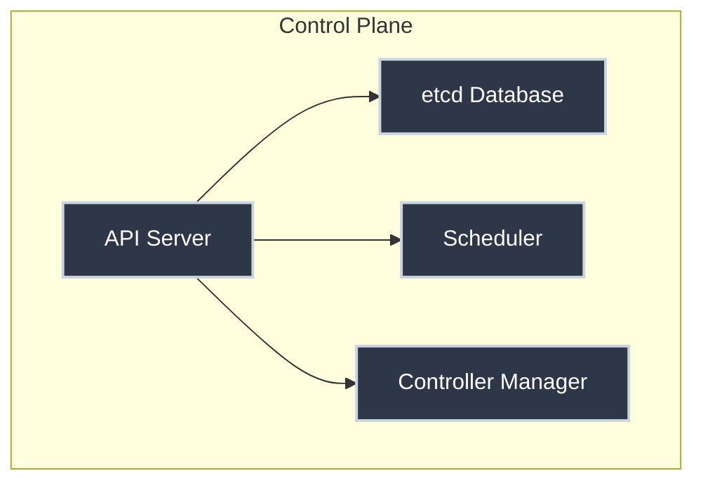
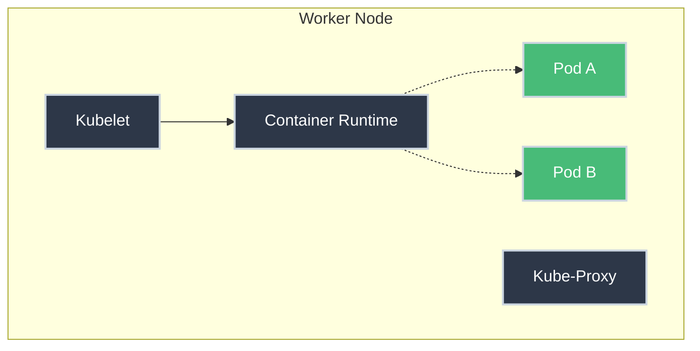

# Cluster Architecture: Management and The Factory

Kubernetes can feel overwhelmingly complex, with dozens of components interacting in mysterious ways. But if we strip away the technical jargon, it functions remarkably like a large-scale manufacturing plant.

To understand Kubernetes, you must understand its two main divisions: the **Control Plane** (the management) and the **Worker Nodes** (the factory floor).

## The Big Picture

At a high level, a Kubernetes cluster consists of two main divisions.

### 1. The Control Plane (Management)
The brains of the operation. It makes decisions, schedules work, and ensures everything is running as intended.

### 2. The Worker Nodes (The Factory Floor)
The muscle. These are the machines (virtual or physical) that actually run your applications.

---

## 1. The Control Plane (The Management)

The Control Plane manages the state of the cluster. It typically consists of four key components:

=== "API Server"

    **`kube-apiserver`** — *The Receptionist / Gatekeeper*

    This is the *only* component you interact with directly. When you run `kubectl apply`, you are talking to the API Server. It validates your request and updates the database. It is the hub for all communication in the cluster.

=== "etcd"

    **`etcd`** — *The Filing Cabinet / Source of Truth*

    A consistent, high-availability key-value store. It saves the entire state of the cluster. If you lose `etcd`, you lose your cluster. The API Server is the only component that talks to `etcd`.

=== "Scheduler"

    **`kube-scheduler`** — *The Logistics Manager*

    It watches for new work (Pods with no assigned Node) and decides where to put them. It considers resources (does Node A have enough RAM?), constraints (does this Pod need a GPU?), and affinity rules.

=== "Controller Manager"

    **`kube-controller-manager`** — *The Automation Engineers*

    A collection of control loops that watch the state of the cluster and try to move it toward the *desired state*.

    *   *Node Controller:* Notices if a node goes down.
    *   *Replication Controller:* Ensures the correct number of pods are running.

---

## 2. The Worker Nodes (The Factory Floor)

This is where the actual work happens. Each Node has components that help it run containers and communicate with the Control Plane.

=== "Kubelet"

    **`kubelet`** — *The Foreman*

    An agent that runs on *every* node. It talks to the API Server ("What work do you have for me?") and ensures the containers described in those PodSpecs are running and healthy. If a container crashes, the Kubelet reports it.

=== "Kube-Proxy"

    **`kube-proxy`** — *The Traffic Controller*

    Maintains network rules on the node. It allows network communication to your Pods from inside or outside the cluster. It essentially implements the Kubernetes "Service" concept.

=== "Container Runtime"

    **Runtime** — *The Machinery*

    The software that actually runs the containers (e.g., containerd, CRI-O, Docker Engine). Kubernetes doesn't run containers itself; it instructs the runtime to do it.

---

## The Workflow in Action

When you deploy an application, here is the flow of information:

1.  **You** (The Architect) send a YAML file to the **API Server** via `kubectl`.
2.  The **API Server** saves this "Desired State" to **etcd**.
3.  The **Scheduler** wakes up, sees a new unassigned Pod, and assigns it to **Node 1**.
4.  The **Kubelet** on Node 1 sees it has been assigned a task. It instructs the **Container Runtime** to start the container.
5.  The **Controller Manager** watches to ensure the Pod keeps running. If Node 1 dies, it notices and asks the Scheduler to reschedule the work elsewhere.

## Summary

| Component | Analogy | Responsibility |
| :--- | :--- | :--- |
| **API Server** | Gatekeeper | Entry point for all REST commands. |
| **etcd** | Filing Cabinet | Storage for cluster data. |
| **Scheduler** | Logistics | Assigns work to nodes. |
| **Controller Manager** | Automation | Maintains desired state. |
| **Kubelet** | Foreman | Manages containers on the node. |
| **Kube-Proxy** | Traffic Cop | Handles networking. |

Understanding this separation of concerns is the first step to mastering Kubernetes orchestration.
