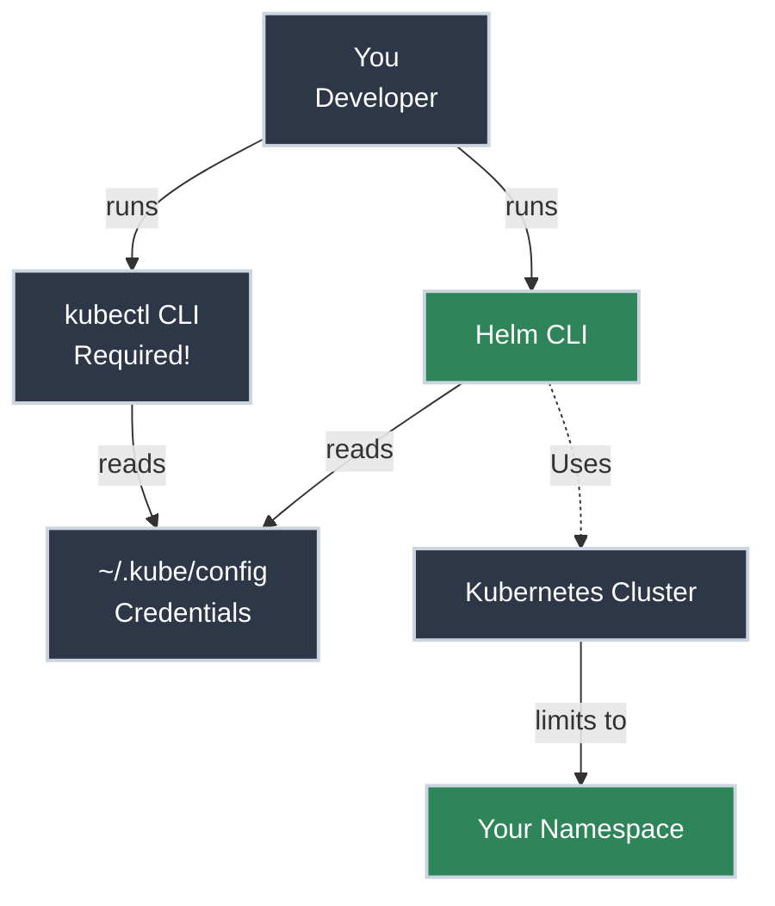

# Getting Helm Access

!!! tip "Part of Day One: Getting Started"
    This is the second article in the Helm Path for [Day One: Getting Started](../overview.md). Make sure you've read [What Is Kubernetes?](../what_is_kubernetes.md) first.

Your company's platform team told you: "We use Helm for everything. Just install the CLI, and you're good to go." 

Maybe you've seen Helm mentioned in a CI/CD pipeline, or maybe you need to install a third-party tool like MongoDB or Prometheus. Either way, you're not writing Kubernetes YAML from scratch today—you're using a package manager.

**Good news:** Helm makes deploying complex applications much simpler. It handles the "glue" that connects multiple Kubernetes resources together, so you don't have to.

Let's get you set up and connected.

!!! info "What You'll Learn"
    By the end of this article, you'll be able to:

    - **Install the Helm CLI** on your operating system
    - **Verify the relationship** between Helm and `kubectl`
    - **Connect Helm to your cluster** using your existing credentials
    - **Add and search chart repositories** to find the software you need
    - **Understand your namespace sandbox** and how to explore safely

## What You're Connecting To

Helm doesn't run *in* your cluster as a separate service (like the old Helm 2 did). Helm 3 is a purely local tool that talks to the Kubernetes API on your behalf.

**Think of it like:**

- **Kubernetes** is the operating system.
- **`kubectl`** is the terminal for running individual commands.
- **Helm** is the "App Store" or `apt`/`brew` for your cluster.

You still need cluster access (the same access used by `kubectl`) for Helm to work.



---

## Prerequisites: kubectl Access

Before you can use Helm, you **must** have working access to your Kubernetes cluster. If you haven't set up your cluster credentials yet, stop here and follow the **[Getting kubectl Access](../kubectl/access.md)** guide first.

**Why?** Helm uses the same configuration file (`~/.kube/config`) as `kubectl`. If `kubectl get pods` doesn't work, Helm won't work either.

---

## Installing Helm

`helm` is a single binary that you've got to install on your machine.

=== "macOS"

    **Using Homebrew (Recommended):**
    ```bash title="Install Helm with Homebrew"
    brew install helm
    ```

    **Verify installation:**
    ```bash title="Verify Helm version"
    helm version
    # Should show: version.BuildInfo{Version:"v3.x.x"...}
    ```

=== "Linux"

    **Using the automated script:**
    ```bash title="Install Helm with official script"
    curl -fsSL -o get_helm.sh https://raw.githubusercontent.com/helm/helm/main/scripts/get-helm-3
    chmod 700 get_helm.sh
    ./get_helm.sh
    ```

    **Verify installation:**
    ```bash title="Verify Helm version"
    helm version
    ```

=== "Windows"

    **Using Chocolatey:**
    ```powershell title="Install Helm with Chocolatey"
    choco install kubernetes-helm
    ```

    **Using Scoop:**
    ```powershell title="Install Helm with Scoop"
    scoop install helm
    ```

    **Verify installation:**
    ```powershell title="Verify Helm version"
    helm version
    ```

---

## Verifying Your Connection

Once Helm is installed, you need to make sure it can talk to your cluster.

### Step 1: Check your kubectl context
Helm will use whichever cluster and namespace you have set as "current" in `kubectl`.

```bash title="Check current context"
kubectl config current-context
# Should show your cluster name (e.g., dev-cluster)
```

### Step 2: Test Helm's reach
Run this command to see if Helm can list "releases" (deployed applications) in your current namespace.

```bash title="List releases"
helm list
# NAME    NAMESPACE    REVISION    UPDATED    STATUS    CHART    APP VERSION
# (It's okay if this list is empty! It means you're connected.)
```

**If you see an error:**
- `Error: Kubernetes cluster unreachable`: Check your VPN or cluster credentials.
- `Error: namespaces "..." is forbidden`: You don't have permissions in your current namespace.

---

## Adding Chart Repositories

Helm finds software in **repositories**. Think of these like the "sources" in `apt` or "taps" in Homebrew.

### Common Repositories
Most developers start by adding a few standard repositories for common software (databases, web servers, monitoring tools).

```bash title="Add common repositories"
# Bitnami is a gold standard for reliable, secure charts
helm repo add bitnami https://charts.bitnami.com/bitnami

# Prometheus/Grafana community charts
helm repo add prometheus-community https://prometheus-community.github.io/helm-charts

# Always update after adding to get the latest metadata
helm repo update
```

### Searching for Software
Once you've added repositories, you can search for the software you need.

```bash title="Search for Nginx"
helm search repo nginx
# NAME             CHART VERSION    APP VERSION    DESCRIPTION
# bitnami/nginx    13.2.23          1.25.3         NGINX Open Source is an...
```

---

## Safety and Exploration

Even though you're using Helm, you're still in a shared cluster. 

!!! info "Your Namespace Is Your Sandbox"
    Helm respects the same security boundaries as `kubectl`.
    - **You can only deploy to namespaces where you have permission.**
    - **Helm releases are namespace-specific.** If you deploy `my-app` to `dev-namespace`, you won't see it if you switch to `prod-namespace`.
    - **Always check your namespace** before running a `helm install`.

```bash title="Verify your current namespace"
kubectl config view --minify | grep namespace
```

---

## Practice Exercises

??? question "Exercise 1: Verify Installation"
    Run `helm version` and identify your client version. Then, verify that `helm list` runs without errors.

    ??? tip "Solution"
        ```bash
        helm version
        helm list
        ```
        If `helm list` returns a header but no data, you are successful! It means the CLI is talking to the Kubernetes API correctly.

??? question "Exercise 2: Add a Repository"
    Add the Bitnami repository and search for "redis".

    ??? tip "Solution"
        ```bash
        helm repo add bitnami https://charts.bitnami.com/bitnami
        helm repo update
        helm search repo redis
        ```
        You should see several options, including `bitnami/redis` and `bitnami/redis-sentinel`.

---

## Quick Recap

| Goal | Command |
|------|---------|
| **Install Helm** | `brew install helm` (macOS) |
| **Check Connection** | `helm list` |
| **Add Repo** | `helm repo add <name> <url>` |
| **Find Software** | `helm search repo <keyword>` |
| **Update Repos** | `helm repo update` |

---

## Further Reading

### Official Documentation
- [Installing Helm](https://helm.sh/docs/intro/install/) - Official guide
- [Helm Repositories](https://helm.sh/docs/topics/chart_repository/) - How repositories work

### Related Articles
- [Getting kubectl Access](../kubectl/access.md) - **Required** before Helm will work
- [What Is Kubernetes?](../what_is_kubernetes.md) - Core concepts

---

## What's Next?

You have the tools, and you have the access. Now let's actually put something on the cluster.

**Next:** **[Your First Helm Deployment](first_deploy.md)** - Deploy your first chart, whether it's a third-party tool or your own application from a CI/CD pipeline.
