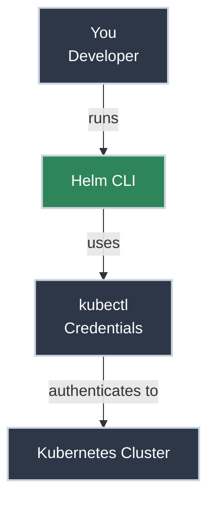

# Getting Helm Access

!!! tip "Part of Day One: Getting Started"
    This is the second article in the Helm Path for [Day One: Getting Started](../overview.md). Make sure you've read [What Is Kubernetes?](../what_is_kubernetes.md) first.

Your company's platform team told you: "We use `Helm` for everything. Just install the CLI, and you're good to go." 

Maybe you've seen `Helm` mentioned in a CI/CD pipeline, or maybe you need to install a third-party tool like `Prometheus` or `Grafana`. Either way, you're not writing Kubernetes YAML from scratch today—you're using a package manager.

**Good news:** `Helm` makes deploying complex applications much simpler. It handles the "glue" that connects multiple Kubernetes resources together, so you don't have to.

Let's get you set up and connected.

!!! info "What You'll Learn"
    By the end of this article, you'll be able to:

    - **Install the Helm CLI** on your operating system
    - **Verify the relationship** between `Helm` and `kubectl`
    - **Connect Helm to your cluster** using your existing credentials
    - **Add and search chart repositories** to find the software you need
    - **Understand your namespace sandbox** and how to explore safely

## Helm: Kubernetes Package Manager

`Helm` is a local command-line tool that talks to the Kubernetes API on your behalf. It doesn't run as a service in your cluster—it's purely client-side, just like `kubectl`.

**The key relationship:**

- **Kubernetes** is the orchestration platform
- **`kubectl`** is the CLI for direct cluster operations
- **`Helm`** is the package manager (like `apt`/`brew` for your cluster)

**Important:** `Helm` uses the same `kubeconfig` credentials you set up in [Getting kubectl Access](../kubectl/access.md). Everything you learned there about authentication, contexts, and namespaces applies to `Helm`—it's using the exact same configuration.



---

## Prerequisites: kubectl Access

Before you can use `Helm`, you **must** have working access to your Kubernetes cluster. If you haven't set up your cluster credentials yet, stop here and follow the **[Getting kubectl Access](../kubectl/access.md)** guide first.

**Why?** `Helm` uses the same configuration file (`~/.kube/config`) as `kubectl`. If `kubectl get pods` doesn't work, `Helm` won't work either.

---

## Before You Install: Understanding Helm's Hidden Cost

`Helm` makes deployment easier, but it adds complexity to troubleshooting. Be honest with yourself about this tradeoff before committing to the `Helm` path.

=== "What You Gain"

    - **Simplified deployments** - One command deploys complex applications with multiple Kubernetes resources. No need to manually `kubectl apply` each file individually.

    - **Package management** - Reusable charts for common software (`Prometheus`, `nginx`, ingress controllers). Install `Prometheus` or `nginx` with a single `helm install` command.

    - **Configuration management** - Change settings through `values.yaml` files instead of editing raw YAML manifests. Update replicas, image tags, or environment variables without touching templates.

    - **Version control and rollbacks** - Easy rollbacks with `helm rollback`. Every deployment is tracked as a revision—undo bad changes instantly.

=== "What You Trade"

    - **Troubleshooting complexity** - When things break, you debug through multiple layers: Is the problem in your `values.yaml`? The chart's templates? The rendered Kubernetes YAML? Or the running resources? Each layer adds places where things can go wrong.

    - **Abstraction opacity** - Templates hide what's actually being deployed until you inspect the rendered output with `helm get manifest`. You're trusting the chart author's template logic without seeing the actual YAML upfront.

    - **Steeper learning curve** - You need to understand both `Helm`'s templating system (Go templates, values hierarchy, chart structure) AND Kubernetes resources. You're learning two complex systems simultaneously instead of one.

!!! warning "Helm's Hidden Cost"
    In large, complex applications, `Helm`'s abstraction layers can make troubleshooting significantly harder. A misconfigured value might produce invalid YAML that's difficult to trace. An error during template rendering looks different from a Kubernetes deployment error. You'll need `kubectl` skills anyway for debugging—`Helm` doesn't eliminate the need to understand Kubernetes fundamentals.

**Our recommendation:** If your team already uses `Helm` (CI/CD generates charts, standardized on `Helm` deployments), learn it. If you're choosing for yourself and learning Kubernetes for the first time, start with the [kubectl path](../kubectl/access.md) to build foundational understanding, then add `Helm` later.

The rest of this article assumes you're committed to the `Helm` path. We'll teach you both `Helm` AND the underlying Kubernetes concepts so you can troubleshoot effectively.

---

## Installing Helm

The `helm` CLI is a single binary that you've got to install on your machine.

=== "macOS"

    **Using Homebrew (Recommended):**
    ```bash title="Install Helm with Homebrew"
    brew install helm
    ```

    **Verify installation:**
    ```bash title="Verify Helm version"
    helm version
    # Should show: version.BuildInfo{Version:"v3.x.x"...}
    ```

=== "Linux"

    **Using the automated script:**
    ```bash title="Install Helm with official script"
    curl -fsSL -o get_helm.sh https://raw.githubusercontent.com/helm/helm/main/scripts/get-helm-3
    chmod 700 get_helm.sh
    ./get_helm.sh
    ```

    **Verify installation:**
    ```bash title="Verify Helm version"
    helm version
    ```

=== "Windows"

    === "PowerShell (Manual)"

        **Works on any Windows system without package managers.**

        Open PowerShell and run:

        ```powershell title="Download and install Helm manually"
        # Download latest Helm release
        Invoke-WebRequest -Uri https://get.helm.sh/helm-v3.14.0-windows-amd64.zip -OutFile helm.zip

        # Extract the archive
        Expand-Archive -Path helm.zip -DestinationPath $env:TEMP\helm

        # Create bin directory if it doesn't exist
        New-Item -Path "$env:USERPROFILE\bin" -ItemType Directory -Force

        # Move helm.exe to your bin directory
        Move-Item -Path "$env:TEMP\helm\windows-amd64\helm.exe" -Destination "$env:USERPROFILE\bin\helm.exe" -Force

        # Add to PATH (current session)
        $env:PATH += ";$env:USERPROFILE\bin"

        # Add to PATH permanently
        [Environment]::SetEnvironmentVariable("Path", $env:PATH + ";$env:USERPROFILE\bin", [EnvironmentVariableTarget]::User)

        # Clean up
        Remove-Item -Path helm.zip, $env:TEMP\helm -Recurse -Force
        ```

        **Verify installation:**

        Close and reopen PowerShell, then run:

        ```powershell title="Verify Helm version"
        helm version
        # Should show: version.BuildInfo{Version:"v3.x.x"...}
        ```

    === "Chocolatey"

        **If you have Chocolatey installed:**

        ```powershell title="Install Helm with Chocolatey"
        choco install kubernetes-helm
        ```

        **Verify installation:**
        ```powershell title="Verify Helm version"
        helm version
        ```

    === "Scoop"

        **If you have Scoop installed:**

        ```powershell title="Install Helm with Scoop"
        scoop install helm
        ```

        **Verify installation:**
        ```powershell title="Verify Helm version"
        helm version
        ```

---

## Verifying Your Connection

Once `Helm` is installed, you need to make sure it can talk to your cluster.

### Step 1: Check your context and namespace

`Helm` uses whichever cluster and namespace you have set as "current" in `kubectl`. If you need a refresher on contexts and namespaces, see [Understanding Contexts](../kubectl/access.md#understanding-contexts).

```bash title="Quick verification"
# Verify your current cluster
kubectl config current-context

# Verify your current namespace
kubectl config view --minify | grep namespace
```

If you're in the right cluster and namespace, proceed to Step 2.

### Step 2: Test Helm's reach
Run this command to see if `Helm` can list "releases" (deployed applications) in your current namespace.

```bash title="List releases"
helm list
# NAME    NAMESPACE    REVISION    UPDATED    STATUS    CHART    APP VERSION
# (It's okay if this list is empty! It means you're connected.)
```

**If you see an error:**

- `Error: Kubernetes cluster unreachable`: Check your VPN or cluster credentials.
- `Error: namespaces "..." is forbidden`: You don't have permissions in your current namespace.

---

## Adding Chart Repositories

`Helm` finds software in **repositories**. Think of these like the "sources" in `apt` or "taps" in `brew`.

### Common Repositories
Most developers start by adding a few standard repositories for common software (web servers, monitoring tools, ingress controllers).

```bash title="Add common repositories"
# Bitnami is a gold standard for reliable, secure charts
helm repo add bitnami https://charts.bitnami.com/bitnami

# Prometheus/Grafana community charts
helm repo add prometheus-community https://prometheus-community.github.io/helm-charts

# Always update after adding to get the latest metadata
helm repo update
```

### Searching for Software
Once you've added repositories, you can search for the software you need.

```bash title="Search for Nginx"
helm search repo nginx
# NAME             CHART VERSION    APP VERSION    DESCRIPTION
# bitnami/nginx    13.2.23          1.25.3         NGINX Open Source is an...
```

---

## Safety and Exploration

Even though you're using `Helm`, namespace security works exactly the same as `kubectl`.

!!! info "Remember: Your Namespace Is Your Sandbox"
    `Helm` respects the same namespace boundaries you learned about in [Getting kubectl Access](../kubectl/access.md).

    **Quick safety checklist before deploying:**

    - Verify your namespace (you did this in Step 1 above)
    - `Helm` releases are namespace-specific—just like `kubectl` resources
    - Always double-check before running `helm install` or `helm uninstall`

---

## Practice Exercises

??? question "Exercise 1: Verify Installation"
    Run `helm version` and identify your client version. Then, verify that `helm list` runs without errors.

    ??? tip "Solution"
        ```bash
        helm version
        helm list
        ```
        If `helm list` returns a header but no data, you are successful! It means the CLI is talking to the Kubernetes API correctly.

??? question "Exercise 2: Add a Repository"
    Add the Bitnami repository and search for "redis".

    ??? tip "Solution"
        ```bash
        helm repo add bitnami https://charts.bitnami.com/bitnami
        helm repo update
        helm search repo redis
        ```
        You should see several options, including `bitnami/redis` (a popular caching layer for Kubernetes).

---

## Quick Recap

| Goal | Command |
|------|---------|
| **Install Helm** | `brew install helm` (macOS) |
| **Check Connection** | `helm list` |
| **Add Repo** | `helm repo add <name> <url>` |
| **Find Software** | `helm search repo <keyword>` |
| **Update Repos** | `helm repo update` |

---

## Further Reading

### Official Documentation

- [Installing Helm](https://helm.sh/docs/intro/install/) - Official installation guide for all platforms
- [Helm Quickstart Guide](https://helm.sh/docs/intro/quickstart/) - Get started with `Helm` in 5 minutes
- [Using Helm](https://helm.sh/docs/intro/using_helm/) - Core `Helm` concepts and workflows
- [Helm Repositories](https://helm.sh/docs/topics/chart_repository/) - How chart repositories work

### Deep Dives

- [What is a Helm Chart? Tutorial for Beginners](https://www.freecodecamp.org/news/what-is-a-helm-chart-tutorial-for-kubernetes-beginners/) - Comprehensive beginner-friendly guide
- [Helm GitHub Repository](https://github.com/helm/helm) - Source code, issues, and community discussions

### Related Articles

- [Getting kubectl Access](../kubectl/access.md) - **Required** before `Helm` will work
- [What Is Kubernetes?](../what_is_kubernetes.md) - Core concepts

---

## What's Next?

You have the tools, and you have the access. Now let's actually put something on the cluster.

**Next:** **[Your First Helm Deployment](first_deploy.md)** - Deploy your first chart, whether it's a third-party tool or your own application from a CI/CD pipeline.
---

## Practice Exercises

??? question "Exercise 1: Verify Installation"
    Run `helm version` and identify your client version. Then, verify that `helm list` runs without errors.

    ??? tip "Solution"
        ```bash
        helm version
        helm list
        ```
        If `helm list` returns a header but no data, you are successful! It means the CLI is talking to the Kubernetes API correctly.

??? question "Exercise 2: Add a Repository"
    Add the Bitnami repository and search for "redis".

    ??? tip "Solution"
        ```bash
        helm repo add bitnami https://charts.bitnami.com/bitnami
        helm repo update
        helm search repo redis
        ```
        You should see several options, including `bitnami/redis` (a popular caching layer for Kubernetes).

---

## Quick Recap

| Goal | Command |
|------|---------|
| **Install Helm** | `brew install helm` (macOS) |
| **Check Connection** | `helm list` |
| **Add Repo** | `helm repo add <name> <url>` |
| **Find Software** | `helm search repo <keyword>` |
| **Update Repos** | `helm repo update` |

---

## Further Reading

### Official Documentation

- [Installing Helm](https://helm.sh/docs/intro/install/) - Official installation guide for all platforms
- [Helm Quickstart Guide](https://helm.sh/docs/intro/quickstart/) - Get started with Helm in 5 minutes
- [Using Helm](https://helm.sh/docs/intro/using_helm/) - Core Helm concepts and workflows
- [Helm Repositories](https://helm.sh/docs/topics/chart_repository/) - How chart repositories work

### Deep Dives

- [What is a Helm Chart? Tutorial for Beginners](https://www.freecodecamp.org/news/what-is-a-helm-chart-tutorial-for-kubernetes-beginners/) - Comprehensive beginner-friendly guide
- [Helm GitHub Repository](https://github.com/helm/helm) - Source code, issues, and community discussions

### Related Articles

- [Getting kubectl Access](../kubectl/access.md) - **Required** before Helm will work
- [What Is Kubernetes?](../what_is_kubernetes.md) - Core concepts

---

## What's Next?

You have the tools, and you have the access. Now let's actually put something on the cluster.

**Next:** **[Your First Helm Deployment](first_deploy.md)** - Deploy your first chart, whether it's a third-party tool or your own application from a CI/CD pipeline.
