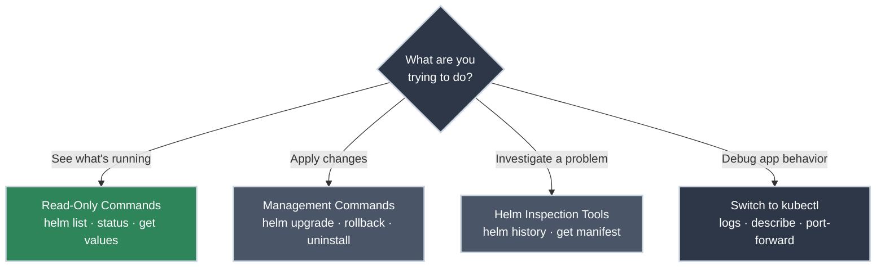

# Essential Helm Commands

!!! tip "Part of Day One: Getting Started"
    This is the fourth article in the Helm path of [Day One: Getting Started](../overview.md). If you haven't deployed anything yet, complete [Your First Helm Deployment](first_deploy.md) first.

You ran `helm install`. Your application appeared on the cluster. That felt powerful.

Now it's next week. Your CI/CD pipeline built a new image and you need to push a bug fix. Next month: a deployment breaks QA and you need to be back to the previous version in the next five minutes. Two months from now: someone asks "what configuration is actually running in staging?"

**These are the moments Helm was built for.** The install is table stakes — lifecycle management is the real skill. The good news: you only need about a dozen commands to manage releases from "just deployed" to "rolling back a production incident."

!!! info "What You'll Learn"
    By the end of this article, you'll know:

    - The daily commands for **investigating** releases (safe to run anytime)
    - The **management commands** for upgrades, rollbacks, and cleanup
    - How to use Helm's **troubleshooting tools** to inspect what was applied
    - **When to use Helm** and when to **switch to `kubectl`** — the most important judgment call you'll make

---



---

## The Daily Toolbox (Read-Only)

These commands read information only. They cannot change anything in the cluster. Run them freely, any time, without thinking twice.

<div class="grid cards" markdown>

-   :material-format-list-bulleted: **helm list**

    ---

    **Why it matters:** The first question every day should be "what's actually running?" `helm list` gives you a quick inventory — release name, namespace, revision number, status, and chart version.

    ```bash title="List releases in your current namespace"
    helm list
    # NAME     NAMESPACE  REVISION  STATUS    CHART          APP VERSION
    # my-app   default    2         deployed  my-app-0.1.0   1.0.1
    ```

    **The revision number matters:** Every upgrade or rollback increments it. Revision 2 means this release has been modified once since it was first installed.

    **Tip:** Use `-A` to see releases across **all** namespaces you have access to — useful when you're not sure which namespace a release lives in:

    ```bash title="See all releases across all namespaces"
    helm list -A
    ```

    ✅ **Safe — read-only**

-   :material-stethoscope: **helm status**

    ---

    **Why it matters:** `helm list` tells you a release is `deployed`. `helm status` tells you what that means in practice — it shows the chart author's NOTES, which often include access instructions, service URLs, and next steps specific to that chart.

    ```bash title="Check release status and notes"
    helm status my-app
    # NAME: my-app
    # LAST DEPLOYED: Mon Feb 10 10:00:00 2026
    # NAMESPACE: default
    # STATUS: deployed
    # REVISION: 2
    # NOTES:
    # 1. Get the application URL by running these commands:
    #    export POD_NAME=$(kubectl get pods ...
    ```

    ✅ **Safe — read-only**

-   :material-cog-outline: **helm get values**

    ---

    **Why it matters:** Answers "what configuration is *actually* running?" — not what you think you applied, but what Helm recorded as applied. The most useful debugging command when a release behaves unexpectedly.

    ```bash title="See your applied overrides for a release"
    helm get values my-app
    # USER-SUPPLIED VALUES:
    # replicaCount: 3
    # image:
    #   tag: "v1.0.2"
    ```

    **Tip:** Add `--all` to see the *complete* merged configuration — your overrides layered over all chart defaults:

    ```bash title="See the full merged configuration including defaults"
    helm get values my-app --all
    ```

    ✅ **Safe — read-only**

</div>

---

## Deployment & Management

These commands modify the cluster. Before running any of them, verify you're in the right context and namespace:

```bash title="Verify your target before any write operation"
kubectl config current-context
kubectl config view --minify | grep namespace
```

=== "helm upgrade"

    ### Upgrade (Apply Changes)

    **Why it matters:** This is the command you'll run every time your values change or a new chart version is available. Every change — image tag update, replica count adjustment, environment variable change — goes through `helm upgrade`.

    The workflow: edit `values.yaml` → commit the file → run `helm upgrade`.

    ⚠️ **Caution (Modifies Resources):**

    ```bash title="Upgrade with your committed values file"
    # Scenario 1: Your app's chart (values.yaml lives inside the chart directory)
    helm upgrade my-app ./my-chart

    # Scenario 2: Vendor chart (values file committed separately)
    helm upgrade my-app bitnami/nginx -f my-values.yaml
    ```

    **`--install` flag:** The standard CI/CD pattern. It installs if the release doesn't exist yet, upgrades if it does — one command handles both cases:

    ```bash title="The CI/CD standard: install-or-upgrade in one command"
    helm upgrade --install my-app ./my-chart -f my-values.yaml
    ```

    !!! warning "Never use --set"
        `--set` flags exist only in the command that ran them — there's no file, no commit, no record. If the release needs to be rebuilt, rolled back by a teammate, or audited, the configuration is gone. Always commit changes to `values.yaml` before running `helm upgrade`.

    !!! tip "GitOps environments"
        In many production clusters you won't run `helm upgrade` yourself. A GitOps controller like FluxCD watches your committed values and runs the upgrade for you through a [`HelmRelease`](https://gitops.bradpenney.io/day_one/flux_resources/) resource — you change `values.yaml`, open a pull request, and the merge drives the deploy. See [What Is GitOps?](https://gitops.bradpenney.io/day_one/what_is_gitops/) for the paradigm behind it.

=== "helm rollback"

    ### Rollback (Undo a Bad Deploy)

    **Why it matters:** Helm stores your full release history. If an upgrade breaks something, you can return to any previous revision in seconds — no rebuilding, no re-deploying from scratch.

    First, check your history to confirm the revision you want:

    ```bash title="View release history (safe — read-only)"
    helm history my-app
    # REVISION    UPDATED                     STATUS      CHART            APP VERSION    DESCRIPTION
    # 1           Mon Feb 10 10:00:00 2026    superseded  my-app-0.1.0     1.25.3         Install complete
    # 2           Mon Feb 10 11:00:00 2026    deployed    my-app-0.1.0     1.25.3         Upgrade complete
    ```

    Then roll back:

    ⚠️ **Caution (Modifies Resources):**

    ```bash title="Roll back to a specific revision"
    helm rollback my-app 1
    # Rollback was a success! Happy Helming.
    ```

    **What actually happens:** Helm retrieves the stored configuration from Revision 1 and sends it to the Kubernetes API. Kubernetes performs a rolling update — new pods using the old configuration gradually replace the broken ones. Your application returns to a working state without downtime.

=== "helm uninstall"

    ### Uninstall (Clean Up Everything)

    **Why it matters:** One command removes the entire release — every Kubernetes resource the chart created (Pods, Services, ConfigMaps, all of it). Use this to decomission a release or clean up after testing.

    🚨 **DANGER (Destructive — removes all release resources):**

    ```bash title="Remove a release and every resource it created"
    helm uninstall my-app
    # release "my-app" uninstalled
    ```

    !!! warning "No undo for uninstall"
        `helm uninstall` is permanent. Every resource created by this release is gone. If you need them back, you'll re-deploy from scratch. Double-check the release name and namespace before running this.

---

## Troubleshooting & Investigation

When something is wrong and you need to understand what Helm actually applied, these are your tools.

### View Release History

Every `install`, `upgrade`, and `rollback` creates a new revision. The history shows you the full audit trail.

```bash title="See the complete revision history for a release"
helm history my-app
# REVISION    UPDATED                     STATUS        CHART            DESCRIPTION
# 1           Mon Feb 10 10:00:00 2026    superseded    my-app-0.1.0     Install complete
# 2           Mon Feb 10 11:00:00 2026    deployed      my-app-0.1.0     Upgrade complete
```

Use this before a rollback to confirm which revision is the last known-good state.

### View Generated YAML

**Why it matters:** This is the X-ray vision command. It shows the actual Kubernetes YAML that Helm generated and applied — the result of processing all your `values.yaml` through the chart's templates. When something is misconfigured, the generated manifest is ground truth.

```bash title="See the raw Kubernetes YAML Helm applied to the cluster"
helm get manifest my-app
# ---
# # Source: my-app/templates/deployment.yaml
# apiVersion: apps/v1
# kind: Deployment
# metadata:
#   name: my-app
# spec:
#   replicas: 3
# ...
```

Combine with standard text tools to find specific resources quickly:

```bash title="Find just the Service definition in the manifest"
helm get manifest my-app | grep -A 20 "kind: Service"
```

!!! tip "New to pipes and grep?"
    That `|` character sends the output of `helm get manifest` directly into `grep` for filtering. If piping commands is unfamiliar, [Pipes and Redirection](https://linux.bradpenney.io/essentials/pipes_and_redirection/) on the Linux site explains the pattern in depth — it's the same concept used constantly in Kubernetes troubleshooting.

---

## The Golden Rule: Helm vs. kubectl

This is the most important judgment call in a Helm-based workflow. The confusion about "should I use Helm or kubectl for this?" comes up constantly.

**The answer is always:**

- **Helm manages what should exist** — the desired state of your releases
- **kubectl investigates what does exist** — the current state of running resources

| If you want to... | Use this | Command |
|---|---|---|
| **Change configuration** (replicas, image tag, env vars) | **Helm** | `helm upgrade my-app ./chart -f values.yaml` |
| **Undo a broken deploy** | **Helm** | `helm rollback my-app 1` |
| **Read application logs** | **kubectl** | `kubectl logs <pod-name>` |
| **Debug a crashing pod** | **kubectl** | `kubectl describe pod <pod-name>` |
| **Test connectivity locally** | **kubectl** | `kubectl port-forward <pod-name> 8080:8080` |
| **Check what resources are running** | **kubectl** | `kubectl get all` |

!!! info "kubectl logs and the Helm workflow"
    `kubectl logs` works identically regardless of whether you deployed via Helm, `kubectl apply`, or anything else. Once a pod exists, investigating it is always a `kubectl` operation — Helm has no concept of "app logs." If you're new to reading logs, the mental model is the same as [Reading Logs](https://linux.bradpenney.io/day_one/reading_logs/) on the Linux site: find the process, look at its output, identify the error.

---

## Practice Exercises

??? question "Exercise 1: Audit a Running Release"
    Using only read-only commands, answer these questions about any release in your namespace:

    1. What revision is currently deployed?
    2. What `replicaCount` is actually applied right now?
    3. What Kubernetes resources did Helm create?

    ??? tip "Solution"
        ```bash title="Investigate a release"
        # 1. Check current revision and status
        helm list

        # 2. Check the applied configuration
        helm get values <release-name>

        # 3. See all Kubernetes resources this release created
        helm get manifest <release-name>
        # Or see the running state with kubectl:
        kubectl get all
        ```

??? question "Exercise 2: Preview Before You Deploy"
    Before running an upgrade on a production-bound release, you want to see exactly what Helm will generate — without touching the cluster. Find the flags that enable this "dry run" mode.

    ??? tip "Solution"
        ```bash title="Preview without applying anything to the cluster"
        helm upgrade my-app bitnami/nginx -f my-values.yaml --dry-run --debug
        ```

        - **`--dry-run`:** Renders templates and validates against the API, but does not apply anything.
        - **`--debug`:** Prints the full rendered YAML output to your terminal.

        This is valuable before any high-stakes upgrade — especially on vendor charts where the generated YAML can be complex.

??? question "Exercise 3: Simulate and Recover from an Incident"
    This exercise simulates a bad deploy and full rollback recovery — the real-world sequence you'd follow if an upgrade breaks an application.

    1. Deploy a release: `helm install practice-app bitnami/nginx -f values.yaml` (with `replicaCount: 3`)
    2. Simulate a "bad" upgrade by setting `replicaCount: 0` in your values file and upgrading
    3. Verify the problem with `kubectl get pods`
    4. Check history to find the last working revision
    5. Roll back and verify recovery

    ??? tip "Solution"
        ```bash title="Deploy, break, and roll back"
        # Step 1: Deploy initial release (replicaCount: 3 in values.yaml)
        helm install practice-app bitnami/nginx -f values.yaml

        # Step 2: "Bad" upgrade (set replicaCount: 0 in values.yaml first, then:)
        helm upgrade practice-app bitnami/nginx -f values.yaml

        # Step 3: Verify the problem
        kubectl get pods
        # No pods — the "incident"

        # Step 4: Find the last working revision
        helm history practice-app
        # REVISION 1 = good, REVISION 2 = broken

        # Step 5: Roll back to revision 1
        helm rollback practice-app 1

        # Verify recovery
        kubectl get pods
        # 3 pods running again

        # Clean up
        helm uninstall practice-app
        ```

        This is the exact sequence you'd follow during a real production rollback. The speed of `helm rollback` — no rebuild, no re-deploy — is one of Helm's most valuable production properties.

---

## Quick Recap

| Command | What It Does | Safe? |
|---------|-------------|-------|
| `helm list` | See all releases in current namespace | ✅ Read-only |
| `helm list -A` | See releases across all namespaces | ✅ Read-only |
| `helm status <name>` | View release health and chart notes | ✅ Read-only |
| `helm get values <name>` | See applied configuration | ✅ Read-only |
| `helm history <name>` | View full revision history | ✅ Read-only |
| `helm get manifest <name>` | See raw generated Kubernetes YAML | ✅ Read-only |
| `helm upgrade <name> <chart>` | Apply configuration changes | ⚠️ Modifies cluster |
| `helm upgrade --install` | Install-or-upgrade (CI/CD pattern) | ⚠️ Modifies cluster |
| `helm rollback <name> <rev>` | Revert to a previous revision | ⚠️ Modifies cluster |
| `helm uninstall <name>` | Remove release and all its resources | 🚨 Destructive |

---

## Further Reading

### Official Documentation

- [helm upgrade Reference](https://helm.sh/docs/helm/helm_upgrade/) - Complete flag reference for upgrades
- [helm rollback Reference](https://helm.sh/docs/helm/helm_rollback/) - Rollback options and behavior
- [helm get Reference](https://helm.sh/docs/helm/helm_get/) - All `helm get` subcommands

### Deep Dives

- [Using Helm: Upgrade and Rollback](https://helm.sh/docs/intro/using_helm/#helm-upgrade-and-helm-rollback-upgrading-a-release-and-recovering-on-failure) - Official guide to upgrade and rollback workflows
- [How Helm Stores Release History](https://helm.sh/docs/faq/changes_since_helm2/#secrets-as-the-default-storage-driver) - Why Helm uses Kubernetes Secrets for release tracking

### Related Articles

- [Your First Helm Deployment](first_deploy.md) - Install, upgrade, and rollback fundamentals
- [Understanding What Helm Created](understanding.md) - What these commands are managing under the hood
- [Pipes and Redirection](https://linux.bradpenney.io/essentials/pipes_and_redirection/) - The Linux tools (`grep`, `|`) used throughout Helm troubleshooting
- [Reading Logs](https://linux.bradpenney.io/day_one/reading_logs/) - The `kubectl logs` mental model applies directly

---

## What's Next?

You know the commands. Now let's understand **what** they're actually managing.

**Next:** [Understanding What Helm Created](understanding.md) — see how Helm translates your `values.yaml` into Pods and Services, how it tracks releases, and exactly where to look when things break.
