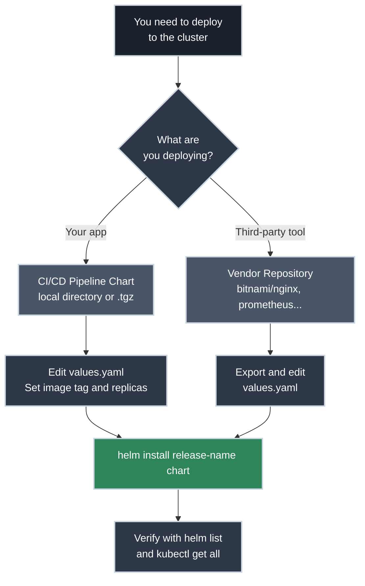

# Your First Helm Deployment

!!! tip "Part of Day One: Getting Started"
    This is the third article in the Helm Path for [Day One: Getting Started](../overview.md). Make sure you've completed [Getting Helm Access](access.md) first.

You have `helm` installed. You have cluster access. Now comes the moment of truth: putting your first application onto the cluster.

In the `Helm` world, we don't just "deploy" files; we manage **Releases**. A release is a specific instance of a chart running in your cluster. You can have three different "releases" of the same `nginx` chart running in the same namespace, each with its own name and configuration.

This article covers the two ways you'll most likely encounter `Helm` in your daily work.

!!! info "What You'll Learn"
    By the end of this article, you'll be able to:

    - **Choose between the two common scenarios**: CI/CD charts vs. Vendor charts
    - **Customize a deployment** using a `values.yaml` file
    - **Install your first release** and verify it's running
    - **Update a running application** with new configuration
    - **Clean up resources** when you're finished

---



## Which Scenario Are You In?

Before we start, identify which situation matches your task today:

!!! warning "Check Your Namespace First"
    `helm install` deploys into your **current namespace**. Before running any install command, confirm you're in the right place:

    ```bash
    kubectl config view --minify | grep namespace
    # namespace: dev-user
    ```

    If you need a refresher on namespaces and contexts, see [Verifying Your Connection](access.md#verifying-your-connection).

=== ":material-rocket-launch: Scenario 1: The CI/CD Chart"

    **Your situation:** Your company's CI/CD pipeline (Jenkins, GitLab, GitHub Actions) has built your code and packaged it into a `Helm` chart. You need to deploy *your* app to a dev environment.

    **What you have:** A directory containing a `Chart.yaml` and a `values.yaml` file, or a `.tgz` package.

    ### Examine values.yaml

    In `Helm`, you **never** edit the templates (the complex Kubernetes YAML). Instead, you edit `values.yaml`. This file is the "settings menu" for your application. Make your changes here — image tag, replica count, environment variables — then **commit the file before deploying**.

    ```yaml title="values.yaml (example)" linenums="1"
    replicaCount: 1  # (1)!

    image:
      repository: my-company/my-app
      tag: "v1.0.1"  # (2)!

    service:
      type: ClusterIP
      port: 80
    ```

    1. How many copies of the app to run.
    2. The specific version of your code built by the CI pipeline.

    !!! warning "Edit the File, Then Commit"
        Change `values.yaml` directly and commit it to version control before running `helm install`. Every deployment must be reproducible from your repo — never rely on flags or files that exist only on your machine.

    ### Install the Release

    Navigate to the directory containing your chart and run:

    ⚠️ **Caution (Modifies Resources):**

    ```bash title="Install from local directory"
    # Usage: helm install <release-name> <path-to-chart>
    helm install my-app ./my-chart
    # NAME: my-app
    # LAST DEPLOYED: Mon Feb 10 10:00:00 2026
    # NAMESPACE: default
    # STATUS: deployed
    # REVISION: 1
    ```

=== ":material-store: Scenario 2: The Vendor Chart"

    **Your situation:** You need to install a standard piece of infrastructure—like a web server (`nginx`), a cache (`Redis`), or a monitoring tool (`Prometheus`)—using a chart provided by a vendor or the community.

    **What you have:** A chart name like `bitnami/nginx` or `prometheus-community/prometheus`.

    ### Find the Available Settings

    Every vendor chart has different options. Start by exporting the defaults so you can see what's configurable:

    ✅ **Safe (Read-Only):**

    ```bash title="Export default values"
    helm show values bitnami/nginx > nginx-values.yaml
    ```

    ### Customize, Commit, and Deploy

    Open `nginx-values.yaml`, change the settings you need, then **commit the file to version control**. This file is now your source of truth for this deployment.

    !!! warning "Never Use --set"
        The `--set` flag writes configuration into thin air — it exists nowhere but the command that ran it. If the release needs to be rebuilt, rolled back by a teammate, or audited, there is no record. Always make changes in a committed `values.yaml` file.

    ⚠️ **Caution (Modifies Resources):**

    ```bash title="Install using your committed values file"
    helm install my-web-server bitnami/nginx -f nginx-values.yaml
    # NAME: my-web-server
    # LAST DEPLOYED: Mon Feb 10 10:05:00 2026
    # NAMESPACE: default
    # STATUS: deployed
    # REVISION: 1
    ```

    Every setting is documented in your committed file. Anyone can reproduce or debug this deployment.

---

## Verifying the Deployment

Regardless of how you installed it, you need to make sure it worked.

### Check Helm Status

`Helm` will tell you if the *Release* was successful.

```bash title="Check Helm release"
helm list
# NAME       NAMESPACE REVISION STATUS   CHART         APP VERSION
# my-app     default   1        deployed my-app-0.1.0  1.0.1
```

### Use kubectl to Investigate

`Helm` creates Kubernetes resources. Use your `kubectl` skills to see them. If you're new to `kubectl`, [Essential kubectl Commands](../kubectl/commands.md) covers everything you'll need for day-to-day investigation.

✅ **Safe (Read-Only):**

```bash title="See resources created by Helm"
kubectl get all
# NAME                          READY   STATUS    RESTARTS   AGE
# pod/my-app-7c5ddbdf54-x8f9p   1/1     Running   0          2m
#
# NAME                 TYPE        CLUSTER-IP   EXTERNAL-IP   PORT(S)   AGE
# service/my-app-svc   ClusterIP   10.96.0.1    <none>        80/TCP    2m
#
# NAME                     READY   UP-TO-DATE   AVAILABLE   AGE
# deployment.apps/my-app   1/1     1            1           2m
```

---

## Updating and Rolling Back

One of `Helm`'s superpowers is the ability to change things safely.

### Upgrading

Edit your `values.yaml`, commit the change, then run:

⚠️ **Caution (Modifies Resources):**

```bash title="Upgrade a release"
# Scenario 1 (local chart - values.yaml is inside the chart directory)
helm upgrade my-app ./my-chart

# Scenario 2 (vendor chart - values file committed separately)
helm upgrade my-web-server bitnami/nginx -f nginx-values.yaml
# STATUS: deployed
# REVISION: 2
```

### Rolling Back

If the upgrade breaks something, you can go back to the previous version instantly. First, check your release history to identify the revision you want:

✅ **Safe (Read-Only):**

```bash title="View release history"
helm history my-app
# REVISION    UPDATED                     STATUS      CHART           APP VERSION    DESCRIPTION
# 1           Mon Feb 10 10:00:00 2026    superseded  my-app-0.1.0    1.0.1          Install complete
# 2           Mon Feb 10 11:00:00 2026    deployed    my-app-0.1.0    1.0.2          Upgrade complete
```

Then roll back to the revision you want:

⚠️ **Caution (Modifies Resources):**

```bash title="Rollback to revision 1"
helm rollback my-app 1
# Rollback was a success! Happy Helming.
```

---

## Cleaning Up

When you're done with your test, you can remove everything `Helm` created with one command.

🚨 **DANGER (Destructive):**

```bash title="Uninstall a release"
helm uninstall my-app
# release "my-app" uninstalled
```

---

## Common Pitfalls

??? warning "Release Already Exists"
    Running `helm install` twice with the same release name fails:

    ```
    Error: INSTALLATION FAILED: cannot re-use a name that is still in use
    ```

    **Fix:** Use `helm upgrade` instead, or `helm uninstall` first if you want a clean slate.

??? warning "Deployed But Pods Aren't Running"
    `helm list` shows `STATUS: deployed`, but your application isn't responding. `Helm` only tracks whether the chart was applied—it doesn't wait for Pods to become healthy.

    **Fix:** Always follow `helm list` with `kubectl get pods`. If Pods show `CrashLoopBackOff` or `Error`, use `kubectl logs <pod-name>` to investigate.

??? warning "Values Change Not Taking Effect"
    You edited `values.yaml` and ran `helm upgrade`, but nothing changed. Most likely cause: you forgot to save the file, or `Helm` is reading a cached version.

    **Fix:** Verify what `Helm` actually applied with `helm get values <release-name>`.

??? warning "Release Not in helm list"
    `helm list` shows nothing, but you know the release exists. `Helm`'s `list` command only shows releases in your **current namespace**.

    **Fix:** Search other namespaces with `helm list -n <namespace>` or `helm list -A` to list all namespaces.

---

## Practice Exercise

??? question "Exercise: Deploy and Scale Nginx"

    1. Add the Bitnami repo (if you haven't already: `helm repo add bitnami https://charts.bitnami.com/bitnami`).
    2. Export the default `nginx` values to a file: `helm show values bitnami/nginx > practice-values.yaml`.
    3. Open `practice-values.yaml` and set `replicaCount` to `3`. Save the file.
    4. Install a release named `practice-web` using your values file.
    5. Verify 3 pods are running with `kubectl get pods`.
    6. Uninstall the release.

    ??? tip "Solution"
        ```bash
        # Export and edit values (set replicaCount: 3 in the file)
        helm show values bitnami/nginx > practice-values.yaml

        # Install using the committed values file
        helm install practice-web bitnami/nginx -f practice-values.yaml

        # Verify
        kubectl get pods
        # NAME                            READY   STATUS    RESTARTS   AGE
        # practice-web-7c5ddbdf54-2xkqn   1/1     Running   0          20s
        # practice-web-7c5ddbdf54-8mz4p   1/1     Running   0          20s
        # practice-web-7c5ddbdf54-kx9qw   1/1     Running   0          20s

        # Cleanup
        helm uninstall practice-web
        ```

---

## Quick Recap

| Action | Command | Why It Matters |
|--------|---------|----------------|
| **Deploy** | `helm install <name> <chart>` | Creates a new Release |
| **Customize** | Edit and commit `values.yaml` | Declarative, reproducible config |
| **Verify** | `helm list` | Confirms the release status |
| **Update** | `helm upgrade <name> <chart>` | Applies changes to a release |
| **Rollback** | `helm rollback <name> <rev>` | Reverts to a known good state |
| **Delete** | `helm uninstall <name>` | Removes all created resources |

---

## Further Reading

### Official Documentation

- [helm install Reference](https://helm.sh/docs/helm/helm_install/) - Full options for the `helm install` command and chart sources
- [helm upgrade Reference](https://helm.sh/docs/helm/helm_upgrade/) - Complete options for upgrading and customizing releases
- [Using Helm](https://helm.sh/docs/intro/using_helm/) - Core `Helm` workflows: searching, installing, and managing releases

### Deep Dives

- [Helm Chart Structure](https://helm.sh/docs/topics/charts/) - Understanding the directory layout and files in a chart
- [The `values.yaml` Hierarchy](https://helm.sh/docs/chart_best_practices/values/) - How values are merged and overridden in `Helm`

### Related Articles

- [Getting Helm Access](access.md) - Prerequisites for this article: install, connect, and add repositories

---

## What's Next?

You've deployed your first application using `Helm`! You've seen how `values.yaml` controls the deployment and how `Helm` manages the lifecycle.

**Next:** **Essential Helm Commands** - Master the lifecycle management commands for investigating, updating, and fixing your releases (coming soon).

**Also worth exploring:** If you haven't worked through the `kubectl` path, [Essential kubectl Commands](../kubectl/commands.md) is useful reading—`Helm` creates the same Kubernetes resources, and you'll use `kubectl` daily for debugging regardless of how you deploy.
