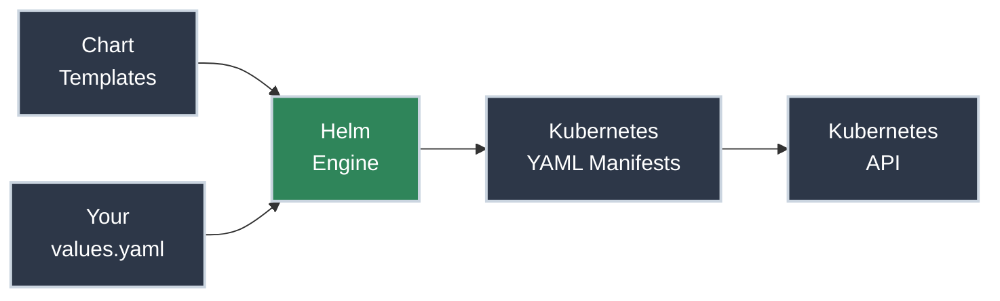
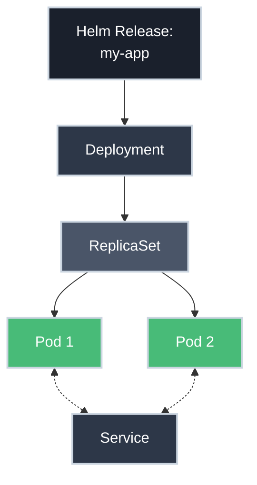
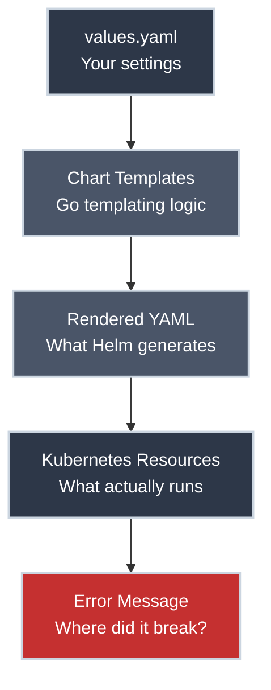

# Understanding What Helm Created

!!! tip "Part of Day One: Getting Started"
    This is the final article in the Helm Path for [Day One: Getting Started](../overview.md). You should have completed [Your First Helm Deployment](first_deploy.md) and learned the [Essential Helm Commands](commands.md) before reading this.

You ran `helm install` and your app appeared on the cluster. It felt easier than writing individual YAML files, but it might also feel a bit like a "black box." 

**But what actually happened?** Helm didn't create "special" Helm-only resources. It used your instructions to create the exact same Kubernetes building blocks—Pods, Services, and Deployments—that every other Kubernetes user uses.

This article pulls back the curtain so you can see how Helm translates your `values.yaml` into the running resources you see in `kubectl`.

!!! info "What You'll Learn"
    By the end of this article, you'll understand:

    - **Helm's primary role** as a "YAML generator"
    - **How `values.yaml` connects** to the Kubernetes manifests
    - **How to trace a Helm release** down to the individual Pods
    - **The shared destination** between the Helm path and the kubectl path
    - **How Helm tracks your releases** using Kubernetes Secrets

---

## Helm is a YAML Generator

The most important thing to understand about Helm is that it doesn't "stay" in the cluster to manage your app. Helm's job is to:

1.  **Read** your templates (the blueprint).
2.  **Inject** your values (your settings).
3.  **Render** the resulting Kubernetes YAML.
4.  **Send** that YAML to the Kubernetes API.



**Key insight:** Once the resources are created, Kubernetes manages them exactly like it would if you had run `kubectl apply`.

---

## Seeing the "Raw" YAML

You can see exactly what Helm generated for your release at any time.

✅ **Safe (Read-Only):**

```bash title="See generated manifests"
helm get manifest my-app
```

In the output, you'll see familiar headers:
- `kind: Deployment`
- `kind: Service`
- `kind: ConfigMap`

**This is the bridge:** These are the exact same resources covered in the [kubectl Path](../kubectl/understanding.md). Helm just filled in the blanks for you.

---

## How They Work Together: The Hierarchy

Even though you used Helm, the hierarchy of resources in Kubernetes remains the same. Helm creates a **Deployment**, which manages a **ReplicaSet**, which manages **Pods**.



**Where Helm adds value:**
- It ensures the labels in the Service match the labels in the Pods automatically.
- It can manage "Hooks" (like running a database migration *before* updating the app).
- It provides a single "Release" name that groups all these separate pieces together.

---

## How Helm Tracks Your Release

If Helm doesn't stay in the cluster, how does it know what happened during Revision 1 vs Revision 2?

Helm stores its metadata as **Kubernetes Secrets** in your namespace. 

```bash title="See Helm's tracking secrets"
kubectl get secrets -l owner=helm
# NAME                           TYPE                 DATA   AGE
# sh.helm.release.v1.my-app.v1   helm.sh/release.v1   1      5m
```

!!! warning "Don't Touch the Secrets!"
    Never edit or delete these Secrets using `kubectl`. If you delete them, Helm will "forget" that your application is deployed, and you won't be able to use `helm upgrade` or `helm uninstall` anymore.

---

## Troubleshooting: Helm vs. kubectl

Because Helm creates standard resources, you use standard `kubectl` commands to fix things when they break.

<div class="grid cards" markdown>

-   :material-magnify: **Problem: "Helm says 'deployed' but it's not working"**

    ---

    **Why it matters:** Helm only cares that Kubernetes *accepted* the YAML. It doesn't always wait to see if the app actually starts correctly.

    **The Fix:** Use `kubectl` to see what's wrong.
    ```bash
    kubectl get pods
    kubectl describe pod <name>
    ```

-   :material-label: **Problem: "Service can't find Pods"**

    ---

    **Why it matters:** If the chart author made a mistake, the labels might not match.

    **The Fix:** Compare the labels.
    ```bash
    kubectl get pods --show-labels
    kubectl describe service <name>
    ```

</div>

### The Complexity Cost: When Troubleshooting Gets Hard

Now that you understand how Helm works, let's be honest about the troubleshooting challenge you've taken on.

**The problem:** Helm adds multiple layers of abstraction between you and your running application. When something breaks, you have to debug through all of them:



**Real-world troubleshooting scenarios:**

<div class="grid cards" markdown>

-   :material-alert-circle: **Scenario 1: Template Rendering Error**

    ---

    **The error:**
    ```
    Error: template: my-chart/templates/deployment.yaml:15:24:
    executing "my-chart/templates/deployment.yaml" at <.Values.image.tag>:
    nil pointer evaluating interface {}.tag
    ```

    **What went wrong:** You forgot to set `image.tag` in your `values.yaml`.

    **The problem:** This error happens BEFORE Kubernetes even sees the YAML. You're debugging Go template logic, not Kubernetes.

    **The fix:** Check your values file and the template to see what's expected.

-   :material-alert-circle: **Scenario 2: Pod Fails to Start**

    ---

    **The symptom:** `helm status my-app` says "deployed" but `kubectl get pods` shows CrashLoopBackOff.

    **What went wrong:** The YAML rendered fine, Kubernetes accepted it, but the container image is wrong or the application is misconfigured.

    **The problem:** You need to trace backwards:

    1. Check the pod: `kubectl describe pod <name>`
    2. Check the rendered deployment: `helm get manifest my-app`
    3. Compare to your values: `helm get values my-app`
    4. Find the template that produced the bad config

    **The fix:** This requires understanding BOTH Helm templates AND Kubernetes pod troubleshooting.

-   :material-alert-circle: **Scenario 3: Service Can't Route Traffic**

    ---

    **The symptom:** Application deployed, pods running, but Service returns 503 errors.

    **What went wrong:** Labels don't match between the Service selector and the Pod labels.

    **The problem:** The chart template generates both the Service and Deployment. You need to:

    1. Get the rendered Service: `helm get manifest my-app | grep -A 20 "kind: Service"`
    2. Compare selector labels to Pod labels
    3. Trace back to which template values control these labels
    4. Update your `values.yaml` correctly

    **The complexity:** With `kubectl apply`, you'd see both YAMLs directly. With Helm, they're generated from templates you didn't write.

</div>

**The tradeoff in practice:**

In large, complex applications with dozens of templates and hundreds of configuration options, troubleshooting becomes exponentially harder. A simple misconfiguration—setting `replicas: "3"` (string) instead of `replicas: 3` (integer)—might work in one chart but break in another depending on template logic.

**What you need to succeed with Helm:**

1. **Strong kubectl skills** - You still debug with `kubectl`, not `helm`
2. **Template literacy** - Understanding Go template syntax (`{{ .Values.foo }}`, `{{ if }}`, `{{ range }}`)
3. **Rendered YAML inspection** - Always check `helm get manifest` when things break
4. **Chart structure knowledge** - Understanding what files are in a chart and how they're organized

!!! tip "The Day One Reality Check"
    If you're new to Kubernetes AND new to Helm, you're learning two complex systems simultaneously. Every error requires asking: "Is this a Kubernetes problem or a Helm problem?"

    **This is why we recommend:** Learn kubectl fundamentals first, then add Helm once you're comfortable debugging Kubernetes resources directly. But if your team already uses Helm, you're committed—just know that strong kubectl skills aren't optional.

**The good news:** Once you understand this layer cake, you can troubleshoot effectively. The key is always working backwards from the running resources (`kubectl`) to the rendered YAML (`helm get manifest`) to your values (`helm get values`) to the problem.

---

## You've Completed Day One

Remember where you started? You had Helm installed and a chart to deploy. Maybe it felt like a mysterious black box. 

**Look at what you've accomplished:**

You've connected Helm to your cluster. You've deployed both local and vendor charts. You've learned how to customize settings using `values.yaml`, and how to upgrade or rollback when things change. Most importantly, you now understand that Helm is a powerful tool for generating and managing the same core Kubernetes primitives you'll use throughout your career.

**You're ready for production work.**

The Helm path and the kubectl path meet here. Whether you use Helm to manage releases or `kubectl` to write manifests from scratch, the underlying resources are the same.

---

## What's Next

Now that you understand what Helm creates, you're ready to dive deep into those building blocks:

- **[Level 1: Core Primitives](../../level_1/overview.md)** - Deep dive into Pods, Services, and Deployments.
- **[Essential Helm Commands](commands.md)** - Review the lifecycle management commands.
- **[Your First Helm Deployment](first_deploy.md)** - Practice more complex customizations.

**Continue your journey:** Start Level 1 to master the resources that Helm has been creating for you!
