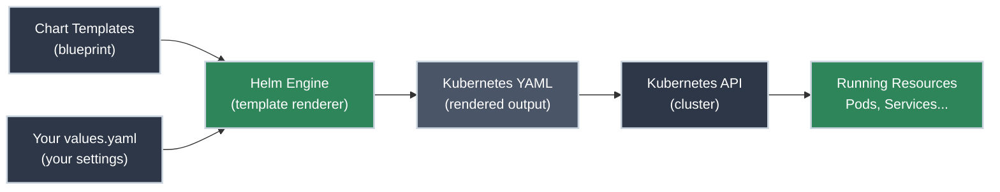
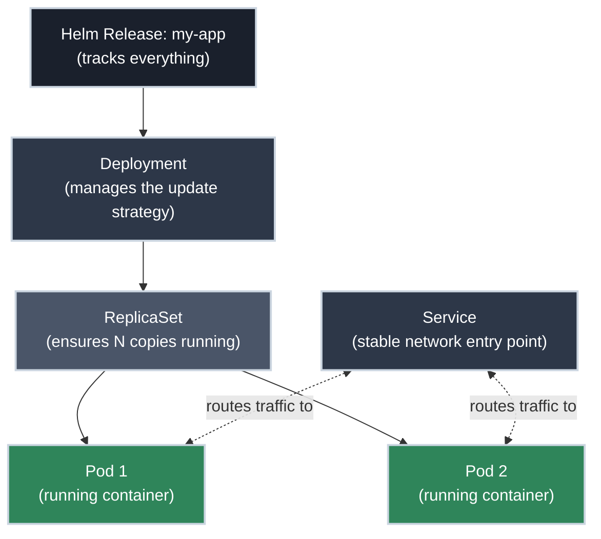
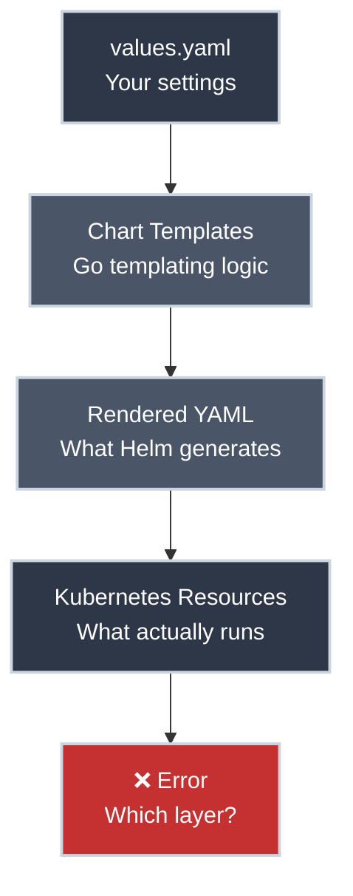

# Understanding What Helm Created

!!! tip "Part of Day One: Getting Started"
    This is the final article in the Helm path of [Day One: Getting Started](../overview.md). Complete [Your First Helm Deployment](first_deploy.md) and [Essential Helm Commands](commands.md) before reading this.

You ran `helm install` and your application appeared on the cluster. The commands worked. But it still might feel like a black box — Helm accepted your `values.yaml` and *somehow* created a Deployment, a Service, and a handful of other resources.

**Let's open that box.**

Understanding what Helm actually does makes you a better troubleshooter. When something breaks (and something always does), you need to know which layer to inspect: your values, the chart templates, the rendered YAML, or the running Kubernetes resources. This article connects those layers so you can move between them confidently.

!!! info "What You'll Learn"
    By the end of this article, you'll understand:

    - **Helm's primary job** — it's a YAML generator, not a cluster service
    - **How `values.yaml` flows** from your file into running Kubernetes resources
    - **How to trace a release** from rendered manifest down to individual Pods
    - **How Helm tracks releases** using Kubernetes Secrets
    - **How to troubleshoot** through each layer of the abstraction stack

---


```mermaid
graph LR
    Chart["Chart Templates<br/>(blueprint)"]
    Values["Your values.yaml<br/>(your settings)"]
    Engine["Helm Engine<br/>(template renderer)"]
    Manifests["Kubernetes YAML<br/>(rendered output)"]
    API["Kubernetes API<br/>(cluster)"]
    Running["Running Resources<br/>Pods, Services..."]

    Chart --> Engine
    Values --> Engine
    Engine --> Manifests
    Manifests --> API
    API --> Running

    style Chart fill:#2d3748,stroke:#cbd5e0,stroke-width:2px,color:#fff
    style Values fill:#2d3748,stroke:#cbd5e0,stroke-width:2px,color:#fff
    style Engine fill:#2f855a,stroke:#cbd5e0,stroke-width:2px,color:#fff
    style Manifests fill:#4a5568,stroke:#cbd5e0,stroke-width:2px,color:#fff
    style API fill:#2d3748,stroke:#cbd5e0,stroke-width:2px,color:#fff
    style Running fill:#2f855a,stroke:#cbd5e0,stroke-width:2px,color:#fff
```

---

## Helm Is a YAML Generator

The most important thing to understand about Helm is that it doesn't live inside the cluster managing your application. Helm runs locally on your machine, does its work, and hands off to Kubernetes.

**Helm's job, in order:**

1. **Read** the chart templates (the blueprint)
2. **Inject** your `values.yaml` settings into those templates
3. **Render** the resulting Kubernetes YAML
4. **Send** that YAML to the Kubernetes API — then its job is done

**After that, Kubernetes runs the show.** The Pods, Services, and Deployments that Helm created are managed by Kubernetes exactly as if you had run `kubectl apply` yourself. Helm doesn't "watch" your application after deployment.

**Why this matters for troubleshooting:** Once Helm delivers the YAML, you use `kubectl` to investigate. Helm is the factory; `kubectl` is the quality control inspector.

---

## Seeing the Raw YAML

At any point, you can see exactly what Helm generated and applied for a release:

✅ **Safe (Read-Only):**

```bash title="See the Kubernetes YAML Helm generated for this release"
helm get manifest my-app
# ---
# # Source: my-app/templates/deployment.yaml
# apiVersion: apps/v1
# kind: Deployment
# metadata:
#   name: my-app
# ...
# ---
# # Source: my-app/templates/service.yaml
# apiVersion: v1
# kind: Service
# ...
```

You'll see familiar resource types: `kind: Deployment`, `kind: Service`, `kind: ConfigMap`. **These are standard Kubernetes resources** — the same ones you'd write with `kubectl apply`. Helm just fills in the blanks from your `values.yaml`.

!!! info "The bridge between paths"
    Whether you followed the kubectl path or the Helm path through Day One, you end up in the same place: running Pods, Services, and Deployments managed by Kubernetes. Helm is just a smarter way to generate the YAML for complex applications. The kubectl path shows you those resources directly; the Helm path generates them for you.

---

## How Resources Connect: The Hierarchy

Even though Helm created everything, the Kubernetes resource hierarchy is the same as if you had written the YAML yourself. A Helm release creates a **Deployment**, which manages a **ReplicaSet**, which manages **Pods**. A **Service** routes traffic to those Pods using label selectors.


```mermaid
graph TD
    H["Helm Release: my-app<br/>(tracks everything)"]
    Dep["Deployment<br/>(manages the update strategy)"]
    RS["ReplicaSet<br/>(ensures N copies running)"]
    P1["Pod 1<br/>(running container)"]
    P2["Pod 2<br/>(running container)"]
    Svc["Service<br/>(stable network entry point)"]

    H --> Dep
    Dep --> RS
    RS --> P1
    RS --> P2
    Svc <-.->|"routes traffic to"| P1
    Svc <-.->|"routes traffic to"| P2

    style H fill:#1a202c,stroke:#cbd5e0,stroke-width:2px,color:#fff
    style Dep fill:#2d3748,stroke:#cbd5e0,stroke-width:2px,color:#fff
    style RS fill:#4a5568,stroke:#cbd5e0,stroke-width:2px,color:#fff
    style P1 fill:#2f855a,stroke:#cbd5e0,stroke-width:2px,color:#fff
    style P2 fill:#2f855a,stroke:#cbd5e0,stroke-width:2px,color:#fff
    style Svc fill:#2d3748,stroke:#cbd5e0,stroke-width:2px,color:#fff
```

**Where Helm adds value beyond a raw `kubectl apply`:**

- It automatically ensures the labels in the Service selector match the labels in the Pods (chart templates handle the consistency)
- It can run "Hooks" — tasks like database migrations that execute before the main application updates
- It groups all separate resources under one Release name, so you can manage them all with a single `helm upgrade` or `helm uninstall`

---

## How Helm Tracks Your Releases

If Helm doesn't run in the cluster, how does it remember what Revision 1 looked like when you want to roll back?

Helm stores release history as **Kubernetes Secrets** in your namespace. Each revision gets its own Secret containing the full snapshot of what was applied.

```bash title="See Helm's release tracking secrets"
kubectl get secrets -l owner=helm
# NAME                             TYPE                   DATA   AGE
# sh.helm.release.v1.my-app.v1    helm.sh/release.v1     1      1h
# sh.helm.release.v1.my-app.v2    helm.sh/release.v1     1      30m
```

!!! danger "Never touch these Secrets"
    Do not edit or delete the `sh.helm.release.v1.*` Secrets with `kubectl`. If you delete them, Helm loses its memory of the release. `helm upgrade`, `helm rollback`, and `helm uninstall` will no longer work for that release. If this happens, you'll need to manually clean up all the resources the release created.

---

## Troubleshooting Through the Layers

Here is the honest challenge with Helm: when something breaks, **you have to debug through multiple abstraction layers**. Each layer is a place where things can go wrong.


```mermaid
graph TD
    Values["values.yaml<br/>Your settings"]
    Templates["Chart Templates<br/>Go templating logic"]
    Rendered["Rendered YAML<br/>What Helm generates"]
    K8s["Kubernetes Resources<br/>What actually runs"]
    Error["❌ Error<br/>Which layer?"]

    Values --> Templates
    Templates --> Rendered
    Rendered --> K8s
    K8s --> Error

    style Values fill:#2d3748,stroke:#cbd5e0,stroke-width:2px,color:#fff
    style Templates fill:#4a5568,stroke:#cbd5e0,stroke-width:2px,color:#fff
    style Rendered fill:#4a5568,stroke:#cbd5e0,stroke-width:2px,color:#fff
    style K8s fill:#2d3748,stroke:#cbd5e0,stroke-width:2px,color:#fff
    style Error fill:#c53030,stroke:#cbd5e0,stroke-width:2px,color:#fff
```

### Common Troubleshooting Scenarios

<div class="grid cards" markdown>

-   :material-alert-circle: **Scenario 1: Template Rendering Error**

    ---

    **The error:**
    ```
    Error: template: my-chart/templates/deployment.yaml:15:24:
    executing "my-chart/templates/deployment.yaml" at <.Values.image.tag>:
    nil pointer evaluating interface {}.tag
    ```

    **What happened:** A required value is missing from your `values.yaml`. The template expected `image.tag` but it wasn't set.

    **The key insight:** This error occurs **before Kubernetes sees anything**. You're debugging Go template logic, not a Kubernetes problem.

    **How to fix:** Check your `values.yaml` for the missing key and verify the template's expected structure with `helm show values <chart>`.

-   :material-alert-circle: **Scenario 2: Helm Says "deployed" But App Isn't Working**

    ---

    **The symptom:** `helm list` shows `STATUS: deployed` but `kubectl get pods` shows `CrashLoopBackOff`.

    **What happened:** Helm only cares that the Kubernetes API *accepted* the YAML. It doesn't wait to confirm the application actually started successfully.

    **Trace backwards:**
    ```bash title="Debug pod startup failure"
    # 1. Check the pod
    kubectl describe pod <pod-name>

    # 2. Read the logs
    kubectl logs <pod-name>

    # 3. Check what Helm actually applied
    helm get manifest my-app

    # 4. Verify what values were used
    helm get values my-app
    ```

-   :material-alert-circle: **Scenario 3: Service Returns 503 Errors**

    ---

    **The symptom:** Application deployed, pods running, but the Service returns errors.

    **What happened:** The label selector in the Service doesn't match the labels on the Pods — often caused by a misconfigured value in the chart.

    **Trace backwards:**
    ```bash title="Debug 503 Service errors"
    # 1. Find the Service selector
    helm get manifest my-app | grep -A 20 "kind: Service"

    # 2. Compare to pod labels
    kubectl get pods --show-labels

    # 3. Identify which value controls these labels
    helm get values my-app --all | grep -i label
    ```

</div>

### The Troubleshooting Stack

When something breaks, work backwards through the layers:

| Layer | What to Check | Command |
|---|---|---|
| **Running resources** | Are pods actually running? | `kubectl get pods` / `kubectl describe pod` |
| **Rendered YAML** | What did Helm actually apply? | `helm get manifest <release>` |
| **Applied values** | What configuration was used? | `helm get values <release>` |
| **Template logic** | What does the chart expect? | `helm show values <chart>` |

### What You Need to Succeed with Helm

1. **Strong `kubectl` skills** — you debug with `kubectl`, not `helm`
2. **Rendered YAML inspection** — always check `helm get manifest` when things break
3. **Values verification** — always confirm with `helm get values` before blaming the chart
4. **Template literacy** — understanding Go template syntax (`{{ .Values.foo }}`) helps when reading error messages, but you don't need to write templates at Day One level

!!! tip "Day One Reality Check"
    If you're learning Kubernetes *and* Helm simultaneously, you're learning two complex systems at once. Every error requires asking: "Is this a Kubernetes problem or a Helm problem?" That judgment call takes practice. The exercises below will help you build it.

---

## Practice Exercises

??? question "Exercise 1: Trace Your Release"
    Deploy any Helm release, then use the troubleshooting stack to answer these questions without looking at your `values.yaml`:

    1. What is the Deployment's `revisionHistoryLimit`?
    2. What labels does the Service use to select Pods?
    3. Does the rendered YAML match what `helm get values` shows?

    ??? tip "Solution"
        ```bash title="Inspect rendered manifest"
        # Start with the rendered manifest
        helm get manifest <release-name>

        # Extract specific sections:
        helm get manifest <release-name> | grep -A 5 "revisionHistoryLimit"
        helm get manifest <release-name> | grep -A 10 "kind: Service"

        # Cross-reference with your values:
        helm get values <release-name> --all
        ```

        If the manifest reflects what you expect from your values, the rendering is correct. If something looks wrong, the problem is either in your values or in the chart templates.

??? question "Exercise 2: Simulate and Trace a Misconfiguration"
    Deploy nginx from Bitnami. Then introduce a misconfiguration: set `service.type: InvalidType` in your `values.yaml` and run `helm upgrade --dry-run`. Read the error and identify which layer it came from.

    ??? tip "Solution"
        ```bash title="Simulate misconfiguration with dry-run"
        # First deploy
        helm install trace-test bitnami/nginx -f values.yaml

        # Set service.type: InvalidType in values.yaml, then:
        helm upgrade trace-test bitnami/nginx -f values.yaml --dry-run

        # For service.type: InvalidType, you'll see a Kubernetes validation error —
        # the value passes through template rendering fine (it's just a string),
        # but the Kubernetes API rejects the rendered manifest because InvalidType
        # is not a recognized Service type.
        #
        # To see a template rendering error instead, try omitting a required value
        # (e.g., delete image.tag from values.yaml) — that fails before K8s even sees it.
        ```

        Recognizing which layer an error comes from is the core troubleshooting skill for Helm. `service.type: InvalidType` always fails at the Kubernetes validation layer — the template renders successfully, K8s rejects the output.

---

## Quick Recap

| Concept | What to Know |
|---------|-------------|
| **Helm is a YAML generator** | It runs locally, generates Kubernetes YAML, sends it to the API, then its job is done |
| **Standard Kubernetes resources** | Helm creates Deployments, Services, etc. — the same resources `kubectl apply` would create |
| **Release tracking** | Helm stores each revision as a Kubernetes Secret — never delete these manually |
| **Troubleshooting order** | Running resources → Rendered YAML → Applied values → Template logic |
| **`kubectl` for debugging** | After Helm deploys, `kubectl` is your investigation tool |

---

## Further Reading

### Official Documentation

- [Helm Architecture](https://helm.sh/docs/topics/architecture/) - How Helm works internally
- [Chart Templates Guide](https://helm.sh/docs/chart_template_guide/) - Go templating in Helm charts
- [Helm Provenance and Integrity](https://helm.sh/docs/topics/provenance/) - Verifying chart authenticity

### Deep Dives

- [Helm Chart Best Practices](https://helm.sh/docs/chart_best_practices/) - Writing and using charts effectively
- [Debugging Templates](https://helm.sh/docs/chart_template_guide/debugging/) - Official guide to template debugging with `--dry-run` and `--debug`

### Related Articles

- [Essential Helm Commands](commands.md) - The commands that interact with each layer
- [Your First Helm Deployment](first_deploy.md) - The hands-on deployment workflow
- [YAML on the Python Site](https://python.bradpenney.io/essentials/yaml/) - YAML syntax reference if the values format feels unfamiliar

---

## You've Completed Day One

You arrived knowing that Kubernetes existed. You leave knowing how to connect to a cluster, deploy an application, manage its lifecycle, and understand what's actually running.

Whether you took the `kubectl` path (writing YAML directly) or the Helm path (using chart templates), the destination is the same: **running Pods, stable Services, and the confidence to deploy and debug.**

**Look at what you've built:**

- Connected to your company's cluster with proper authentication
- Deployed an application and verified it running
- Learned to read and investigate the resources you created
- Understood how Helm generates and tracks Kubernetes resources
- Practiced the troubleshooting workflow from symptoms to root cause

This is the foundation. Everything in Level 1 and beyond builds directly on these skills.

---

## What's Next?

Day One is complete. Now it's time to understand the building blocks that Helm has been creating for you.

**[Level 1: Core Primitives](../../level_1/overview.md)** — Deep dive into Pods, Services, and the other fundamental Kubernetes resources. You've deployed them; now you'll understand exactly how they work.
