# Essential kubectl Commands

!!! tip "Part of Day One: Getting Started"
    This is the fourth article in [Day One: Getting Started](../overview.md). If you haven't deployed anything yet, do [Your First Deployment](first_deploy.md) first.

You just deployed your first application to Kubernetes. It worked! But you also noticed something: you ran `kubectl apply`, then `kubectl get pods`, then `kubectl describe`, then `kubectl logs`... and you're starting to wonder: **how many of these commands do I actually need to know?**

Good news: despite hundreds of possible `kubectl` commands and flags, you'll use the same 10-15 commands about 90% of the time. Master these, and you'll be productive with Kubernetes.

This guide organizes the essential commands by what you're trying to do, shows you exactly what output to expect, and gives you the confidence to explore safely.

!!! info "What You'll Learn"
    By the end of this article, you'll know:

    - The daily commands you'll run dozens of times (read-only and safe)
    - The deployment commands that modify resources (use with awareness)
    - The troubleshooting commands that save you when things break
    - How to combine commands with useful flags
    - Which commands are safe vs. destructive

## The Daily Commands

**Start with read-only commands.** They're safe, informative, and help you understand what's actually running in your cluster before you make any changes.


These are the commands you'll run dozens of times per day. They're all equally important—use whichever one fits your current need:

=== "kubectl get"

    ### Get (Viewing Resources)

    The `kubectl get` command lists resources. This is usually your first step when checking on deployments, debugging issues, or just seeing what's running.

    ```bash title="List Pods"
    kubectl get pods
    # NAME                        READY   STATUS    RESTARTS   AGE
    # my-app-7c5ddbdf54-2xkqn     1/1     Running   0          5m
    # my-app-7c5ddbdf54-8mz4p     1/1     Running   0          5m
    ```

    ```bash title="List Deployments"
    kubectl get deployments
    kubectl get deploy  # Short form
    # NAME      READY   UP-TO-DATE   AVAILABLE   AGE
    # my-app    3/3     3            3           10m
    ```

    ```bash title="List Services"
    kubectl get services
    kubectl get svc  # Short form
    # NAME         TYPE        CLUSTER-IP      EXTERNAL-IP   PORT(S)   AGE
    # my-app-svc   ClusterIP   10.96.45.123    <none>        80/TCP    10m
    ```

    ```bash title="List Everything in Namespace"
    kubectl get all
    # Shows pods, services, deployments, replicasets
    ```

    ```bash title="Get More Details"
    kubectl get pods -o wide
    # NAME                        READY   STATUS    RESTARTS   AGE   IP           NODE
    # my-app-7c5ddbdf54-2xkqn     1/1     Running   0          5m    10.244.1.5   worker-1
    ```

    ✅ **Safe:** Read-only, can't break anything

=== "kubectl describe"

    ### Describe (Detailed Info)

    When `kubectl get` shows something's wrong, `kubectl describe` tells you **why**. It shows events, status details, and error messages—your primary debugging tool.

    ```bash title="Describe a Pod"
    kubectl describe pod my-app-7c5ddbdf54-2xkqn
    # Name:             my-app-7c5ddbdf54-2xkqn
    # Namespace:        default
    # Node:             worker-1/192.168.1.10
    # Status:           Running
    # IP:               10.244.1.5
    # Containers:
    #   my-app:
    #     Image:          nginx:1.21
    #     Port:           80/TCP
    #     State:          Running
    # Events:
    #   Type    Reason     Age   Message
    #   ----    ------     ----  -------
    #   Normal  Scheduled  5m    Successfully assigned pod to worker-1
    #   Normal  Pulled     5m    Container image pulled
    #   Normal  Created    5m    Created container
    #   Normal  Started    5m    Started container
    ```

    **Pro tip:** Always check the Events section at the bottom—that's where error messages appear.

    ✅ **Safe:** Read-only

=== "kubectl logs"

    ### Logs (Application Output)

    The `kubectl logs` command shows your application's stdout/stderr—exactly what you'd see if you ran the container locally with `docker logs`.

    ```bash title="View Pod Logs"
    kubectl logs my-app-7c5ddbdf54-2xkqn
    # 192.168.1.100 - - [12/Feb/2026:14:23:11 +0000] "GET / HTTP/1.1" 200
    # 192.168.1.101 - - [12/Feb/2026:14:23:15 +0000] "GET /health HTTP/1.1" 200
    ```

    ```bash title="Follow Logs in Real-Time"
    kubectl logs -f my-app-7c5ddbdf54-2xkqn
    # Like tail -f - keeps running and shows new log lines as they appear
    # Press Ctrl+C to stop
    ```

    ```bash title="Last N Lines"
    kubectl logs --tail=50 my-app-7c5ddbdf54-2xkqn
    # Shows only the last 50 lines
    ```

    ```bash title="Multi-Container Pod"
    kubectl logs my-app-7c5ddbdf54-2xkqn -c nginx
    # When a pod has multiple containers, specify which one
    ```

    ✅ **Safe:** Read-only

=== "kubectl explain"

    ### Explain (Documentation)

    The `kubectl explain` command is built-in documentation for every Kubernetes resource. No need to leave your terminal to look up YAML fields.

    ```bash title="Explain a Resource Type"
    kubectl explain pods
    # KIND:     Pod
    # VERSION:  v1
    # DESCRIPTION:
    #      Pod is a collection of containers that can run on a host...
    ```

    ```bash title="Drill Down into Fields"
    kubectl explain pods.spec
    # Shows all fields under spec

    kubectl explain pods.spec.containers
    # Shows container-specific fields

    kubectl explain pods.spec.containers.resources
    # Shows resource request/limit fields
    ```

    ```bash title="Explain Other Resources"
    kubectl explain deployments
    kubectl explain services
    kubectl explain configmaps
    # Works for ANY Kubernetes resource
    ```

    **Pro tip:** When writing YAML and you forget a field name, use `kubectl explain` instead of googling.

    ✅ **Safe:** Just shows documentation—doesn't interact with the cluster

---

??? tip "Pro Tips - Click to Expand"
    **Create shell aliases for commands you run constantly:**

    === "bash/zsh (Linux/Mac)"

        ```bash title="Add to ~/.bashrc or ~/.zshrc"
        alias k=kubectl
        alias kgp='kubectl get pods'
        alias kgd='kubectl get deployments'
        alias kgs='kubectl get svc'
        alias kga='kubectl get all'
        alias kd='kubectl describe'
        alias kl='kubectl logs'
        alias kaf='kubectl apply -f'
        alias kdel='kubectl delete'
        ```

        After adding these, run `source ~/.bashrc` (or `source ~/.zshrc`), then you can use `k get pods` instead of `kubectl get pods`.

    === "PowerShell (Windows)"

        ```powershell title="Add to your PowerShell profile"
        # Find your profile location:
        # $PROFILE

        # Edit your profile (creates if missing):
        # notepad $PROFILE

        # Add these functions:
        function k { kubectl $args }
        function kgp { kubectl get pods $args }
        function kgd { kubectl get deployments $args }
        function kgs { kubectl get svc $args }
        function kga { kubectl get all $args }
        function kd { kubectl describe $args }
        function kl { kubectl logs $args }
        function kaf { kubectl apply -f $args }
        function kdel { kubectl delete $args }
        ```

        After adding these, restart PowerShell, then you can use `k get pods` instead of `kubectl get pods`.

        !!! tip "Reload Without Restarting"
            After editing your profile, reload it:
            ```powershell
            . $PROFILE
            ```

    **Enable kubectl autocomplete** for tab completion of commands and resource names:

    === "bash"

        ```bash title="Add to ~/.bashrc"
        # Enable kubectl autocompletion
        source <(kubectl completion bash)

        # If using alias 'k', add completion for it:
        complete -o default -F __start_kubectl k
        ```

        After adding, run `source ~/.bashrc` or restart your terminal.

    === "zsh"

        ```bash title="Add to ~/.zshrc"
        # Enable kubectl autocompletion
        source <(kubectl completion zsh)

        # If using alias 'k', add completion for it:
        compdef __start_kubectl k
        ```

        After adding, run `source ~/.zshrc` or restart your terminal.

    === "PowerShell"

        ```powershell title="Add to your PowerShell profile"
        # Enable kubectl autocompletion
        kubectl completion powershell | Out-String | Invoke-Expression

        # Optional: Set alias 'k' to kubectl
        Set-Alias -Name k -Value kubectl
        ```

        After adding, restart PowerShell or run `. $PROFILE`.

    **With autocomplete enabled:** Press `Tab` while typing commands:

    - `kubectl get po` + `Tab` → `kubectl get pods`
    - `kubectl describe pod my-app-` + `Tab` → shows matching pod names
    - `kubectl -n ` + `Tab` → shows available namespaces

    **Set your default namespace** so you don't need `-n namespace` every time:

    ```bash title="Set Default Namespace (Works in all shells)"
    kubectl config set-context --current --namespace=your-namespace
    # Now all commands use this namespace by default
    ```

    !!! tip "Need to switch between multiple contexts?"
        If you work with multiple clusters (dev, staging, prod), you'll use `kubectl config use-context` to switch between them. See **[Getting kubectl Access: Switching Contexts](access.md#switching-contexts)** for the full workflow.

---

## Deployment Commands

Now we move from read-only to commands that **modify your cluster**. These are still safe in your dev namespace, but use them with awareness.

```mermaid
graph TD
    Start[Need to change<br/>resources?] --> Apply[kubectl apply<br/>Create/Update]
    Apply --> Check{Is it working?}

    Check -->|Yes| Scale[kubectl scale<br/>Adjust replicas]
    Check -->|No| Delete[kubectl delete<br/>Remove resources]

    Scale --> Done[Changes applied<br/>⚠️ Namespace modified]
    Delete --> Done

    style Start fill:#1a202c,stroke:#cbd5e0,stroke-width:2px,color:#fff
    style Apply fill:#2d3748,stroke:#cbd5e0,stroke-width:2px,color:#fff
    style Check fill:#4a5568,stroke:#cbd5e0,stroke-width:2px,color:#fff
    style Scale fill:#2d3748,stroke:#cbd5e0,stroke-width:2px,color:#fff
    style Delete fill:#c53030,stroke:#cbd5e0,stroke-width:2px,color:#fff
    style Done fill:#4a5568,stroke:#cbd5e0,stroke-width:2px,color:#fff
```



=== "kubectl apply"

    ### Apply (Create/Update Resources)

    The `kubectl apply` command is how you deploy applications. It reads YAML files and creates or updates resources to match what's in the file.

    ```bash title="Apply a Single File"
    kubectl apply -f deployment.yaml
    # deployment.apps/my-app created
    ```

    **Example YAML that `kubectl apply` reads:**

    ```yaml title="deployment.yaml" linenums="1"
    apiVersion: apps/v1  # (1)!
    kind: Deployment  # (2)!
    metadata:
      name: my-app  # (3)!
    spec:
      replicas: 3  # (4)!
      selector:
        matchLabels:
          app: my-app
      template:
        metadata:
          labels:
            app: my-app  # (5)!
        spec:
          containers:
          - name: nginx
            image: nginx:1.21  # (6)!
            ports:
            - containerPort: 80
    ```

    1. API version tells Kubernetes which resource schema to use
    2. Deployment manages ReplicaSets, which manage Pods
    3. Name must be unique within the namespace
    4. Kubernetes maintains exactly 3 running pods
    5. Labels connect Deployments → Pods → Services
    6. **Always pin versions** - avoid `:latest` in production

    ```bash title="Apply All Files in Directory"
    kubectl apply -f ./configs/
    # deployment.apps/my-app created
    # service/my-app-svc created
    # configmap/my-app-config created
    ```

    ```bash title="Apply from URL"
    kubectl apply -f https://k8s.io/examples/application/deployment.yaml
    # Useful for examples and quick tests
    ```

    **How it works:** `kubectl apply` is declarative—it figures out what needs to be created, updated, or left alone. Run it multiple times safely; it only makes necessary changes.

    ⚠️ **Caution:** Creates or modifies resources in your namespace - can trigger Pod restarts if changing images or resource limits

=== "kubectl delete"

    ### Delete (Remove Resources)

    The `kubectl delete` command removes resources. Use carefully—there's no "Are you sure?" prompt.

    ```bash title="Delete by File"
    kubectl delete -f deployment.yaml
    # deployment.apps "my-app" deleted
    # Removes everything defined in that YAML file
    ```

    ```bash title="Delete by Resource Name"
    kubectl delete pod my-app-7c5ddbdf54-2xkqn
    # pod "my-app-7c5ddbdf54-2xkqn" deleted

    kubectl delete deployment my-app
    # deployment.apps "my-app" deleted
    # Also deletes the ReplicaSet and all pods it manages
    ```

    ```bash title="Delete by Label"
    kubectl delete all -l app=myapp
    # Deletes all resources with label app=myapp
    # CAREFUL: 'all' means pods, services, deployments, etc.
    ```

    !!! warning "Namespace Awareness"
        `kubectl delete` only affects your current namespace. You can't accidentally delete production resources if you're in the dev namespace—but always check with `kubectl config view --minify | grep namespace` first.

    🚨 **DANGER:** Permanently deletes resources—no confirmation prompt

=== "kubectl scale"

    ### Scale (Adjust Replicas)

    ⚠️ **Caution:** The `kubectl scale` command changes how many copies (replicas) of your application are running **immediately**. Great for testing load handling or temporarily scaling down, but affects live traffic.

    ```bash title="Scale Up"
    kubectl scale deployment my-app --replicas=5
    # deployment.apps/my-app scaled
    # Kubernetes creates 2 more pods (you had 3, now you'll have 5)
    ```

    ```bash title="Scale Down"
    kubectl scale deployment my-app --replicas=1
    # deployment.apps/my-app scaled
    # Kubernetes terminates 2 pods (keeping 1 running)
    # ⚠️ Active connections to terminated pods may be dropped
    ```

    ```bash title="Scale to Zero"
    kubectl scale deployment my-app --replicas=0
    # Stops all pods but keeps the deployment
    # ⚠️ Application becomes completely unavailable
    ```

    **Note:** Scaling changes take a few seconds. Use `kubectl get pods -w` to watch pods starting or terminating.

    **Production consideration:** Scaling down can drop active connections. In production, prefer gradual scaling or use `kubectl rollout restart` for graceful pod replacement.

---

## Troubleshooting Commands

When things break (and they will), these commands help you investigate and fix problems.

```mermaid
graph TD
    Start[Something's broken?] --> Port[kubectl port-forward<br/>Test locally]
    Port --> Works{Does it work<br/>locally?}

    Works -->|No| Exec[kubectl exec<br/>Shell into pod]
    Works -->|Yes| Rollout[kubectl rollout<br/>Check deployment]

    Exec --> Debug[Debug inside<br/>container]
    Rollout --> Fix{Need to<br/>rollback?}

    Fix -->|Yes| Undo[kubectl rollout undo<br/>Revert to previous]
    Fix -->|No| Restart[kubectl rollout restart<br/>Recreate pods]

    Debug --> Solved[Problem identified<br/>⚠️ Fix and redeploy]
    Undo --> Solved
    Restart --> Solved

    style Start fill:#1a202c,stroke:#cbd5e0,stroke-width:2px,color:#fff
    style Port fill:#2d3748,stroke:#cbd5e0,stroke-width:2px,color:#fff
    style Works fill:#4a5568,stroke:#cbd5e0,stroke-width:2px,color:#fff
    style Exec fill:#2d3748,stroke:#cbd5e0,stroke-width:2px,color:#fff
    style Rollout fill:#2d3748,stroke:#cbd5e0,stroke-width:2px,color:#fff
    style Debug fill:#2d3748,stroke:#cbd5e0,stroke-width:2px,color:#fff
    style Fix fill:#4a5568,stroke:#cbd5e0,stroke-width:2px,color:#fff
    style Undo fill:#2d3748,stroke:#cbd5e0,stroke-width:2px,color:#fff
    style Restart fill:#2d3748,stroke:#cbd5e0,stroke-width:2px,color:#fff
    style Solved fill:#2f855a,stroke:#cbd5e0,stroke-width:2px,color:#fff
```



=== "kubectl port-forward"

    ### Port Forward (Local Access)

    The `kubectl port-forward` command creates a tunnel from your laptop to a pod or service in the cluster. Perfect for testing before exposing services publicly.

    ```bash title="Forward Pod Port to localhost"
    kubectl port-forward pod/my-app-7c5ddbdf54-2xkqn 8080:80
    # Forwarding from 127.0.0.1:8080 -> 80
    # Now open http://localhost:8080 in your browser
    # Press Ctrl+C to stop forwarding
    ```

    ```bash title="Forward Service Port"
    kubectl port-forward service/my-app-svc 8080:80
    # Forwards to one of the service's pods automatically
    # Better than pod forwarding (works even if pods restart)
    ```

    **When to use this:**

    - Testing an application before creating an Ingress
    - Accessing a database that's not publicly exposed
    - Debugging connectivity issues

    ✅ **Safe:** Only affects your local machine—doesn't change anything in the cluster

=== "kubectl exec"

    ### Exec (Shell Into Pod)

    The `kubectl exec` command runs commands inside a running container—like SSH but for containers. Incredibly useful for debugging when logs don't tell you enough.

    ??? danger "Major Security Risk - Click to Expand"
        **Many enterprise organizations disable `kubectl exec` entirely.** Here's why:

        **You're inside the cluster network:** Once you `exec` into a pod, you have network access to:

        - Internal services (databases, APIs, message queues)
        - Other pods in the same namespace
        - Potentially other namespaces (depending on network policies)
        - Secrets mounted as environment variables or files

        **An attacker with `exec` access can:**

        - Exfiltrate sensitive data from databases
        - Access internal APIs that should be isolated
        - Pivot to other systems within the cluster
        - Read mounted secrets and credentials

        **Enterprise reality:** Many organizations restrict `exec` via RBAC policies or disable it completely in production. If you get "Forbidden" errors, this is intentional security policy—not a bug.

        **Alternatives to consider:**

        - Use `kubectl logs` for application debugging (safer)
        - Build better observability into your app (metrics, traces)
        - Use ephemeral debug containers (Kubernetes 1.23+) with time limits
        - Request temporary elevated access through formal security processes

    ```bash title="Run a Single Command"
    kubectl exec my-app-7c5ddbdf54-2xkqn -- ls -la /app
    # total 12
    # drwxr-xr-x    2 root     root          4096 Feb 12 14:20 .
    # drwxr-xr-x    1 root     root          4096 Feb 12 14:20 ..
    # -rw-r--r--    1 root     root           612 Feb 12 14:20 index.html
    ```

    ```bash title="Interactive Shell"
    kubectl exec -it my-app-7c5ddbdf54-2xkqn -- /bin/bash
    # Opens interactive shell inside the container
    # You're now "inside" the pod - explore, debug, test

    # If bash isn't available, try sh:
    kubectl exec -it my-app-7c5ddbdf54-2xkqn -- sh
    ```

    ```bash title="Multi-Container Pod"
    kubectl exec -it my-app-7c5ddbdf54-2xkqn -c nginx -- sh
    # Specify container name when pod has multiple containers
    ```

    ```bash title="If Exec is Blocked"
    kubectl exec my-app-7c5ddbdf54-2xkqn -- sh
    # Error from server (Forbidden): pods "my-app-7c5ddbdf54-2xkqn" is forbidden:
    # User "your-username" cannot create resource "pods/exec" in namespace "dev"

    # This is expected in many enterprise environments
    # Use kubectl logs instead, or request access through proper channels
    ```

        **Common debugging tasks (if you have `exec` access):**

        - Check if config files are mounted correctly
        - Test network connectivity (`curl`, `ping`)
        - Verify environment variables
        - Inspect file permissions

        🚨 **DANGER:**

        - You can modify the container's filesystem (changes lost when pod/container restarts)
        - You have network access to internal cluster services
        - Your actions are audited—use responsibly and only in dev/test environments
        - Never use `exec` in production unless explicitly authorized

=== "kubectl rollout"

    ### Rollout (Manage Deployments)

    The `kubectl rollout` commands manage deployment updates, history, and rollbacks. Essential when deployments go wrong.

    ```bash title="Check Rollout Status"
    kubectl rollout status deployment/my-app
    # Waiting for deployment "my-app" rollout to finish: 1 out of 3 new replicas updated...
    # deployment "my-app" successfully rolled out
    ```

    ```bash title="View Rollout History"
    kubectl rollout history deployment/my-app
    # REVISION  CHANGE-CAUSE
    # 1         <none>
    # 2         kubectl apply --filename=deployment.yaml
    # 3         kubectl apply --filename=deployment.yaml
    ```

    ```bash title="Rollback to Previous Version"
    kubectl rollout undo deployment/my-app
    # deployment.apps/my-app rolled back
    # Reverts to the previous version immediately
    ```

    ```bash title="Rollback to Specific Revision"
    kubectl rollout undo deployment/my-app --to-revision=2
    # deployment.apps/my-app rolled back
    ```

    ```bash title="Restart Deployment"
    kubectl rollout restart deployment/my-app
    # deployment.apps/my-app restarted
    # Recreates all pods (useful when config changed but image didn't)
    ```

    ⚠️ **Caution:** These commands affect your running application—use `rollout status` first to understand what's happening

---

## Useful Flags

These flags work with most `kubectl` commands and dramatically increase their power.

=== "Namespace"

    ### Namespace

    By default, `kubectl` commands operate on your current namespace. Use these flags to work with other namespaces:

    ```bash title="Specific Namespace"
    kubectl get pods -n other-namespace
    # Shows pods in 'other-namespace' instead of current namespace
    ```

    ```bash title="All Namespaces"
    kubectl get pods --all-namespaces
    kubectl get pods -A  # Short form
    # Shows pods from all namespaces (if you have permission)
    ```

=== "Output Formats"

    ### Output Formats

    Get resources in different formats for parsing, saving, or detailed inspection:

    ```bash title="YAML Output"
    kubectl get pod my-app-7c5ddbdf54-2xkqn -o yaml
    # Shows complete pod definition in YAML
    # Great for seeing every field and current values
    ```

    ```bash title="JSON Output"
    kubectl get pod my-app-7c5ddbdf54-2xkqn -o json
    # Same as YAML but in JSON format
    # Useful for scripting with jq
    ```

    ```bash title="Custom Columns"
    kubectl get pods -o custom-columns=NAME:.metadata.name,STATUS:.status.phase,IP:.status.podIP
    # NAME                        STATUS    IP
    # my-app-7c5ddbdf54-2xkqn     Running   10.244.1.5
    ```

=== "Labels"

    ### Labels

    Labels are key/value pairs attached to resources—the fundamental way Kubernetes connects resources together.

    ```bash title="Filter by Label"
    kubectl get pods -l app=nginx
    # Shows only pods with label app=nginx

    kubectl get pods -l app=nginx,environment=prod
    # Multiple labels (AND condition)
    ```

    ```bash title="Show Labels"
    kubectl get pods --show-labels
    # NAME                        READY   STATUS    LABELS
    # my-app-7c5ddbdf54-2xkqn     1/1     Running   app=nginx,pod-template-hash=7c5ddbdf54
    ```

    ```bash title="Trace Label Matching (Troubleshooting)"
    # 1. Check what label your Service is looking for
    kubectl get service my-app-svc -o jsonpath='{.spec.selector}'
    # {"app":"nginx"}

    # 2. Check if your Pods have that label
    kubectl get pods -l app=nginx
    # If empty, labels don't match!

    # 3. Check Service endpoints
    kubectl get endpoints my-app-svc
    # Should show Pod IPs - if empty, labels don't match
    ```

    !!! tip "Understanding Labels"
        Labels are how Services find Pods, how Deployments manage Pods, and how you filter resources. Without matching labels, Services can't route traffic—this is the #1 cause of "my service returns 503" problems.

        **Visual explanation:** See the [label matching diagram in Your First Deployment](first_deploy.md#your-first-deployment) showing how Deployment, Pods, and Service connect via labels.

        **Deep dive:** For the complete explanation, see **[Understanding What Happened: Labels - The Glue](understanding.md#labels-the-glue)**

=== "Watch"

    ### Watch

    Watch resources in real-time as they change:

    ```bash title="Watch for Changes"
    kubectl get pods --watch
    kubectl get pods -w  # Short form
    # Shows initial list, then updates as pods start/stop/change
    # Press Ctrl+C to stop watching
    ```

**Combine flags:** You can use multiple flags together, like `kubectl get pods -n dev -l app=nginx -o wide --watch`

---

## Command Cheat Sheet

**Quick reference for the 10 essential commands:**

| Task | Command | Safety |
|------|---------|--------|
| **List pods** | `kubectl get pods` | ✅ Safe |
| **Pod details** | `kubectl describe pod <name>` | ✅ Safe |
| **Pod logs** | `kubectl logs <name>` | ✅ Safe |
| **Shell in pod** | `kubectl exec -it <name> -- sh` | ⚠️ Caution |
| **Create resources** | `kubectl apply -f file.yaml` | ⚠️ Caution |
| **Delete resources** | `kubectl delete -f file.yaml` | 🚨 Danger |
| **Scale deployment** | `kubectl scale deployment <name> --replicas=N` | ⚠️ Caution |
| **Port forward** | `kubectl port-forward pod/<name> 8080:80` | ✅ Safe |
| **Rollback** | `kubectl rollout undo deployment/<name>` | ⚠️ Caution |
| **Get docs** | `kubectl explain <resource>` | ✅ Safe |

---

## Real-World Workflows

Real-world scenarios showing how to combine commands effectively.

=== "Debugging a Broken Pod"

    ### Debugging a Broken Pod

    When you see a pod with status `CrashLoopBackOff`, `Error`, or `ImagePullBackOff`:

    ```bash title="1. Identify the Problem Pod"
    kubectl get pods
    # NAME                        READY   STATUS             RESTARTS   AGE
    # my-app-7c5ddbdf54-2xkqn     0/1     CrashLoopBackOff   5          3m
    ```

    ```bash title="2. Check Events"
    kubectl describe pod my-app-7c5ddbdf54-2xkqn
    # Look at the Events section at the bottom
    # Common errors:
    # - "ImagePullBackOff" → wrong image name
    # - "CrashLoopBackOff" → container exits immediately
    # - "Pending" with events → resource constraints
    ```

    ```bash title="3. Check Application Logs"
    kubectl logs my-app-7c5ddbdf54-2xkqn
    # See what the application printed before crashing

    # If it restarted multiple times, check previous logs:
    kubectl logs my-app-7c5ddbdf54-2xkqn --previous
    ```

    ```bash title="4. Shell Into Pod (if it's running)"
    kubectl exec -it my-app-7c5ddbdf54-2xkqn -- sh
    # Investigate filesystem, test connections, check config
    ```

=== "Deploying an Update"

    ### Deploying an Update

    The safe way to deploy a new version:

    ```bash title="1. Edit Your YAML"
    # Update the image version in deployment.yaml
    # image: nginx:1.21 → image: nginx:1.22
    ```

    ```bash title="2. Apply the Change"
    kubectl apply -f deployment.yaml
    # deployment.apps/my-app configured
    ```

    ```bash title="3. Watch the Rollout"
    kubectl rollout status deployment/my-app
    # Waiting for deployment "my-app" rollout to finish...
    # deployment "my-app" successfully rolled out
    ```

    ```bash title="4. Verify Pods are Running"
    kubectl get pods
    # All pods should show STATUS: Running and READY: 1/1
    ```

    ```bash title="5. If Something Broke, Rollback"
    kubectl rollout undo deployment/my-app
    # deployment.apps/my-app rolled back
    # Instantly reverts to the previous working version
    ```

=== "Checking Application Health"

    ### Checking Application Health

    Quick health check workflow:

    ```bash title="1. Check All Resources"
    kubectl get all
    # See pods, services, deployments, replicasets at once
    ```

    ```bash title="2. Verify Pods are Running"
    kubectl get pods
    # All should be Running with correct READY count
    ```

    ```bash title="3. Check Service Exists"
    kubectl get svc
    # Verify your service has a ClusterIP
    ```

    ```bash title="4. Test Connectivity"
    kubectl port-forward service/my-app-svc 8080:80
    # Forwarding from 127.0.0.1:8080 -> 80

    # Open http://localhost:8080 in your browser
    # If it works, your app is healthy
    ```

---

## Real-World Pitfalls

Common pitfalls that trip up even experienced users:

=== "Wrong Namespace"

    ### The Wrong Namespace Trap

    The most common mistake: running commands in the wrong namespace.

    ```bash title="Always Check Your Current Namespace"
    kubectl config view --minify | grep namespace
    # namespace: dev

    # Or check explicitly on each command:
    kubectl get pods -n production  # ⚠️ Be VERY careful with production
    ```

    **You think you're in `dev`, but you're actually in `production`.** This leads to:

    - Deleting production pods by accident
    - Deploying test code to production
    - Scaling down production deployments

    **Protection:** Set your namespace explicitly and verify before destructive operations.

=== "--all Flag Danger"

    ### The `--all` Flag Danger

    Commands with `--all` or `-A` are powerful but dangerous:

    ```bash title="Dangerous: Affects ALL Namespaces"
    kubectl delete pods --all -A
    # 🚨 DELETES EVERY POD IN EVERY NAMESPACE YOU HAVE ACCESS TO

    kubectl get pods -A
    # ✅ Safe - just lists pods across all namespaces
    ```

    **Rule:** `--all` with read-only commands (`get`, `describe`) is safe. `--all` with destructive commands (`delete`) is **extremely dangerous**.

=== "Label Selectors"

    ### The `-l` Label Selector Trap

    Label selectors are powerful but can match more than you expect:

    ```bash title="What Will This Delete?"
    kubectl delete all -l app=myapp
    # Deletes: pods, services, deployments, replicasets with label app=myapp
    # Does NOT delete: configmaps, secrets, persistent volumes
    # "all" doesn't mean "everything"
    ```

    **Always test with `get` first:**

    ```bash title="Safe Testing Pattern"
    # 1. See what matches
    kubectl get all -l app=myapp

    # 2. If it looks right, then delete
    kubectl delete all -l app=myapp
    ```

=== "kubectl apply Risks"

    ### The `kubectl apply` Isn't Always Safe

    While `kubectl apply` is declarative and generally safe, it can still cause disruptions:

    - Changing resource limits → pods restart
    - Updating image tags → rolling restart
    - Modifying service selectors → traffic disruption

    **Best practice:** Always review changes with `kubectl diff` first (if available) or understand what will change before applying.

=== "--previous Flag"

    ### The Forgotten `--previous` Flag

    When debugging crashed pods:

    ```bash title="Wrong - Shows Current Logs (Empty)"
    kubectl logs crashing-pod-abc123
    # (empty output - pod just restarted)

    kubectl logs crashing-pod-abc123 --previous
    # Shows logs from BEFORE the crash - what you actually need
    ```

    If a pod is crash-looping, always use `--previous` to see what happened before the restart.


---

## Practice Exercises

??? question "Exercise 1: Explore Your Deployed Application"
    You deployed an application in the previous article. Use the commands you learned to investigate what's actually running.

    **Tasks:**

    1. List all pods in your namespace
    2. Get detailed information about one pod
    3. View the logs from that pod
    4. List all services

    **Goal:** Get comfortable with read-only commands.

    ??? tip "Solution"
        ```bash title="1. List All Pods"
        kubectl get pods
        # NAME                        READY   STATUS    RESTARTS   AGE
        # nginx-7c5ddbdf54-x8f9p     1/1     Running   0          10m
        ```

        ```bash title="2. Get Detailed Pod Info"
        kubectl describe pod nginx-7c5ddbdf54-x8f9p
        # Check the Events section at the bottom
        # Look at Status, IP address, Node assignment
        ```

        ```bash title="3. View Pod Logs"
        kubectl logs nginx-7c5ddbdf54-x8f9p
        # Should see nginx access logs (or your app's logs)
        ```

        ```bash title="4. List Services"
        kubectl get svc
        # NAME         TYPE        CLUSTER-IP      EXTERNAL-IP   PORT(S)
        # nginx-svc    ClusterIP   10.96.45.123    <none>        80/TCP
        ```

        **What you learned:** These four commands (`get pods`, `describe pod`, `logs`, `get svc`) are your daily toolkit. They're all read-only and safe to run anytime.

??? question "Exercise 2: Scale Your Application"
    Practice scaling your deployment up and down.

    **Tasks:**

    1. Check current number of replicas
    2. Scale to 5 replicas
    3. Watch pods being created
    4. Scale back to 2 replicas
    5. Verify the change

    **Goal:** Get comfortable modifying resources safely.

    ??? tip "Solution"
        ```bash title="1. Check Current Replicas"
        kubectl get deployment
        # NAME     READY   UP-TO-DATE   AVAILABLE   AGE
        # nginx    3/3     3            3           15m
        # Currently has 3 replicas
        ```

        ```bash title="2. Scale to 5 Replicas"
        kubectl scale deployment nginx --replicas=5
        # deployment.apps/nginx scaled
        ```

        ```bash title="3. Watch Pods Being Created"
        kubectl get pods -w
        # Watch as new pods go from Pending → ContainerCreating → Running
        # Press Ctrl+C to stop watching
        ```

        ```bash title="4. Scale Back to 2"
        kubectl scale deployment nginx --replicas=2
        # deployment.apps/nginx scaled
        ```

        ```bash title="5. Verify the Change"
        kubectl get pods
        # Should now see only 2 pods
        # Some pods will show "Terminating" status briefly

        kubectl get deployment
        # NAME     READY   UP-TO-DATE   AVAILABLE   AGE
        # nginx    2/2     2            2           20m
        ```

        **What you learned:** Scaling is instant and safe. Kubernetes handles starting/stopping pods automatically. In production, you'd set replica counts in your YAML, but `kubectl scale` is useful for testing.

??? question "Exercise 3: Test Connectivity with Port Forwarding"
    Access your application locally without exposing it publicly.

    **Tasks:**

    1. Forward your service's port 80 to localhost:8080
    2. Test it in your browser
    3. Try forwarding directly to a pod

    **Goal:** Learn how to test applications before exposing them.

    ??? tip "Solution"
        ```bash title="1. Forward Service Port"
        kubectl port-forward service/nginx-svc 8080:80
        # Forwarding from 127.0.0.1:8080 -> 80
        # Forwarding from [::1]:8080 -> 80
        # (Keeps running - don't close the terminal yet)
        ```

        ```bash title="2. Test in Browser"
        # Open a new terminal (don't stop port-forward)
        # Visit http://localhost:8080

        # Or use curl:
        curl http://localhost:8080
        # Should see HTML response from nginx
        ```

        ```bash title="3. Forward to a Specific Pod"
        # Stop the previous port-forward (Ctrl+C)

        # Get a pod name:
        kubectl get pods
        # NAME                     READY   STATUS    RESTARTS   AGE
        # nginx-7c5ddbdf54-x8f9p   1/1     Running   0          25m

        # Forward to that specific pod:
        kubectl port-forward pod/nginx-7c5ddbdf54-x8f9p 8080:80
        # Works the same way
        ```

        **What you learned:** Port forwarding is perfect for testing. Service forwarding is usually better than pod forwarding because pods can restart (changing their name), but the service stays consistent.

??? question "Exercise 4: Investigate a Resource Type"
    Use `kubectl explain` to learn about Kubernetes resources without leaving your terminal.

    **Tasks:**

    1. Get documentation for pods
    2. Drill down into pod.spec
    3. Find out what fields are available under containers

    **Goal:** Get comfortable with built-in documentation.

    ??? tip "Solution"
        ```bash title="1. Explain Pods"
        kubectl explain pods
        # KIND:     Pod
        # VERSION:  v1
        # DESCRIPTION:
        #      Pod is a collection of containers...
        ```

        ```bash title="2. Drill Into pod.spec"
        kubectl explain pod.spec
        # RESOURCE: spec <Object>
        # DESCRIPTION:
        #      Specification of the desired behavior of the pod...
        # FIELDS:
        #    containers  <[]Object> -required-
        #    volumes     <[]Object>
        #    ... (many more fields)
        ```

        ```bash title="3. Explore Containers"
        kubectl explain pod.spec.containers
        # RESOURCE: containers <[]Object>
        # FIELDS:
        #    image  <string> -required-
        #    name   <string> -required-
        #    ports  <[]Object>
        #    env    <[]Object>
        #    resources  <Object>
        #    ... (many more fields)
        ```

        ```bash title="Bonus: Check Resources Field"
        kubectl explain pod.spec.containers.resources
        # Shows how to set CPU/memory requests and limits
        ```

        **What you learned:** `kubectl explain` is like having Kubernetes documentation built into your terminal. Use it when writing YAML to find field names and understand what's required.

??? question "Challenge: Deploy, Break, and Fix"
    **Advanced exercise:** Deploy an application, intentionally break it, then debug and fix it.

    **Scenario:** You're deploying a new image version, but you typo the image name. Debug and fix it using only `kubectl` commands.

    **Tasks:**

    1. Create a deployment with an intentionally wrong image name (`nginx:nonexistent-tag`)
    2. Observe the failure
    3. Diagnose the problem using `kubectl describe` and `kubectl logs`
    4. Fix it by updating the deployment
    5. Verify it's now working

    ??? tip "Solution"
        ```bash title="1. Create Broken Deployment"
        # Create a file called broken-deployment.yaml:
        cat > broken-deployment.yaml <<EOF
        apiVersion: apps/v1
        kind: Deployment
        metadata:
          name: broken-app
        spec:
          replicas: 2
          selector:
            matchLabels:
              app: broken-app
          template:
            metadata:
              labels:
                app: broken-app
            spec:
              containers:
              - name: nginx
                image: nginx:nonexistent-tag
                ports:
                - containerPort: 80
        EOF

        kubectl apply -f broken-deployment.yaml
        # deployment.apps/broken-app created
        ```

        ```bash title="2. Observe the Failure"
        kubectl get pods
        # NAME                          READY   STATUS             RESTARTS   AGE
        # broken-app-7c5ddbdf54-2xkqn   0/1     ImagePullBackOff   0          30s
        # STATUS shows ImagePullBackOff - image can't be pulled
        ```

        ```bash title="3. Diagnose with describe"
        kubectl describe pod broken-app-7c5ddbdf54-2xkqn
        # Events:
        #   Type     Reason     Age   Message
        #   ----     ------     ----  -------
        #   Warning  Failed     10s   Failed to pull image "nginx:nonexistent-tag"
        #   Warning  Failed     10s   Error: ErrImagePull
        # Clear error message: image doesn't exist
        ```

        ```bash title="4. Fix the Deployment"
        # Edit broken-deployment.yaml and change:
        #   image: nginx:nonexistent-tag
        # to:
        #   image: nginx:1.21
        # Save the file, then reapply:
        kubectl apply -f broken-deployment.yaml
        # deployment.apps/broken-app configured
        ```

        ```bash title="5. Verify It's Fixed"
        kubectl get pods
        # NAME                          READY   STATUS    RESTARTS   AGE
        # broken-app-7c5ddbdf54-abc123  1/1     Running   0          20s
        # broken-app-7c5ddbdf54-def456  1/1     Running   0          18s

        kubectl describe deployment broken-app
        # Should show 2/2 replicas available
        ```

        **What you learned:** This is real-world debugging. `ImagePullBackOff` is a common error. The Events section in `kubectl describe` always tells you what went wrong. Fixing is as simple as correcting the YAML and running `kubectl apply` again.

---

## Quick Recap

**Top 10 commands you'll use daily:**

| Category | Command | Purpose |
|----------|---------|---------|
| **Read-Only** | `kubectl get pods` | List all pods |
| **Read-Only** | `kubectl describe pod <name>` | Detailed pod info and events |
| **Read-Only** | `kubectl logs <name>` | Application output |
| **Read-Only** | `kubectl explain <resource>` | Built-in documentation |
| **Deployment** | `kubectl apply -f <file>` | Create or update resources |
| **Deployment** | `kubectl scale deployment <name> --replicas=N` | Adjust replica count |
| **Deployment** | `kubectl delete <resource> <name>` | Remove resources |
| **Troubleshooting** | `kubectl exec -it <name> -- sh` | Shell into container |
| **Troubleshooting** | `kubectl port-forward service/<name> 8080:80` | Test locally |
| **Troubleshooting** | `kubectl rollout undo deployment/<name>` | Rollback deployment |

**Remember:** Start with read-only commands (`get`, `describe`, `logs`) to understand the state, then use deployment commands to make changes.

---

## Further Reading

### Official Documentation

- [kubectl Cheat Sheet](https://kubernetes.io/docs/reference/kubectl/cheatsheet/) - Official quick reference
- [kubectl Command Reference](https://kubernetes.io/docs/reference/kubectl/) - Complete command documentation
- [kubectl Usage Conventions](https://kubernetes.io/docs/reference/kubectl/conventions/) - Best practices and patterns

### Interactive Learning

- [kubectl Book](https://kubectl.docs.kubernetes.io/) - Comprehensive guide to kubectl usage
- [Kube by Example](https://kubebyexample.com/) - Hands-on learning paths from Red Hat
- [Kubernetes Tutorials](https://kubernetes.io/docs/tutorials/) - Official interactive tutorials
- [Kubernetes Examples on GitHub](https://github.com/kubernetes/examples) - Real-world YAML examples

### Related Articles

- [Your First Deployment](first_deploy.md) - How you got here
- [Understanding What Happened](understanding.md) - What's next: understand the architecture

---

## What's Next?

You've mastered the essential commands. Now understand what actually happens when you deploy:

**[Understanding What Happened](understanding.md)** - Learn about the Kubernetes architecture, how controllers work, and what all those resources (`Deployment`, `ReplicaSet`, `Pod`, `Service`) actually do behind the scenes.
