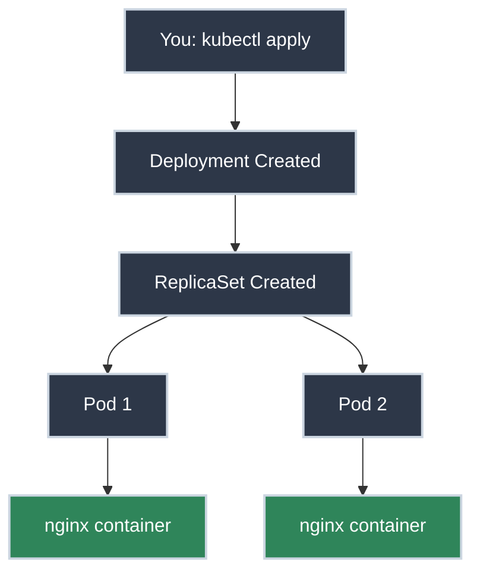

# Your First Deployment

!!! tip "Part of Day One: Getting Started"
    This is the third article in [Day One: Getting Started](../overview.md). Make sure you've completed [Getting kubectl Access](access.md) first.

You're connected to your cluster. You have `kubectl` working. Now comes the moment of truth: deploying something.

If you're nervous about breaking things or typing the wrong command—that's completely normal. We'll start with a simple web application and walk through every step. By the end, you'll see your application running in Kubernetes.

This is the moment it becomes real.

!!! info "What You'll Learn"

    By the end of this article, you'll know how to:


    - **Write a Deployment YAML** - Define what you want running


    - **Apply it to your cluster** - Use `kubectl apply` to deploy
    - **Expose it with a Service** - Make your app accessible
    - **Test and verify** - Confirm everything works
    - **Scale your application** - Increase/decrease replicas
    - **Clean up resources** - Remove what you've created

## The Deployment Journey



---

## Your First Deployment

### Understanding the YAML

We're deploying a simple nginx web server. Why nginx?

- Small image (downloads fast)
- Well-known and stable
- Easy to test (just open a browser)
- Same principles apply to YOUR application later

**The Deployment YAML:**

``` yaml title="nginx-deployment.yaml" linenums="1"
apiVersion: apps/v1  # (1)!
kind: Deployment  # (2)!
metadata:
  name: my-first-app  # (3)!
  labels:
    app: nginx
spec:
  replicas: 2  # (4)!
  selector:
    matchLabels:
      app: nginx  # (5)!
  template:
    metadata:
      labels:
        app: nginx  # (6)!
    spec:
      containers:
      - name: nginx
        image: nginx:1.21  # (7)!
        ports:
        - containerPort: 80  # (8)!
```

1. API version for Deployments
2. We're creating a Deployment—it manages Pods for us
3. Name must be unique within your namespace
4. Kubernetes will maintain exactly 2 running copies
5. Deployment finds its Pods using this label
6. Pods get this label—must match selector above
7. Container image to run—always pin versions (not `:latest`)
8. Port the container listens on inside the Pod

!!! tip "Labels Are the Glue"
    Notice the `app: nginx` label appears three times in that YAML:

    1. **Deployment metadata** - Identifying the Deployment itself
    2. **Selector matchLabels** - The Deployment finds "its" Pods using this
    3. **Pod template labels** - The Pods get this label when created

    This label matching is how Kubernetes connects resources. Your Service will also use `app: nginx` to find these Pods. **If the labels don't match, nothing works.** We'll explore this in depth in [Understanding What Happened](understanding.md#labels-the-glue).

    **How label matching works:**

    ```mermaid
    graph TD
        Deployment["<b>Deployment</b><br/>selector:<br/>matchLabels:<br/>app: nginx"]

        Deployment -->|"creates & manages"| Pod1["<b>Pod 1</b><br/>labels:<br/>app: nginx"]
        Deployment -->|"creates & manages"| Pod2["<b>Pod 2</b><br/>labels:<br/>app: nginx"]

        Pod1 <-->|"label match:<br/>app: nginx"| Service["<b>Service</b><br/>selector:<br/>app: nginx"]
        Pod2 <-->|"label match:<br/>app: nginx"| Service

        Service -->|"external traffic"| Traffic["Traffic"]

        style Deployment fill:#2d3748,stroke:#cbd5e0,stroke-width:2px,color:#fff
        style Pod1 fill:#2f855a,stroke:#cbd5e0,stroke-width:2px,color:#fff
        style Pod2 fill:#2f855a,stroke:#cbd5e0,stroke-width:2px,color:#fff
        style Service fill:#2d3748,stroke:#cbd5e0,stroke-width:2px,color:#fff
        style Traffic fill:#4a5568,stroke:#cbd5e0,stroke-width:2px,color:#fff
    ```

    **The critical rule:** All three must have `app: nginx` for this to work:

    - Deployment's `selector.matchLabels` → finds Pods to manage
    - Pod's `labels` → identifies which Deployment owns it
    - Service's `selector` → finds Pods to route traffic to

    **If labels don't match, nothing connects.** This is the #1 beginner mistake.

**Don't memorize this.** Just understand the key parts:

- `kind: Deployment` - We're creating a Deployment (manages Pods for us)
- `replicas: 2` - We want 2 copies running
- `image: nginx:1.21` - What container to run
- `containerPort: 80` - What port the app listens on

### Deploying It

<div class="grid cards" markdown>

-   :material-file-edit: **Step 1: Create the File**

    ---

    Create `nginx-deployment.yaml` with the content above. You can use any text editor (`nano`, `vim`, or your IDE).

    **Why this matters:** YAML files let you declare what you want. Kubernetes reads it and makes it happen.

-   :material-rocket-launch: **Step 2: Apply It**

    ---

    ⚠️ **Caution (Modifies Resources):**

    ``` bash title="Apply the Deployment"
    kubectl apply -f nginx-deployment.yaml
    # deployment.apps/my-first-app created
    ```

    !!! warning "Namespace Context"
        These commands operate in your current namespace. Check with:
        ```bash
        kubectl config view --minify | grep namespace
        ```
        To specify a namespace: `kubectl get pods -n dev`

    **That's it.** Kubernetes is now creating your Pods.

    !!! tip "Safe to Run in Dev"
        `kubectl apply` is safe in dev environments. It creates or updates resources declaratively. You won't break anything—worst case, you'll need to delete and try again.

-   :material-eye-check: **Step 3: Watch It Come Up**

    ---

    ✅ **Safe (Read-Only):**

    ``` bash title="Check Pod Status"
    kubectl get pods
    # NAME                            READY   STATUS              RESTARTS   AGE
    # my-first-app-7c5ddbdf54-2xkqn   0/1     ContainerCreating   0          5s
    # my-first-app-7c5ddbdf54-8mz4p   0/1     ContainerCreating   0          5s
    ```

    Wait a few seconds and check again:

    ``` bash title="Verify Pods are Running"
    kubectl get pods
    # NAME                            READY   STATUS    RESTARTS   AGE
    # my-first-app-7c5ddbdf54-2xkqn   1/1     Running   0          20s
    # my-first-app-7c5ddbdf54-8mz4p   1/1     Running   0          20s
    ```

    **STATUS: Running** - SUCCESS!

</div>

### Making It Accessible

Your Pods are running, but you can't access them yet. They're isolated inside the cluster. We need a **Service**.

``` yaml title="nginx-service.yaml" linenums="1"
apiVersion: v1  # (1)!
kind: Service  # (2)!
metadata:
  name: my-first-app-svc  # (3)!
spec:
  type: NodePort  # (4)!
  selector:
    app: nginx  # (5)!
  ports:
  - port: 80  # (6)!
    targetPort: 80  # (7)!
    nodePort: 30080  # (8)!
```

1. API version for Services
2. We're creating a Service—routes traffic to Pods
3. Name of the Service (used for DNS)
4. NodePort exposes the service externally for testing
5. **CRITICAL:** This selector must match the Pod labels from your Deployment—this is how Services find Pods
6. Port the Service listens on
7. Port to forward to on the Pod (container's port 80)
8. External port on the node (range 30000-32767)

**Apply the Service:**

⚠️ **Caution (Modifies Resources):**

```bash title="Create the Service"
kubectl apply -f nginx-service.yaml
# service/my-first-app-svc created
```

✅ **Safe (Read-Only):**

```bash title="Verify Service Created"
kubectl get service my-first-app-svc
# NAME                TYPE       CLUSTER-IP      EXTERNAL-IP   PORT(S)        AGE
# my-first-app-svc    NodePort   10.96.123.45    <none>        80:30080/TCP   10s
```

### Testing It

=== "Option 1: Port Forward (Easiest)"
    **Goal:** Access your service from your local machine without exposing it externally.

    ✅ **Safe (Creates Temporary Tunnel):**

    ``` bash title="Forward Local Port to Service"
    kubectl port-forward service/my-first-app-svc 8080:80
    # Forwarding from 127.0.0.1:8080 -> 80
    ```

    Open your browser and navigate to: `http://localhost:8080`

    You should see the "Welcome to nginx!" page. Press `Ctrl+C` in your terminal to stop port forwarding when you're done.

=== "Option 2: From Inside the Cluster"
    **Goal:** Test how other applications in your cluster will "see" and access your service using DNS.

    ⚠️ **Caution (Creates Temporary Pod):**

    ``` bash title="Create Test Pod"
    kubectl run test --image=busybox -it --rm -- sh
    ```

    ✅ **Safe (Read-Only from Inside Pod):**

    ``` bash title="Test Service from Inside Cluster"
    # Once inside the pod prompt:
    wget -O- http://my-first-app-svc
    # Shows nginx HTML source code
    exit
    ```

    The `--rm` flag automatically deletes the test pod when you type `exit`.

---

## Understanding What Happened

Think of a **Deployment like a Factory Manager**. You hand the Manager a blueprint (your YAML) and say "I want 2 copies running." The Manager hires a Supervisor (**ReplicaSet**) to watch the factory floor and keep exactly 2 machines (**Pods**) running at all times.

Your Service acts like a reception desk—it routes visitors to whichever machines are currently operational.

**The key:** You declared what you wanted. Kubernetes figured out how to make it happen—and will keep it that way automatically.

!!! tip "Want the Full Technical Breakdown?"
    This is enough to understand your deployment worked. For the complete step-by-step flow (what actually happened in the cluster, which components did what, and how it all connects), see **[Understanding What Happened](understanding.md)**—the final Day One article that explains the architecture.

### Common Pitfalls

Things don't always go smoothly. Here are the issues you're most likely to encounter.

**Don't try to memorize these**—if something goes wrong, come back to this section or jump to [Essential kubectl Commands](commands.md) for detailed troubleshooting workflows. This is a reference for when you need it, not a study guide.

??? question "Pods Stuck in 'ImagePullBackOff'"
    **Problem:** Kubernetes can't download your container image.

    **Check it:**
    ```bash title="See detailed error"
    kubectl describe pod my-first-app-7c5ddbdf54-2xkqn
    # Look for "Events" section at bottom
    ```

    **Common causes:**

    - **Typo in image name** - `nginx:1.21` not `nginx:121`
    - **Image doesn't exist** - Check the registry
    - **Private registry without credentials** - Need imagePullSecrets
    - **Network/registry access issue** - Cluster can't reach Docker Hub

    **Fix:** Correct the image name in your YAML and reapply.

    ??? warning "Private Registry Authentication (Common in Companies)"
        **If your company uses a private container registry** (AWS ECR, Google Artifact Registry, Azure Container Registry, or self-hosted), Kubernetes needs authentication credentials to pull images.

        **How to tell if this is your issue:**
        ```bash title="Check the error message"
        kubectl describe pod my-app-7c5ddbdf54-2xkqn
        # Events:
        #   Warning  Failed   10s  Failed to pull image "mycompany.azurecr.io/my-app:latest"
        #   Warning  Failed   10s  Error: ErrImagePull
        # Look for "unauthorized" or "authentication required"
        ```

        **The fix: imagePullSecrets**

        Your platform team should provide:

        1. **The registry credentials** (username/password or token)
        2. **Instructions to create the secret**
        3. **The secret name to reference**

        **Typical workflow:**

        ```bash title="1. Create imagePullSecret (platform team provides credentials)"
        kubectl create secret docker-registry my-registry-secret \
          --docker-server=mycompany.azurecr.io \
          --docker-username=<username> \
          --docker-password=<password> \
          --docker-email=<your-email>
        # secret/my-registry-secret created
        ```

        ```yaml title="2. Reference the secret in your Deployment"
        apiVersion: apps/v1
        kind: Deployment
        metadata:
          name: my-app
        spec:
          replicas: 2
          selector:
            matchLabels:
              app: my-app
          template:
            metadata:
              labels:
                app: my-app
            spec:
              imagePullSecrets:  # Add this
              - name: my-registry-secret  # Reference the secret
              containers:
              - name: my-app
                image: mycompany.azurecr.io/my-app:1.0  # Private image
                ports:
                - containerPort: 80
        ```

        ```bash title="3. Reapply the Deployment"
        kubectl apply -f deployment.yaml
        # Now Kubernetes can authenticate and pull the private image
        ```

        **Important notes:**

        - **Don't hardcode credentials** in YAML—always use Secrets
        - **Platform teams often automate this** - Check if your namespace has default imagePullSecrets already configured
        - **Cloud provider managed registries** (ECR, GCR, ACR) often use cluster IAM roles instead of imagePullSecrets

        **Ask your platform team:**

        - "Do I need imagePullSecrets for our registry?"
        - "Is there a default imagePullSecret already configured in my namespace?"
        - "How do I authenticate to pull images from our private registry?"

        They may have already configured automatic authentication at the cluster or namespace level.

??? question "Deployment Shows '0/2 Ready'"
    **Problem:** Deployment created, but no Pods are running.

    **Check it:**
    ```bash title="See what's wrong"
    kubectl get pods
    kubectl describe deployment my-first-app
    ```

    **Common causes:**

    - **Resource limits** - Not enough CPU/memory in cluster
    - **Image pull failing** - See ImagePullBackOff above
    - **Container crashing** - App has a startup error

    **Fix:** Use `kubectl describe pod <pod-name>` to see the specific error.

??? question "Service Can't Find Pods (503 errors)"
    **Problem:** Service is created but traffic doesn't reach Pods.

    **Check it:**
    ```bash title="Check Service endpoints"
    kubectl get endpoints my-first-app-svc
    # Should show Pod IPs - if empty, labels don't match
    ```

    **Common cause:** Label mismatch between Service selector and Pod labels.

    **Your Service says:**
    ```yaml
    selector:
      app: nginx  # Looking for pods with this label
    ```

    **Your Pods must have:**
    ```yaml
    metadata:
      labels:
        app: nginx  # Must match!
    ```

    **Fix:** Ensure Service selector matches Deployment's Pod template labels exactly.

??? question "Changes to YAML Don't Apply"
    **Problem:** You edited the YAML but nothing changed.

    **Common causes:**

    - **Forgot to save the file** - Check your editor
    - **Applied wrong file** - `kubectl apply -f old-file.yaml`
    - **Immutable field change** - Some fields can't be updated (rare)

    **Fix:** Save, verify filename, reapply. For immutable fields, delete and recreate.

!!! tip "Pro Debugging Workflow"
    When something goes wrong, follow this order:

    1. `kubectl get pods` - What's the status?
    2. `kubectl describe pod <name>` - What are the events?
    3. `kubectl logs <pod-name>` - What does the app say?
    4. `kubectl get events --sort-by=.metadata.creationTimestamp` - Recent cluster events

---

## Working With Your Deployment

### Exploring Your Deployment

✅ **Safe (Read-Only):**

```bash title="See All Resources"
kubectl get all
# Shows: deployments, replicasets, pods, services
```

```bash title="Detailed Deployment Info"
kubectl describe deployment my-first-app
# Shows: replicas, strategy, events, conditions
```

```bash title="View Pod Logs"
kubectl logs my-first-app-7c5ddbdf54-2xkqn
# Shows: container logs (nginx access/error logs)
```

```bash title="Execute Command in Pod"
kubectl exec my-first-app-7c5ddbdf54-2xkqn -- nginx -v
# nginx version: nginx/1.21.6
```

!!! tip "Pro Tip: Follow Logs"
    Use `-f` to follow logs in real-time:
    ```bash
    kubectl logs -f my-first-app-7c5ddbdf54-2xkqn
    ```
    Press `Ctrl+C` to stop.

### Scaling Up

Want more copies? Change replicas:

⚠️ **Caution (Modifies Resources):**

```bash title="Scale Deployment to 5 Replicas"
kubectl scale deployment my-first-app --replicas=5
# deployment.apps/my-first-app scaled
```

✅ **Safe (Read-Only):**

```bash title="Verify Scaling"
kubectl get pods
# NAME                            READY   STATUS    RESTARTS   AGE
# my-first-app-7c5ddbdf54-2xkqn   1/1     Running   0          5m
# my-first-app-7c5ddbdf54-8mz4p   1/1     Running   0          5m
# my-first-app-7c5ddbdf54-kx9qw   1/1     Running   0          10s
# my-first-app-7c5ddbdf54-p2mzn   1/1     Running   0          10s
# my-first-app-7c5ddbdf54-w4r7t   1/1     Running   0          10s
```

**Now you have 5 pods!** Kubernetes automatically created 3 more to match your desired state.

### Cleaning Up

When done testing:

🚨 **DANGER (Destructive):**

```bash title="Delete Resources by Name"
kubectl delete deployment my-first-app
# deployment.apps "my-first-app" deleted

kubectl delete service my-first-app-svc
# service "my-first-app-svc" deleted
```

**Or delete from files:**

```bash title="Delete Resources from Files"
kubectl delete -f nginx-deployment.yaml
kubectl delete -f nginx-service.yaml
```

!!! warning "Deletion is Immediate"
    `kubectl delete` removes resources immediately. In dev, this is fine. In production, always double-check what you're deleting and consider using staging environments first.

---

## Practice Exercise

??? question "Exercise: Deploy Your Own App"
    **Goal:** Deploy nginx with 3 replicas, expose it with a Service, and access it.

    **Steps:**

    1. Create deployment YAML with 3 replicas
    2. Apply it
    3. Create service YAML
    4. Apply it
    5. Access it with port-forward
    6. Scale to 5 replicas
    7. Clean up

    ??? tip "Solution"
        **Step 1: Create Deployment YAML**

        Create `my-deployment.yaml`:

        ``` yaml title="my-deployment.yaml" linenums="1"
        apiVersion: apps/v1
        kind: Deployment
        metadata:
          name: practice-app
          labels:
            app: practice
        spec:
          replicas: 3
          selector:
            matchLabels:
              app: practice
          template:
            metadata:
              labels:
                app: practice
            spec:
              containers:
              - name: nginx
                image: nginx:1.21
                ports:
                - containerPort: 80
        ```

        **Step 2: Apply Deployment**

        ```bash
        kubectl apply -f my-deployment.yaml
        # deployment.apps/practice-app created

        kubectl get pods
        # Should show 3 pods
        ```

        **Step 3: Create Service YAML**

        Create `my-service.yaml`:

        ``` yaml title="my-service.yaml" linenums="1"
        apiVersion: v1
        kind: Service
        metadata:
          name: practice-svc
        spec:
          type: NodePort
          selector:
            app: practice
          ports:
          - port: 80
            targetPort: 80
            nodePort: 30090
        ```

        **Step 4: Apply Service**

        ```bash
        kubectl apply -f my-service.yaml
        # service/practice-svc created

        kubectl get service practice-svc
        # Verify service created
        ```

        **Step 5: Access with Port Forward**

        ```bash
        kubectl port-forward service/practice-svc 8080:80
        # Forwarding from 127.0.0.1:8080 -> 80
        ```

        Open browser: `http://localhost:8080`

        You should see the nginx welcome page.

        Press `Ctrl+C` to stop port forwarding.

        **Step 6: Scale to 5 Replicas**

        ```bash
        kubectl scale deployment practice-app --replicas=5
        # deployment.apps/practice-app scaled

        kubectl get pods
        # Should show 5 pods now
        ```

        **Step 7: Clean Up**

        ```bash
        kubectl delete -f my-deployment.yaml
        kubectl delete -f my-service.yaml
        # Or:
        # kubectl delete deployment practice-app
        # kubectl delete service practice-svc
        ```

        **What you learned:**

        - Creating deployment YAML from scratch
        - Setting replicas
        - Creating services
        - Port forwarding for local access
        - Scaling deployments
        - Cleaning up resources

---

## Quick Recap

| What You Did | Command |
|--------------|---------|
| **Created Deployment** | `kubectl apply -f deployment.yaml` |
| **Checked Pods** | `kubectl get pods` |
| **Created Service** | `kubectl apply -f service.yaml` |
| **Accessed App** | `kubectl port-forward` |
| **Scaled** | `kubectl scale deployment` |
| **Cleaned Up** | `kubectl delete` |

---

## Further Reading

### Official Documentation

- [Kubernetes Docs: Deployments](https://kubernetes.io/docs/concepts/workloads/controllers/deployment/) - Complete Deployment reference with examples
- [Kubernetes Docs: Services](https://kubernetes.io/docs/concepts/services-networking/service/) - Service types and networking concepts
- [kubectl Reference: apply](https://kubernetes.io/docs/reference/generated/kubectl/kubectl-commands#apply) - Full `kubectl apply` command reference
- [kubectl Reference: get](https://kubernetes.io/docs/reference/generated/kubectl/kubectl-commands#get) - Using `kubectl get` to view resources

### Deep Dives

- [Understanding Kubernetes Objects](https://kubernetes.io/docs/concepts/overview/working-with-objects/) - How Kubernetes represents resources
- [Kubernetes API Concepts](https://kubernetes.io/docs/reference/using-api/api-concepts/) - Understanding `apiVersion`, `kind`, and `metadata`

### Related Articles

- [Day One Overview](../overview.md) - See all Day One articles
- [Getting kubectl Access](access.md) - Review how to connect to your cluster
- [What Is Kubernetes?](../what_is_kubernetes.md) - Understanding Kubernetes fundamentals

---

## What's Next?

You've deployed your first application! Next up in the Day One series:

- **[Essential kubectl Commands](commands.md)** - Master the 10 commands you'll use every day
- **[Understanding What Happened](understanding.md)** - Deep dive into Deployments, ReplicaSets, and Pods

Check the [Day One Overview](../overview.md) for the complete learning path.

---

**Congratulations!** You're officially running applications on Kubernetes.
