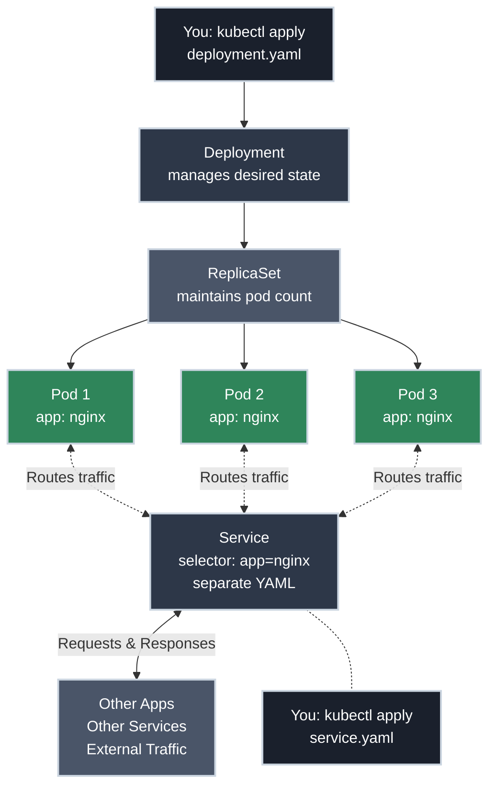

# Understanding What Happened

!!! tip "Part of Day One: Getting Started"
    This is the final article in [Day One: Getting Started](../overview.md). You should have completed [Your First Deployment](first_deploy.md) and learned the [Essential kubectl Commands](commands.md) before reading this.

You ran `kubectl apply -f deployment.yaml` and your app deployed. You checked with `kubectl get pods` and saw your application running. It feels like magic.

**But what actually happened?** When you told Kubernetes "I want this app running," it created multiple resources working together behind the scenes. Understanding these resources transforms you from someone who copies commands to someone who truly understands Kubernetes.

This article reveals what Kubernetes created when you deployed your application—and why each piece matters.

!!! info "What You'll Learn"
    By the end of this article, you'll understand:

    - **What Kubernetes created** when you ran `kubectl apply` - the full resource hierarchy
    - **Deployments, ReplicaSets, and Pods** - what each resource does and why all three exist
    - **How they work together** - the flow from your YAML file to running containers
    - **Labels and selectors** - how Services find Pods and Deployments manage Pods
    - **Self-healing behavior** - how Kubernetes automatically replaces crashed Pods
    - **The cluster architecture** - control plane, worker nodes, and how they interact

## The Resource Hierarchy

When you deployed your application in [Your First Deployment](first_deploy.md), Kubernetes didn't just start containers. It created multiple resources working together in a specific hierarchy. Here's what got created and how they relate:



**Pods are the center - two flows connect to them:**

- **From ABOVE (deployment.yaml):** You create a Deployment → It creates a ReplicaSet → ReplicaSet creates Pods
- **From BELOW (service.yaml):** You create a Service separately → It receives external traffic → Routes traffic UP to Pods by matching labels

**How the Service works:**

- **Stable gateway to Pods** - Provides a permanent entry point while Pods come and go
- **Receives all traffic** - Other applications, services, or external sources send requests to the Service
- **Routes to ephemeral Pods** - Finds and distributes traffic to Pods by matching labels (`selector: app=nginx`)
- **Independent of Deployments** - Can route to ANY Pods with matching labels, even from different Deployments
- **Survives Pod restarts** - Pods die and get recreated constantly; the Service IP and DNS name stay stable

**Key insight:** Pods don't know about the Service. The Service finds Pods using labels and routes traffic to them. The Deployment creates Pods from above, the Service routes to them from below.

## The Kubernetes Resources Explained

**Building on the basics:** Remember the Factory Manager analogy from [Your First Deployment](first_deploy.md#understanding-what-happened)? Now we're diving deep into how that factory actually operates—each resource's role and technical details.

<div class="grid cards" markdown>

-   :material-folder-cog: **Deployment: The Manager**

    ---

    **Why it matters:** The Deployment is what you interact with. It maintains your desired state—if you want 3 replicas, the Deployment ensures 3 replicas exist.

    ```bash title="See Your Deployment"
    kubectl get deployments
    # NAME               READY   UP-TO-DATE   AVAILABLE   AGE
    # nginx-deployment   3/3     3            3           5m
    ```

    **What to notice:**

    - `READY`: How many Pods are running vs. desired (3/3 means all good)
    - `UP-TO-DATE`: Pods running the latest configuration
    - `AVAILABLE`: Pods ready to serve traffic

    The Deployment handles updates, rollbacks, and scaling. When you run `kubectl scale` or `kubectl rollout`, you're talking to the Deployment.

-   :material-checkbox-multiple-marked: **ReplicaSet: The Supervisor**

    ---

    **Why it matters:** The ReplicaSet is the Deployment's worker. Its job: ensure exactly the right number of Pods exist. If a Pod crashes, the ReplicaSet creates a replacement.

    ```bash title="See Your ReplicaSet"
    kubectl get replicasets
    # NAME                         DESIRED   CURRENT   READY   AGE
    # nginx-deployment-7c5ddbdf54  3         3         3       5m
    ```

    **What to notice:**

    - The name includes a hash (`7c5ddbdf54`) - this is the Pod template version
    - `DESIRED`: What the Deployment wants (3)
    - `CURRENT`: How many Pods exist right now (3)
    - `READY`: How many Pods passed health checks (3)

    **You rarely interact with ReplicaSets directly.** The Deployment manages them. But understanding they exist helps you troubleshoot—if you see old ReplicaSets with 0 Pods, those are from previous deployments (kept for rollback).

-   :material-cube: **Pods: The Workers**

    ---

    **Why it matters:** Pods are where your containers actually run. Everything else exists to manage these. When you check logs, exec into a shell, or debug networking—you're interacting with Pods.

    ```bash title="See Your Pods"
    kubectl get pods
    # NAME                               READY   STATUS    RESTARTS   AGE
    # nginx-deployment-7c5ddbdf54-8kp2m  1/1     Running   0          5m
    # nginx-deployment-7c5ddbdf54-j9xvq  1/1     Running   0          5m
    # nginx-deployment-7c5ddbdf54-wnr4k  1/1     Running   0          5m
    ```

    **What to notice:**

    - Each Pod has the ReplicaSet name + a unique suffix
    - `READY`: How many containers are running in the Pod (1/1 means 1 of 1 is ready)
    - `STATUS`: `Running` is good; `Pending`, `CrashLoopBackOff`, or `Error` need investigation
    - `RESTARTS`: How many times the container has restarted (0 is ideal)

    **Key insight:** Pods are ephemeral. They can be deleted and recreated at any time. Never rely on a specific Pod existing—that's why you use Deployments and Services.

-   :material-network: **Service: The Router (Separate YAML!)**

    ---

    **Why it matters:** Pods have changing IP addresses. Services provide a stable endpoint that routes traffic to your Pods, no matter which specific Pods are running.

    **Critical:** The Service is NOT created by the Deployment. It's a separate YAML file you apply separately. The Service finds Pods using label selectors—if the labels match, the Service routes to them.

    ```bash title="See Your Service (if created)"
    kubectl get services
    # NAME            TYPE        CLUSTER-IP      EXTERNAL-IP   PORT(S)   AGE
    # nginx-service   ClusterIP   10.96.145.22    <none>        80/TCP    5m
    ```

    **What to notice:**

    - `TYPE`: How the Service is exposed (ClusterIP = internal only)
    - `CLUSTER-IP`: The stable internal IP for this Service
    - `PORT(S)`: What port the Service listens on

    **When you need it:** If your app needs to receive network traffic (web server, API, database), you need a Service. If it just runs a job and exits, you might not.

</div>

## Investigating with kubectl

Let's use `kubectl describe` to see the full story. This command shows you everything about a resource, including events (what happened).

=== "Describe Your Deployment"

    ✅ **Safe (Read-Only):**

    ```bash title="Get Detailed Deployment Info"
    kubectl describe deployment nginx-deployment
    ```

    **What you'll see:**

    - **Selector:** How the Deployment finds its Pods (labels)
    - **Replicas:** Desired vs. actual count
    - **Pod Template:** The blueprint for Pods (container image, ports, env vars)
    - **Events:** Actions Kubernetes took (scaled, created ReplicaSet, etc.)

    **Why it matters:** The events section shows you the deployment timeline. If something failed, you'll see error messages here.

=== "Describe a Pod"

    ✅ **Safe (Read-Only):**

    ```bash title="Get Detailed Pod Info"
    kubectl describe pod nginx-deployment-7c5ddbdf54-8kp2m
    ```

    **What you'll see:**

    - **Node:** Which cluster node is running this Pod
    - **Status:** Current state and why
    - **IP:** The Pod's internal IP address
    - **Containers:** What's running inside (image, ports, resource limits)
    - **Events:** Pod lifecycle (scheduled, pulled image, started container)

    **Why it matters:** If a Pod won't start, the events section tells you why—image pull failure, insufficient resources, crash loops, etc.

=== "Describe a Service"

    ✅ **Safe (Read-Only):**

    ```bash title="Get Detailed Service Info"
    kubectl describe service nginx-service
    ```

    **What you'll see:**

    - **Selector:** How the Service finds Pods to route to (labels)
    - **Type:** ClusterIP, NodePort, or LoadBalancer
    - **Endpoints:** The actual Pod IPs the Service routes to
    - **Events:** Any Service configuration changes

    **Why it matters:** The endpoints list shows which Pods are receiving traffic. If it's empty, your Service selector doesn't match your Pod labels.

## How They Work Together

Here's what happens when you deploy an application:

??? info "Step 1: You create a Deployment"
    ```yaml title="deployment.yaml" linenums="1"
    apiVersion: apps/v1
    kind: Deployment
    metadata:
      name: nginx-deployment
    spec:
      replicas: 3  # (1)!
      selector:
        matchLabels:
          app: nginx  # (2)!
      template:
        metadata:
          labels:
            app: nginx  # (3)!
        spec:
          containers:
          - name: nginx
            image: nginx:1.21
            ports:
            - containerPort: 80
    ```

    1. "I want 3 copies running"
    2. "Find Pods with this label"
    3. "Give created Pods this label"

    **What you're telling Kubernetes:** "I want 3 replicas of nginx running. Label them with `app: nginx` so other resources can find them."

??? info "Step 2: The Deployment creates a ReplicaSet"
    The Deployment says: "Create a ReplicaSet with this Pod template and maintain 3 replicas."

    The ReplicaSet gets a name based on the Deployment name + a hash of the Pod template. If you update the Deployment (change the image, for example), a new ReplicaSet gets created.

    **Why a hash?** The hash represents the Pod template version. Different templates = different hashes = different ReplicaSets. This is how Kubernetes manages rolling updates and rollbacks.

??? info "Step 3: The ReplicaSet creates Pods"
    The ReplicaSet says: "I need 3 Pods matching this template. Let me create them."

    It creates 3 Pods, each with a unique name (ReplicaSet name + random suffix). The Pods get the labels defined in the template.

    **What you'll see:** `nginx-deployment-7c5ddbdf54-abc12` (Deployment name + ReplicaSet hash + unique Pod suffix)

??? info "Step 4: Kubernetes schedules the Pods"
    The Kubernetes scheduler picks which nodes (servers) should run each Pod. It considers resources available, node selectors, affinity rules, etc.

    **Behind the scenes:** The scheduler looks at CPU/memory requests, node capacity, and placement rules to decide "Pod 1 goes to node-a, Pod 2 goes to node-b, Pod 3 goes to node-c."

??? info "Step 5: Container runtime starts the containers"
    On each node, the container runtime (Docker, containerd, CRI-O) pulls the image and starts the container(s).

    **The actual work:** This is where `docker pull nginx:1.21` happens and your application container actually starts running.

??? info "Step 6: The Service routes traffic (separate YAML you created)"
    Remember when you created the Service with `kubectl apply -f nginx-service.yaml`? That Service watches for Pods with matching labels and adds their IPs to its endpoint list. Now traffic to the Service gets distributed across your Pods.

    **Key insight:** The Service is NOT created by the Deployment. You created it separately—two YAMLs, two `kubectl apply` commands. The Service and Deployment are independent resources that connect only through labels (`app: nginx`).

## What Happens When...

<div class="grid cards" markdown>

-   :material-refresh: **You scale the Deployment**

    ---

    **Why it matters:** You can increase or decrease capacity instantly.

    ⚠️ **Caution (Modifies Resources):**

    ```bash title="Scale to 5 Replicas"
    kubectl scale deployment nginx-deployment --replicas=5
    ```

    **The flow:**

    1. Deployment updates: `replicas: 5`
    2. ReplicaSet sees it needs 5 Pods but only has 3
    3. ReplicaSet creates 2 more Pods
    4. Scheduler places them on nodes
    5. Containers start
    6. Service automatically adds new Pod IPs to endpoints

    **Result:** You go from 3 running Pods to 5, seamlessly.

-   :material-delete: **A Pod crashes**

    ---

    **The flow:**

    1. Pod container exits unexpectedly (bug, out of memory, etc.)
    2. ReplicaSet sees it now has 2 healthy Pods instead of 3
    3. ReplicaSet creates a replacement Pod
    4. Scheduler places it on a node
    5. Container starts
    6. Service removes the crashed Pod's IP and adds the new one

    **Result:** Your desired 3 replicas are maintained automatically. This is Kubernetes' self-healing.

-   :material-update: **You update the image**

    ---

    **Why it matters:** This is how you deploy new versions of your code.

    ⚠️ **Caution (Modifies Resources):**

    ```yaml title="deployment.yaml — update image tag, then apply"
    # Change the image tag in your YAML file:
    #   image: nginx:1.21  →  image: nginx:1.22
    # Then apply the change:
    # kubectl apply -f deployment.yaml
    ```

    **The flow:**

    1. Deployment updates the Pod template (new image)
    2. Deployment creates a NEW ReplicaSet (with updated template)
    3. Deployment scales new ReplicaSet up, old ReplicaSet down (rolling update)
    4. Old Pods terminate, new Pods start with new image
    5. Service seamlessly routes to both old and new Pods during transition

    **Result:** Zero-downtime update. The old ReplicaSet remains (scaled to 0) for easy rollback.

-   :material-trash-can: **You delete the Deployment**

    ---

    **Why it matters:** Clean up resources when they're no longer needed.

    🚨 **DANGER (Destructive):**

    ```bash title="Delete Everything"
    kubectl delete deployment nginx-deployment
    ```

    **The flow:**

    1. Deployment gets deleted
    2. Deployment tells its ReplicaSet(s) to scale to 0
    3. ReplicaSet deletes all Pods
    4. ReplicaSet gets deleted
    5. Service remains (it's independent) but has no endpoints

    **Result:** Everything created by the Deployment is cleaned up. Services are separate—you need to delete them explicitly.

</div>

## Labels: The Glue

Everything connects through **labels**. Labels are key-value pairs you attach to resources.

```yaml title="How Labels Connect Resources" linenums="1"
# Deployment creates Pods with this label:
spec:
  template:
    metadata:
      labels:
        app: nginx  # (1)!

# Service finds Pods with this label:
spec:
  selector:
    app: nginx  # (2)!

# ReplicaSet manages Pods with this label:
spec:
  selector:
    matchLabels:
      app: nginx  # (3)!
```

1. Every Pod created by this Deployment gets `app: nginx`
2. The Service routes to any Pod with `app: nginx`
3. The ReplicaSet maintains the count of Pods with `app: nginx`

**Without matching labels, nothing connects.** If your Service selector doesn't match your Pod labels, traffic won't route. If your Deployment selector doesn't match your template labels, the ReplicaSet won't manage the Pods.

!!! warning "Label Mismatches Are a Common Issue"
    If your Service has no endpoints, check that the Service selector matches your Pod labels exactly. Use `kubectl describe service <name>` to see the selector and `kubectl get pods --show-labels` to see Pod labels.

## Practice Exercises

??? question "Exercise 1: Trace Your Deployment"

    Deploy an application and trace the full resource hierarchy from Deployment to Pods.

    **Goal:** Understand the relationship between all resources created.

    **Steps:**

    1. Deploy nginx using a Deployment
    2. List all Deployments, ReplicaSets, and Pods
    3. Identify which ReplicaSet belongs to your Deployment
    4. Identify which Pods belong to your ReplicaSet

    ??? tip "Solution"

        Create and apply a Deployment:

        ```yaml title="nginx-deployment.yaml"
        apiVersion: apps/v1
        kind: Deployment
        metadata:
          name: nginx-deployment
        spec:
          replicas: 3
          selector:
            matchLabels:
              app: nginx
          template:
            metadata:
              labels:
                app: nginx
            spec:
              containers:
              - name: nginx
                image: nginx:1.21
                ports:
                - containerPort: 80
        ```

        ```bash title="Apply the Deployment"
        kubectl apply -f nginx-deployment.yaml
        ```

        Now trace the hierarchy:

        ```bash title="See the Full Chain"
        # 1. See your Deployment
        kubectl get deployments
        # NAME               READY   UP-TO-DATE   AVAILABLE   AGE
        # nginx-deployment   3/3     3            3           1m

        # 2. See the ReplicaSet it created
        kubectl get replicasets
        # NAME                          DESIRED   CURRENT   READY   AGE
        # nginx-deployment-7c5ddbdf54   3         3         3       1m
        # Notice the name: deployment-name + hash

        # 3. See the Pods the ReplicaSet created
        kubectl get pods
        # NAME                                READY   STATUS    RESTARTS   AGE
        # nginx-deployment-7c5ddbdf54-abc12   1/1     Running   0          1m
        # nginx-deployment-7c5ddbdf54-def34   1/1     Running   0          1m
        # nginx-deployment-7c5ddbdf54-ghi56   1/1     Running   0          1m
        # Notice: Each Pod name starts with the ReplicaSet name
        ```

        **What you learned:** The naming convention makes the hierarchy visible. Every resource name includes its parent's name.

??? question "Exercise 2: Watch Self-Healing in Action"

    Delete a Pod and watch Kubernetes automatically replace it.

    **Goal:** See ReplicaSet's self-healing behavior.

    **Hint:** Delete a Pod, then immediately run `kubectl get pods --watch`

    ??? tip "Solution"

        First, get your Pod names:

        ```bash title="List Pods"
        kubectl get pods
        # NAME                                READY   STATUS    RESTARTS   AGE
        # nginx-deployment-7c5ddbdf54-abc12   1/1     Running   0          5m
        # nginx-deployment-7c5ddbdf54-def34   1/1     Running   0          5m
        # nginx-deployment-7c5ddbdf54-ghi56   1/1     Running   0          5m
        ```

        Pick one Pod and delete it:

        ```bash title="Delete One Pod"
        kubectl delete pod nginx-deployment-7c5ddbdf54-abc12
        ```

        Watch what happens:

        ```bash title="Watch Replacement Creation"
        kubectl get pods --watch
        # NAME                                READY   STATUS    RESTARTS   AGE
        # nginx-deployment-7c5ddbdf54-abc12   1/1     Terminating   0      5m
        # nginx-deployment-7c5ddbdf54-xyz99   0/1     Pending       0      0s
        # nginx-deployment-7c5ddbdf54-xyz99   0/1     ContainerCreating   0   1s
        # nginx-deployment-7c5ddbdf54-xyz99   1/1     Running             0   3s
        ```

        **What you see:**

        1. The Pod you deleted enters `Terminating` state
        2. A new Pod immediately gets created (`Pending`)
        3. The new Pod starts (`ContainerCreating`)
        4. The new Pod becomes `Running`
        5. You still have 3 replicas total

        **What you learned:** The ReplicaSet constantly monitors the desired vs. actual state. When a Pod disappears, it immediately creates a replacement.

??? question "Exercise 3: Understand ReplicaSet Versioning"

    Update your Deployment's image and observe how Kubernetes creates a new ReplicaSet while keeping the old one for rollback.

    **Goal:** See how Deployments manage updates using multiple ReplicaSets.

    **Hint:** Use `kubectl set image` to update, then check ReplicaSets.

    ??? tip "Solution"

        Check current ReplicaSets:

        ```bash title="Before Update"
        kubectl get replicasets
        # NAME                          DESIRED   CURRENT   READY   AGE
        # nginx-deployment-7c5ddbdf54   3         3         3       10m
        ```

        Update the image by editing `nginx-deployment.yaml` — change `nginx:1.21` to `nginx:1.22`, save, then apply:

        ```bash title="Apply the Updated Image Tag"
        kubectl apply -f nginx-deployment.yaml
        # deployment.apps/nginx-deployment configured
        ```

        Watch the rollout:

        ```bash title="Watch the Update"
        kubectl rollout status deployment/nginx-deployment
        # Waiting for deployment "nginx-deployment" rollout to finish: 1 out of 3 new replicas have been updated...
        # Waiting for deployment "nginx-deployment" rollout to finish: 2 out of 3 new replicas have been updated...
        # deployment "nginx-deployment" successfully rolled out
        ```

        Now check ReplicaSets again:

        ```bash title="After Update"
        kubectl get replicasets
        # NAME                          DESIRED   CURRENT   READY   AGE
        # nginx-deployment-7c5ddbdf54   0         0         0       15m
        # nginx-deployment-556d429bd4   3         3         3       2m
        ```

        **What you see:**

        - **Old ReplicaSet** (`7c5ddbdf54`): Scaled to 0, but still exists
        - **New ReplicaSet** (`556d429bd4`): Running all 3 Pods with new image
        - Different hashes = different Pod templates

        **Why it matters:** The old ReplicaSet enables instant rollback. If the new version has a bug, Kubernetes can scale the old ReplicaSet back up and the new one back down.

        Try rolling back:

        ```bash title="Rollback to Previous Version"
        kubectl rollout undo deployment/nginx-deployment
        ```

        Check ReplicaSets again—you'll see the old one scaled back up!

        **What you learned:** Deployments manage multiple ReplicaSets (one per version). This is how rolling updates and rollbacks work.

??? question "Exercise 4: Investigate Label Connections"

    Create a Service and verify it finds your Pods using labels.

    **Goal:** Understand how labels connect Services to Pods.

    **Steps:**

    1. Verify your Deployment's Pods have labels
    2. Create a Service with a matching selector
    3. Check that the Service found your Pods (endpoints)

    ??? tip "Solution"

        First, check your Pod labels (assuming you still have the nginx-deployment from Exercise 1):

        ```bash title="Show Pod Labels"
        kubectl get pods --show-labels
        # NAME                                READY   STATUS    RESTARTS   AGE   LABELS
        # nginx-deployment-7c5ddbdf54-abc12   1/1     Running   0          10m   app=nginx,pod-template-hash=7c5ddbdf54
        # nginx-deployment-7c5ddbdf54-def34   1/1     Running   0          10m   app=nginx,pod-template-hash=7c5ddbdf54
        # nginx-deployment-7c5ddbdf54-ghi56   1/1     Running   0          10m   app=nginx,pod-template-hash=7c5ddbdf54
        ```

        **Notice:** All Pods have `app=nginx` label.

        Create a Service that selects `app=nginx`:

        ```yaml title="nginx-service.yaml"
        apiVersion: v1
        kind: Service
        metadata:
          name: nginx-service
        spec:
          selector:
            app: nginx  # This must match Pod labels!
          ports:
          - port: 80
            targetPort: 80
          type: ClusterIP
        ```

        ```bash title="Apply the Service"
        kubectl apply -f nginx-service.yaml
        ```

        Now check if the Service found your Pods:

        ```bash title="Describe the Service"
        kubectl describe service nginx-service
        # Name:              nginx-service
        # Namespace:         default
        # Labels:            <none>
        # Annotations:       <none>
        # Selector:          app=nginx
        # Type:              ClusterIP
        # IP Family Policy:  SingleStack
        # IP Families:       IPv4
        # IP:                10.96.145.22
        # Port:              <unset>  80/TCP
        # TargetPort:        80/TCP
        # Endpoints:         10.244.1.5:80,10.244.1.6:80,10.244.1.7:80
        # Session Affinity:  None
        # Events:            <none>
        ```

        **What to notice:**

        - **Selector:** `app=nginx` (matches your Pod labels)
        - **Endpoints:** List of Pod IPs (should show 3 IPs)

        If endpoints are empty, your selector doesn't match your Pod labels!

        **What you learned:** Services find Pods using label selectors. The Service doesn't "know about" the Deployment—it just looks for any Pod with matching labels.

## Quick Recap

**The Resource Hierarchy:**

| Resource | Job | You Interact With It? |
|----------|-----|-----------------------|
| **Deployment** | Maintains desired state (replicas, version) | ✅ Yes - for scaling, updates, rollbacks |
| **ReplicaSet** | Ensures exact number of Pods exist | ⚠️ Rarely - Deployment manages it |
| **Pod** | Runs your container(s) | ✅ Yes - for logs, debugging, troubleshooting |
| **Service** | Routes traffic to Pods | ✅ Yes - for exposing applications |

**Key Insights:**

- When you deploy, Kubernetes creates a chain: Deployment → ReplicaSet → Pods
- ReplicaSets provide self-healing (replace crashed Pods automatically)
- Multiple ReplicaSets enable rolling updates and rollbacks
- Services provide stable networking (Pod IPs change, Service IPs don't)
- Labels connect everything—Services find Pods, Deployments manage Pods, all through labels
- Use `kubectl describe` to investigate what actually happened

---

## You've Completed Day One

Remember where you started? You had `kubectl` access to a cluster. Maybe you were intimidated by the command line. Maybe someone said "we're using Kubernetes now" and you weren't sure where to begin.

**Look at what you've accomplished:**

You deployed your first application. You watched Kubernetes create Pods, maintain them, and scale them automatically. You exposed your application with a Service and verified traffic could reach it. You learned the essential `kubectl` commands—the ones you'll use every single day. And now you understand what actually happens behind the scenes: how Deployments manage ReplicaSets, how ReplicaSets maintain Pods, how Services route traffic using labels.

**You're not just running commands anymore—you understand the system.**

You know that when a Pod crashes, the ReplicaSet notices and creates a replacement. You know that when you update an image, Kubernetes creates a new ReplicaSet and gradually shifts traffic. You know that labels are the glue connecting everything. This isn't magic anymore—it's architecture you can reason about.

**This foundation is powerful.** With what you've learned in Day One, you can:

- Deploy applications to your dev cluster with confidence
- Understand why Pods crash or Services fail to route traffic
- Scale applications to handle load
- Roll back when deployments go wrong
- Communicate with your platform team using the right terminology

The `kubectl` commands aren't scary anymore. The YAML makes sense. The cluster is a tool you can wield, not a black box you're afraid to touch.

**Day One is complete. You're ready for production work.**

!!! tip "Note for Experienced Developers"
    We intentionally skipped one topic: **resource requests and limits** (how much CPU/memory your Pods need). That's a Level 2 topic for when you're deploying real applications and need to tune performance. Day One focused on getting things running—optimizing resource allocation comes after you understand the basics.

The deeper dive into Kubernetes continues with Level 1, where you'll master each primitive in detail—but honestly? With what you know right now, you can already ship code to Kubernetes. Many developers work productively for months with just Day One knowledge.

The difference between you when you started Day One and you right now is confidence. You've deployed. You've investigated. You've understood. That's what Day One was for.

## What's Next

Congratulations! You've completed the Day One journey. You've gone from "What is Kubernetes?" to understanding the full resource hierarchy of a deployment.

When you're ready to move beyond the basics and master the individual building blocks of Kubernetes, continue to:

- **Level 1: Core Primitives** - (coming soon) Deep dive into Pods, Services, ConfigMaps, and Namespaces
- **[Essential kubectl Commands](commands.md)** - Review the commands for investigating resources
- **[Your First Deployment](first_deploy.md)** - Revisit the deployment process with your new understanding

**Practice makes perfect:** Deploy your real application to solidify what you've learned. The best way to master Kubernetes is to use it with actual projects.

## Further Reading

### Official Documentation

- [Kubernetes Concepts: Workloads](https://kubernetes.io/docs/concepts/workloads/) - Official overview of Pods, Controllers, and Workloads
- [Deployments](https://kubernetes.io/docs/concepts/workloads/controllers/deployment/) - Deep dive into Deployment controller
- [ReplicaSets](https://kubernetes.io/docs/concepts/workloads/controllers/replicaset/) - Understanding ReplicaSets and when you'd use them directly
- [Pods](https://kubernetes.io/docs/concepts/workloads/pods/) - The atomic unit of Kubernetes
- [Services, Load Balancing, and Networking](https://kubernetes.io/docs/concepts/services-networking/) - How networking works in Kubernetes

### Deep Dives

- [Understanding Kubernetes Objects](https://kubernetes.io/docs/concepts/overview/working-with-objects/kubernetes-objects/) - How Kubernetes represents resources (spec, status, metadata)
- [Labels and Selectors](https://kubernetes.io/docs/concepts/overview/working-with-objects/labels/) - How resources find each other
- [Kubernetes Components](https://kubernetes.io/docs/concepts/overview/components/) - Control plane and node components explained

### Related Articles

- [What Is Kubernetes?](../what_is_kubernetes.md) - Review the fundamentals and the problem Kubernetes solves
- [Your First Deployment](first_deploy.md) - Revisit the deployment process with your new understanding
- [Essential kubectl Commands](commands.md) - Commands for investigating resource relationships
- [Day One Overview](../overview.md) - See your complete Day One journey
