# Getting kubectl Access

!!! tip "Part of Day One: Getting Started"
    This is the second article in [Day One: Getting Started](overview.md). Make sure you've read [What Is Kubernetes?](what_is_kubernetes.md) first.

Your company's platform team sent you:

- Instructions for connecting to the cluster (a command to run, a login portal, or documentation)
- Your assigned namespace (like `dev-yourteam` or `yourname-dev`)
- Maybe a Slack message that said "install `kubectl` and run this command"

**Good news:** Modern Kubernetes authentication generates YOUR individual credentials automatically. No shared passwords, no precious files to protect. Your identity = your credentials = audit trail shows what YOU did.

Let's get you connected.

## What You'll Learn

By the end of this article, you'll be able to:

- Install `kubectl` on your operating system (macOS, Linux, or Windows)
- Understand which authentication method your company uses (cloud provider, OIDC, or certificates)
- Connect to your company's Kubernetes cluster with YOUR individual credentials
- Verify your access and check which namespace you're assigned
- Switch between multiple Kubernetes contexts (dev, staging, prod)
- Troubleshoot common connection problems

---

## What You're Connecting To

Your company has a Kubernetes cluster—a group of servers running Kubernetes. You're not managing the cluster; you're just deploying your applications to it.

**Think of it like:**

- The cluster is a shared server
- Your namespace is your home directory
- `kubectl` is your SSH client

You have access to YOUR namespace, not the whole cluster.


---

## Installing kubectl

`kubectl` (pronounced "kube-control" or "kube-cuttle") is the command-line tool for talking to Kubernetes.

=== "macOS"

    **Using Homebrew:**
    ```bash title="Install kubectl with Homebrew"
    brew install kubectl
    ```

    **Verify installation:**
    ```bash title="Verify kubectl installation"
    kubectl version --client
    # Should show: Client Version: v1.28.x or similar
    ```

=== "Linux"

    **Download and install:**
    ```bash title="Download and install kubectl"
    curl -LO "https://dl.k8s.io/release/$(curl -L -s https://dl.k8s.io/release/stable.txt)/bin/linux/amd64/kubectl"
    chmod +x kubectl
    sudo mv kubectl /usr/local/bin/
    ```

    **Verify installation:**
    ```bash title="Verify kubectl installation"
    kubectl version --client
    ```

    ??? tip "Don't have sudo access? Install to your home directory"
        If you don't have sudo privileges or prefer a user-space installation:

        ```bash title="Install kubectl without sudo"
        # Download kubectl
        curl -LO "https://dl.k8s.io/release/$(curl -L -s https://dl.k8s.io/release/stable.txt)/bin/linux/amd64/kubectl"

        # Make it executable
        chmod +x kubectl

        # Create local bin directory if it doesn't exist
        mkdir -p ~/.local/bin

        # Move kubectl there
        mv kubectl ~/.local/bin/
        ```

        **Add to PATH** (if not already):

        ```bash title="Add ~/.local/bin to PATH"
        # Add to your shell config (~/.bashrc, ~/.zshrc, etc.)
        echo 'export PATH="$HOME/.local/bin:$PATH"' >> ~/.bashrc

        # Reload your shell config
        source ~/.bashrc
        ```

        **Verify:**
        ```bash title="Verify kubectl installation"
        kubectl version --client
        ```

=== "Windows"

    === "PowerShell (Recommended)"

        Open PowerShell as Administrator and run:

        ```powershell title="Download kubectl"
        # Download a recent stable release (check https://kubernetes.io/releases/ for latest)
        curl.exe -LO "https://dl.k8s.io/release/v1.31.0/bin/windows/amd64/kubectl.exe"  # (1)!

        # Move to a permanent location
        New-Item -Path "$env:USERPROFILE\bin" -ItemType Directory -Force
        Move-Item -Path "kubectl.exe" -Destination "$env:USERPROFILE\bin\kubectl.exe"
        ```

        1. v1.31.0 is used as an example - kubectl versions are typically compatible across multiple Kubernetes versions. Your cluster's version doesn't need to match exactly. Check [Kubernetes releases](https://kubernetes.io/releases/) for the latest stable version.

        Add to your PATH (still in PowerShell as Administrator):

        ```powershell title="Add kubectl to PATH"
        # Get current PATH
        $currentPath = [Environment]::GetEnvironmentVariable("Path", "User")

        # Add kubectl directory to PATH
        [Environment]::SetEnvironmentVariable(
            "Path",
            "$currentPath;$env:USERPROFILE\bin",
            "User"
        )
        ```

        **Close and reopen PowerShell** (needed for PATH change to take effect).

    === "Manual Download"

        If you prefer clicking through:

        1. Download a recent release:

            - **For latest version:** Check [Kubernetes releases](https://kubernetes.io/releases/) first, then download
            - **Or use v1.31.0 (example):** [Download kubectl.exe](https://dl.k8s.io/release/v1.31.0/bin/windows/amd64/kubectl.exe)
            - Save the file to your Downloads folder

        2. Create a directory for kubectl:

            - Open File Explorer
            - Navigate to `C:\Users\YourUsername\`
            - Create a new folder called `bin`
            - Move `kubectl.exe` from Downloads to `C:\Users\YourUsername\bin\`

        3. Add to PATH:

            - Press `Win + X`, select "System"
            - Click "Advanced system settings" (right side)
            - Click "Environment Variables" button
            - Under "User variables", find and select "Path", click "Edit"
            - Click "New" and add: `C:\Users\YourUsername\bin`
            - Click OK on all windows
            - **Restart any open PowerShell or Command Prompt windows**

    === "Package Managers"

        If you use Chocolatey:
        ```powershell title="Install with Chocolatey"
        choco install kubernetes-cli
        ```

        If you use winget (Windows 10+):
        ```powershell title="Install with winget"
        winget install -e --id Kubernetes.kubectl
        ```

    **Verify Installation:**

    Open a **new** PowerShell window (not as Administrator needed) and run:

    ```powershell title="Verify kubectl works"
    kubectl version --client
    # Should show: Client Version: v1.31.x
    ```

    !!! tip "Troubleshooting"
        If you get "kubectl is not recognized":

        1. Make sure you opened a **new** PowerShell window after changing PATH
        2. Verify kubectl.exe exists: `Test-Path "$env:USERPROFILE\bin\kubectl.exe"`
        3. Check your PATH includes the bin folder: `$env:PATH -split ';' | Select-String 'bin'`

---

## Getting Your Credentials

`kubectl` needs to know:

1. Where the cluster is (API server address)
2. Who you are (YOUR credentials, not shared)
3. Which namespace to use

This information gets stored in a **kubeconfig file** at `~/.kube/config`. But you don't create this file manually—your platform team's instructions will generate it with YOUR individual credentials.

### Which Method Does Your Company Use?

**Check what your platform team told you:**

```mermaid
graph TD
    Start[Platform team gave you<br/>instructions]
    CheckInstructions{What did they<br/>tell you to install?}

    AWS[AWS CLI<br/>aws]
    GCP[gcloud CLI<br/>gcloud]
    Azure[Azure CLI<br/>az]
    Browser[Login via<br/>browser/portal]
    CertFile[Certificate files<br/>.crt and .key]
    ConfigFile[kubeconfig file<br/>to copy]

    Start --> CheckInstructions

    CheckInstructions -->|aws CLI| AWS
    CheckInstructions -->|gcloud CLI| GCP
    CheckInstructions -->|az CLI| Azure
    CheckInstructions -->|Browser login<br/>URL/portal| Browser
    CheckInstructions -->|Certificate files| CertFile
    CheckInstructions -->|Just a config file| ConfigFile

    AWS --> CloudProvider[☁️ Cloud Provider<br/>AWS EKS tab]
    GCP --> CloudProvider2[☁️ Cloud Provider<br/>GKE tab]
    Azure --> CloudProvider3[☁️ Cloud Provider<br/>AKS tab]
    Browser --> OIDC[🔐 OIDC/SSO Login tab]
    CertFile --> Certificate[🔑 Certificate-Based Auth tab]
    ConfigFile --> Shared[⚠️ Shared Config File tab<br/>Anti-pattern]

    style Start fill:#2d3748,stroke:#cbd5e0,stroke-width:2px,color:#fff
    style CheckInstructions fill:#4a5568,stroke:#cbd5e0,stroke-width:2px,color:#fff
    style CloudProvider fill:#2f855a,stroke:#cbd5e0,stroke-width:2px,color:#fff
    style CloudProvider2 fill:#2f855a,stroke:#cbd5e0,stroke-width:2px,color:#fff
    style CloudProvider3 fill:#2f855a,stroke:#cbd5e0,stroke-width:2px,color:#fff
    style OIDC fill:#2f855a,stroke:#cbd5e0,stroke-width:2px,color:#fff
    style Certificate fill:#2f855a,stroke:#cbd5e0,stroke-width:2px,color:#fff
    style Shared fill:#c53030,stroke:#cbd5e0,stroke-width:2px,color:#fff
    style AWS fill:#2d3748,stroke:#cbd5e0,stroke-width:2px,color:#fff
    style GCP fill:#2d3748,stroke:#cbd5e0,stroke-width:2px,color:#fff
    style Azure fill:#2d3748,stroke:#cbd5e0,stroke-width:2px,color:#fff
    style Browser fill:#2d3748,stroke:#cbd5e0,stroke-width:2px,color:#fff
    style CertFile fill:#2d3748,stroke:#cbd5e0,stroke-width:2px,color:#fff
    style ConfigFile fill:#2d3748,stroke:#cbd5e0,stroke-width:2px,color:#fff
```



<div class="grid cards" markdown>

-   :material-aws: **AWS EKS**

    ---

    **You know it's AWS if:**

    - Instructions mention "EKS" or "Elastic Kubernetes Service"
    - You were told to install AWS CLI (`aws`)
    - You have AWS IAM access or AWS SSO login

    → Use the **Cloud Provider (AWS EKS)** tab below

-   :material-google-cloud: **Google Cloud GKE**

    ---

    **You know it's GKE if:**

    - Instructions mention "GKE" or "Google Kubernetes Engine"
    - You were told to install `gcloud`
    - You have a Google Cloud project assigned

    → Use the **Cloud Provider (GKE)** tab below

-   :material-microsoft-azure: **Azure AKS**

    ---

    **You know it's AKS if:**

    - Instructions mention "AKS" or "Azure Kubernetes Service"
    - You were told to install Azure CLI (`az`)
    - You have Azure Active Directory access

    → Use the **Cloud Provider (AKS)** tab below

-   :material-login: **Company SSO (Okta, Azure AD, Google)**

    ---

    **You know it's SSO if:**

    - Instructions mention logging in through a browser
    - You were given a URL or portal to visit
    - You log in with your company email/password + 2FA

    → Use the **OIDC/SSO Login** tab below

</div>

**Still not sure?** Ask your platform team: "What authentication method does our Kubernetes cluster use?"

### How Your Company Authenticates

Most enterprises use one of these methods:

=== "Cloud Provider (Most Common)"

    **Why it matters:** Your company's cloud identity (AWS IAM, Google Cloud, Azure AD) becomes your Kubernetes identity. No separate passwords, automatic credential refresh, and IT manages everything in one place. This is the most common approach for companies using managed Kubernetes services (EKS, GKE, AKS).

    **If your cluster runs on AWS, Google Cloud, or Azure**, your cloud identity generates Kubernetes credentials automatically.

    **AWS EKS:**

    Your platform team should tell you the cluster name and region. If they didn't, here's how to find it:

    ??? question "How do I find my cluster name and region?"
        **Ask your platform team first** - they should tell you which cluster to use.

        If you have AWS CLI access and need to discover clusters:

        ```bash title="List all EKS clusters you have access to"
        # List clusters in a specific region
        aws eks list-clusters --region us-west-2

        # Check multiple common regions
        for region in us-east-1 us-west-2 eu-west-1; do
            echo "Checking $region..."
            aws eks list-clusters --region $region
        done
        ```

        **Most companies have a naming convention:**
        - `dev-cluster`, `staging-cluster`, `prod-cluster`
        - `teamname-dev`, `teamname-prod`
        - `companyname-k8s-dev`

        **Check your onboarding docs, Confluence, or internal wiki** for cluster details.

    ```bash title="Connect to your EKS cluster"
    # Replace with your actual cluster name and region
    aws eks update-kubeconfig --name my-cluster --region us-west-2

    # This generates ~/.kube/config with YOUR AWS IAM identity
    # Credentials auto-refresh using your `aws` CLI session
    ```

    **What just happened?**

    - `aws eks update-kubeconfig` called the EKS API to get cluster connection details
    - It added/updated `~/.kube/config` with the cluster's API server address
    - It configured authentication to use YOUR AWS IAM identity (via `aws` CLI)
    - Every `kubectl` command now authenticates as YOU using your AWS credentials

    **Google Cloud GKE:**

    Your platform team should tell you the cluster name and zone/region. If they didn't:

    ??? question "How do I find my cluster name and zone?"
        **Ask your platform team first** - they should specify which cluster and project to use.

        If you have gcloud CLI access:

        ```bash title="List all GKE clusters you have access to"
        # List clusters in current project
        gcloud container clusters list

        # List clusters in a specific project
        gcloud container clusters list --project=my-project-id

        # See which project you're currently using
        gcloud config get-value project
        ```

        **The output shows:** cluster name, location (zone or region), and status.

        **Check your onboarding documentation** for the correct project and cluster names.

    ```bash title="Connect to your GKE cluster"
    # Replace with your actual cluster name and zone
    gcloud container clusters get-credentials my-cluster --zone us-central1-a

    # Or if using a regional cluster (multi-zone):
    gcloud container clusters get-credentials my-cluster --region us-central1

    # This generates ~/.kube/config with YOUR Google identity
    # Credentials auto-refresh using your `gcloud` session
    ```

    **What just happened?**

    - `gcloud container clusters get-credentials` fetched cluster details from GKE API
    - It updated `~/.kube/config` with the cluster's API server address
    - It configured authentication to use YOUR Google Cloud identity (via `gcloud` CLI)
    - Every `kubectl` command authenticates as YOU using your Google credentials

    **Azure AKS:**

    Your platform team should tell you the cluster name and resource group. If they didn't:

    ??? question "How do I find my cluster name and resource group?"
        **Ask your platform team first** - they should specify which cluster and subscription to use.

        If you have Azure CLI access:

        ```bash title="List all AKS clusters you have access to"
        # List clusters in current subscription
        az aks list --output table

        # List clusters in a specific resource group
        az aks list --resource-group my-resource-group --output table

        # See which subscription you're currently using
        az account show

        # List all your subscriptions
        az account list --output table
        ```

        **The output shows:** cluster name, resource group, location, and status.

        **Resource groups typically named:**
        - `rg-dev`, `rg-staging`, `rg-prod`
        - `teamname-resources`, `projectname-k8s`

        **Check your onboarding documentation** for cluster and resource group names.

    ```bash title="Connect to your AKS cluster"
    # Replace with your actual cluster name and resource group
    az aks get-credentials --name my-cluster --resource-group my-rg

    # This generates ~/.kube/config with YOUR Azure AD identity
    # Credentials auto-refresh using your `az` CLI session
    ```

    **What just happened?**

    - `az aks get-credentials` fetched cluster details from AKS API
    - It updated `~/.kube/config` with the cluster's API server address
    - It configured authentication to use YOUR Azure AD identity (via `az` CLI)
    - Every `kubectl` command authenticates as YOU using your Azure credentials

    !!! success "Why this is better"
        - **Your identity** = Audit logs show what YOU did, not "shared-user"
        - **Auto-refresh** = No expired credentials
        - **Revocation** = You leave the company? Your cloud access is revoked = kubectl access revoked
        - **No shared secrets** = Nothing precious to protect

=== "OIDC/SSO Login"

    **Why it matters:** Single sign-on means one password for everything—Kubernetes, email, internal tools. Your IT team adds/removes you from a group in Okta or Azure AD, and your Kubernetes access updates instantly. Browser-based login with 2FA is more secure than long-lived credentials.

    **If your company uses Okta, Azure AD, or Google Workspace**, you authenticate through your SSO provider using a browser login.

    **Common tools your company might use:**

    === "kubelogin (Azure AD)"

        If your company uses **Azure Active Directory** for Kubernetes authentication:

        **Install kubelogin:**
        ```bash title="Install kubelogin for Azure AD authentication"
        # macOS
        brew install Azure/kubelogin/kubelogin

        # Linux
        curl -LO https://github.com/Azure/kubelogin/releases/latest/download/kubelogin-linux-amd64.zip
        unzip kubelogin-linux-amd64.zip && sudo mv bin/linux_amd64/kubelogin /usr/local/bin/

        # Windows
        choco install kubelogin
        ```

        **Your platform team will provide:**
        - The kubeconfig file or command to generate it
        - Instructions to convert it to use Azure AD auth

        **Typical flow:**
        ```bash title="Configure Azure AD authentication for kubectl"
        # Get kubeconfig (platform team provides cluster name)
        az aks get-credentials --name my-cluster --resource-group my-rg

        # Convert to Azure AD login
        kubelogin convert-kubeconfig -l azurecli

        # Now when you run kubectl, it will open your browser for login
        kubectl get pods
        ```

        **What happens:** First `kubectl` command opens browser → Azure AD login → token stored → future commands use the token until it expires (typically 1 hour).

    === "Teleport"

        If your company uses **Teleport** for access management:

        **Install Teleport client:**
        ```bash title="Install Teleport"
        # macOS
        brew install teleport

        # Linux - download from https://goteleport.com/download/
        # Windows - download installer from https://goteleport.com/download/
        ```

        **Your platform team will provide:**
        - Teleport proxy URL (e.g., `teleport.company.com`)
        - Cluster name to connect to

        **Login flow:**
        ```bash title="Login to Kubernetes via Teleport"
        # Login to Teleport (opens browser for SSO)
        tsh login --proxy=teleport.company.com --user=your.email@company.com

        # List available Kubernetes clusters
        tsh kube ls

        # Login to specific cluster
        tsh kube login my-cluster

        # Now kubectl commands work
        kubectl get pods
        ```

        **What happens:** `tsh` generates short-lived certificates (typically 12 hours) and updates your kubeconfig automatically.

    === "Generic OIDC (Okta, Google, etc.)"

        If your company uses **Okta, Google Workspace, or another OIDC provider**:

        **Your platform team should provide:**
        - Specific kubectl plugin or tool to install
        - The issuer URL (identity provider)
        - Client ID for the Kubernetes cluster

        **Common pattern with `kubectl oidc-login` plugin:**
        ```bash title="Setup generic OIDC authentication"
        # Install plugin (example for macOS)
        brew install int128/kubelogin/kubelogin

        # Platform team provides kubeconfig or setup command
        kubectl oidc-login setup \
          --oidc-issuer-url=https://accounts.company.com \
          --oidc-client-id=kubernetes-cluster-id

        # First kubectl command opens browser
        kubectl get pods
        ```

        **Company-specific tools:**

        Some companies build internal tools. Your instructions might look like:
        ```bash title="Company-specific authentication tool"
        # Company-specific login command (example)
        company-k8s-login dev

        # Or a web portal where you download a kubeconfig
        # Visit https://k8s.company.com → Login → Download Config
        ```

    **General OIDC Flow:**

    1. Run the command or first `kubectl` command
    2. Browser opens automatically
    3. Log in with company email + password + 2FA
    4. Browser shows "Success! You can close this window"
    5. Token stored in `~/.kube/cache/` or similar
    6. Token valid for hours/days (depends on company policy)
    7. When expired, you'll be prompted to login again

    **What just happened?**

    - Your identity provider (Okta, Azure AD, Google) verified who you are
    - It issued a time-limited token proving your identity
    - Kubernetes cluster trusts tokens from your company's identity provider
    - Every `kubectl` command includes this token - audit logs show YOUR username

    !!! success "Why this is better"
        - **Your identity** = Audit trail shows your actual user account
        - **Centralized access control** = IT manages permissions in one place (add/remove from Okta group → instant K8s access change)
        - **Token expiration** = Automatic security boundary (lost laptop = tokens expire)
        - **Single sign-on** = Same login for Kubernetes, AWS, internal tools

=== "Certificate-Based Auth"

    **Why it matters:** Certificates work offline (no external identity provider needed) and are cryptographically secure. Common in self-hosted clusters, air-gapped environments, and industries with strict compliance requirements. You own the private key—maximum control, maximum responsibility.

    **Less common in 2026**, but some companies issue individual X.509 client certificates for Kubernetes authentication.

    **When you'd see this:**

    - Self-hosted Kubernetes clusters (not managed cloud services)
    - Companies with strict security requirements (defense, finance, healthcare)
    - Environments where OIDC integration isn't available
    - OpenShift clusters (uses certificates internally)

    **How certificates work:**

    - Your company's Kubernetes cluster has a Certificate Authority (CA)
    - Platform team generates a certificate + private key signed by that CA
    - Certificate contains YOUR username (in the Common Name field)
    - Kubernetes cluster trusts certificates signed by its CA
    - **Certificates expire** (typically 30-90 days) for security

    **Common workflows:**

    === "Automated Tool (Easiest)"

        **Option 1: Automated tool**

        If your platform team provides a script or command-line tool:

        ```bash title="Generate certificate with automated tool"
        # Platform team provides a script or tool
        company-k8s-cert-generator --user yourname@company.com --cluster dev

        # This generates:
        # - yourname.crt (certificate - can be shared)
        # - yourname.key (private key - NEVER share)
        # - Updates ~/.kube/config automatically
        ```

        **This is the easiest option** - everything is automated for you.

    === "Self-Service Portal"

        **Option 2: Self-service portal**

    1. Visit internal portal (e.g., `https://k8s-certs.company.com`)
    2. Log in with company credentials
    3. Request certificate for cluster "dev" or "prod"
    4. Download `yourname.crt` and `yourname.key`
    5. Configure kubectl:

    ```bash title="Configure kubectl to use your certificate"
    # Add your certificate to kubectl config
    kubectl config set-credentials yourname \
      --client-certificate=yourname.crt \
      --client-key=yourname.key \
      --embed-certs=true  # (1)!

    # Set the cluster and context (platform team provides these values)
    kubectl config set-cluster my-cluster \
      --server=https://k8s-api.company.com:6443 \
      --certificate-authority=ca.crt

    kubectl config set-context my-cluster \
      --cluster=my-cluster \
      --user=yourname \
      --namespace=default

    kubectl config use-context my-cluster
    ```

        1. `--embed-certs=true` encodes the certificate into the kubeconfig file instead of referencing the file path. Useful if you move the kubeconfig to another machine.

    === "CSR Workflow (Advanced)"

        **Option 3: CSR (Certificate Signing Request) workflow**

        Advanced setup where YOU generate the private key:

        ```bash title="Generate certificate with CSR (advanced)"
        # Generate your private key (keep this SECRET)
        openssl genrsa -out yourname.key 2048

        # Generate a Certificate Signing Request
        openssl req -new -key yourname.key -out yourname.csr \
          -subj "/CN=yourname@company.com/O=dev-team"

        # Submit CSR to platform team (via portal or email)
        # They sign it and return yourname.crt

        # Configure kubectl (same as Option 2)
        ```

    **What just happened?** (applies to all options)

    - You now have a cryptographic identity tied to YOUR username
    - Every `kubectl` command uses your certificate to prove who you are
    - Kubernetes audit logs show your certificate's Common Name (your username)
    - When certificate expires, you'll get "Unauthorized" errors and need to request a new one

    **Certificate renewal:**

    Certificates expire by design. When yours expires:

    1. You'll see errors like: `Unable to connect to the server: x509: certificate has expired`
    2. Request a new certificate using the same process
    3. Update your kubeconfig with the new certificate
    4. Set a calendar reminder 1 week before expiration

    !!! warning "Protect Your Private Key"
        - `yourname.key` is like a password - NEVER share it
        - Don't commit it to git
        - Don't email it or post it in Slack
        - Store it securely with permissions: `chmod 600 yourname.key`
        - If compromised, report to your platform team immediately

=== "⚠️ Shared Config File (Anti-Pattern)"

    **Why this matters (and why it's problematic):** Shared credentials mean everyone appears as the same user in audit logs—no accountability. If one person leaves or is compromised, everyone's credentials must be regenerated. This was common in 2015, but modern alternatives (cloud IAM, OIDC) are vastly superior.

    **If your platform team sent you a kubeconfig file to copy**, this is an older, less secure approach. It works, but understand the risks:

    ```bash title="Copy shared kubeconfig file (anti-pattern)"
    # Create kubectl config directory
    mkdir -p ~/.kube

    # Copy the file you received
    cp /path/to/received-config ~/.kube/config

    # Secure it (important!)
    chmod 600 ~/.kube/config
    ```

    !!! danger "Why this is problematic"
        - **Shared identity** = Everyone appears as the same user in audit logs
        - **No accountability** = Can't tell who did what
        - **Revocation nightmare** = One person leaves? Regenerate and redistribute to everyone
        - **Credential sprawl** = File gets copied to laptops, home directories, accidentally committed to git
        - **No expiration** = Static credentials don't rotate automatically

        **If your company uses this method**, consider asking your platform team about migrating to cloud IAM or OIDC. It's worth the effort for security and operability.

    **If you must use this method:**

    - Treat the file like a password
    - Never commit it to git (add `~/.kube/config` to `.gitignore`)
    - Never share it in Slack or public forums
    - Request access to the cluster with YOUR identity instead

---

## Credential Lifecycle: What Happens Over Time?

Understanding when your credentials expire and what to do about it:

!!! tip "Quick Summary"
    - **Cloud providers (AWS/GCP/Azure):** Auto-refresh every 15-60 minutes - you rarely notice
    - **OIDC/SSO:** Tokens last hours/days - you'll need to re-login occasionally
    - **Certificates:** Last weeks/months - set a calendar reminder to renew
    - **Shared configs:** Often permanent (but shouldn't be used!)

<div class="credential-table" markdown>

| Auth Method | Typical Lifespan | What Happens When Expired | How to Refresh |
|-------------|------------------|---------------------------|----------------|
| **AWS EKS** | 15 minutes (token auto-refreshes) | Transparent - `kubectl` automatically calls `aws` CLI to get a fresh token | Usually automatic. If you get errors, re-login to AWS: `aws sso login` or `aws configure` |
| **GCP GKE** | 1 hour (token auto-refreshes) | Transparent - `kubectl` automatically calls `gcloud` to get a fresh token | Usually automatic. If you get errors, re-login: `gcloud auth login` |
| **Azure AKS** | 1 hour (token auto-refreshes) | Transparent - `kubectl` automatically calls `az` CLI to get a fresh token | Usually automatic. If you get errors, re-login: `az login` |
| **OIDC/SSO** | 1 hour - 24 hours (varies by company policy) | `kubectl` commands fail with "Unauthorized" error | Re-run the login command (e.g., `tsh kube login`, browser login again) |
| **Certificates** | 30-90 days (no auto-refresh) | `kubectl` commands fail with "certificate has expired" error | Request new certificate from platform team or self-service portal |
| **Shared config** | Often permanent (security risk!) | Usually doesn't expire unless manually rotated | Platform team distributes new config file |

</div>

??? info "What does 'Auto-Refresh' mean?"

    For **cloud provider auth** (AWS, GCP, Azure):

    - Your kubeconfig contains a command like `aws eks get-token`
    - Every `kubectl` command runs this command to get a fresh token
    - As long as your cloud CLI is logged in, `kubectl` works
    - **You rarely think about expiration** - it just works

    For **OIDC/SSO**:

    - Token stored in `~/.kube/cache/` or similar
    - `kubectl` uses cached token until it expires
    - When expired, you're prompted to login again (browser opens)
    - **You'll know when it expires** - you'll have to login again

    For **certificates**:

    - Certificate file has an expiration date baked in
    - No automatic refresh mechanism
    - **Set a calendar reminder** to request a new cert before expiration
    - Some companies send email reminders

### Common Scenarios

??? question "I closed my laptop for the weekend - will `kubectl` still work?"

    **Cloud provider auth (AWS/GCP/Azure):** Probably yes, as long as your cloud CLI session is still valid. Cloud sessions typically last days/weeks.

    **OIDC/SSO:** Depends on your company's token lifetime. If tokens last 1 hour, no. If they last 12 hours, maybe. Just re-login when needed.

    **Certificates:** Yes, until the certificate expiration date (weeks/months away).

??? question "I got 'Unauthorized' or 'certificate has expired' errors"

    **First, check which auth method you're using:**
    ```bash title="Check your authentication method"
    kubectl config view --minify | grep -E 'user:|exec:|client-certificate'
    ```

    **If you see `exec:` (cloud provider):**
    - Check your cloud CLI login: `aws sts get-caller-identity`, `gcloud auth list`, or `az account show`
    - Re-login if needed: `aws sso login`, `gcloud auth login`, or `az login`

    **If you see OIDC-related fields:**
    - Re-run your company's login command or let `kubectl` prompt you to login

    **If you see `client-certificate:`:**
    - Your certificate expired - request a new one from your platform team

??? question "Do I need to re-run the setup command every day?"

    **No!** Setup commands like `aws eks update-kubeconfig` are **one-time** (or very infrequent). They generate the kubeconfig file. After that:

    - **Cloud provider:** Just keep your cloud CLI logged in
    - **OIDC:** Re-login when tokens expire (hours/days)
    - **Certificates:** Only when certs expire (weeks/months)

    You DON'T re-run `aws eks update-kubeconfig` daily - that's only needed if the cluster configuration changes or you're setting up a new machine.

---

## Understanding Contexts

A **context** is a saved combination of:

- **Cluster** - which Kubernetes cluster to talk to
- **User** - which credentials to use
- **Namespace** - your default workspace in that cluster

Think of contexts as "saved profiles" - like browser profiles or AWS CLI profiles.

### Why Multiple Contexts?

You'll accumulate contexts over time:

- **Multiple environments:** dev, staging, prod clusters
- **Multiple teams:** frontend-dev, backend-dev, data-platform
- **Multiple projects:** project-a-dev, project-b-dev
- **Multiple companies:** if you're a consultant working with several clients

**Real-world example:**
```bash title="Example: Multiple contexts for different environments"
kubectl config get-contexts
# CURRENT   NAME                    CLUSTER         AUTHINFO       NAMESPACE
# *         company-dev             eks-us-west-2   aws-iam        my-team-dev
#           company-staging         eks-us-west-2   aws-iam        my-team-staging
#           company-prod            eks-us-east-1   aws-iam        my-team-prod
#           side-project            gke-cluster     gcp-iam        default
```

The `*` shows your **current context** - where `kubectl` commands will run.

### Switching Contexts

**View available contexts:**
```bash title="List all available contexts"
kubectl config get-contexts
```

**Switch to a different context:**
```bash title="Switch to a different context"
kubectl config use-context company-staging
# Switched to context "company-staging"

# Verify you're in the right place
kubectl config current-context
# company-staging
```

**Pro tip:** Use `kubectx` tool for faster switching:
```bash title="Install and use kubectx for easier context switching"
# Install kubectx
brew install kubectx  # macOS
# or download from https://github.com/ahmetb/kubectx

# List contexts
kubectx

# Switch with shorter command
kubectx company-staging

# Switch back to previous context
kubectx -
```

### Contexts vs Authentication

**Context just stores the "what" and "who":**
```yaml title="Context configuration in kubeconfig"
contexts:
- name: company-dev
  context:
    cluster: eks-us-west-2    # What cluster
    user: aws-iam              # Which auth method/user
    namespace: my-team-dev     # Default namespace
```

**The "user" references your auth method:**
```yaml title="User authentication configuration in kubeconfig"
users:
- name: aws-iam
  user:
    exec:                      # Cloud provider auth
      command: aws
      args:
        - eks
        - get-token
        - --cluster-name
        - my-cluster
```

**When you switch contexts**, you're changing:

1. Which cluster API server to connect to
2. Which auth credentials to use (may be same user, different cluster)
3. Which namespace is your default

**You DON'T need to re-authenticate** when switching contexts (unless auth has expired).

### Context Safety

??? warning "Be VERY careful with prod contexts"
    **Accidents happen when you think you're in dev but you're actually in prod.**

    **Safety tips:**

    1. **Check before destructive commands:**
       ```bash title="Always verify your context before deleting"
       kubectl config current-context  # Always check first!
       kubectl delete deployment my-app  # Then run the command
       ```

    2. **Name your contexts clearly:**
       - Good: `company-dev`, `company-PROD`
       - Bad: `context1`, `k8s`

    3. **Use namespace in context name:**
       - Good: `eks-dev-team-frontend`, `eks-prod-team-frontend`
       - Makes it obvious at a glance

    4. **Set up shell prompt** to show current context:
       ```bash title="Show Kubernetes context in shell prompt"
       # Add to ~/.bashrc or ~/.zshrc
       # Shows context in your terminal prompt
       # Many tutorials available for "kubernetes context in prompt"
       ```

    5. **Consider separate kubeconfig files for prod:**
       ```bash title="Use separate kubeconfig files for prod safety"
       export KUBECONFIG=~/.kube/config-dev  # Dev and staging
       export KUBECONFIG=~/.kube/config-prod # Prod only (separate terminal)
       ```

---

## Verifying Your Connection

### Step 1: Check cluster connection

```bash title="Verify cluster connection"
kubectl cluster-info
# Should show: Kubernetes control plane is running at https://...
```

### Step 2: Check your namespace

```bash title="Check your assigned namespace"
kubectl config view --minify | grep namespace  # (1)!
# Should show your assigned namespace
```

1. `grep namespace` filters the output to show only lines containing "namespace" - makes it easier to spot your assigned namespace in the config

!!! info "What's `--minify`?"
    The `--minify` flag shows only your **current context's configuration** (cluster, user, namespace). Without it, `kubectl config view` dumps your entire kubeconfig with all clusters and contexts, which can be overwhelming. Use `--minify` when troubleshooting to see just what's active right now.

If empty, your platform team should tell you what namespace to use.

**Set your namespace:**

```bash title="Set your default namespace"
kubectl config set-context --current --namespace=your-namespace-here
```

### Step 3: Try listing pods

```bash title="Test namespace access"
kubectl get pods
# Might show "No resources found" - that's OK! It means you're connected.
```

If you see an error like "Unauthorized" or "Forbidden", contact your platform team.

---

## Common Connection Problems

??? question "Error: The connection to the server was refused"
    **Problem:** kubectl can't reach the cluster.

    **Possible causes:**
    - VPN required but not connected
    - Wrong cluster address in kubeconfig
    - Firewall blocking connection

    **Try:**

    1. Connect to VPN if your company requires it
    2. Ask platform team if cluster is accessible from your network
    3. Verify cluster address: `kubectl config view`

??? question "Error: Forbidden / Unauthorized"
    **Problem:** Authentication failed.

    **Possible causes:**
    - Cloud CLI session expired (AWS, GCP, Azure)
    - OIDC token expired (need to re-login)
    - Access not granted yet to cluster or namespace
    - Certificate expired

    **Try:**

    1. **If using cloud provider auth:**
        - AWS: `aws sts get-caller-identity` (verify you're logged in)
        - GCP: `gcloud auth list` (verify active account)
        - Azure: `az account show` (verify subscription)
    2. **If using OIDC:** Re-run the login command (token likely expired)
    3. **Ask platform team** if your access is active and which namespace you're assigned
    4. **Check config:** `kubectl config view --minify` to see current user

??? question "Error: No resources found in namespace"
    **Problem:** Actually not a problem! This means you're connected but haven't deployed anything yet.

    **This is success.** Move to the next article.

---

## Understanding Your Access

### What You Can Do

In YOUR namespace, you can typically:

- ✅ Create pods, deployments, services
- ✅ View logs
- ✅ Delete resources you created
- ✅ Scale deployments

### What You Can't Do

- ❌ Access other teams' namespaces
- ❌ Modify cluster-wide resources
- ❌ Access production (unless explicitly granted)
- ❌ Create namespaces

**This is good!** It means you can experiment safely without breaking anything outside your namespace.

---

## The kubectl Cheat Sheet

Essential commands you'll use constantly:

**✅ Safe (Read-Only) - Use these freely to explore:**

```bash title="View resources (safe to run)"
# See what's running
kubectl get pods
kubectl get deployments
kubectl get services

# Get detailed info about a resource
kubectl describe pod <pod-name>

# View application logs
kubectl logs <pod-name>

# Check which context you're in
kubectl config current-context
```

**⚠️ Caution (Modifies Resources) - Double-check before running:**

```bash title="Modify resources (check your context first!)"
# Apply configuration from a file
kubectl apply -f my-app.yaml

# Scale a deployment
kubectl scale deployment my-app --replicas=3

# Execute commands inside a pod
kubectl exec -it <pod-name> -- /bin/bash
```

**🚨 DANGER (Destructive) - Always verify context and namespace:**

```bash title="Delete resources (DANGEROUS - cannot be undone)"
# Delete a specific resource
kubectl delete pod <pod-name>

# Delete everything matching a label
kubectl delete deployment my-app

# NEVER run these without explicit instruction:
# kubectl delete --all
# kubectl delete namespace <name>
```

We'll cover all of these in detail in the next article about essential `kubectl` commands.

---

## Practice Exercise

??? question "Exercise: Verify Your Setup"
    Complete these steps to verify you're ready:

    1. Install `kubectl` for your operating system (see tabs above)
    2. Follow the authentication method your company uses (Cloud Provider, OIDC, or Certificate tabs above)
    3. Run `kubectl cluster-info` successfully
    4. Run `kubectl get pods` (even if it says "No resources found")
    5. Check your current namespace

    ??? tip "Solution"
        ```bash title="Verify your kubectl setup"
        # 1. Check kubectl is installed
        kubectl version --client

        # 2. Verify kubeconfig exists
        ls ~/.kube/config

        # 3. Test cluster connection
        kubectl cluster-info

        # 4. Test namespace access
        kubectl get pods

        # 5. See current context and namespace
        kubectl config get-contexts
        kubectl config view --minify | grep namespace
        ```

        **Success looks like:**
        - `kubectl cluster-info` shows cluster address
        - `kubectl get pods` returns (even if empty)
        - No "Unauthorized" or "Forbidden" errors

---

## Quick Recap

| Task | Command |
|------|---------|
| **Install kubectl** | `brew install kubectl` (macOS) |
| **Verify connection** | `kubectl cluster-info` |
| **List pods** | `kubectl get pods` |
| **Switch context** | `kubectl config use-context <name>` |
| **Set namespace** | `kubectl config set-context --current --namespace=<ns>` |

---

## Further Reading

### Official Documentation

- [Install kubectl](https://kubernetes.io/docs/tasks/tools/) - Installation for all platforms
- [Configure kubectl](https://kubernetes.io/docs/tasks/tools/install-kubectl-linux/#verify-kubectl-configuration) - kubeconfig setup
- [kubectl Cheat Sheet](https://kubernetes.io/docs/reference/kubectl/cheatsheet/) - Command reference

### Authentication Methods

- [Kubernetes Authentication](https://kubernetes.io/docs/reference/access-authn-authz/authentication/) - Official authentication overview
- [AWS EKS Authentication](https://docs.aws.amazon.com/eks/latest/userguide/cluster-auth.html) - IAM integration with EKS
- [GKE `kubectl` Access](https://cloud.google.com/kubernetes-engine/docs/how-to/cluster-access-for-kubectl) - Configuring `kubectl` for GKE clusters
- [AKS Authentication](https://learn.microsoft.com/en-us/azure/aks/control-kubeconfig-access) - Azure AD integration

### Deep Dives

- [Understanding kubeconfig](https://kubernetes.io/docs/concepts/configuration/organize-cluster-access-kubeconfig/) - Configuration file format
- [kubectl Context and Configuration](https://kubernetes.io/docs/reference/kubectl/cheatsheet/#kubectl-context-and-configuration) - Managing contexts

---

## What's Next?

You're connected! `kubectl` is working, and you can access your namespace. The next article will guide you through deploying your first application to the cluster.

---

**Don't worry if `kubectl` feels foreign.** After deploying a few applications, these commands will become second nature.
