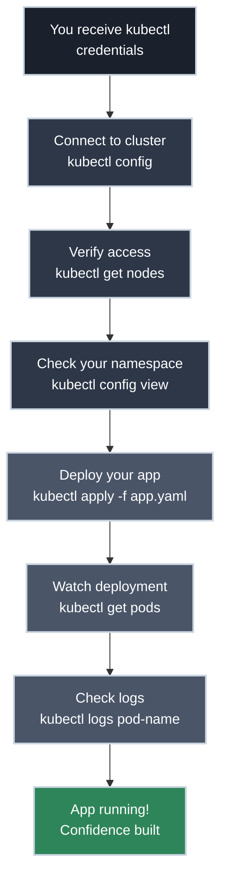

# Day One: Getting Started with Kubernetes

!!! tip "Your First Day with Kubernetes"
    You just got kubectl access to your company's dev cluster. You have an application to deploy. You're probably thinking: *What is this? How do I use it? Will I break something?*

## Welcome to Kubernetes

This is your first time working with Kubernetes, and you're probably feeling one of two ways:

- **Curious:** "Everyone talks about Kubernetes. Time to see what it's about!"
- **Nervous:** "I just got cluster access and need to deploy my app. No idea where to start..."

**Both are valid. You're in the right place.**

This guide is for application developers who need to deploy their code to a Kubernetes cluster. Not infrastructure engineers (yet)—just developers who need to ship their applications.

## What You'll Learn

By the end of Day One, you'll know how to:

- **Understand Kubernetes** - What it is, why your company uses it, what problem it solves
- **Connect to your cluster** - kubectl setup, contexts, namespaces
- **Deploy your first application** - From container image to running pods
- **Use essential kubectl commands** - The 10 commands you'll use daily
- **Understand what you just did** - What actually happens when you deploy
- **Explore safely** - Read-only commands, troubleshooting basics

## Your First Day: The Journey

This is the practical journey you'll take—from credentials in hand to deployed application.

## Understanding Your Context

This guide is written for a specific situation—one that's incredibly common but rarely addressed directly in Kubernetes tutorials.

-   :material-account-check: **Your Setup**

    ---

    **You have:**

    - A containerized application (Docker image in a registry)
    - `kubectl` installed and configured (IT/ops did this for you)
    - Access to a development Kubernetes cluster (real cluster, not minikube)
    - A namespace you can deploy to
    - Basic understanding that containers exist

    **You don't have:**

    - Deep Kubernetes knowledge (that's why you're here!)
    - Infrastructure or ops responsibilities (yet)
    - A cluster to manage (you're using an existing one)
    - Command line confidence (we'll fix that)

    **You are:**

    - An application developer
    - Possibly intimidated by the terminal
    - Responsible for getting your app running in dev/staging
    - Learning Kubernetes because your company adopted it

-   :material-account-group: **The Team Reality**

    ---

    Let's be honest about what's probably happening at your company:

    - **Your manager said "we're using Kubernetes now"** but doesn't know how it works either
    - **Your teammates are figuring this out alongside you** - nobody on the team is a Kubernetes expert
    - **The platform/ops team gave you access** but can't hand-hold through every deployment
    - **Nobody expects you to become a Kubernetes expert** - just functional enough to deploy your app
    - **You're learning by necessity, not choice** - this wasn't on your career roadmap, but here you are

    **This guide gets you unblocked.** Not certified, not expert-level—just competent enough to ship code and debug when things break.

    **You're not alone.** Thousands of application developers are in the exact same situation: handed `kubectl` credentials and told "figure it out." This guide is for all of you.

---

## Common Developer Scenarios

Why are you really here? Probably one of these situations:

=== ":material-rocket-launch: Deploy My App to Dev"

    **Your situation:** QA needs to test your latest build. You have a Docker image. Now what?

    **What you need to learn:**

    - How to write a deployment YAML (or modify the existing one)
    - `kubectl apply -f deployment.yaml` - push your changes
    - `kubectl get pods` - verify it's running
    - `kubectl rollout status` - watch the deployment happen

    **Day One gets you here.** By the end, you'll deploy confidently.

=== ":material-bug: Check Logs When Bug Reported"

    **Your situation:** QA says "it's broken in dev" or "I'm seeing weird errors." You need to investigate.

    **What you need to learn:**

    - `kubectl get pods` - find your pod name
    - `kubectl logs pod-name-xyz` - see what's failing
    - `kubectl logs -f pod-name-xyz` - follow logs live
    - `kubectl describe pod pod-name-xyz` - see why it crashed

    **Essential Commands teaches this.** Debugging becomes routine.

=== ":material-cog: Update Environment Variable"

    **Your situation:** Need to point to a different database, change an API key, or update a config value.

    **What you need to learn:**

    - ConfigMaps and Secrets (where config lives)
    - How to update them
    - How to restart your deployment to pick up changes
    - How to verify the new value is being used

    **Level 1: ConfigMaps and Secrets covers this.** Configuration management made clear.

=== ":material-undo: Roll Back Bad Deploy"

    **Your situation:** You deployed something and now dev is broken. You need to undo it. Fast.

    **What you need to learn:**

    - `kubectl rollout undo deployment/yourapp` - instant rollback
    - `kubectl rollout history` - see what versions exist
    - How to verify you're back to the working version

    **Level 2: Deployments Explained teaches this.** Rollbacks become your safety net.

=== ":material-scale-balance: Scale Up for Load Testing"

    **Your situation:** Performance team wants to load test. You need more instances running.

    **What you need to learn:**

    - `kubectl scale deployment/yourapp --replicas=10` - simple scaling
    - How to verify all replicas are running
    - How to scale back down when done

    **Level 2: Deployments covers scaling.** It's easier than you think.

**Sound familiar?** These are the real-world tasks you'll master. Not theoretical Kubernetes architecture—practical skills for shipping code.

---

## The Articles

Work through these in order for the complete Day One experience:

-   :material-help-circle: **[What Is Kubernetes and Why?](what_is_kubernetes.md)**

    ---

    Understand the container orchestration problem and why companies adopt Kubernetes. No jargon, just practical context.

-   :material-connection: **[Getting kubectl Access](kubectl_access.md)**

    ---

    Connect to your company's cluster. Understand kubeconfig, contexts, namespaces, and how to verify you're ready.

-   :material-rocket-launch: **[Your First Deployment](first_deployment.md)**

    ---

    Deploy a simple application and see it run. Hands-on, step-by-step, with YAML explained.

-   :material-console: **[Essential kubectl Commands](essential_commands.md)**

    ---

    The 10 commands you'll use every single day: get, describe, logs, exec, apply, delete, and more.

-   :material-lightbulb: **Understanding What Happened** *(coming soon)*

    ---

    What actually runs when you deploy? Learn about Pods, ReplicaSets, Services, and how they fit together.

!!! note "Day One Articles"
    Four articles are now available! Start with "What Is Kubernetes?" and work through in order. "Understanding What Happened" is coming soon to complete the Day One journey.

---

## The Philosophy

Throughout Day One, we emphasize **safety and confidence**. You're working on a shared development cluster:

!!! tip "Read-Only Commands Are Safe"

    These commands won't hurt anything—explore freely:

    - `kubectl get` - See what's running
    - `kubectl describe` - Inspect resources
    - `kubectl logs` - Read application logs
    - `kubectl explain` - Get documentation

!!! warning "Some Commands Need Care"

    These commands modify or delete resources—use with namespace awareness:

    - `kubectl delete` - Removes resources (yours, hopefully!)
    - `kubectl apply` - Creates/updates resources (stay in your namespace!)
    - `kubectl edit` - Modifies running resources

    **We'll clearly label which is which** throughout the articles.

!!! info "Your Namespace Is Your Sandbox"

    Your company likely gave you a namespace (like `dev-yourname` or `team-frontend-dev`). Think of it as your personal workspace:

    - **You can create/delete freely in YOUR namespace**
    - **Other namespaces are off-limits** (unless you're explicitly given access)
    - **Production namespaces require extra caution** (healthy respect for production!)

    We'll teach you to always check which namespace you're working in.

---

## Our Teaching Approach

Day One focuses on **practical, immediate needs**—the skills you need to deploy your application today.

-   :material-lightbulb-on: **We Teach**

    ---

    **The "Why"** — Why Kubernetes exists, why this command, why it matters

    **Real Scenarios** — "You need to deploy your app to dev" not abstract theory

    **Finding Answers** — How to help yourself when stuck (`kubectl explain`, `describe`, `logs`)

    **Safety Habits** — Namespace awareness, read-only vs destructive commands

---

## What's Next?

Once you're comfortable deploying applications and using kubectl confidently, you're ready for **Level 1: Core Primitives**. That's where you'll dive deeper into Pods, Services, ConfigMaps, and the fundamental building blocks of Kubernetes.

But first, let's get you deploying applications. That's what Day One is all about.

---

## Ready?

Start with **[What Is Kubernetes and Why?](what_is_kubernetes.md)** to understand what you're working with and why it matters.

Your journey from intimidated app developer to confident Kubernetes user starts here. Let's get you deploying.
