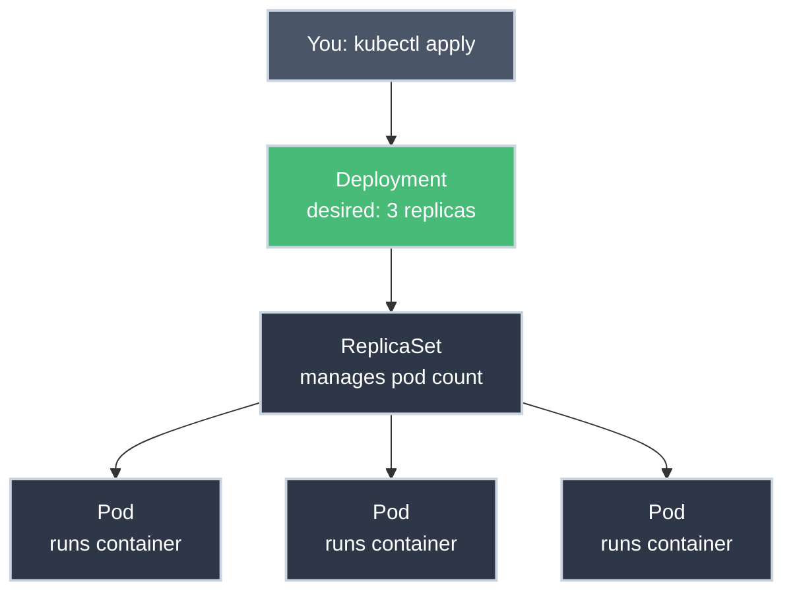

# Understanding What Happened

!!! tip "Part of Day One: Getting Started"
    This is the final article in [Day One: Getting Started](overview.md). You should have deployed an application and used kubectl commands before reading this.

You've deployed applications. You've used kubectl. But what actually happens when you run `kubectl apply -f deployment.yaml`?

Let's pull back the curtain and understand the Kubernetes architecture.

---

## The Big Picture

When you deployed nginx, you didn't create containers directly. You created a **Deployment**, which created a **ReplicaSet**, which created **Pods**, which run **Containers**.



**Why so many layers?**
- **Deployment** manages versions (rolling updates, rollbacks)
- **ReplicaSet** maintains desired count
- **Pod** is the atomic unit (the actual running thing)

---

## The Kubernetes Architecture

Your company's cluster has two parts:

### Control Plane (The Brains)

These components manage the cluster:

- **API Server** - The front door. kubectl talks to this.
- **etcd** - The database. Stores cluster state.
- **Scheduler** - Decides which server runs your pods.
- **Controller Manager** - Watches for desired state changes.

**You don't touch these.** They're managed by your platform team.

### Worker Nodes (The Muscle)

These servers actually run your containers:

- **kubelet** - Agent on each node. Runs containers.
- **kube-proxy** - Handles networking.
- **Container Runtime** - Docker/containerd. Actually runs containers.

**Your pods run here.**

---

## What Happens When You Deploy

Let's trace what happens step-by-step:

### 1. You run kubectl apply

```bash
kubectl apply -f deployment.yaml
```

kubectl sends your YAML to the **API Server**.

### 2. API Server validates and stores

- Validates YAML is correct
- Stores in **etcd** database
- Returns: "deployment.apps/my-app created"

### 3. Deployment Controller wakes up

The Deployment Controller watches for new Deployments. It sees yours and:
- Creates a **ReplicaSet** with your pod template
- Tells API Server about it

### 4. ReplicaSet Controller wakes up

The ReplicaSet Controller sees the new ReplicaSet and:
- Checks current pod count (0)
- Desired count (3 in your YAML)
- Creates 3 **Pods**
- Marks them "Pending"

### 5. Scheduler assigns nodes

The Scheduler sees Pending pods and:
- Looks at available worker nodes
- Checks resources (CPU, RAM)
- Assigns each pod to a node

### 6. kubelet starts containers

On each worker node, kubelet sees:
- A pod was assigned to my node
- Tells Container Runtime to pull image
- Starts container
- Reports back to API Server

### 7. Pod becomes Running

Once container is running:
- Pod status: Running
- Deployment status: 3/3 replicas ready
- You're done!

**All of this happens in seconds.**

---

## The Service Connection

When you created a Service, here's what happened:

### Service Creation

```yaml
kind: Service
spec:
  selector:
    app: nginx  # Looks for this label
```

### Service Controller

- Watches for pods matching label `app: nginx`
- Creates **Endpoints** (list of pod IPs)
- Updates kube-proxy on all nodes

### kube-proxy

- Updates networking rules
- Routes traffic to pod IPs
- Load balances across pods

**Result:** Requests to service name go to healthy pods automatically.

---

## The Objects You Created

Let's see everything you created:

```bash
kubectl get all
```

```
NAME                            READY   STATUS    RESTARTS   AGE
pod/my-app-7c5ddbdf54-2xkqn     1/1     Running   0          5m
pod/my-app-7c5ddbdf54-8mz4p     1/1     Running   0          5m
pod/my-app-7c5ddbdf54-x7fnw     1/1     Running   0          5m

NAME                        TYPE        CLUSTER-IP      PORT(S)
service/my-app-svc          ClusterIP   10.96.45.123    80/TCP

NAME                      READY   UP-TO-DATE   AVAILABLE   AGE
deployment.apps/my-app    3/3     3            3           5m

NAME                                 DESIRED   CURRENT   READY   AGE
replicaset.apps/my-app-7c5ddbdf54    3         3         3       5m
```

You created 2 things (Deployment, Service), Kubernetes created the rest automatically.

---

## Why This Design?

### Declarative, Not Imperative

**Imperative (Bad):**
```bash
create_pod pod1
create_pod pod2
if pod1 dies, create_pod pod3
```

**Declarative (Good):**
```yaml
desired_state: 3 pods running nginx
```

Kubernetes figures out how to make it happen. If one dies, it creates a new one automatically.

### Self-Healing

Because Kubernetes knows the desired state:
- Pod crashes? Create a new one.
- Node dies? Move pods to healthy nodes.
- Too few replicas? Create more.
- Too many? Delete extras.

**You describe what you want, Kubernetes makes it happen.**

---

## Labels: The Glue

Labels connect everything:

```yaml
# Deployment creates pods with this label:
labels:
  app: nginx

# Service finds pods with this label:
selector:
  app: nginx

# ReplicaSet manages pods with this label:
selector:
  matchLabels:
    app: nginx
```

**Without matching labels, nothing connects.**

---

## Namespaces: Your Workspace

Everything you created is in YOUR namespace. Other teams can't see or touch your resources.

```bash
# Your stuff
kubectl get pods
# Only shows your namespace

# Other team's stuff
kubectl get pods -n other-team
# Forbidden (probably)
```

**Namespaces provide:**
- Isolation
- Resource quotas
- Access control

---

## What You've Learned

By the end of Day One, you understand:

1. **What Kubernetes is** - Container orchestration
2. **How to connect** - kubectl and kubeconfig
3. **How to deploy** - YAML manifests and kubectl apply
4. **Essential commands** - The 10 you'll use daily
5. **How it works** - Architecture and resource hierarchy

**You're ready to use Kubernetes.**

---

## The Journey Ahead

Day One gave you the foundation. Here's what comes next:

### Level 1: Core Primitives
- Deep dive into Pods
- Services and networking
- ConfigMaps and Secrets
- Namespaces
- Labels and Selectors

### Level 2: Workload Management
- Deployments in detail
- StatefulSets for databases
- DaemonSets for node services
- Jobs and CronJobs

### Levels 3-6
- Networking
- Storage
- Security
- Production operations

**But first, master the basics.** Use kubectl daily. Deploy your real applications. Get comfortable.

---

## Practice Project

??? question "Challenge: Deploy Your Real Application"
    **Goal:** Take your actual application and deploy it to Kubernetes.

    **Requirements:**
    - Create a Dockerfile (if you don't have one)
    - Build and push to container registry
    - Write Deployment YAML
    - Write Service YAML
    - Deploy and test

    This is the best way to learn—deploy something real.

---

## Quick Recap

| Concept | What It Does |
|---------|--------------|
| **Deployment** | Manages versions and updates |
| **ReplicaSet** | Maintains desired pod count |
| **Pod** | Runs your container(s) |
| **Service** | Provides stable networking |
| **API Server** | Front door for all requests |
| **Controller** | Watches and maintains desired state |
| **kubelet** | Runs containers on nodes |

---

## Further Reading

### Official Documentation
- [Kubernetes Components](https://kubernetes.io/docs/concepts/overview/components/)
- [Kubernetes Objects](https://kubernetes.io/docs/concepts/overview/working-with-objects/kubernetes-objects/)
- [Understanding Kubernetes Objects](https://kubernetes.io/docs/concepts/overview/working-with-objects/)

### Deep Dives
- **Cluster Architecture Deep Dive** (coming soon)
- [The Kubernetes Book](https://github.com/nigelpoulton/TheK8sBook)

---

## What's Next?

**Day One Complete!** 🎉

You're ready for **[Level 1: Core Primitives](../level_1/overview.md)** where you'll master Pods, Services, ConfigMaps, and more.

Or take a break and deploy your real application first. Practice makes perfect.

---

**Remember:** Every Kubernetes expert started where you are right now. You've come a long way in Day One.

Welcome to the world of container orchestration.
