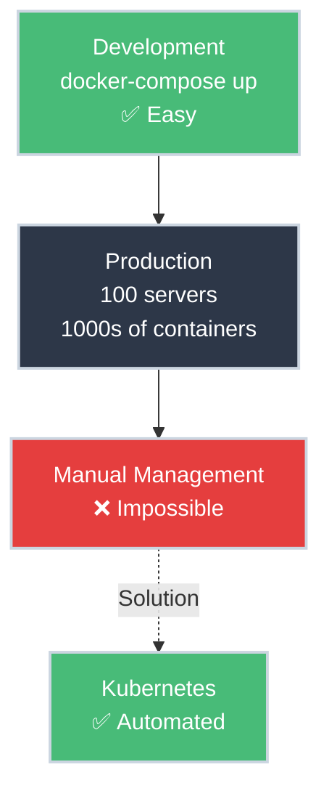

# What Is Kubernetes and Why?

!!! tip "Part of Day One: Getting Started"
    This is the first article in [Day One: Getting Started](overview.md). Start here if you're brand new to Kubernetes.

You just found out your company uses Kubernetes. Or maybe you saw it on a job description. Or your manager said "we're deploying to K8s now" and you nodded along, hoping it would make sense eventually.

**Let's make it make sense.**

---

## The Container Orchestration Challenge



## The Problem: Too Many Containers, Not Enough Hands

Imagine you've containerized your application. You have:

- A frontend container (React app)
- A backend container (API server)
- A database container (PostgreSQL)
- Maybe a cache (Redis)

**On your laptop:** Docker Compose handles this beautifully. One `docker-compose up` and everything runs.

??? info "Don't have Docker Compose experience? That's okay!"
    Not everyone comes to Kubernetes from Docker Compose—and that's perfectly fine.

    **The key point:** On a single computer, managing a few containers is easy. Your company probably already has a solution for this (Docker Compose, single-server Docker, or even just running processes directly).

    **The problem Kubernetes solves** isn't running containers on one machine—it's managing *hundreds or thousands* of containers across *dozens or hundreds* of servers. That's where manual management becomes impossible.

    **You can learn Kubernetes without Docker Compose experience.** The concepts transfer: containers need to run, they need to talk to each other, they need to restart when they crash. Kubernetes does this at massive scale.

**In production:** You have 50 frontend containers, 30 backend containers, 10 databases across 100 servers. Now you need to:

- Ensure containers are running (and restart them if they crash)
- Spread them across servers (load balancing)
- Connect them together (networking)
- Handle traffic spikes (scaling up/down)
- Deploy updates without downtime
- Monitor everything

**Doing this manually is impossible.** This is why Kubernetes exists.

---

## What Kubernetes Actually Is

**Kubernetes (K8s)** is a **container orchestration platform**. It's software that manages containers for you.

Think of it like an operating system for a data center:

- Your laptop's OS manages processes, memory, and files
- Kubernetes manages containers, servers, and networking

**The key idea:** You tell Kubernetes what you want ("I want 3 copies of my API running"), and Kubernetes makes it happen. If something breaks, Kubernetes fixes it automatically.

??? example "What Does 'Telling Kubernetes What You Want' Look Like?"
    You interact with Kubernetes using the `kubectl` command-line tool.

    Here's what checking on your app looks like:

    ```bash
    kubectl get pods
    # NAME                       READY   STATUS    RESTARTS   AGE
    # my-app-7c5ddbdf54-abc123   1/1     Running   0          2m
    # my-app-7c5ddbdf54-def456   1/1     Running   0          2m
    # my-app-7c5ddbdf54-ghi789   1/1     Running   0          2m
    ```

    That's it. One command to see what's running. Three copies of your app, all healthy.

    **Don't worry if this looks foreign.** In the next article, you'll run your first `kubectl` commands, and they'll become second nature quickly.

---

## The Shipping Container Analogy

The name "Kubernetes" means "helmsman" (ship pilot) in Greek. The logo is a ship's wheel. This isn't random—**containers** (Docker) are literally named after shipping containers.

**Before shipping containers (1950s):**

- Every cargo was different (boxes, barrels, crates)
- Loading/unloading was manual and slow
- Each port handled things differently

**After shipping containers:**

- Everything goes in standard 20' or 40' boxes
- Cranes can move them automatically
- Any port can handle any container
- Global trade exploded

**Kubernetes is the Port Authority:**

- Docker containers are the standardized boxes
- Kubernetes is the crane system that moves them around
- It doesn't matter what's inside the container—K8s handles it the same way

---

## Why Companies Adopt Kubernetes

<div class="grid cards" markdown>

-   :material-cloud-sync: **Run Anywhere**

    ---

    **Why it matters:** No vendor lock-in, move workloads freely

    Same Kubernetes runs on:

    - AWS (EKS)
    - Google Cloud (GKE)
    - Azure (AKS)
    - Your company's data center
    - Your laptop (for development)

    **Benefit:** Switch cloud providers without rewriting deployment infrastructure.

-   :material-heart-pulse: **Self-Healing**

    ---

    **Why it matters:** Fewer 3 AM pages, automatic recovery

    Kubernetes automatically handles failures:

    - Container crashes → Kubernetes restarts it
    - Server dies → Kubernetes moves containers to healthy servers
    - Traffic spike → Kubernetes scales up automatically

    **Benefit:** Operations team sleeps better, applications stay running.

-   :material-file-code: **Declarative Configuration**

    ---

    **Why it matters:** Infrastructure as Code, everything version-controlled

    **Traditional approach:** Imperative scripts

    ```bash
    # Run these commands in this exact order...
    docker run container-a
    sleep 5
    docker run container-b
    # Hope nothing breaks!
    ```

    **Kubernetes approach:** Declarative YAML

    ```yaml
    # Describe desired state, Kubernetes figures out how
    spec:
      replicas: 3  # I want 3 running
      containers:
        - name: my-app
    ```

    **Benefit:** Git tracks changes, rollbacks are easy, no procedural scripts.

-   :material-update: **Rolling Updates**

    ---

    **Why it matters:** Deploy anytime, no maintenance windows

    Update your app from v1 to v2 without downtime:

    1. Kubernetes starts new v2 containers
    2. Waits for them to be healthy
    3. Gradually stops v1 containers
    4. If v2 fails, automatically rolls back to v1

    **Benefit:** Deploy during business hours, users never notice.

</div>

---

## What Kubernetes Isn't

**Kubernetes is NOT:**

- ❌ A replacement for Docker (K8s uses Docker/containerd)
- ❌ A cloud provider (it runs ON clouds)
- ❌ Easy (it's powerful but complex)
- ❌ Required for small projects (might be overkill)

**Kubernetes IS:**

- ✅ An orchestrator for containers
- ✅ Platform for running distributed systems
- ✅ Industry standard for production deployments
- ✅ Worth learning if you're shipping software at scale

---

## The Trade-Off

**Complexity vs. Capability**

Kubernetes adds complexity:

- New concepts to learn (Pods, Services, Deployments)
- YAML configuration everywhere
- More moving parts

Kubernetes adds capability:

- Automatic scaling and healing
- Zero-downtime deployments
- Runs anywhere
- Battle-tested at Google/Cloud Native scale

**When it's worth it:** Teams shipping multiple services, need high availability, or running at scale.

**When it's not:** Single-server apps, hobby projects, teams without ops experience.

---

## Your Company Probably Uses Kubernetes If...

<div class="grid cards" markdown>

-   :material-apps: **Microservices Architecture**

    ---

    You have 10+ independent services (not a monolith)

-   :material-chart-line: **High Availability Requirements**

    ---

    Need 99.9%+ uptime, can't afford extended outages

-   :material-rocket-launch: **Frequent Deployments**

    ---

    Deploy multiple times per day, need fast iteration

-   :material-cloud: **Major Cloud Provider**

    ---

    Running on AWS, GCP, or Azure (all offer managed K8s)

-   :material-server-network: **Platform/DevOps Team**

    ---

    Company has dedicated infrastructure team

</div>

**If 2 or more apply:** Kubernetes makes sense for your company.

**What this means for you:**
You don't need to learn how to *install* Kubernetes (that's the platform team's job). You need to learn how to *use* Kubernetes to deploy your applications.

That's what Day One is about.

---

## What You'll Actually Do with Kubernetes

Remember the scenarios from the overview? Here's how Kubernetes addresses them:

- **Deploy your app** → `kubectl apply` pushes your changes to the cluster
- **Check logs** → `kubectl logs` shows what's happening inside containers
- **Update config** → ConfigMaps and Secrets manage environment variables
- **Roll back** → `kubectl rollout undo` instantly reverts bad deployments
- **Scale** → `kubectl scale` adjusts how many copies are running

We'll cover each of these in Day One and Level 1-2.

---

## Reflection Questions

These aren't hands-on exercises (we'll do that in the next article), but take a moment to think through these questions:

??? question "Exercise 1: Identify Your Scenario"
    Which of these describes your company?

    - Monolithic application on a single server
    - Microservices architecture (10+ services)
    - High availability requirements (99.9%+ uptime)
    - Multiple deployments per day
    - Running on major cloud provider (AWS, GCP, Azure)

    **How many apply?** If you checked 2 or more, Kubernetes makes sense for your company.

    ??? tip "Why This Matters"
        Understanding *why* your company adopted Kubernetes helps you appreciate the complexity trade-off. If you're running 50 microservices across 100 servers, the overhead of learning Kubernetes is worth it. If you have 1 app on 1 server, maybe not.

??? question "Exercise 2: Match the Problem to the Solution"
    We listed 6 orchestration challenges earlier. Can you match each problem to the Kubernetes feature that solves it?

    **Problems:**

    1. Containers crash and need to restart automatically
    2. Load needs to be distributed across many servers
    3. Services need to find and talk to each other
    4. Traffic spikes require spinning up more instances quickly
    5. Updates need to happen without taking the app offline
    6. Need to monitor health across hundreds of containers

    **Kubernetes Features:** Self-healing, Load balancing, Service discovery, Scaling, Rolling updates, Health checks

    ??? tip "Answers"
        1. **Self-healing** - Kubernetes restarts crashed containers automatically
        2. **Load balancing** - Services distribute traffic evenly across pods
        3. **Service discovery** - Kubernetes DNS lets services find each other by name
        4. **Scaling** - Deployments can increase/decrease replicas on demand
        5. **Rolling updates** - Gradual replacement of old containers with new ones
        6. **Health checks** - Probes continuously monitor container health

        **The pattern:** Every `kubectl` command you learn (coming in the next articles) maps back to solving one of these problems. Kubernetes isn't abstract—it's solving real operational challenges your team faces daily.

??? question "Exercise 3: What's Your Current Deploy Process?"
    Before Kubernetes (or right now, if you haven't deployed yet):

    **How does your team currently deploy applications?**

    - SSH into servers and run commands?
    - CI/CD pipeline that deploys to VMs?
    - Docker Compose on a single server?
    - Already using Kubernetes (but you don't understand it yet)?

    **Write down 2-3 pain points with your current process.**

    ??? tip "Why This Exercise Matters"
        When you deploy your first application to Kubernetes (next article!), you'll compare:

        **Before:** Manual SSH, forgotten steps, downtime during deploys, "works on my machine" problems

        **After:** `kubectl apply -f deployment.yaml` and Kubernetes handles the rest

        Understanding your current pain points helps you appreciate what Kubernetes solves.

---

## Quick Recap

| Question | Answer |
|----------|--------|
| **What is Kubernetes?** | Container orchestration platform |
| **Why does it exist?** | Managing containers at scale is impossible manually |
| **What problem does it solve?** | Automated deployment, scaling, healing, and updates |
| **Do I need to learn it?** | If your company uses it, yes! |

---

## Further Reading

### Official Documentation
- [What is Kubernetes?](https://kubernetes.io/docs/concepts/overview/what-is-kubernetes/) - Official overview
- [Kubernetes Components](https://kubernetes.io/docs/concepts/overview/components/) - Architecture overview

### Deep Dives
- [The Illustrated Children's Guide to Kubernetes](https://www.cncf.io/phippy/the-childrens-illustrated-guide-to-kubernetes/) - Visual story explaining K8s concepts
- [The Kubernetes Origin Story](https://cloud.google.com/blog/products/containers-kubernetes/from-google-to-the-world-the-kubernetes-origin-story) - How Google's Borg became Kubernetes
- [Borg: The Predecessor to Kubernetes](https://kubernetes.io/blog/2015/04/borg-predecessor-to-kubernetes/) - Official Kubernetes blog on Borg history

### Related Articles
- [Day One: Getting Started](overview.md) - Complete learning path overview

---

## What's Next?

You understand why Kubernetes exists. Now let's get you connected: **[Getting kubectl Access](kubectl_access.md)** will show you how to connect to your company's cluster and verify you're ready to deploy.

---

**Remember:** Every Kubernetes expert started by asking "What even is this?" You're on your way.
