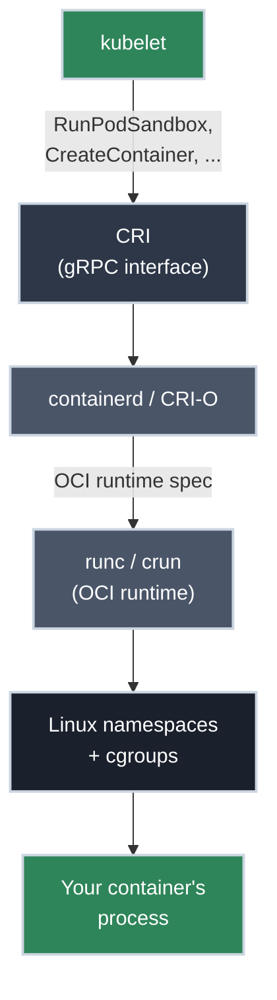

# The CRI: How kubelet Actually Talks to Container Runtimes

!!! tip "Part of Efficiency"
    This builds directly on [Essentials: Architecture](../essentials/architecture.md); read that first if "control plane," "node," and "kubelet" aren't already solid ground. This article picks up exactly where that one's runtime callout left off.

If you've ever read a cluster upgrade changelog, seen "Docker support removed," and felt a small jolt of *wait, Kubernetes runs on Docker, doesn't it?*, you've bumped into the exact confusion this article clears up. Plenty of clusters run on `containerd`. Some run on `CRI-O`. A few run something more exotic for sandboxing. `kubelet` doesn't know or care which — and that's not an accident, it's a deliberate interface.

!!! info "What You'll Learn"
    By the end of this article, you'll understand:

    - **What the CRI actually specifies** — the two gRPC services `kubelet` calls, not a vague "runtime API"
    - **Why it exists** — the Docker-was-hardcoded history, and what forced the abstraction
    - **The dockershim story** — how Kubernetes ran on Docker for years anyway, and why that shim was removed
    - **The full path from `kubectl apply` to a running process** — `kubelet` → CRI → runtime → OCI runtime → containers
    - **The runtimes you'll actually meet** — `containerd`, `CRI-O`, and sandboxed runtimes like gVisor/Kata
    - **How to inspect the runtime layer directly** with `crictl`, when `kubectl` isn't enough

---



---

## The Interface, Not the Implementation

The **CRI (Container Runtime Interface)** is a gRPC API with two services:

- **`RuntimeService`** — the Pod and container lifecycle: create a Pod sandbox, start/stop/remove containers, exec into one, stream logs.
- **`ImageService`** — pulling, listing, and removing container images on the node.

That's the entire contract. `kubelet` is written against these two services and nothing else. Whatever process implements them (`containerd`, `CRI-O`, or something else entirely) is a valid Kubernetes container runtime. `kubelet` never links against a runtime's SDK or shells out to its CLI; it makes gRPC calls and gets structured responses back.

This is the same pattern as `kube-proxy` implementing whatever a Service needs regardless of the underlying network, or a `StorageClass` abstracting away which cloud disk actually backs a volume: Kubernetes draws a hard interface boundary and lets multiple implementations compete behind it.

## Why This Existed: The Docker Problem

It wasn't always this clean. Early Kubernetes had Docker's control logic **built directly into `kubelet`** — no interface, just direct calls to the Docker daemon. That worked fine when Docker was the only serious container runtime anyone used.

Then **`rkt`** (CoreOS's container runtime) showed up wanting first-class support, and the Kubernetes project faced a choice: keep hardcoding one runtime after another into `kubelet` forever, or draw a boundary. They drew the boundary. The **CRI shipped in Kubernetes 1.5** (2016), and every runtime — Docker included — was expected to sit behind it going forward.

Docker itself didn't speak CRI natively, so Kubernetes shipped **`dockershim`**: a translation layer built into `kubelet` that spoke CRI on one side and the Docker API on the other. It let existing Docker-based clusters keep working while the ecosystem caught up. That shim lived far longer than anyone planned: it wasn't removed until **Kubernetes 1.24** (2022), six years after the CRI existed, because ripping out a compatibility layer that half the world's clusters silently depended on is not something you rush.

!!! warning "What the dockershim removal actually broke"
    Nothing that used the CRI properly. What broke were tools and workflows that reached *past* Kubernetes and talked to the Docker daemon directly on a node: some CI pipelines, some monitoring agents, the odd `docker ps` habit from a platform engineer debugging a node. The lesson generalizes: if you're operating at the node level, know which layer you're actually touching.

## The Full Path From `kubectl apply` to a Running Process

Stitching this to what you already know from [Architecture](../essentials/architecture.md) and [Pods](../essentials/pods.md):

1. `kubectl apply` sends your manifest to the **API server**, which stores it in `etcd` as desired state.
2. The **scheduler** assigns the Pod to a node.
3. **`kubelet`** on that node notices a new Pod assignment and calls `RunPodSandbox` over the CRI.
4. The **runtime** (`containerd` or `CRI-O`) creates the sandbox. This is the same "pause container holding the network namespace open" mechanic from the [Pods article](../essentials/pods.md#what-containers-share-inside-a-pod), just one layer further down than you saw it there.
5. `kubelet` calls `CreateContainer` / `StartContainer` for each container in the Pod spec.
6. The runtime hands off to an **OCI runtime** (almost always `runc`, sometimes `crun`), which does the actual low-level work: creating [Linux namespaces and cgroups](https://linux.bradpenney.io/efficiency/namespaces_cgroups/), setting up the filesystem, and executing your container's entrypoint.
7. Status flows back up the same chain, and `kubelet` reports it to the API server, which is what `kubectl get pods` is reading.

Every "container runtime" you'll hear named (`containerd`, `CRI-O`) is really doing step 4 through 6: implementing the CRI on one side, and driving an OCI-compliant low-level runtime on the other. The CRI and the OCI runtime spec are two different, deliberately separate standards solving two different problems: one is "how does an orchestrator talk to a runtime," the other is "how does a runtime actually construct a container."

## Runtimes You'll Actually See

=== "containerd"

    The **default runtime** on most managed Kubernetes (GKE, EKS, AKS) and most on-prem distributions. A CNCF graduated project, originally extracted from Docker itself. If you don't have a strong reason to pick something else, this is the safe default.

=== "CRI-O"

    Built specifically to implement the CRI and nothing more: no image-building, no CLI meant for humans, just the minimum surface Kubernetes needs. The default on OpenShift. Smaller attack surface by design, at the cost of being useless as a general-purpose container tool outside Kubernetes.

=== "Sandboxed runtimes (gVisor, Kata)"

    For workloads that need stronger isolation than a shared kernel gives you (untrusted multi-tenant code, for instance). gVisor intercepts syscalls in userspace instead of letting containers hit the host kernel directly; Kata runs each Pod in a lightweight VM. Both still implement the CRI, so `kubelet` drives them exactly like `containerd`. You select one per Pod with the `RuntimeClass` API object rather than reconfiguring the whole node.

## Debugging at the Runtime Layer

`kubectl` answers "what does the cluster think is happening." Sometimes you need "what does the node's runtime actually have running"; a Pod stuck in `ContainerCreating` with vague events is the classic trigger. That's what `crictl` is for: a CLI that speaks the CRI directly, bypassing `kubelet` entirely.

✅ **Safe (Read-Only):**

```bash title="Inspect containers directly through the runtime"
crictl ps               # containers the runtime knows about -- may differ from kubectl get pods!
crictl images            # images actually present on this node
crictl logs <container-id>
crictl inspect <container-id>   # low-level state: mounts, namespaces, OCI config
```

!!! info "Blast radius: node-scoped, not namespace-scoped"
    `crictl` requires access to the node itself (SSH or a debug container with the CRI socket mounted) — it's outside `kubectl`'s namespace-scoped RBAC entirely. Anything you see or touch here affects every Pod on that node, not just yours. This is squarely platform-engineer territory, not something application teams reach for.

## Practice Exercises

??? question "Exercise 1: Which Layer Broke?"
    A Pod is stuck in `ContainerCreating`. `kubectl describe pod` shows a generic "failed to create containerd task" event. Which layer does that error come from: the API server, the scheduler, `kubelet`, or the container runtime?

    ??? tip "Solution"
        **The container runtime** (`containerd`, specifically). `kubelet` successfully received the Pod assignment and made the CRI call; the failure happened one layer down, inside the runtime trying to actually construct the container. This is exactly the kind of failure where `crictl inspect` on the node gives you more than `kubectl describe` ever will.

??? question "Exercise 2: Two Standards, Not One"
    A colleague says "containerd implements the OCI spec so Kubernetes can talk to it." What's imprecise about that sentence?

    ??? tip "Solution"
        It conflates two separate standards. `containerd` implements the **CRI** so *`kubelet`* can talk to it: that's the orchestrator-facing interface. `containerd` then *drives* `runc`, which implements the **OCI runtime spec**: a different, lower-level standard for how a container actually gets constructed. `containerd` sits in the middle, speaking one standard up and driving another down.

## Quick Recap

| Concept | What to Know |
|---|---|
| **CRI** | The gRPC interface (`RuntimeService` + `ImageService`) `kubelet` uses to talk to any runtime |
| **Why it exists** | Kubernetes 1.5 drew a hard boundary instead of hardcoding runtimes one by one |
| **`dockershim`** | The Docker-to-CRI translation layer that let Docker clusters keep working; removed in 1.24 |
| **OCI runtime spec** | A separate standard for how a runtime actually builds a container (namespaces, cgroups) |
| **`containerd` / `CRI-O`** | Implement the CRI, then drive an OCI runtime like `runc` underneath |
| **RuntimeClass** | How you select a non-default runtime (e.g., a sandboxed one) per Pod |
| **`crictl`** | Talks to the runtime directly, bypassing `kubelet` — node-scoped, platform-engineer territory |

## What's Next?

You now have the full chain from a YAML file to a running Linux process. From here, the natural next step is the workloads that sit on top of Pods and manage them at scale.

**Related:** **[Essentials: Architecture](../essentials/architecture.md)** — the control-plane/node model this article assumes.

---

## Further Reading

### Official Documentation

- [Container Runtime Interface (CRI)](https://kubernetes.io/docs/concepts/architecture/cri/) - The official CRI overview
- [Dockershim Removal FAQ](https://kubernetes.io/blog/2022/02/17/dockershim-faq/) - What changed in 1.24 and why
- [RuntimeClass](https://kubernetes.io/docs/concepts/containers/runtime-class/) - Selecting a runtime per Pod

### Deep Dives

- [containerd](https://containerd.io/) - The CNCF graduated runtime used by most managed Kubernetes
- [CRI-O](https://cri-o.io/) - The minimal, Kubernetes-only runtime used by OpenShift
- [OCI Runtime Specification](https://github.com/opencontainers/runtime-spec) - The standard `runc` and `crun` implement

### Related Learning

- [Namespaces and cgroups: How Linux Isolates a Process](https://linux.bradpenney.io/efficiency/namespaces_cgroups/) - What `runc` is actually building when it constructs a container, explained from first principles
- [What Is a Container, Really?](https://containers.bradpenney.io/day_one/what_is_a_container/) - The container concept itself, independent of Kubernetes

### Related Articles

- [Essentials: Architecture](../essentials/architecture.md) - Control plane, nodes, and where the runtime fits
- [Pods Deep Dive](../essentials/pods.md) - The shared-namespace mechanics this article's "pause container" reference builds on
