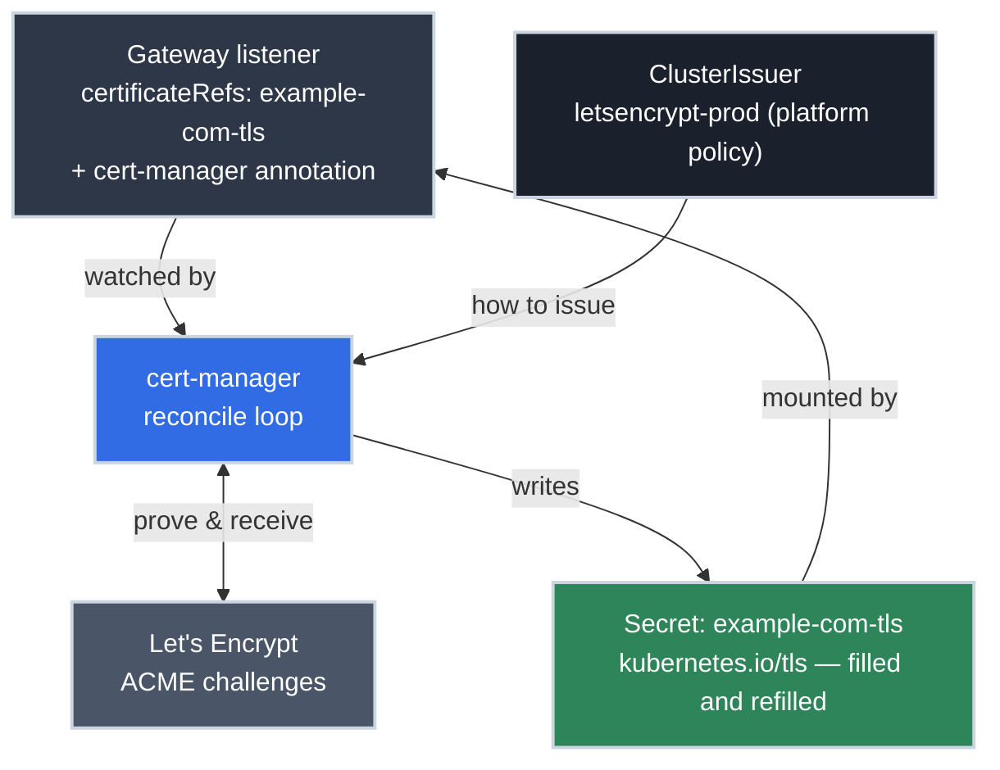

# cert-manager: Certificates as Cluster Resources

!!! tip "Part of a Learning Path"
    This article is a step in the [Put Your Kubernetes App on the Internet](https://bradpenney.io/pathways/cluster-to-internet) pathway on [bradpenney.io](https://bradpenney.io). It assumes the [Gateway API front door](gateway_api.md) and the [ACME protocol](https://networking.bradpenney.io/efficiency/tls/certificate_management/) — how a machine proves domain ownership — from the networking side of this pathway.

The [Gateway article](gateway_api.md) left you holding a promise: its HTTPS listener references a Secret called `example-com-tls`, and something, somehow, has to put a valid certificate in it, and keep putting one there, every renewal, forever. Do that by hand and you've built the exact calendar-driven outage the [ACME protocol](https://networking.bradpenney.io/efficiency/tls/certificate_management/) exists to end.

**cert-manager** is how a cluster keeps that promise. It applies the same move Kubernetes applies to everything: a certificate stops being a file someone fetches and becomes **desired state** (a resource declaring *which names, issued by whom, stored where*), with a controller reconciling reality to match, through every issuance and renewal, for as long as the cluster runs. This article wires it up: the two resources that model issuance, the one Gateway annotation that automates the whole front door, and the debug chain for the day a certificate won't issue.

!!! info "What You'll Learn"
    By the end of this article, you'll understand:

    - **The two-resource model** — Issuers as platform policy, Certificates as requests
    - **The Gateway integration** — one annotation, and listener Secrets fill and renew themselves
    - **The debug chain** — `Certificate → CertificateRequest → Order → Challenge`, and where failures actually live
    - **Staging discipline in cluster terms** — two ClusterIssuers, and which environments may touch production
    - **Internal PKI** — the same resources with your own CA as the signer

---



---

## Two Resources: Policy and Request

cert-manager adds two CRD layers to the cluster, and they divide the same way [Gateway API's resources](gateway_api.md) do, into platform policy and request:

**The Issuer** (platform-owned) says *where certificates come from and how to prove ownership*. `ClusterIssuer` is the cluster-wide variant you'll usually want:

```yaml title="platform/cert-manager/cluster-issuers.yaml" linenums="1"
apiVersion: cert-manager.io/v1
kind: ClusterIssuer
metadata:
  name: letsencrypt-prod
spec:
  acme:
    server: https://acme-v02.api.letsencrypt.org/directory  # (1)!
    email: platform@example.com  # (2)!
    privateKeySecretRef:
      name: letsencrypt-prod-account  # (3)!
    solvers:
    - http01:
        gatewayHTTPRoute:
          parentRefs:
          - name: web-gateway
            namespace: infra
            kind: Gateway  # (4)!
```

1. Let's Encrypt's **production** endpoint. A `letsencrypt-staging` twin of this resource, pointed at the staging endpoint, belongs beside it in the platform config; see the discipline note below.
2. Where expiry warnings go if renewal somehow fails repeatedly: a team inbox, not a person.
3. The ACME *account* key (cert-manager creates it): not a certificate, just the cluster's standing identity with the CA.
4. How [HTTP-01 challenges](https://networking.bradpenney.io/efficiency/tls/certificate_management/) get answered: cert-manager briefly attaches a temporary HTTPRoute to your existing Gateway to serve the token, then removes it. A `dns01` solver block (with DNS provider credentials) goes here instead when you need wildcards or internal names.

**The Certificate** (the request) says *which names, stored where*:

```yaml title="What cert-manager acts on" linenums="1"
apiVersion: cert-manager.io/v1
kind: Certificate
metadata:
  name: example-com-tls
  namespace: infra
spec:
  secretName: example-com-tls  # (1)!
  dnsNames:
  - "example.com"
  - "*.example.com"  # (2)!
  issuerRef:
    name: letsencrypt-prod
    kind: ClusterIssuer
```

1. The output: a standard `kubernetes.io/tls` Secret, the exact shape every TLS consumer mounts, [chain included](https://networking.bradpenney.io/essentials/tls/tls_basics/). cert-manager rewrites it at every renewal.
2. A wildcard means this Certificate needs a **DNS-01** solver on its issuer; HTTP-01 physically can't prove a wildcard.

Like everything on the platform, these are manifests in the config repo, [delivered by GitOps](https://gitops.bradpenney.io/essentials/deploying_the_edge_stack/): the `platform/cert-manager/` directory of the edge-stack artifact.

## The Payoff: Annotate the Gateway, Delete the Chore

Here's the part that closes the loop with the [front door](gateway_api.md). You usually don't even write the `Certificate` resource: cert-manager can generate it **from the Gateway itself**. Enable the integration the same way Traefik's own Gateway API support got turned on: a flag on the controller Deployment.

```yaml title="platform/cert-manager/cert-manager.yaml — the controller Deployment, one arg added" linenums="1"
      containers:
      - name: cert-manager-controller
        args:
        - --enable-gateway-api  # (1)!
```

1. Tells cert-manager to watch Gateways for the annotation below — the same declarative-flag pattern as Traefik's `--providers.kubernetesgateway=true`. Both live in the vendored manifest, not a Helm `values.yaml`.

With the flag set:

```yaml title="A Gateway whose certificates manage themselves" linenums="1"
apiVersion: gateway.networking.k8s.io/v1
kind: Gateway
metadata:
  name: web-gateway
  namespace: infra
  annotations:
    cert-manager.io/cluster-issuer: letsencrypt-prod  # (1)!
spec:
  gatewayClassName: traefik
  listeners:
  - name: websecure
    port: 443
    protocol: HTTPS
    hostname: "shop.example.com"  # (2)!
    tls:
      mode: Terminate
      certificateRefs:
      - name: shop-example-com-tls  # (3)!
```

1. The whole integration. cert-manager watches Gateways carrying this annotation.
2. cert-manager reads each listener's `hostname` to know which names the certificate must cover.
3. cert-manager creates a `Certificate` targeting this Secret name, runs the ACME dance, and fills it — the Secret the Gateway article told you to have "somehow" now creates *and renews* itself. The platform annotates once; every future listener on this Gateway gets the same treatment.

That's the end state worth naming: **certificate expiry stops being an event.** Not "we get reminded": the concept disappears from the calendar.

!!! warning "Two ClusterIssuers, one discipline"
    Let's Encrypt's production endpoint has [rate limits that can lock a domain out for days](https://networking.bradpenney.io/efficiency/tls/certificate_management/). In cluster terms the discipline is structural: the platform config carries **both** a `letsencrypt-staging` and a `letsencrypt-prod` ClusterIssuer, ephemeral and test environments annotate their Gateways with **staging** (untrusted certs, unlimited patience), and only long-lived environments reference **prod**. The annotation *is* the control point.

## When It Doesn't Issue: Follow the Chain

cert-manager decomposes every issuance into a chain of resources — `Certificate → CertificateRequest → Order → Challenge` — and debugging means walking it, outermost in, until the story changes. Here's the walk the way it actually happens, twelve minutes after a new listener shipped:

- :material-clock-alert-outline: **09:14 — The report.** `stats.example.com` is serving Traefik's default certificate. Start at the outermost resource:

    ```bash title="Is the Certificate ready?"
    kubectl get certificate -n infra
    # NAME                    READY   SECRET                  AGE
    # stats-example-com-tls   False   stats-example-com-tls   12m
    ```

- :material-stairs-down: **09:15 — One link down.** Twelve minutes is too long. `kubectl describe certificate` points at a `CertificateRequest`, which is waiting on an ACME `Order`:

    ```bash title="Walk down the chain"
    kubectl get order,challenge -n infra
    # NAME                                           STATE     AGE
    # order.acme.cert-manager.io/stats-example...    pending   12m
    # NAME                                           STATE     DOMAIN              AGE
    # challenge.acme.cert-manager.io/stats-exa...    pending   stats.example.com   12m
    ```

- :material-file-search: **09:16 — The Challenge names it.** The innermost resource holds the real story, as it almost always does:

    ```bash title="The Challenge names the failure"
    kubectl describe challenge -n infra | grep -A3 "Reason"
    #  Reason: Waiting for HTTP-01 challenge propagation:
    #    failed to perform self check GET request
    #    'http://stats.example.com/.well-known/acme-challenge/xK3f...':
    #    dial tcp: lookup stats.example.com: no such host
    ```

- :material-lightbulb-on: **09:18 — The actual cause.** `no such host`: the listener shipped, but nobody created the DNS record, and the CA can't fetch a token from a name that doesn't resolve. The fix isn't in cert-manager at all — it's a missing record. (Or, as the [next article](external_dns.md) argues, a controller that would have created it automatically.)

- :material-check-circle: **09:31 — Resolved, hands-free.** Record created. With no further human input, the Challenge retries on its own schedule and passes, and the chain unwinds: `Order` valid, `CertificateRequest` issued, `READY: True`, real certificate served. Nobody had to tell cert-manager to try again; reconcilers don't wait to be asked twice.

That walk is every "cert won't issue" incident: outermost resource in, until a `Reason` names the cause; and the cause is almost never cert-manager itself. Port 80 blocked at the load balancer, DNS credentials rejected, a record that doesn't exist yet: the Challenge tells you which.

## Internal Names: The CA Issuer

ACME with a public CA assumes the CA can see your domain, but `*.internal.corp` and service-to-service certificates front names that will never be public. cert-manager handles them with different **issuer types**: a `CA` issuer signs with a [private CA](https://networking.bradpenney.io/essentials/tls/tls_basics/) keypair you provide, and Vault/Venafi issuers delegate to enterprise PKI. Same `Certificate` resources, same Secrets, same renewal loop; only the signer changes. On-prem platforms get the by-now-familiar lesson: the machinery doesn't change, only who fulfills the request.

## Common Pitfalls

=== ":material-dns-outline: The Challenge is stuck on DNS-01"

    The Challenge sits `pending` with TXT-record errors. Check, in order: the **DNS provider credentials Secret** the solver references (wrong key or under-scoped permissions shows as `Forbidden` in the challenge events); **split-horizon DNS**, where the record landed in your internal zone but the public zone the CA queries never saw it; or plain propagation lag to a slow secondary. The challenge's `describe` output names which.

=== ":material-sync-alert: Renewed, but clients still get the old cert"

    The Secret holds a fresh certificate; `openssl s_client` against the live endpoint shows the old one. The consumer isn't reloading: Traefik watches Secret changes, but a CDN or external LB in front may hold *its own* cached copy that isn't cert-manager's to update. Compare what's served against what's in the Secret, then find the layer holding the stale copy. Also check for **two issuers fighting over one Secret**: flapping contents is the tell.

=== ":material-certificate-outline: `READY: True` but the Gateway serves a default cert"

    The Certificate issued fine — into a Secret the listener isn't actually referencing. Compare the listener's `certificateRefs.name` against the Certificate's `secretName` character by character (and namespace by namespace): the annotation-generated name must match what the listener mounts. Traefik serving its built-in default certificate is the classic symptom of a reference mismatch, not an issuance failure.

## Practice Exercises

??? question "Exercise 1: Walk the Chain"

    A new listener's certificate has shown `READY: False` for an hour. Walk the debugging chain and name the likely culprit given this finding: the Challenge is `pending`, HTTP-01, and its events say the self-check for `http://shop.example.com/.well-known/acme-challenge/<token>` times out.

    ??? tip "Solution"

        Chain: `Certificate` (False) → `CertificateRequest` → `Order` (pending) → `Challenge` (pending, with the actual reason). A timing-out HTTP-01 self-check means the token URL isn't reachable **from the internet**: either `shop.example.com` doesn't resolve to the Gateway's address yet (DNS record missing or still cached; plain [TTL math](https://networking.bradpenney.io/essentials/dns/how_dns_works/)), or **port 80 is closed** at the LoadBalancer/firewall because someone exposed only 443. HTTP-01 requires the CA to fetch over plain HTTP; an HTTPS-only edge breaks issuance while looking "more secure." Fix the port-80 path (serving only the challenge plus a redirect is fine) or switch the solver to DNS-01.

??? question "Exercise 2: The Preview-Environment Pipeline"

    Your CI creates a full preview environment per merge request — each with its own hostname on `*.preview.example.com` — and tears it down after review. Design the certificate strategy: which ClusterIssuer, which challenge, and what one change removes most of the issuance load entirely?

    ??? tip "Solution"

        Preview environments should never touch the **production** ACME endpoint: per-domain rate limits make CI-driven issuance a self-inflicted outage. Options, best first: (1) a **wildcard certificate** (`*.preview.example.com`, DNS-01, issued *once* under the production issuer and shared by every preview environment via the platform Gateway's listener), which removes per-environment issuance entirely (the "one change"); (2) if per-environment certs are truly required, annotate preview Gateways with the **staging** ClusterIssuer and accept the browser warning internally. The wildcard-on-the-Gateway pattern is the platform/app split paying off again: one platform-owned certificate, unlimited app-team environments underneath it.

??? question "Exercise 3: Who Owns Which Resource?"

    Your platform runs one Gateway with the `cert-manager.io/cluster-issuer` annotation. An app team asks for `pay.example.com` with TLS. List what already exists, what the app team creates, and what cert-manager creates on its own — and name the one thing that would force a *platform* change.

    ??? tip "Solution"

        **Already exists (platform):** cert-manager itself, both ClusterIssuers, and the annotated Gateway with a listener whose hostname covers `pay.example.com`. **App team creates:** exactly what the [Gateway article](gateway_api.md) taught — an HTTPRoute in their namespace (plus their Service). **cert-manager creates on its own:** the `Certificate`, the `CertificateRequest`/`Order`/`Challenge` chain, and the filled `kubernetes.io/tls` Secret the listener references; no human writes any of them. The platform change trigger: a hostname *outside* every existing listener's coverage (say `pay.example.io`): new listener, new certificate coverage, and that's a platform-owned edit to the Gateway, exactly where the ownership line belongs.

## Quick Recap

| Concept | What to Know |
|---------|-------------|
| **Desired state** | A Certificate declares names/issuer/Secret; the controller reconciles issuance and renewal forever |
| **Issuer vs Certificate** | Platform policy (how certs are issued) vs. request (which names, stored where) |
| **Gateway annotation** | `cert-manager.io/cluster-issuer` on the Gateway → Certificates generated from listeners automatically |
| **Two ClusterIssuers** | `letsencrypt-staging` for ephemeral/test, `letsencrypt-prod` for long-lived; the annotation is the control point |
| **Debug chain** | `Certificate → CertificateRequest → Order → Challenge`; the Challenge names the real failure |
| **Reference mismatch** | `READY: True` + default cert served = listener `certificateRefs` ≠ Certificate `secretName` |
| **CA issuer** | Same resources, your own signer: internal PKI without new machinery |

---

## What's Next?

The front door now feeds itself certificates. One hand-made artifact remains between users and your app (the DNS record pointing your domain at the Gateway), and [external-dns deletes that ticket](external_dns.md) with the same reconcile-loop move this article just made.

---

## Further Reading

### Official Documentation

- [cert-manager documentation](https://cert-manager.io/docs/) - Installation, issuer types, and configuration
- [cert-manager: Gateway API usage](https://cert-manager.io/docs/usage/gateway/) - The annotation integration used in this article

### Related Learning

- [Automating TLS Certificates: ACME and Let's Encrypt (networking.bradpenney.io)](https://networking.bradpenney.io/efficiency/tls/certificate_management/) - The protocol this controller runs: challenges, rate limits, and the 90-day design
- [TLS Basics (networking.bradpenney.io)](https://networking.bradpenney.io/essentials/tls/tls_basics/) - What the issued certificates are, chain and all
- [Deploying Platform Services with Flux and OCI Artifacts (gitops.bradpenney.io)](https://gitops.bradpenney.io/essentials/deploying_the_edge_stack/) - How `platform/cert-manager/` reaches the cluster

### Related Articles

- [Gateway API with Traefik: The Standard Front Door](gateway_api.md) - The listeners whose Secrets this article fills
- [Pointing Your Domain at the Cluster with external-dns](external_dns.md) - The other controller in the closed loop
