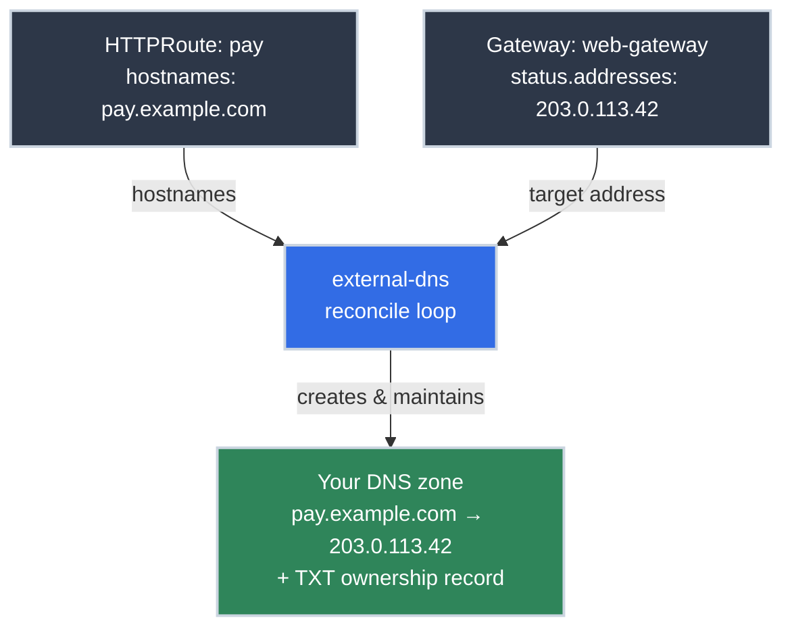

# Pointing Your Domain at the Cluster with external-dns

!!! tip "Part of a Learning Path"
    This article is a step in the [Put Your Kubernetes App on the Internet](https://bradpenney.io/pathways/cluster-to-internet) pathway on [bradpenney.io](https://bradpenney.io). It assumes the [Gateway API front door](gateway_api.md) is in place.

The DNS ticket is still sitting in your queue. An app team shipped a perfect HTTPRoute for `pay.example.com` this morning — the route attached, the certificate issued — and now they're blocked on *you*, because someone with zone access has to type an address into a DNS console. On a platform where the load balancer provisions itself, routes attach themselves, and certificates renew themselves, one artifact is still hand-made: the **DNS record**. Every hostname, every environment, forever.

That's the last ticket, and this article deletes it. **external-dns** watches your cluster's routing resources and writes the matching records into your DNS zone: the same reconcile-loop pattern as everything else here: HTTPRoutes declare hostnames, the Gateway knows its address, and a controller makes the zone agree.

!!! info "What You'll Learn"
    By the end of this article, you'll understand:

    - **How external-dns computes records** — hostnames from HTTPRoutes, targets from the Gateway's address
    - **The TXT ownership registry** — how it avoids destroying records it didn't create
    - **`--policy` and `--domain-filter`** — the blast-radius controls you set before trusting it
    - **The provider fork** — managed DNS (Route53/Cloudflare) vs. authoritative DNS you run yourself
    - **The completed loop** — a new HTTPRoute becoming a live, TLS-secured, resolvable app with zero tickets

---



---

## How external-dns Computes a Record

external-dns is a controller with one reconcile question: *what records should exist, given what's running?* With the Gateway API source enabled, it answers from resources you already have:

- **The name** comes from each HTTPRoute's `spec.hostnames` — narrowed against the parent Gateway's listener hostnames, so a route can't mint records outside what the platform's listeners actually serve.
- **The target** comes from the Gateway's `status.addresses`: the same external IP (or AWS hostname) the [LoadBalancer machinery](../../essentials/loadbalancer_services.md) wrote there. IP → A record; hostname → CNAME. It's the same [A-vs-CNAME decision](https://networking.bradpenney.io/essentials/dns/how_dns_works/) you'd make by hand at a DNS console, now made by a controller.

Configuration is a handful of flags on its Deployment — declarative manifests in the platform's config repo, [delivered by GitOps like everything else](https://gitops.bradpenney.io/essentials/deploying_the_edge_stack/):

```yaml title="external-dns Deployment — the flags that matter" linenums="1"
        args:
        - --source=gateway-httproute  # (1)!
        - --provider=cloudflare  # (2)!
        - --domain-filter=example.com  # (3)!
        - --txt-owner-id=prod-cluster  # (4)!
        - --policy=sync  # (5)!
```

1. Watch HTTPRoutes (companion sources exist for `gateway-grpcroute`, Services, and legacy Ingress). Without this, external-dns ignores your Gateway API resources entirely.
2. Where records get written; each provider takes credentials via a Secret. The provider list is long: Route53, Cloudflare, Google Cloud DNS, and, important later, `rfc2136` for DNS servers you run yourself.
3. **Scope guard:** external-dns may only touch this zone. Always set it: a controller with zone-write credentials should have the narrowest possible view. Same zero-trust habit as the rest of the platform: an explicit allow-list of what it may touch, never "everything minus exceptions."
4. This cluster's identity in the ownership registry (next section). Every cluster writing to a shared zone needs its own.
5. The blast-radius decision; read on before choosing.

## Ownership: Why It Won't Eat Your Zone

A controller that writes to your DNS zone raises an obvious fear: what stops it from overwriting the MX records, or the CEO's blog? The answer is the **registry**: for every record external-dns creates, it also creates a companion **TXT record** stamping it with the `--txt-owner-id`. On every reconcile, it will only modify or delete records that carry *its own* stamp. Hand-made records, another cluster's records, your mail configuration: invisible to it, by design.

That's also why `--txt-owner-id` must be **unique per cluster**: give staging and production the same owner ID against a shared zone and each will treat the other's records as its own, deleting "orphans" that are actually the other environment's live entries.

## `policy`: The Deletion Question

Ownership settles what external-dns *may* touch. The `policy` field settles what it *does* when the source of truth changes underneath it: specifically, when an HTTPRoute disappears.

| | `upsert-only` | `sync` |
| :--- | :--- | :--- |
| **Route created** | Record created | Record created |
| **Route's hostname changed** | New record created; **old one stays** | Old record replaced |
| **Route deleted** | **Record stays forever** | Record deleted |
| **Failure mode** | Zone fills with stale records pointing at your Gateway | A bad `kubectl delete` also removes the DNS record |

`sync` is the honest default *because* of the ownership registry: it can only delete records this cluster stamped, and a stale record pointing at your infrastructure is its own kind of hazard (dangling entries that resolve to an address you might someday release). Choose `upsert-only` when the zone is shared with processes you don't fully trust the labeling of, and accept that cleanup becomes a human job again.

## The Fork: Whose DNS Server Is It?

Everything above assumed somewhere to write records. Here the road forks, and it's the same fork as [the LoadBalancer article](../../essentials/loadbalancer_services.md): who provides the infrastructure?

**Path one, a managed DNS provider.** Route53, Cloudflare, Google Cloud DNS: you own the zone data; they run the authoritative servers. external-dns writes through their APIs, and the [registrar delegation](https://networking.bradpenney.io/essentials/dns/how_dns_works/) points at servers that are somebody else's pager. This is the default for internet-facing apps, and for most teams the right one.

**Path two, authoritative DNS you run yourself.** On-prem estates, regulated environments that can't put zone data in a third party's control plane, and homelabs all end up here: your own [BIND9](https://www.isc.org/bind/), the software behind much of the internet's DNS. Two ways to automate against it:

- **external-dns with the `rfc2136` provider**: BIND9 speaks the standard dynamic-update protocol (RFC 2136), so external-dns can push records to a BIND server you've already configured, secured by a TSIG key. Same controller, different backend; you still hand-manage the BIND deployment itself.
- **An operator that manages the DNS infrastructure too**, the fully declarative shape: the DNS servers, zones, and records all become Kubernetes resources. [Bindy](https://bindy.firestoned.io/) is one example: an operator that deploys and configures BIND9 clusters via CRDs (`Bind9Cluster`, zones, records applied dynamically over RNDC), extending the cluster's desired-state pattern down into the DNS layer itself.

!!! info "Disclosure"
    I'm involved in the Bindy project and I recommend it — I have no financial stake in it, so the recommendation isn't a paid placement, just a genuine one.

The decision rule mirrors MetalLB's: managed DNS for simplicity and global anycast reach; self-hosted when policy, network isolation, or ownership requirements say the zone can't leave your infrastructure, at the price of running one more critical service.

## The Loop, Closed

Watch what shipping an app looks like now, end to end — the whole edge stack in one motion:

1. The payments team merges an HTTPRoute into their config repo; the pipeline delivers it: `pay.example.com`, `parentRef: web-gateway`, backend `pay-svc`. *(Their only action.)*
2. The Gateway [accepts the attachment](gateway_api.md): the listener's `allowedRoutes` already admits their namespace.
3. **external-dns** sees the new hostname, sees the Gateway's address, and writes `pay.example.com → 203.0.113.42` (plus its TXT stamp) into the zone.
4. **cert-manager** [needs that record](cert_manager.md): its HTTP-01 challenge URL must resolve, and now it does, so the challenge passes, the certificate issues, and the Secret fills.
5. Traffic flows: [resolver](https://networking.bradpenney.io/essentials/dns/how_dns_works/) → [load balancer](../../essentials/loadbalancer_services.md) → Gateway → [TLS termination](https://networking.bradpenney.io/essentials/tls/tls_basics/) → route → Service → Pods.

No tickets. No consoles. Every artifact declarative, reviewed in Git, reconciled by a controller, and every layer something you can now name, debug, and explain.

## Common Pitfalls

=== ":material-file-question: No records appear"

    Check in order: is `--source=gateway-httproute` actually set? Does the hostname fall inside `--domain-filter` (a route for `pay.example.io` is silently ignored when the filter says `example.com`)? Does the **Gateway have an address** in `status.addresses`? No address means no target and no record; that's the [L4 layer's problem](../../essentials/loadbalancer_services.md), not external-dns's. The controller's logs narrate every decision, including what it skipped and why.

=== ":material-content-duplicate: It won't manage a record that already exists"

    You pre-created `pay.example.com` by hand months ago; external-dns now logs that it's skipping it. Correct behavior: the record carries **no ownership TXT stamp**, so it isn't external-dns's to modify. To hand it over, delete the manual record and let the controller recreate it (mind the [TTL window](https://networking.bradpenney.io/essentials/dns/how_dns_works/) during the swap); don't try to hand-forge the registry record.

=== ":material-delete-alert: Records vanished after a cluster migration"

    Old and new cluster both ran external-dns with `policy: sync` and the **same `--txt-owner-id`** against the shared zone. When the old cluster's routes were deleted during teardown, its controller dutifully deleted "its" records, which the new cluster believed were its own. Unique owner IDs per cluster, always; during migrations, run the incoming cluster as `upsert-only` until the outgoing one is fully off.

## Practice Exercises

??? question "Exercise 1: Two Clusters, One Zone"
    Staging and production clusters both expose apps under `example.com`. Design the external-dns configuration for each: `--txt-owner-id`, `--policy`, `--domain-filter` — and name the specific disaster your design prevents.

    ??? tip "Solution"
        Give each cluster a **unique owner ID** (`--txt-owner-id=staging` / `--txt-owner-id=prod`) so each only ever touches records it stamped. Scope harder with `--domain-filter` if the naming allows it (e.g., staging apps under `staging.example.com` → filter staging to that subtree; production keeps `example.com`). With ownership and filters correct, `--policy=sync` is safe for both and keeps the zone clean. The prevented disaster: shared owner IDs + `sync` means either cluster treats the other's records as its own orphans, so staging's teardown deletes production's DNS. The registry only protects you if identities are actually distinct.

??? question "Exercise 2: The Record That Never Came"
    A team's new app at `api.example.com` isn't resolving an hour after they applied their HTTPRoute. `kubectl get httproute` shows it `Accepted`. Walk the diagnosis in order and name the three most likely findings.

    ??? tip "Solution"
        The route is attached, so the Gateway layer is fine: this is external-dns territory. (1) **Source/scope:** is `--source=gateway-httproute` set, and does `api.example.com` pass `--domain-filter`? A filter mismatch is silent by design. (2) **No target:** does the Gateway have a `status.addresses` value? A `<pending>` LoadBalancer upstream means external-dns has a name but no address to point it at. (3) **Ownership:** a manually pre-created `api.example.com` record makes external-dns refuse to adopt it. The controller's logs distinguish all three in one read; if the record *was* created recently, the last suspect is plain [TTL/negative caching](https://networking.bradpenney.io/essentials/dns/how_dns_works/) on the resolver doing the checking.

??? question "Exercise 3: The Air-Gapped Estate"
    Your next platform runs on-prem for a regulated client: zone data may not leave their infrastructure, and the apps are internal-only. Which parts of this article's setup survive unchanged, and what replaces the provider?

    ??? tip "Solution"
        Everything cluster-side survives: the Gateway, HTTPRoutes as the source of truth for hostnames, the reconcile pattern, ownership, and policy discipline. What changes is the write target: no managed provider, so the authoritative servers are **BIND9 run in-house**. Either point external-dns at them with the **`rfc2136` provider** (TSIG-secured dynamic updates against BIND you administer separately), or go fully declarative with an operator that manages the BIND9 deployment, zones, and records as cluster resources: the Bindy pattern from this article. Certificates shift too, same logic: an internal CA issuer rather than a public ACME CA, since Let's Encrypt can't see (and shouldn't vouch for) internal names.

## Quick Recap

| Concept | What to Know |
|---------|-------------|
| **external-dns** | A reconcile loop for your DNS zone: HTTPRoute hostnames + Gateway address → records |
| **Record shape** | Gateway address is an IP → A record; an AWS-style hostname → CNAME |
| **TXT registry** | Records are stamped with the `--txt-owner-id`; the controller only touches what it stamped |
| **Unique owner IDs** | Per cluster, always; shared IDs on a shared zone end in mutual record deletion |
| **`--domain-filter`** | The scope guard: zone-write credentials deserve the narrowest possible view |
| **`policy`** | `sync` keeps the zone truthful (safe *because* of ownership); `upsert-only` never deletes |
| **The fork** | Managed provider APIs vs. self-hosted BIND9 (`rfc2136`, or an operator like Bindy) |
| **The closed loop** | Route applied → record written → challenge passes → cert issued → app live. Zero tickets |

---

## What's Next?

The edge is now functionally complete: from a name typed into a browser, through resolvers, load balancers, and a TLS handshake, to a Gateway routing into your Pods, every layer understood and every artifact self-maintaining. One question remains, and it gets the final word: how does this whole stack (Traefik, cert-manager, external-dns) actually reach the cluster? Not by hand. [Deploying Platform Services with Flux and OCI Artifacts](https://gitops.bradpenney.io/essentials/deploying_the_edge_stack/) ships it the production way — one versioned artifact, zero manual commands.

---

## Further Reading

### Official Documentation

- [external-dns](https://github.com/kubernetes-sigs/external-dns) - The project, provider list, and setup tutorials
- [external-dns: Gateway API sources](https://kubernetes-sigs.github.io/external-dns/latest/docs/sources/gateway/) - Exactly how hostnames and targets are derived from routes

### Related Articles

- [Gateway API with Traefik: The Standard Front Door](gateway_api.md) - The resources external-dns watches
- [LoadBalancer Services: From Cloud to Bare Metal](../../essentials/loadbalancer_services.md) - Where the Gateway's address comes from
- [How DNS Actually Works (networking.bradpenney.io)](https://networking.bradpenney.io/essentials/dns/how_dns_works/) - The zones, records, and TTLs this controller is writing
- [cert-manager: Certificates as Cluster Resources](cert_manager.md) - The other controller in the closed loop
