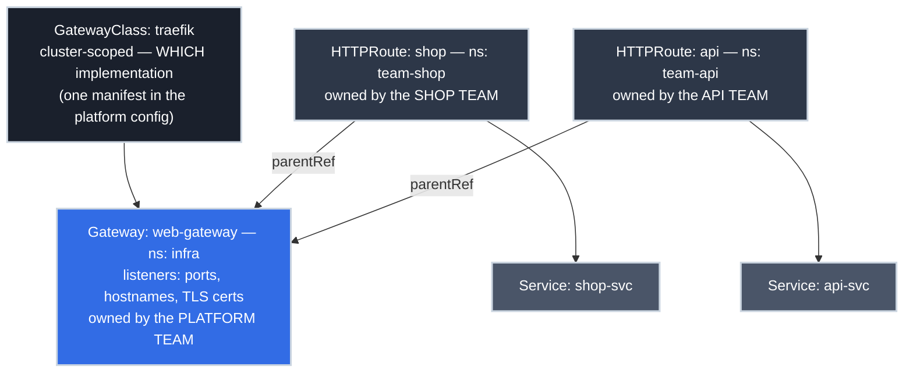

# Gateway API with Traefik: The Standard Front Door

!!! tip "Part of a Learning Path"
    This article is a step in the [Put Your Kubernetes App on the Internet](https://bradpenney.io/pathways/cluster-to-internet) pathway on [bradpenney.io](https://bradpenney.io). It assumes the [LoadBalancer Services](../../essentials/loadbalancer_services.md) picture: one external L4 address, and the question of what routes L7 traffic behind it.

You own the cluster's edge. Twelve application teams want hostnames, paths, and TLS behind the one public address you [pay for](../../essentials/loadbalancer_services.md), and every one of their routing changes currently lands in *your* queue, because the edge config is a single shared object only your team can safely touch.

That bottleneck isn't a tooling accident; it's what happens when one resource has to describe infrastructure *and* application routing at once. **Gateway API**, the successor to Ingress and the current Kubernetes standard for L7 traffic, is designed around exactly that fault line: it splits the front door into resources that match who owns what, so the platform team defines the door once and app teams attach their own routes to it, declaratively, in their own namespaces. This article builds that front door for real, using Traefik.

!!! info "What You'll Learn"
    By the end of this article, you'll understand:

    - **The three-resource model** — GatewayClass, Gateway, HTTPRoute — and why the split maps to teams
    - **How to wire it up with Traefik** — CRDs, the provider flag, and the GatewayClass, all as declarative manifests delivered by GitOps
    - **Listeners and TLS** — where certificates live and who may attach routes to which listener
    - **What HTTPRoutes can express** — hostname, path, and header matching, traffic splits, redirects
    - **How to debug attachment** — the status conditions that tell you exactly why a route isn't live

---



---

## Three Resources, Three Owners

Gateway API's core design decision is that L7 exposure involves three different jobs, done by three different roles — so it uses three resources instead of Ingress's one:

| Resource | Scope | What it declares | Who owns it |
| :--- | :--- | :--- | :--- |
| **GatewayClass** | Cluster | *Which implementation* handles Gateways of this class, like a StorageClass for traffic | Platform/infrastructure |
| **Gateway** | Namespaced | *The door itself*: listeners (ports, protocols, hostnames, TLS certificates) and who may attach | Platform team |
| **HTTPRoute** | Namespaced | *One app's routing*: hostnames/paths/headers → backend Services | Application team |

The connection between them is deliberate: an HTTPRoute names its Gateway in `parentRefs`, **from the app team's own namespace**, and the Gateway declares which namespaces are allowed to attach. Note the shape of that control: it's an **allow-list**. Nothing attaches by default, and there is no "block the bad ones" mode to mismanage — zero-trust posture, applied to routing. Routing changes stop flowing through the platform queue; the platform's control shifts to *policy* (who may attach, on which listener, for which hostnames) instead of *every change*.

That's also the blast-radius story, which is why the split holds up operationally: a **Gateway** change (a listener, a certificate) affects every app behind it and belongs with the team that owns that risk; an **HTTPRoute** change affects exactly one app and can safely live with the people who ship it.

!!! info "Why not Ingress?"
    Ingress standardized only the basics (host and path to Service), so every real-world need (redirects, traffic splits, header rules) escaped into **controller-specific annotations**, unportable and untyped, and everything lived in one flat resource with no ownership boundary. Gateway API absorbs those needs into the *typed spec* you're about to use. You'll still meet Ingress everywhere in existing clusters, and [reading it fluently matters](../../essentials/ingress.md). New builds start here.

## Wiring It Up with Traefik

Like everything else on the platform, Traefik rolls out **via GitOps**: a Kustomize directory of plain Kubernetes manifests, packaged as a versioned **OCI artifact** and reconciled into the cluster by a controller — never by hand, never by a package manager mutating the cluster imperatively. (The full pipeline of artifact, registry, and reconciler is [its own article](https://gitops.bradpenney.io/essentials/deploying_the_edge_stack/); here's the directory it delivers.)

```yaml title="platform/traefik/kustomization.yaml" linenums="1"
apiVersion: kustomize.config.k8s.io/v1beta1
kind: Kustomization
namespace: infra
resources:
  - gateway-api-crds.yaml  # (1)!
  - rbac.yaml  # (2)!
  - deployment.yaml
  - service.yaml
  - gatewayclass.yaml
```

1. The Gateway API CRDs, versioned and released separately from Kubernetes itself, vendored from the standard channel's `v1.6.0` release file. The artifact is self-contained by design: nothing is fetched from the internet at deploy time, and a spec upgrade is a reviewable diff.
2. Traefik itself is ordinary Kubernetes objects: a ServiceAccount with RBAC, a Deployment, and its own `type: LoadBalancer` Service — which is where the door gets its address.

Two of those manifests carry the actual decisions. The Deployment's args enable the Gateway API provider:

```yaml title="platform/traefik/deployment.yaml — the part that matters" linenums="1"
      containers:
      - name: traefik
        image: traefik:v3.5  # (1)!
        args:
        - --providers.kubernetesgateway=true  # (2)!
        - --entrypoints.web.address=:80
        - --entrypoints.websecure.address=:443
```

1. Pinned, like every image on the platform — never `:latest`.
2. Turns on Traefik's Gateway API support. Traefik v3 implements the Standard channel — HTTPRoute plus GRPCRoute and TLSRoute.

And the **GatewayClass**, the cluster-wide "which implementation" answer, is a manifest you author, not installer magic:

```yaml title="platform/traefik/gatewayclass.yaml" linenums="1"
apiVersion: gateway.networking.k8s.io/v1
kind: GatewayClass
metadata:
  name: traefik
spec:
  controllerName: traefik.io/gateway-controller  # (1)!
```

1. The controller identifier Traefik announces. From now on, any Gateway with `gatewayClassName: traefik` belongs to this Traefik.

Merge the directory into the platform's config repo, let the pipeline package and the reconciler deliver it, and verify the claim:

```bash title="Verify the class is claimed"
kubectl get gatewayclass
# NAME      CONTROLLER                      ACCEPTED   AGE
# traefik   traefik.io/gateway-controller   True       15s
```

`ACCEPTED: True` means the controller has claimed the class: the "which implementation" question is answered once, cluster-wide.

One thing worth noticing about that address: it comes from the [LoadBalancer machinery](../../essentials/loadbalancer_services.md): a cloud controller on EKS/GKE/AKS, MetalLB on your own metal. **Everything from here on is identical in both worlds.** The Gateway API layer neither knows nor cares what answers for the IP in front of it; that's the payoff of the stack being layered.

!!! tip "Where should the Traefik Pods themselves run?"
    On the general worker pool, as a small Deployment (2–3 replicas) with pod anti-affinity so no two share a node; that's the right default, and the load balancer's health checks track wherever they land. Clusters with stricter requirements graduate to **dedicated ingress nodes**: a labeled, tainted pool that only edge traffic touches, buying predictable capacity and a tighter firewall boundary. What the front door should *not* stand on in production is the **control plane** — an internet-facing proxy doesn't belong on the machines running `etcd` and the API server, for isolation and contention reasons both. (Homelab-scale clusters where every node is both server and worker get a pragmatic pass.)

## The Gateway: The Platform Team's Door

The Gateway declares the listeners: what ports and hostnames the door serves, where TLS terminates, and who may attach.

```yaml title="web-gateway.yaml" linenums="1"
apiVersion: gateway.networking.k8s.io/v1
kind: Gateway
metadata:
  name: web-gateway
  namespace: infra
spec:
  gatewayClassName: traefik  # (1)!
  listeners:
  - name: web
    port: 80
    protocol: HTTP  # (2)!
  - name: websecure
    port: 443
    protocol: HTTPS
    hostname: "*.example.com"  # (3)!
    tls:
      mode: Terminate
      certificateRefs:
      - name: example-com-tls  # (4)!
    allowedRoutes:
      namespaces:
        from: Selector
        selector:
          matchLabels:
            gateway-access: "granted"  # (5)!
```

1. Binds this Gateway to the Traefik-controlled class declared in the platform config.
2. The plaintext listener exists for exactly one purpose: redirecting to HTTPS (shown below). Nothing should serve real traffic here.
3. This listener only serves names under `example.com`; a route claiming `evil.other.com` can't attach to it. SNI decides which certificate a client sees.
4. A standard `kubernetes.io/tls` Secret in this namespace. TLS terminates *here*, at the platform's door; apps behind it never touch certificates. (Getting that Secret to issue and renew itself is [cert-manager's job](cert_manager.md).)
5. The governance Ingress never had — and zero-trust in miniature: **only what's explicitly allowed gets through.** Namespaces attach because the platform labeled them, never because they weren't blocked. `from: Same` is the tightest posture; treat `from: All` as a deliberate, documented exception, not a convenience.

```bash title="Verify the door is up"
kubectl get gateway -n infra
# NAME          CLASS     ADDRESS         PROGRAMMED   AGE
# web-gateway   traefik   203.0.113.42    True         40s
```

`PROGRAMMED: True` is the controller saying "this configuration is live in my data plane." The `ADDRESS` is what your DNS record points at.

## The HTTPRoute: The App Team's Claim

Now the part that scales: each team, in its own namespace, declares its own routing.

```yaml title="shop-route.yaml (namespace: team-shop)" linenums="1"
apiVersion: gateway.networking.k8s.io/v1
kind: HTTPRoute
metadata:
  name: shop
  namespace: team-shop
spec:
  parentRefs:
  - name: web-gateway
    namespace: infra  # (1)!
    sectionName: websecure  # (2)!
  hostnames:
  - "shop.example.com"  # (3)!
  rules:
  - matches:
    - path:
        type: PathPrefix
        value: /  # (4)!
    backendRefs:
    - name: shop-svc
      port: 80  # (5)!
```

1. Attaching across namespaces is the *intended* pattern: the route lives with the app, the Gateway with the platform. It only works because the listener's `allowedRoutes` admits this namespace.
2. Attach to the HTTPS listener specifically. Omit `sectionName` to attach to every listener that will have you.
3. Must fit inside the listener's `*.example.com` — the intersection of listener and route hostnames is what actually serves.
4. `PathPrefix` and `Exact` are core; everything is a typed field, not an annotation string.
5. A plain ClusterIP [Service](../../essentials/services.md); with a real front door, *nothing else* in the cluster needs `type: LoadBalancer`.

Merge that manifest, and once it reconciles `https://shop.example.com` routes to the shop team's Pods — with no ticket to the platform team and no shared file edited. The next team ships `api-route.yaml` in `team-api`, and the same door serves both.

## What Routes Can Express

The features that used to live in annotation soup are typed rules now. The three you'll reach for first:

=== ":material-call-split: Canary by weight"

    Split traffic between two versions of a backend — the primitive under progressive delivery:

    ```yaml title="90/10 split" linenums="1"
    rules:
    - backendRefs:
      - name: shop-svc
        port: 80
        weight: 90
      - name: shop-svc-canary
        port: 80
        weight: 10  # (1)!
    ```

    1. Weights are proportions, not percentages — `9`/`1` behaves identically. Shift the ratio in Git, let it reconcile, watch the canary's error rate, repeat.

=== ":material-format-header-pound: Route on a header"

    Send matching requests — a debug flag, a beta cohort — to a different backend than everyone else:

    ```yaml title="Header-based routing" linenums="1"
    rules:
    - matches:
      - headers:
        - name: X-Beta
          value: "enrolled"  # (1)!
      backendRefs:
      - name: shop-svc-beta
        port: 80
    - backendRefs:  # (2)!
      - name: shop-svc
        port: 80
    ```

    1. Exact header match (regex is available). L4 could never do this: reading headers is precisely what an L7 door is for.
    2. A rule with no `matches` is the catch-all; order the specific rule first.

=== ":material-arrow-right-bold: Redirect HTTP → HTTPS"

    The port-80 listener's only legitimate job, expressed as a filter on a route attached to it:

    ```yaml title="Redirect route (attach via sectionName: web)" linenums="1"
    rules:
    - filters:
      - type: RequestRedirect
        requestRedirect:
          scheme: https
          statusCode: 301  # (1)!
    ```

    1. Any plaintext request bounces to the HTTPS listener before touching a backend. This used to be a per-controller annotation; now it's spec.

## Debugging Attachment: Read the Status

Gateway API's other quiet win is that it **reports back** — and that's what keeps the ownership split honest. A shared front door only works if, when a route doesn't serve, the status says *whose move it is*. Every Gateway and HTTPRoute carries conditions explaining exactly what the controller decided, which turns "my route isn't working" into a lookup:

```bash title="The route tells you what's wrong"
kubectl describe httproute shop -n team-shop  # (1)!
# Conditions:
#   Type:     Accepted
#   Status:   False
#   Reason:   NotAllowedByListeners  (2)
```

1. Check the route's status first, the Gateway's second (`kubectl describe gateway -n infra` shows per-listener `attachedRoutes` counts).
2. This exact reason means the listener's `allowedRoutes` doesn't admit the route's namespace: fix the namespace label or the selector. `NoMatchingListenerHostname` means the route's hostname falls outside the listener's; `ResolvedRefs: False` means a `backendRef` points at a Service that doesn't exist.

## Common Pitfalls

=== ":material-cube-off: Nothing recognizes `kind: Gateway`"

    `error: resource mapping not found for ... "gateway.networking.k8s.io/v1"` — the CRDs aren't installed. They ship separately from Kubernetes *and* separately from Traefik: the vendored CRD manifest is missing from (or ordered after its dependents in) the platform kustomization. (If `kubectl get gatewayclass` returns zero resources instead of an error, the CRDs are in but `--providers.kubernetesgateway=true` is missing from Traefik's args.)

=== ":material-link-off: Route exists, traffic 404s"

    First: is the route even attached? `describe` it and read `Accepted`/`ResolvedRefs` (above). If it's accepted and you're testing with `curl https://203.0.113.42/`, the 404 is the hostname: routing matched on `shop.example.com` and you sent the raw IP as the Host/SNI. Test the way traffic really arrives (`curl --resolve shop.example.com:443:203.0.113.42 https://shop.example.com/`) before DNS exists.

=== ":material-timer-sand: Gateway PROGRAMMED but no ADDRESS"

    The door is configured but nothing answers for it externally: this is the [LoadBalancer article's](../../essentials/loadbalancer_services.md) problem wearing a new hat: Traefik's own LoadBalancer Service is `<pending>`. On cloud, check the cloud controller; on bare metal, MetalLB isn't installed or its pool is exhausted. The Gateway API layer is fine; the L4 layer under it isn't.

## Practice Exercises

??? question "Exercise 1: Draw the Ownership Line"
    Your platform team runs one Gateway. The `payments` team needs `pay.example.com` routed to their Service, TLS included. List every resource that must exist or change, which team owns each, and the one thing the platform team must have done *in advance* for payments to self-serve.

    ??? tip "Solution"
        **Platform-owned, already in place:** the GatewayClass (one manifest in the platform config) and the Gateway with an HTTPS listener whose hostname covers `pay.example.com` (e.g. `*.example.com`), TLS Secret referenced, and, as the advance requirement, an `allowedRoutes` policy that admits the payments namespace (e.g. the platform labels `team-payments` with `gateway-access: granted`). **Payments-owned:** their ClusterIP Service and one `HTTPRoute` in `team-payments` with a `parentRef` to `infra/web-gateway`, hostname `pay.example.com`, and a `backendRef` to their Service. Plus a DNS record for `pay.example.com` → the Gateway's address. No platform ticket in the request path — the platform's decision was made once, as policy.

??? question "Exercise 2: The Canary That Took All the Traffic"
    A teammate ships a split: rule 1 matches `PathPrefix: /`, `backendRef: shop-svc`; rule 2 matches `PathPrefix: /`, `backendRef: shop-svc-canary`. They expected 50/50; the canary gets nothing. Why, and what's the correct manifest shape?

    ??? tip "Solution"
        They wrote **two rules**, and rule evaluation picks a single winner per request: with identical matches, the first rule takes everything, so the canary starves. A traffic split is **one rule with two weighted `backendRefs`**: a single `backendRefs` list containing `shop-svc` with `weight: 50` and `shop-svc-canary` with `weight: 50`. Rules decide *which* rule handles a request; weights decide *which backend within the rule* receives it. Mixing up those two levels is the most common Gateway API manifest bug.

??? question "Exercise 3: Accepted: False"
    The `analytics` team copies the shop team's working HTTPRoute into their namespace, changes the hostname to `stats.example.com` and the backend to their Service, and applies. Traffic 404s; `kubectl describe` shows `Accepted: False, Reason: NotAllowedByListeners`. Diagnose precisely, name the fix, and say which team must act.

    ??? tip "Solution"
        The route's `parentRef` and hostname are fine: the listener itself **refused the attachment** because its `allowedRoutes` namespace selector doesn't admit `team-analytics`. Copying the manifest copied everything *except* the one thing that isn't in the manifest: the namespace's standing with the Gateway. The fix is labeling the `team-analytics` namespace to match the selector (e.g. `gateway-access: granted`) — and that's the **platform team's** action, deliberately: admitting a new team to the shared door is a policy decision, made once, after which analytics self-serves like everyone else.

## Quick Recap

| Concept | What to Know |
|---------|-------------|
| **GatewayClass** | Cluster-scoped "which implementation"; one authored manifest binds `traefik` → `traefik.io/gateway-controller` |
| **Gateway** | Platform-owned listeners: ports, hostnames, TLS termination, attachment policy |
| **HTTPRoute** | App-owned routing in the app's namespace, attached via `parentRefs` |
| **`allowedRoutes`** | Zero-trust allow-list: nothing attaches unless explicitly permitted, never a block-list |
| **Typed rules** | Splits, header matches, redirects are spec fields, not controller annotations |
| **Status conditions** | `Accepted` / `ResolvedRefs` on the route tell you exactly why traffic isn't flowing |
| **One LB total** | The Gateway sits behind a single LoadBalancer Service; cloud or MetalLB, same YAML above it |
| **Ingress** | The predecessor you'll still encounter: read it, migrate from it, don't start new work on it |

---

## What's Next?

You have the standard front door: one address, TLS at the edge, and routing that app teams own without owning the edge. Two loose ends remain: the [**Ingress** resources you'll inherit in existing clusters](../../essentials/ingress.md) (and how to read them with Gateway API eyes), and [making the `example-com-tls` Secret above issue and renew itself](cert_manager.md), so certificates stop being something anyone remembers.

---

## Further Reading

### Official Documentation

- [Gateway API](https://gateway-api.sigs.k8s.io/) - The spec, concepts, and guides from the SIG
- [Traefik: Kubernetes Gateway provider](https://doc.traefik.io/traefik/reference/install-configuration/providers/kubernetes/kubernetes-gateway/) - Enabling and configuring the provider used here

### Deep Dives

- [Gateway API: HTTP routing](https://gateway-api.sigs.k8s.io/guides/http-routing/) - The official walk-through of match types and precedence
- [Traefik blog: Getting started with Kubernetes Gateway API and Traefik](https://traefik.io/blog/getting-started-with-kubernetes-gateway-api-and-traefik) - The vendor's own end-to-end tour

### Related Learning

- [Reverse Proxies and API Gateways (networking.bradpenney.io)](https://networking.bradpenney.io/efficiency/api_gateways/reverse_proxies_and_gateways/) - The front-door theory this article implements on Kubernetes
- [Deploying Platform Services with Flux and OCI Artifacts (gitops.bradpenney.io)](https://gitops.bradpenney.io/essentials/deploying_the_edge_stack/) - How this article's `platform/traefik` directory actually reaches the cluster
- [Load Balancer Basics (networking.bradpenney.io)](https://networking.bradpenney.io/essentials/load_balancers/load_balancer_basics/) - L4 vs L7 — why the Gateway can route on hostnames and the LB in front of it can't

### Related Articles

- [LoadBalancer Services: From Cloud to Bare Metal](../../essentials/loadbalancer_services.md) - The L4 layer this Gateway sits behind
- [Services: Stable Networking for Pods](../../essentials/services.md) - The ClusterIP backends every route points at
