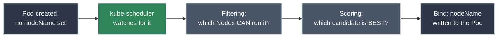

# The Kubernetes Scheduler: How a Pod Picks a Node

!!! tip "Part of Efficiency"
    This builds on [Essentials: Architecture](../essentials/architecture.md). The control-plane component named there gets its full mechanics here. It's also a step in the [How Modern Software Really Runs on a CPU](https://bradpenney.io/pathways/cpu-to-cluster) pathway on [bradpenney.io](https://bradpenney.io).

You `kubectl apply` a Deployment, and thirty seconds later a Pod is still sitting in `Pending`. `kubectl get pods` gives you nothing to work with. No crash, no logs, because the container has never started. The answer is always in one place: `kubectl describe pod`, and specifically its `Events` section, because *something* just failed to make a decision, and that something has a name.

## Where You Might Have Seen This

- **A Pod stuck in `Pending` with an event like `0/5 nodes are available: 3 Insufficient cpu, 2 node(s) had untolerated taint`:** the scheduler telling you, precisely, why every candidate was rejected.
- **`kubectl taint nodes` for dedicated node pools** (GPU nodes, spot instances): deliberately narrowing which Pods are even eligible to land there.
- **A StatefulSet or Deployment whose Pods always seem to spread across availability zones:** not a coincidence; a scoring preference doing exactly what it's configured to do.
- **`nodeSelector: kubernetes.io/os: linux`**, quietly present in most Helm charts. The simplest possible scheduling constraint, so ubiquitous it's easy to stop noticing it's there.

## Same Problem, Cluster Altitude

**[How the OS Scheduler Actually Decides](https://cs.bradpenney.io/efficiency/systems/os_scheduler/)** covered a specific shape of problem: many contenders, one shared resource (a CPU core), and something that has to decide who goes next. **kube-scheduler** solves the exact same shape of problem, one level up: many Pods, a fleet of Nodes, and a decision about which Pod belongs on which machine. Neither the kubelet nor the Pod itself makes this call; it's a dedicated control-plane component, watching the API server for Pods with no assigned Node and deciding, one at a time, where each one goes.



Every unscheduled Pod goes through the same two phases:

1. **Filtering:** starting from every Node in the cluster, throw out any that *cannot* run this Pod at all: not enough allocatable CPU or memory left, a taint the Pod doesn't tolerate, a `nodeSelector` or required affinity rule that doesn't match, a port conflict. What's left is the set of *feasible* Nodes.
2. **Scoring:** rank the feasible Nodes against each other (0–100 per scoring plugin, summed) and pick the highest. This is where "which of these several valid choices is actually the best one" gets decided, balancing resource utilization, spreading Pods across failure domains, and any preferences you've configured.

If filtering leaves zero feasible Nodes, the Pod stays `Pending`. Not stuck, not broken, correctly reporting that no legal placement currently exists.

## Filtering: Taints, Tolerations, and Affinity

**Taints** go on a Node and repel Pods by default; **tolerations** go on a Pod and grant an exception to a specific taint. This is the mechanism behind dedicated node pools: taint the GPU nodes, and only Pods that explicitly tolerate that taint are even eligible to land there, no accidental scheduling possible.

```yaml title="Toleration and Node Affinity" linenums="1"
apiVersion: v1
kind: Pod
metadata:
  name: gpu-training-job
spec:
  tolerations:
  - key: "workload-type"      # (1)!
    operator: "Equal"
    value: "gpu"
    effect: "NoSchedule"
  affinity:
    nodeAffinity:
      requiredDuringSchedulingIgnoredDuringExecution:  # (2)!
        nodeSelectorTerms:
        - matchExpressions:
          - key: "gpu-type"
            operator: In
            values: ["a100"]
  containers:
  - name: trainer
    image: training-job:v2.4.1
```

1. Matches a taint of `workload-type=gpu:NoSchedule` on the GPU node pool: without this, filtering rejects those Nodes outright.
2. "Required" means this is a hard filter, not a preference: Pods without a matching Node stay `Pending` rather than landing somewhere else. `IgnoredDuringExecution` means a label change on the Node *after* the Pod is already running won't retroactively evict it.

`tolerations` above are entries in a `[]Toleration`; each one is a real Go struct: [`Toleration`, core/v1/types.go](https://github.com/kubernetes/api/blob/v0.36.3/core/v1/types.go#L4091-L4116) in the Kubernetes API source. The `affinity` field is `*Affinity` ([`Affinity`, core/v1/types.go](https://github.com/kubernetes/api/blob/v0.36.3/core/v1/types.go#L3855-L3865)), a small struct that's really just a pointer to three much larger sub-structs (`NodeAffinity`, `PodAffinity`, `PodAntiAffinity`), one per kind of rule.

Taints have three effects, worth knowing precisely: `NoSchedule` (new Pods without a matching toleration won't land here; existing ones are unaffected), `PreferNoSchedule` (a soft version: the scheduler tries to avoid it, but will if it must), and `NoExecute` (actively evicts already-running Pods that don't tolerate it, not just a placement-time rule).

!!! danger "Node Affinity Targets a Type of Node, Never a Specific Node"
    `nodeSelectorTerms` should always match a label describing a *class* of machine, like `gpu-type: a100`, `disk: nvme-ssd`, or `zone: us-east-1a`: a label every interchangeable Node in that class carries. Pinning a Pod to one specific Node's identity (`kubernetes.io/hostname: ip-10-0-1-42`) is a serious production anti-pattern, not a shortcut. That Node isn't special; it's a replaceable instance in a pool. The moment it's drained, rebooted, or replaced by the autoscaler, the Pod has nowhere left to go and sits `Pending` forever. If a workload genuinely needs specific hardware, label every Node of that type identically and match on the label, so any Node of that class (including one the autoscaler provisions tomorrow) is a valid landing spot. The administrator's job is replacing Nodes with more of the same *type*, not keeping one irreplaceable Node alive because a Pod quietly became dependent on it.

## Scoring: Bin-Packing vs. Spreading

Among Nodes that survive filtering, scoring plugins rank them. Two built-in strategies pull in opposite directions, and clusters generally pick one as their bias:

- **`MostAllocated`:** favors Nodes already carrying more load, packing workloads tightly and leaving other Nodes empty (and eligible for scale-down, on autoscaled clusters: better bin-packing, lower cost).
- **`LeastAllocated`** (the default): favors emptier Nodes, spreading load evenly and leaving more headroom on every machine for bursts.

A separate mechanism, **Pod topology spread constraints** (and the older `PodAntiAffinity`), targets a different goal entirely: not balancing raw resource usage, but ensuring replicas of the *same* workload land across different failure domains: different Nodes, different zones. So a single Node or zone failure doesn't take out every replica at once.

## Why This Matters for Platform Work

- **`Pending` is the scheduler telling you exactly what it couldn't satisfy: read the Events, don't guess.** "Insufficient cpu" means real, allocatable capacity is gone (see [Resource Requests and Limits](../essentials/resource_requests_limits.md) for what "allocatable" actually accounts for); "untolerated taint" means a placement rule, not a resource shortage: two different fixes for what looks like the same symptom.
- **Taints are how you build dedicated capacity without hoping nobody schedules there by accident.** GPU pools, high-memory pools, spot-instance pools: all commonly taint-protected, because a `nodeSelector` alone is opt-in (a Pod without it can still land anywhere), while a taint is opt-out (nothing lands there without explicit permission).
- **Anti-affinity is the actual mechanism behind "why did my Deployment's replicas end up on the same Node," and how to stop it.** Without an explicit spread constraint, the scheduler's default scoring optimizes for resource balance, not blast-radius: two replicas landing on the same Node is a valid, unremarkable outcome unless you tell it otherwise.
- **A cluster autoscaler and the scheduler are solving related but distinct problems.** The scheduler only ever chooses among *existing* Nodes; a Pod that's `Pending` because literally no Node has room is the trigger condition an autoscaler watches for, but provisioning a new Node is a separate control loop entirely.

## Practice Exercises

??? question "Exercise 1: Reading a Scheduling Failure"

    `kubectl describe pod` shows: `0/6 nodes are available: 4 Insufficient memory, 2 node(s) had untolerated taint {dedicated: ml-only}`. What does this tell you, and what are your two real options?

    ??? tip "Solution"
        Filtering rejected all six Nodes for two different reasons: four genuinely don't have enough allocatable memory left for this Pod's request; two are protected by a taint this Pod doesn't tolerate (likely reserved capacity, deliberately walled off). The real options are: reduce the Pod's memory request if it's genuinely oversized, add capacity (more Nodes, or Nodes with more memory), or, if this workload legitimately belongs on the tainted Nodes, add the matching toleration. Simply retrying `kubectl apply` won't change any of these, since nothing about the underlying constraint changed.

??? question "Exercise 2: MostAllocated vs. LeastAllocated"

    A cluster on cloud infrastructure with autoscaling enabled is using `LeastAllocated` scoring (the default) and workloads keep landing on new Nodes even when existing ones have room. Why might that increase cost, and what's the fix?

    ??? tip "Solution"
        `LeastAllocated` actively spreads load toward emptier Nodes, which is great for headroom, but on an autoscaled cluster it works directly against consolidation: existing Nodes never fill up enough to make any of them safe to scale down, so the cluster grows instead of packing tighter. Switching the scoring strategy to `MostAllocated` biases the scheduler toward filling existing Nodes before spreading to new ones, which plays nicer with an autoscaler trying to shrink the cluster during quiet periods: a real trade of headroom-per-Node for lower total Node count.

## Quick Recap

- kube-scheduler solves the same problem the OS scheduler solves, one altitude up: many contenders, limited capacity, a decision about who runs where.
- Every unscheduled Pod goes through **filtering** (which Nodes even can run it) then **scoring** (which of those is best).
- Taints repel by default; tolerations grant a specific exception: the mechanism behind dedicated node pools.
- `Pending` isn't a mystery state — `kubectl describe pod`'s Events section names exactly which filter rejected every candidate Node.
- Scoring strategy (`LeastAllocated` vs `MostAllocated`) and spread constraints are real, opposing levers over cost, headroom, and blast radius.

## What's Next

**[Resource Requests and Limits](../essentials/resource_requests_limits.md)** covers the other half of what filtering actually checks: what "insufficient CPU" and "insufficient memory" mean, in terms the kernel would recognize.

If you're following the [How Modern Software Really Runs on a CPU](https://bradpenney.io/pathways/cpu-to-cluster) pathway on [bradpenney.io](https://bradpenney.io), that's exactly where it continues next.

---

## Further Reading

### Official Documentation

- [Kubernetes Scheduling docs](https://kubernetes.io/docs/concepts/scheduling-eviction/kube-scheduler/): the canonical reference for scheduler behavior and configuration.
- [Taints and Tolerations](https://kubernetes.io/docs/concepts/scheduling-eviction/taint-and-toleration/): full effect semantics and examples.
- [Assigning Pods to Nodes](https://kubernetes.io/docs/concepts/scheduling-eviction/assign-pod-node/): `nodeSelector`, affinity, and anti-affinity in depth.

### Related Learning

- **[How the OS Scheduler Actually Decides](https://cs.bradpenney.io/efficiency/systems/os_scheduler/):** the same shape of problem, one machine at a time instead of a fleet.
- **[Resource Requests and Limits](../essentials/resource_requests_limits.md):** what filtering is actually checking when it says "insufficient CPU."
- **[Diagnosing Pod Failure States](../essentials/pod_failure_states.md):** reading `Pending` and other symptoms end to end.

### Related Articles

- **[Essentials: Architecture](../essentials/architecture.md):** where kube-scheduler sits among the other control-plane components.
