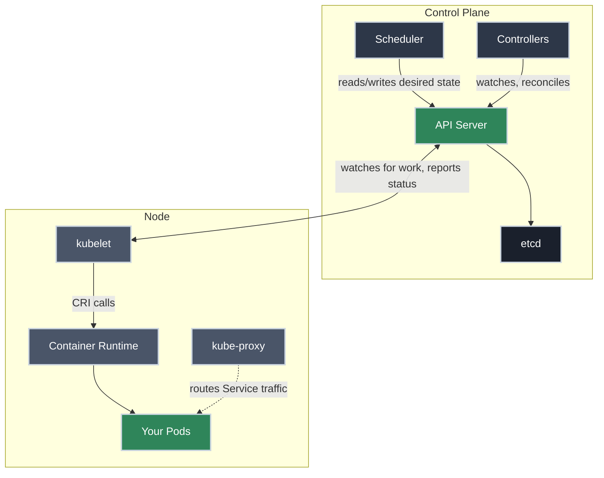

# How a Kubernetes Cluster Is Built

!!! tip "Part of Essentials"
    This is the foundation the rest of Essentials leans on. Before you dig into [Pods](pods.md) and [Services](services.md), it helps to know *what* you're actually talking to when you run `kubectl apply` — what decides where your Pod runs, and what runs it.

You've been reading "Kubernetes does X" and "the cluster reconciles your manifest." This article puts names to that machinery: just enough to make the rest of Essentials precise. The full depth (etcd internals, highly-available control planes, cluster networking) lives in the Mastery tier; here we want a working mental model, not an operator's manual.

!!! info "What You'll Learn"
    By the end of this article, you'll understand:

    - **The two halves of a cluster** — the control plane that decides, the nodes that run
    - **What each control plane component does** — API server, scheduler, controllers, `etcd`
    - **What each node component does** — `kubelet`, `kube-proxy`, and the container runtime
    - **Why the runtime is swappable** — the one-sentence version of the CRI, with the full story a link away
    - **The reconcile loop** — the idea that makes `kubectl apply` idempotent and self-healing

---

---

## Two Halves: the Brain and the Muscle

A cluster is two kinds of machine working together:

- **The control plane** — the brain. It makes the decisions: what should run, where, and whether reality matches what you asked for. You talk to it; you don't run your own workloads on it.
- **The nodes** — the muscle. These are the machines that actually run your Pods.

Everything below is that split, named component by component.

## The Control Plane: What Decides

**API server (`kube-apiserver`)** is the only door in. Every `kubectl` command, every controller, every `kubelet` on every node — all of them talk to the cluster exclusively through the API server. It validates requests and is the single source that reads and writes cluster state.

**Scheduler (`kube-scheduler`)** watches for Pods that exist but haven't been assigned a node, and picks one, weighing available CPU/memory, node taints, and affinity rules. Once it decides, its job is done; it doesn't run anything itself.

**Controllers (`kube-controller-manager`)** are the reconcile loops: a Deployment controller keeping the right number of Pods alive, a Node controller noticing when a node stops responding, and dozens more, each watching one slice of state and nudging it toward what you asked for.

**`etcd`** is where the desired state actually lives: a consistent key-value store that only the API server talks to directly. If `etcd` is gone, the cluster has no memory of what it's supposed to be running.

None of these four run your Pods. That happens one layer down.

## The Nodes: What Runs Your Pods

**`kubelet`** is the agent running on every node. It watches the API server for Pods assigned to its node, and its entire job is making reality match that assignment: start the containers that should be running, kill the ones that shouldn't, and report status back up.

**`kube-proxy`** programs the node's networking so that traffic sent to a Service's virtual IP actually reaches a Pod. You've already seen the mechanics of this in [Services](services.md) — `kube-proxy` is the "actually doing the work" layer described there, so we won't repeat it here.

**Container runtime** is the piece that actually starts and stops [containers](https://containers.bradpenney.io/day_one/what_is_a_container/) on the node. `kubelet` doesn't do this itself; it hands off the work.

!!! info "Why the runtime is a separate, swappable piece"
    `kubelet` doesn't talk to Docker or `containerd` by calling their APIs directly. It talks through a standard interface called the **CRI** (Container Runtime Interface) — which is *why* a cluster can run `containerd` on one distribution and `CRI-O` on another, with `kubelet` none the wiser about which one it's talking to. That interface, the history behind it, and how a Pod's start request actually flows from `kubelet` down to a running process is its own topic — covered in [Efficiency: The CRI](../efficiency/container_runtime.md) once you're ready to go a level deeper.

## The Reconcile Loop: Desired vs. Actual

This is the single idea that makes the rest of Kubernetes predictable: **you declare desired state, and controllers continuously compare it to actual state and act to close the gap.**

You already met the practical side of this in [Pods](pods.md#creating-pods): you write a manifest describing what you want, hand it to the cluster with `kubectl apply`, and Kubernetes takes it from there. The reconcile loop is *why* that works:

- Apply the same manifest a hundred times and nothing changes: the desired state was already met, so there's nothing to reconcile.
- Delete a Pod that a Deployment manages and a replacement appears within seconds: the controller noticed actual state (2 Pods) didn't match desired state (3 Pods) and closed the gap.
- A node dies and its Pods reappear elsewhere — same loop, different trigger.

Nothing in Kubernetes is a one-off action. Every change you make is a new desired state, and the reconcile loop is what makes it durable.

---

## Practice Exercises

??? question "Exercise 1: Where Does the Decision Happen?"
    You run `kubectl scale deployment web --replicas=5`. Which component decides *which nodes* the two new Pods land on?

    ??? tip "Solution"
        The **scheduler**. The API server records that 5 replicas are now desired, a controller notices 2 Pods are missing and creates them (unassigned), and the scheduler is the component that picks a node for each. `kubelet` on that node then starts the containers.

??? question "Exercise 2: Swap the Runtime"
    A cluster admin migrates a node from `containerd` to `CRI-O`. Does `kubelet`'s code need to change?

    ??? tip "Solution"
        **No.** `kubelet` talks to whatever runtime is configured through the CRI, the same standard interface either way. This is the entire point of the interface existing: the orchestration layer and the runtime layer can evolve independently.

## Quick Recap

| Component | Lives On | Job |
|---|---|---|
| **API server** | Control plane | The only door in; validates and stores every request |
| **Scheduler** | Control plane | Picks which node a new Pod runs on |
| **Controllers** | Control plane | Reconcile loops that keep actual state matching desired state |
| **`etcd`** | Control plane | Stores the cluster's desired state |
| **`kubelet`** | Node | Starts/stops containers to match its node's assigned Pods |
| **`kube-proxy`** | Node | Programs Service routing on the node |
| **Container runtime** | Node | Actually runs the containers, via the CRI |

## What's Next?

You now have names for the machinery behind "Kubernetes does X." Time to put it to use with the object everything else is built on.

**Next:** **[Pods Deep Dive](pods.md)** — what a Pod actually is, why Kubernetes schedules Pods instead of containers, and the lifecycle you'll be debugging daily.

---

## Further Reading

### Official Documentation

- [Kubernetes Components](https://kubernetes.io/docs/concepts/overview/components/) - The official component reference
- [kube-scheduler](https://kubernetes.io/docs/concepts/scheduling-eviction/kube-scheduler/) - How scheduling decisions are made

### Related Learning

- [What Is a Container, Really?](https://containers.bradpenney.io/day_one/what_is_a_container/) - What the container runtime on each node is actually running

### Related Articles

- [Efficiency: The CRI — How kubelet Talks to Container Runtimes](../efficiency/container_runtime.md) - The full story of the interface between kubelet and the runtime
- [Pods Deep Dive](pods.md) - The object the control plane and nodes exist to run
- [Services: Stable Networking for Pods](services.md) - What `kube-proxy` is actually programming
