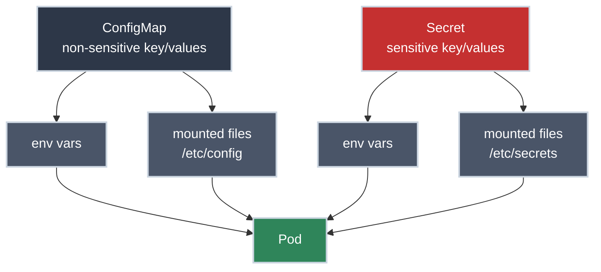

# ConfigMaps and Secrets: Configuration as a First-Class Object

!!! tip "Part of Essentials: Core Primitives"
    This article is part of [Essentials: Core Primitives](overview.md). It assumes you're comfortable with [Pods](pods.md) and [Services](services.md).

A container image should be **environment-agnostic**. The same `myapp:v1.4.2` artifact that runs in dev should run in staging and production unchanged: same bytes, same SHA. The only thing that differs is configuration: the database URL, the log level, the feature flags, the API credentials.

Bake any of that into the image and you've broken the contract. Now "promote to prod" means "rebuild," every environment is a different artifact, and a credential is sitting in an image layer that anyone with pull access can `docker history` out of.

**ConfigMaps and Secrets are how Kubernetes keeps configuration out of the image:** as cluster objects you mount or inject at runtime. ConfigMaps for non-sensitive data, Secrets for sensitive data. Understanding the difference between them, and the real (and limited) security boundary a Secret provides, is the point of this article.

!!! info "What You'll Learn"
    By the end of this article, you'll understand:

    - **Why configuration is externalized** from the image, and what that buys you operationally
    - **ConfigMaps** — defining them declaratively, and the imperative shortcut
    - **Two ways to consume config** — environment variables vs mounted files — and the tradeoffs
    - **Secrets** — what they actually are (and the hard truth that base64 is not encryption)
    - **Update propagation** — why an env-var change needs a restart but a mounted file doesn't
    - **The production security model** — controlling who can read secrets, encryption at rest, and sourcing secrets from a real secret manager

---



---

## Why Externalize Configuration?

The principle predates Kubernetes: it's [config factor III of the Twelve-Factor App](https://12factor.net/config), keep config in the environment, not the code. Kubernetes just gives you typed objects to do it with.

The payoff is concrete:

| Benefit | What it gives you |
| :--- | :--- |
| **One artifact, every environment** | Promote the exact image you tested, differences live in the ConfigMap/Secret, not a rebuild. |
| **Config changes without a code redeploy** | Update the object and restart the workload, no CI pipeline run. |
| **Separation of duties** | The config repo and the secret manager can be owned by different people than the application code. On a GitOps-managed cluster this matters a lot: app config is one concern, credentials are another. |
| **Auditability** | Configuration is a versioned object, not a value buried in an image layer. |

ConfigMaps and Secrets are nearly identical mechanically. The split exists so that the *sensitive* values can be treated differently: restricted by access controls (who's allowed to read them), encrypted at rest, kept out of Git, sourced from a real secret manager. Use the right one for the data; don't put a password in a ConfigMap because it was convenient.

---

## ConfigMaps: Non-Sensitive Configuration

A ConfigMap is a map of string key/values that lives in your namespace. Think of it as the cluster-native replacement for a `.env` file or a `config.yaml` you'd otherwise bake into the image.

### Define It Declaratively (the default)

Config that isn't sensitive belongs in version control next to your other manifests, so the YAML form is the one you'll actually live with:

``` yaml title="app-config.yaml" linenums="1"
apiVersion: v1
kind: ConfigMap
metadata:
  name: app-config
data:  # (1)!
  LOG_LEVEL: "info"
  FEATURE_NEW_CHECKOUT: "true"  # (2)!
  CACHE_URL: "redis://redis-svc:6379"
  app.properties: |  # (3)!
    server.port=8080
    server.timeout=30s
```

1. Each value is stored as a string — note `"true"` and `"8080"` are quoted; ConfigMap values are always strings, never typed.
2. Feature flags are the textbook ConfigMap use case — flip behaviour without a rebuild.
3. A value can be a whole file. The `|` block scalar preserves newlines, so `app.properties` mounts as a real multi-line file.

Unlike Deployments or Services, a ConfigMap has no `spec`: `data` sits directly on the object. That's visible in the real struct: [`ConfigMap`, core/v1/types.go](https://github.com/kubernetes/api/blob/v0.36.2/core/v1/types.go#L8077-L8109) in the Kubernetes API source.

``` bash title="Apply it (⚠️ creates/updates a resource)"
kubectl apply -f app-config.yaml
# configmap/app-config created
```

!!! tip "The imperative shortcut — for scratch work only"
    `kubectl create configmap app-config --from-literal=LOG_LEVEL=info --from-file=app.properties` builds a ConfigMap without writing YAML. It's handy at a prompt, but it produces an object with no manifest in Git — invisible to the next person and impossible to diff. Use it to experiment; commit a manifest for anything that outlives the afternoon.

---

## Consuming Config in a Pod

There are two ways to get a ConfigMap's data into a container, and the choice has real consequences, especially for updates (covered below).

=== "As environment variables"

    ``` yaml title="pod-config-env.yaml" linenums="1"
    apiVersion: v1
    kind: Pod
    metadata:
      name: myapp
    spec:
      containers:
      - name: app
        image: myapp:1.4.2
        env:
        - name: LOG_LEVEL  # (1)!
          valueFrom:
            configMapKeyRef:
              name: app-config
              key: LOG_LEVEL
        envFrom:  # (2)!
        - configMapRef:
            name: app-config
    ```

    1. Map one specific key to one env var — use this when the var name differs from the key.
    2. Inject **every** key in the ConfigMap as an env var at once. Convenient, but it pulls in keys like `app.properties` too (which becomes an awkward multi-line env var).

    **Tradeoff:** simplest for apps that already read config from the environment. But env vars are **read once at process start**: a ConfigMap change does nothing until the Pod restarts.

=== "As mounted files"

    ``` yaml title="pod-config-volume.yaml" linenums="1"
    apiVersion: v1
    kind: Pod
    metadata:
      name: myapp
    spec:
      containers:
      - name: app
        image: myapp:1.4.2
        volumeMounts:
        - name: config
          mountPath: /etc/config  # (1)!
          readOnly: true
      volumes:
      - name: config
        configMap:
          name: app-config  # (2)!
    ```

    1. Each key becomes a file under `/etc/config/` — `/etc/config/LOG_LEVEL`, `/etc/config/app.properties`, etc.
    2. The whole ConfigMap is projected as a read-only volume.

    **Tradeoff:** the kubelet **updates the files in place** when the ConfigMap changes (eventually — see below). Apps that re-read their config file, or watch it for changes, pick up new values with no restart.

---

## Secrets: Same Mechanics, Different Trust

A Secret looks almost exactly like a ConfigMap and is consumed the same two ways (env vars or mounted files). What's different is how the cluster *treats* it: Secrets can be restricted with their own access-control rules (who may read them), encrypted at rest, and are kept out of normal `get -o yaml` habits. They're also the only sane place for passwords, tokens, and TLS keys.

!!! danger "base64 is encoding, not encryption"
    This is the single most misunderstood thing about Secrets. The values are **base64-encoded**, which is trivially reversible — `base64 -d` and it's plaintext. A Secret is not "encrypted" just because it's a Secret. Anyone who can read the Secret object (via the API or etcd) can read its contents. The real protections are *external* to the object: access controls limiting who can read it, and encryption-at-rest in the cluster's datastore. Internalize this now and you won't make the career-limiting mistake of treating a base64 string as safe.

### Creating Secrets

Secrets invert the declarative-first rule for one reason: **you must not commit plaintext or base64 Secret values to Git.** Base64 isn't encryption, so a committed Secret manifest is a leaked credential the moment the repo is cloned.

=== "Imperative (dev/test)"

    ``` bash title="Create a Secret without writing it to a file (⚠️ creates a resource)"
    kubectl create secret generic db-credentials \
      --from-literal=username=appuser \
      --from-literal=password='s3cr3t-do-not-commit'
    ```

    Nothing sensitive lands on disk or in Git. This is the right move for a dev cluster.

=== "Declarative with stringData"

    ``` yaml title="secret.yaml — DO NOT commit with real values" linenums="1"
    apiVersion: v1
    kind: Secret
    metadata:
      name: db-credentials
    type: Opaque  # (1)!
    stringData:  # (2)!
      username: appuser
      password: s3cr3t-do-not-commit
    ```

    1. `Opaque` is the generic type — arbitrary key/values. Specialized types exist (see the table below).
    2. `stringData` takes plaintext and Kubernetes base64-encodes it for you — far less error-prone than hand-encoding into a `data:` block. Useful for templating tools, but the rendered file still holds the secret, so it must never be committed.

    Same shape as ConfigMap — `type`, `data`, and `stringData` all sit directly on the object, no `spec`: [`Secret`, core/v1/types.go](https://github.com/kubernetes/api/blob/v0.36.2/core/v1/types.go#L7933-L7968) in the Kubernetes API source. The doc comment right above it is a genuinely useful read: it's what states the byte-size limit on `Data` in the first place.

=== "Production (External Secrets)"

    In production you don't manage Secret YAML by hand at all. A controller like the [External Secrets Operator](https://external-secrets.io/) pulls values from a real secret manager (HashiCorp Vault, AWS Secrets Manager, GCP Secret Manager) and *materializes* the Kubernetes Secret for you. The source of truth is the vault; Git holds only a non-sensitive `ExternalSecret` reference. This is the pattern to reach for once you're past a dev cluster. It's covered properly in the Mastery tier.

### Consuming Secrets — prefer files over env vars

Same two mechanisms as a ConfigMap, but the stakes are higher: which one you pick determines whether a credential ends up somewhere it can leak.

``` yaml title="pod-secret-volume.yaml" linenums="1"
apiVersion: v1
kind: Pod
metadata:
  name: myapp
spec:
  containers:
  - name: app
    image: myapp:1.4.2
    volumeMounts:
    - name: creds
      mountPath: /etc/secrets
      readOnly: true  # (1)!
  volumes:
  - name: creds
    secret:
      secretName: db-credentials
      defaultMode: 0400  # (2)!
```

1. Secret mounts should always be read-only.
2. `0400` = readable only by the container's user. Lock the file down.

!!! warning "Why mounted files beat env vars for secrets"
    Environment variables leak. `kubectl exec <pod> -- env` dumps them in one command, child processes inherit them, and crash/observability tooling routinely captures the full environment into logs. A mounted Secret file isn't sprayed across the process tree and can be permission-restricted. When you have the choice, mount secrets as files. Reserve secret env vars for apps that genuinely can't read from a path.

---

## Secret Types

`Opaque` covers most cases, but Kubernetes defines typed Secrets that other components know how to consume:

| Type | Use Case | Key Fields |
|------|----------|-----------|
| `Opaque` | Generic credentials, tokens | arbitrary keys |
| `kubernetes.io/tls` | TLS cert + key (e.g. for Ingress) | `tls.crt`, `tls.key` |
| `kubernetes.io/dockerconfigjson` | Pull from a private registry | `.dockerconfigjson` |
| `kubernetes.io/basic-auth` | Basic-auth credentials | `username`, `password` |
| `kubernetes.io/ssh-auth` | SSH private key | `ssh-privatekey` |
| `kubernetes.io/service-account-token` | Service-account token | managed by the API server |

The registry-pull case comes up constantly: a Pod referencing a private image needs an `imagePullSecrets` entry pointing at a `dockerconfigjson` Secret, or it sits in `ImagePullBackOff`:

``` yaml title="private-image-pull.yaml" linenums="1"
spec:
  imagePullSecrets:
  - name: my-registry  # (1)!
  containers:
  - name: app
    image: registry.example.com/myapp:1.4.2
```

1. Create this Secret with `kubectl create secret docker-registry my-registry --docker-server=... --docker-username=... --docker-password=...`.

---

## Update Propagation: the Gotcha That Bites Everyone

Change a ConfigMap or Secret and the behaviour depends entirely on *how it's consumed* — this is the detail that turns into a 2 a.m. "but I updated the config" incident:

| Consumed as | What happens on update |
|-------------|------------------------|
| **Environment variable** | **Nothing.** Env vars are set at process start. The running Pod keeps the old value until it's recreated. |
| **Mounted file** | The kubelet refreshes the file automatically, typically within a minute (it's eventually consistent, not instant). The app sees the new value *if it re-reads the file*. |

Because env-var config can't be hot-reloaded, the standard way to roll out a config change to running Pods is to trigger a fresh rollout, which the workload controller does declaratively:

``` bash title="Roll the workload to pick up new config (⚠️ restarts Pods)"
kubectl rollout restart deployment/myapp
```

This recreates the Pods (respecting the Deployment's rollout strategy, so it's zero-downtime), and the new Pods read the current ConfigMap/Secret. It does **not** mutate any resource by hand — it just asks the controller to reconcile a new generation.

!!! tip "Make config changes trigger rollouts automatically"
    A common production pattern is to hash the ConfigMap/Secret contents into a Pod-template annotation (Helm and Kustomize both have built-ins for this). When the config changes, the hash changes, the Pod template changes, and the Deployment rolls automatically — no one has to remember to run `rollout restart`. Worth knowing exists; you'll meet it again in Efficiency/Mastery.

---

## Common Pitfalls

The three symptoms that trace straight back to something covered above:

??? warning "ConfigMap or Secret not found — Pod stuck in `CreateContainerConfigError`"
    The Pod references a ConfigMap/Secret that doesn't exist in **its namespace**. These objects are namespace-scoped (see [Namespaces](namespaces.md)) and there is no cross-namespace reference — a Pod in `dev` cannot mount a Secret from `staging`.

    ```bash title="Diagnose"
    kubectl describe pod <pod-name>
    # Events: ... configmap "app-config" not found
    ```

??? warning "Updated the ConfigMap, app still uses the old value"
    You're consuming it as an **environment variable**. Env vars don't hot-reload. Either switch to a mounted file (if the app re-reads it) or `kubectl rollout restart` the workload.

??? warning "Treated a Secret as if it were encrypted"
    It isn't. If a base64 value ended up somewhere it shouldn't (a committed manifest, a Slack paste, a log line), treat it as **compromised and rotate it**. Decoding it back is one command.

---

## Practice Exercises

??? question "Exercise 1: One config, two consumption styles"
    Create a ConfigMap `app-config` with `LOG_LEVEL=debug` and `app.properties` containing `server.port=8080`. Mount it into a Pod **as files**, then verify the app would see them.

    ??? tip "Solution"
        ``` yaml title="app-config.yaml"
        apiVersion: v1
        kind: ConfigMap
        metadata:
          name: app-config
        data:
          LOG_LEVEL: "debug"
          app.properties: |
            server.port=8080
        ```

        ``` yaml title="pod.yaml"
        apiVersion: v1
        kind: Pod
        metadata:
          name: cfg-demo
        spec:
          containers:
          - name: app
            image: busybox:1.35
            command: ['sh', '-c', 'cat /etc/config/LOG_LEVEL; cat /etc/config/app.properties; sleep 3600']
            volumeMounts:
            - name: config
              mountPath: /etc/config
              readOnly: true
          volumes:
          - name: config
            configMap:
              name: app-config
        ```

        ``` bash
        kubectl apply -f app-config.yaml
        kubectl apply -f pod.yaml
        kubectl logs cfg-demo
        # debug
        # server.port=8080
        ```

        **Why files here:** mounting as a volume means a later `kubectl apply` of an edited ConfigMap propagates to the file automatically — no Pod restart needed if the app re-reads it.

??? question "Exercise 2: Prove that base64 isn't security"
    Create a Secret with `kubectl create secret generic demo --from-literal=token=hunter2`, then recover the plaintext using only `kubectl`.

    ??? tip "Solution"
        ``` bash
        kubectl create secret generic demo --from-literal=token=hunter2

        kubectl get secret demo -o jsonpath='{.data.token}' | base64 -d
        # hunter2
        ```

        Anyone with `get secret` permission in the namespace can do this. The protection isn't the encoding — it's the access-control rule that decides who can run that `get`. That's the whole point of keeping secrets in `Secret` objects (restrictable, encryptable at rest) rather than ConfigMaps.

---

## Quick Recap

| Concept | What to Know |
|---------|-------------|
| **ConfigMap** | Non-sensitive string key/values; manage declaratively in Git |
| **Secret** | Sensitive data; **base64-encoded, not encrypted**; keep out of Git |
| **env vars** | Simple; set once at startup; **no hot-reload**; leak easily |
| **Mounted files** | Auto-refresh (eventually); permission-controllable; preferred for secrets |
| **Update propagation** | env = restart required; file = automatic within ~1 min |
| **`rollout restart`** | Declarative way to push config to running Pods |
| **Real secret security** | Access controls + encryption at rest + a real secret manager — not the object itself |

## What's Next?

You can keep configuration out of your images and reason honestly about what a Secret does and doesn't protect. Next: the boundary that scopes all of these objects, and the multi-tenancy controls built on it.

**Next:** [Namespaces](namespaces.md) — isolation boundaries, resource quotas, and the soft-vs-hard reality of separating teams on one cluster.

---

## Further Reading

### Official Documentation

- [ConfigMaps](https://kubernetes.io/docs/concepts/configuration/configmap/) - Concept and API reference
- [Secrets](https://kubernetes.io/docs/concepts/configuration/secret/) - Including built-in types
- [Secrets Good Practices](https://kubernetes.io/docs/concepts/security/secrets-good-practices/) - The official hardening guidance
- [Encrypting Secret Data at Rest](https://kubernetes.io/docs/tasks/administer-cluster/encrypt-data/) - Making etcd storage actually encrypted

### Deep Dives

- [The Twelve-Factor App: Config](https://12factor.net/config) - The principle this all implements
- [External Secrets Operator](https://external-secrets.io/) - Sourcing Secrets from Vault / cloud secret managers

### Related Articles

- [Pods: What Actually Runs Your Application](pods.md) - Where these objects get mounted
- [Namespaces](namespaces.md) - ConfigMaps and Secrets are namespace-scoped
- [Labels and Selectors](labels_selectors.md) - Organizing and querying these objects

