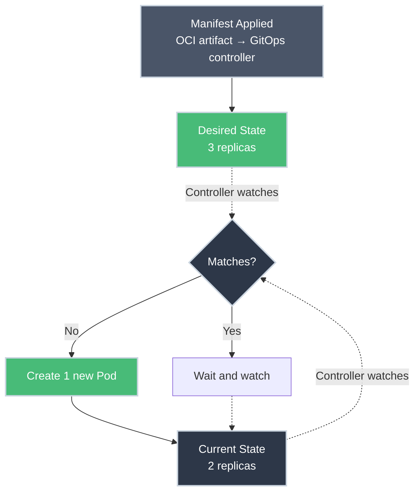
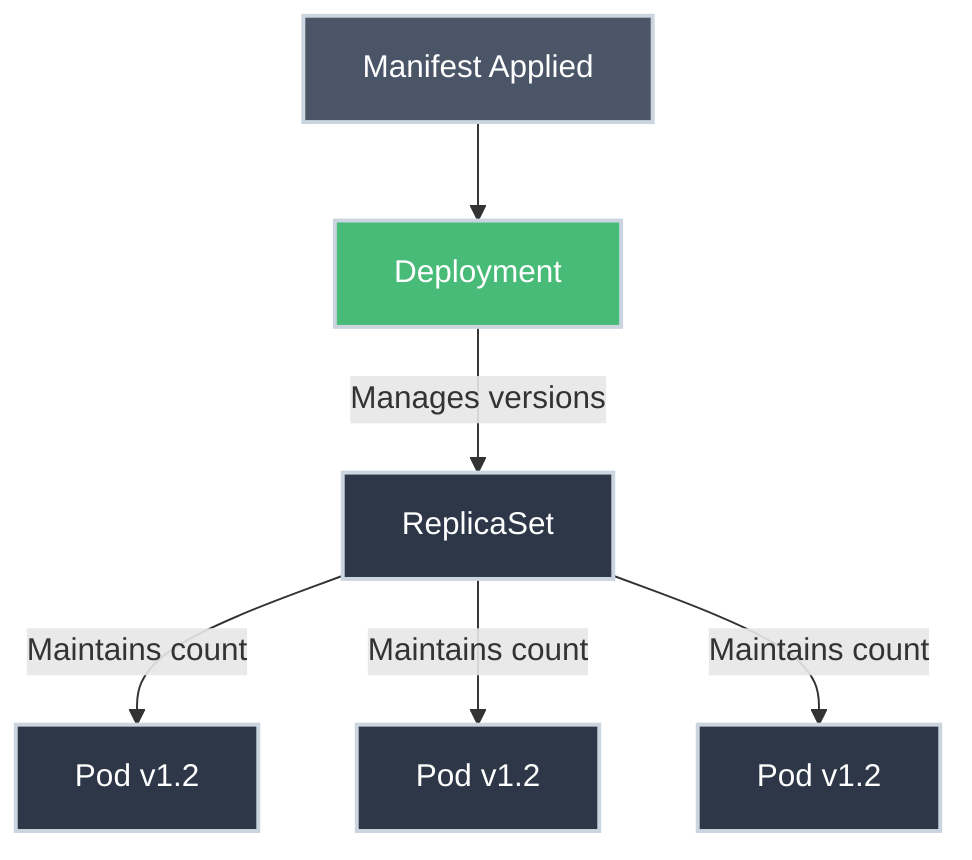

# Deployments: Scaling and Self-Healing

!!! tip "Part of Essentials: Workloads"
    This article is part of [Essentials](overview.md) — read [Pods: The Atomic Unit](pods.md) and [Services](services.md) first. Deployments are what you'll actually create; Pods and Services are what they're built from.

If Pods are the building blocks of Kubernetes, **Deployments** are the architects. In production, you almost never create a Pod directly — you create a Deployment, and the Deployment creates the Pods for you.

That distinction matters beyond convenience. A Deployment is what makes your app survive a node dying at 3am without anyone getting paged, and what lets you ship a new image without a maintenance window. Every other team calling your Service is depending on that.

---

## The Controller Loop: The Secret Sauce

Kubernetes works on a desired-state model.

1. You say: *"I want 3 copies of my web app running."* (**desired state**)
2. The Deployment controller looks at the cluster and sees 0 copies. (**current state**)
3. The controller creates 3 Pods. (**action**)

This loop runs forever. If a node dies and takes a Pod with it, the controller notices the count dropped to 2 and starts a replacement on a healthy node — no human involved. This is **self-healing**, and it's the whole reason naked Pods aren't a production pattern: nothing is watching them.



!!! warning "In practice: GitOps applies this, and manual changes don't stick"
    Every example on this page uses `kubectl apply -f` directly, because that's the fastest way to *learn* what a Deployment does. In a real production setup, the applying is rarely a person typing that command — it's a controller like Flux reconciling on a loop, without anyone triggering it by hand. What Flux watches at runtime isn't Git directly, either: a live runtime dependency on GitHub (or any Git host) being reachable is an anti-pattern this site doesn't teach. Config gets *authored* in Git, then packaged and pushed to an OCI registry as an artifact — that artifact, not the Git repo, is what the cluster actually polls. Same controller loop shown above; the only thing that changes is who (or what) puts the manifest in front of the API server.

    The consequence: if a resource is under Flux's control, editing it directly (`kubectl edit`, `kubectl scale`, `kubectl set image`, any of it) only lasts until the next reconcile. Flux compares live state back to the artifact on its own schedule and overwrites the drift, silently, whether or not the change was intentional. "It reverted my fix" is expected behavior here, not a bug.

    For a genuine emergency where a manual change needs to survive — a live incident, a debugging session — suspend reconciliation on that resource first:

    ```bash
    flux suspend kustomization <name>
    # make your manual change — it'll actually stick now
    flux resume kustomization <name>
    # Flux immediately reconciles again, so land the real fix in Git/the
    # artifact BEFORE resuming, or your manual change disappears anyway
    ```

    A suspended Kustomization stops drift-correcting in both directions — Flux won't fix it, but it also won't notice if something *else* changes underneath you. Treat suspension as a narrow, deliberately temporary window, and resume it the moment the incident's over. If this workflow is new to you, [Your Flux Workflow](https://gitops.bradpenney.io/day_one/your_flux_workflow/) on [Exploring GitOps](https://gitops.bradpenney.io) walks through it.

---

## Deployments, ReplicaSets, and Pods

A Deployment doesn't manage Pods directly: it manages a **ReplicaSet**, which manages the Pods.

- The **ReplicaSet's** only job is keeping the right number of Pods running.
- The **Deployment's** job is managing *which version* of those Pods should exist.



**Why the extra layer?** When you update your app's version, the Deployment creates a *new* ReplicaSet for the new version while scaling the old one down. Two ReplicaSets existing side by side, briefly, is what makes rolling updates and instant rollbacks possible — see [ReplicaSets Under the Hood](replicasets.md) for exactly how that handoff works.

---

## Creating a Deployment

The mechanics above apply to any Deployment; here's the smallest one worth actually running:

``` yaml title="nginx-deployment.yaml" linenums="1"
apiVersion: apps/v1  # (1)!
kind: Deployment
metadata:
  name: nginx-deployment
  labels:
    app: nginx
spec:
  replicas: 3  # (2)!
  selector:
    matchLabels:
      app: nginx  # (3)!
  template:  # (4)!
    metadata:
      labels:
        app: nginx  # (5)!
    spec:
      containers:
      - name: nginx
        image: nginx:1.21  # (6)!
        ports:
        - containerPort: 80
```

1. API group for workload controllers (Deployments, ReplicaSets, StatefulSets).
2. Desired number of Pod replicas.
3. Selector matches Pods carrying this label — same mechanism [Services](services.md) use, and the same [Labels and Selectors](labels_selectors.md) query layer underneath both.
4. The Pod template: everything below `template` is what gets stamped out.
5. Pod labels must match the selector above, or the ReplicaSet can't find what it created.
6. Container image — this is what changes on a rolling update.

`replicas`, `selector`, `template`, and the rolling-update controls further down are all fields on one real Go struct: [`DeploymentSpec`, apps/v1/types.go](https://github.com/kubernetes/api/blob/v0.36.2/apps/v1/types.go#L378-L421) in the Kubernetes API source.

```bash title="Apply and verify"
kubectl apply -f nginx-deployment.yaml
# deployment.apps/nginx-deployment created

kubectl get deployments
# NAME               READY   UP-TO-DATE   AVAILABLE   AGE
# nginx-deployment   3/3     3            3           10s

kubectl get pods
# NAME                                READY   STATUS    RESTARTS   AGE
# nginx-deployment-7c5ddbdf54-2xkqn   1/1     Running   0          15s
# nginx-deployment-7c5ddbdf54-8mz4p   1/1     Running   0          15s
# nginx-deployment-7c5ddbdf54-x7fnw   1/1     Running   0          15s
```

A real production Deployment also declares `resources` (so the scheduler and the kernel know what to enforce) and probes (so Kubernetes knows when a Pod is actually ready for traffic) inside that same container block — both are their own articles: [Resource Requests and Limits](resource_requests_limits.md) and [Health Checks and Probes](probes.md).

---

## Rolling Updates: Zero Downtime

When you move from `nginx:1.21` to `nginx:1.22`, you don't delete everything and start over. A Deployment performs a **rolling update**: create one new Pod, wait for it to pass its readiness check, retire one old Pod, and repeat until only the new version remains. Nobody watching your Service sees a gap.

**The production path is declarative** — edit the manifest, re-apply. It's in Git, reviewable, and revertible:

``` yaml title="nginx-deployment.yaml (updated)"
spec:
  containers:
  - name: nginx
    image: nginx:1.22  # changed from 1.21
```

```bash title="Apply the change and watch it roll out"
kubectl apply -f nginx-deployment.yaml
# deployment.apps/nginx-deployment configured

kubectl rollout status deployment/nginx-deployment
# Waiting for deployment "nginx-deployment" rollout to finish: 1 out of 3 new replicas have been updated...
# Waiting for deployment "nginx-deployment" rollout to finish: 2 out of 3 new replicas have been updated...
# deployment "nginx-deployment" successfully rolled out
```

⚠️ **Caution (Modifies Resources) — dev-shortcut, not the production path:**

```bash
kubectl set image deployment/nginx-deployment nginx=nginx:1.22
```

This does the same thing imperatively. Useful for a quick test against a dev cluster, but it changes nothing in Git. If someone re-applies the old manifest later, your change silently disappears. Treat it the way you'd treat editing a file directly on a server.

### Controlling Rollout Speed

The default pace is a reasonable guess, not a law — two fields let you trade speed for safety in either direction:

``` yaml title="deployment-with-strategy.yaml" linenums="1"
apiVersion: apps/v1
kind: Deployment
metadata:
  name: web-app
spec:
  replicas: 10
  strategy:
    type: RollingUpdate  # (1)!
    rollingUpdate:
      maxSurge: 2  # (2)!
      maxUnavailable: 1  # (3)!
  selector:
    matchLabels:
      app: web
  template:
    metadata:
      labels:
        app: web
    spec:
      containers:
      - name: web
        image: myapp:v2
```

1. `RollingUpdate` is the default; `Recreate` (kill everything, then start the new version) exists but reintroduces the downtime you're trying to avoid.
2. Extra Pods allowed above `replicas` during the rollout.
3. Pods allowed to be unavailable during the rollout.

**Why a platform engineer tunes these:** `maxSurge` costs capacity: 2 extra Pods means 2 extra Pods' worth of CPU and memory the scheduler needs to find *right now*, on a cluster other teams are also scheduling onto. `maxUnavailable` costs availability: during the window, fewer replicas are serving traffic. Defaults (25%/25%) are a reasonable starting point; tighten `maxUnavailable` toward 0 for anything user-facing.

### Rollback: The Panic Button

A Deployment keeps a history of prior ReplicaSets, so a bad rollout is one command away from undone:

```bash title="Rollback Deployment"
kubectl rollout history deployment/nginx-deployment
# REVISION  CHANGE-CAUSE
# 1         <none>
# 2         <none>
# 3         kubectl set image deployment/nginx-deployment nginx=nginx:1.22

kubectl rollout undo deployment/nginx-deployment
# deployment.apps/nginx-deployment rolled back

kubectl rollout undo deployment/nginx-deployment --to-revision=1
```

Unlike routine updates, `rollout undo` **is** the normal production tool for this — you're not editing state, you're asking the controller to reuse a ReplicaSet it already has. There's no faster way back to known-good.

---

## Scaling Deployments

**Production path:** change `replicas` in the manifest, re-apply. Same declarative discipline as the image update above.

⚠️ **Dev-shortcut:**

```bash
kubectl scale deployment/nginx-deployment --replicas=5
```

Fine for "I need more capacity for this load test right now." For anything that should persist past the next `kubectl apply`, put the number in the YAML.

**Autoscaling:** Kubernetes can adjust replica count automatically based on CPU usage via a HorizontalPodAutoscaler:

```bash title="Create a HorizontalPodAutoscaler"
kubectl autoscale deployment nginx-deployment --min=2 --max=10 --cpu-percent=80
# horizontalpodautoscaler.autoscaling/nginx-deployment autoscaled
```

An HPA reads the CPU `resources.requests` you've set on the container — another reason [Resource Requests and Limits](resource_requests_limits.md) isn't optional once you're running real traffic. Autoscaling policy tuning beyond this is a platform-engineering-scale topic and out of scope here.

---

## Working with Deployments

Everything above was one command at a time, in context. Here's the same set gathered as a reference, grouped by how much damage each one can do:

``` bash title="Deployment Operations"
# Read-only
kubectl get deployments
kubectl get deploy                          # short form
kubectl describe deployment nginx-deployment
kubectl get replicasets                     # see the ReplicaSets underneath
kubectl rollout status deployment/nginx-deployment

# ⚠️ Modifies resources
kubectl rollout pause deployment/nginx-deployment
kubectl rollout resume deployment/nginx-deployment
kubectl rollout restart deployment/nginx-deployment   # recreate all Pods

# 🚨 Destructive
kubectl delete deployment nginx-deployment
```

!!! warning "Blast Radius: Deleting a Deployment"
    Deleting a Deployment deletes its ReplicaSets and every Pod they own. If a Service was routing to those Pods, it now has zero healthy endpoints — anyone calling it gets connection failures, not a graceful error. Confirm you're deleting the right one before you run it.

---

## Practice Exercises

??? question "Exercise 1: Manual Deletion"
    You have a Deployment managing 3 Pods. You manually delete one Pod with `kubectl delete pod <pod-name>`. What happens 5 seconds later?

    ??? tip "Solution"
        **A new Pod is born.**

        The ReplicaSet controller notices current state (2 Pods) doesn't match desired state (3 Pods) and immediately creates a replacement. This is the same mechanism that recovers from a node failure — self-healing doesn't distinguish "you deleted it" from "hardware killed it."

??? question "Exercise 2: Updating Images"
    You update the image from `nginx:1.21` to `nginx:1.22` on a Deployment with 10 replicas and apply it. Does Kubernetes kill all 10 Pods at once?

    ??? tip "Solution"
        **No.** Default rolling-update settings are `maxUnavailable: 25%` and `maxSurge: 25%`: for 10 replicas, roughly 2-3 Pods down and up to 12-13 total Pods at any moment during the rollout. The service stays up throughout; you can tune both values if that pace doesn't suit a particular workload.

??? question "Exercise 3: Rollback Scenario"
    You deployed v2.0 and it's crashing in production. What's the fastest way back to the working v1.0?

    ??? tip "Solution"
        ```bash
        kubectl rollout undo deployment/my-app
        ```

        This immediately starts rolling back to the previous revision using the ReplicaSet Kubernetes already kept around — no rebuild, no re-apply of old YAML, no waiting on CI.

---

## Quick Recap

| Object | Purpose |
| :--- | :--- |
| **Pod** | Atomic unit of execution |
| **ReplicaSet** | Ensures the correct number of Pods exist |
| **Deployment** | Manages versions, rollouts, and rollbacks |
| **Rolling Update** | Zero-downtime replacement, old version → new |
| **Rollback** | Instant recovery via a kept prior ReplicaSet |
| **Self-Healing** | Automatic Pod replacement on failure |

## What's Next?

You understand how Deployments turn "3 replicas, please" into a self-repairing, updatable application. Two things every real Deployment also needs: **[Resource Requests and Limits](resource_requests_limits.md)** (so the scheduler and the node behave the way you expect under load) and **[Health Checks and Probes](probes.md)** (so Kubernetes actually knows when a Pod is ready for traffic). Then **[ReplicaSets Under the Hood](replicasets.md)** for exactly how the layer underneath this one works.

---

## Further Reading

### Official Documentation

- [Kubernetes Docs: Deployments](https://kubernetes.io/docs/concepts/workloads/controllers/deployment/) - Complete deployment reference
- [Deployment Strategies](https://kubernetes.io/docs/concepts/workloads/controllers/deployment/#strategy) - RollingUpdate vs Recreate

### Deep Dives

- [Performing a Rolling Update](https://kubernetes.io/docs/tutorials/kubernetes-basics/update/update-intro/) - Tutorial walkthrough

### Related Articles

- [Pods: The Atomic Unit](pods.md) - What Deployments manage
- [ReplicaSets Under the Hood](replicasets.md) - How Deployments work internally
- [Resource Requests and Limits](resource_requests_limits.md) - What to set inside the container block
- [Health Checks and Probes](probes.md) - How Kubernetes knows a Pod is ready
