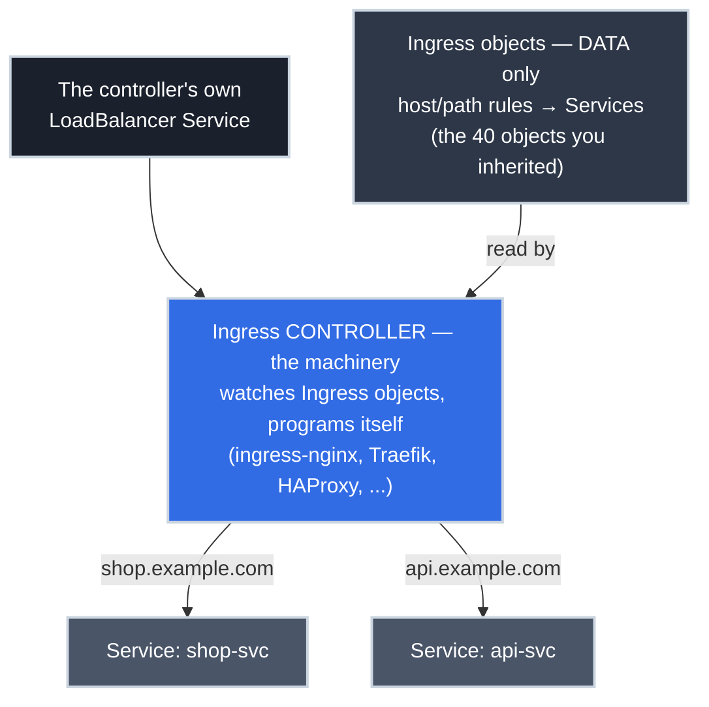

# Kubernetes Ingress: Reading the Front Door You Inherit

!!! tip "Part of a Learning Path"
    This article is a step in the [Put Your Kubernetes App on the Internet](https://bradpenney.io/pathways/cluster-to-internet) pathway on [bradpenney.io](https://bradpenney.io). It reads best after [Gateway API with Traefik](../efficiency/networking/gateway_api.md) — the standard that replaced what this article covers.

New exposure work belongs on [Gateway API](../efficiency/networking/gateway_api.md). Then you open the cluster you actually inherited: `kubectl get ingress -A` returns forty objects, every one of them serving production traffic right now, and none of them going anywhere this quarter. **Ingress** ran the front door of essentially every Kubernetes cluster built between 2016 and the mid-2020s — so reading it fluently isn't studying history; it's a skill you'll need in the first week of operating any cluster that predates you.

There's a clock on this knowledge being passive, too: the most widely deployed controller behind those objects, **ingress-nginx, was retired in March 2026**: no more releases, no more security fixes. If that's what's in your inherited cluster, you're not just reading legacy config; you're planning a migration. This article covers both: the resource as you'll find it, and the way off.

And one idea organizes all of it: **an Ingress is just data — every hard question it raises is answered by its *controller*, not by Kubernetes.** What does this path match? Ask the controller. What does that annotation do? Ask the controller. Why doesn't it route at all — and is it safe to keep running? Controller, and controller. Keep asking "*which controller reads this?*" and the whole estate becomes legible.

!!! info "What You'll Learn"
    By the end of this article, you'll understand:

    - **What an Ingress declares** — host and path rules mapping to Services, plus TLS
    - **Why an Ingress alone does nothing** — controllers, `ingressClassName`, and the legacy annotation
    - **The `pathType` subtleties** that decide whether `/app` matches `/application`
    - **How to read annotation soup** — and why it's controller-specific by design failure
    - **The ingress-nginx retirement** — what it means and your two migration paths

---



---

## Anatomy of the Ingress You'll Actually Find

Here's a representative specimen: not a tidy tutorial example, but the shape that turns up in real namespaces, annotations and all.

```yaml title="What kubectl get ingress shop -o yaml shows you" linenums="1"
apiVersion: networking.k8s.io/v1
kind: Ingress
metadata:
  name: shop
  namespace: team-shop
  annotations:
    nginx.ingress.kubernetes.io/ssl-redirect: "true"  # (1)!
    nginx.ingress.kubernetes.io/proxy-body-size: "10m"
spec:
  ingressClassName: nginx  # (2)!
  tls:
  - hosts:
    - shop.example.com
    secretName: shop-tls  # (3)!
  rules:
  - host: shop.example.com  # (4)!
    http:
      paths:
      - path: /
        pathType: Prefix  # (5)!
        backend:
          service:
            name: shop-svc
            port:
              number: 80  # (6)!
```

1. Controller-specific behavior lives in annotations; these two only mean something to ingress-nginx. More on this below, because it's the resource's defining flaw.
2. Which controller should act on this object. `nginx` here: the retired one, which is exactly what you'll inherit most often.
3. TLS termination: the certificate is a standard `kubernetes.io/tls` Secret in this namespace, the *same* Secret shape a Gateway listener references. Certificates outlive the resource kind that mounts them.
4. Host-based routing: this rule only applies to requests whose `Host` header says `shop.example.com`. A rule with no `host` matches everything; worth noticing when auditing.
5. The match semantics (see the `pathType` section); this field causes real incidents.
6. The target is a plain ClusterIP [Service](services.md), exactly as with an HTTPRoute's `backendRef`.

Read top to bottom, an Ingress answers three questions by itself: *which hostnames* (rules + tls), *which paths* (paths + pathType), *which Service* (backend). Everything else (redirects, body limits, timeouts, auth) hides in the annotations. And that split is the article's organizing idea in miniature: three questions the data answers, and a fourth the data can't — *what machinery acts on it?*

## Data, Not Machinery

The single most important fact about Ingress — and the source of the classic "I created it and nothing happened": **an Ingress object does nothing by itself.** It's a row of routing data waiting for an **Ingress controller** to read it and program itself accordingly. No controller installed, or the wrong `ingressClassName`, and the object sits there `ACCEPTED`-looking and completely inert. Kubernetes has *never* shipped a controller by default.

Which controller acts on which object is matched through `ingressClassName`, pointing at a cluster-scoped `IngressClass` object — and in older manifests you'll instead find the deprecated annotation `kubernetes.io/ingress.class: "nginx"`, which predates the field and still works in most controllers. Both may coexist in an inherited estate; when routing "randomly" works for some apps and not others, class mismatch is the first thing to check:

```bash title="Match objects to machinery"
kubectl get ingressclass  # (1)!
# NAME      CONTROLLER                     AGE
# nginx     k8s.io/ingress-nginx           4y
# traefik   traefik.io/ingress-controller  90d

kubectl get ingress -A -o custom-columns=NS:.metadata.namespace,NAME:.metadata.name,CLASS:.spec.ingressClassName  # (2)!
```

1. What machinery exists in this cluster; and yes, multiple controllers happily coexist, each serving its own class. That `AGE` column tells a story too.
2. The audit: every Ingress and which class it claims. Objects whose class matches no installed controller are the inert ones.

If the controller layer sounds familiar, it should: a controller like Traefik sits behind [its own LoadBalancer Service](loadbalancer_services.md) and does L7 routing: architecturally it's the *same front door* as the Gateway article's, consuming a different config format. Traefik in fact consumes both at once, which is load-bearing for migration later.

## `pathType`: Three Words That Cause Incidents

Every path rule carries a `pathType`, and the differences are sharp enough to page you:

| pathType | `path: /app` matches | Doesn't match | Notes |
| :--- | :--- | :--- | :--- |
| **`Exact`** | `/app` only | `/app/`, `/app/cart` | The trailing slash is a different URL |
| **`Prefix`** | `/app`, `/app/`, `/app/cart` | `/application` | Matches by **path element**, not by string prefix |
| **`ImplementationSpecific`** | whatever the controller decides | — | Common in old manifests; behavior changes if you change controllers |

The two that bite: **`Prefix` is element-wise**: `/app` does *not* match `/application`, which surprises everyone who reads "prefix" as a string operation. And **`ImplementationSpecific` is a portability landmine**: the match semantics belong to the controller, so a migration that "just swaps the controller" can silently change which requests route where. When auditing an inherited estate for migration, `grep` for it first.

## Annotation Soup: The Flaw That Ended Ingress

The Ingress spec standardized only host/path/Service/TLS. Everything else real front doors need — redirects, rewrites, timeouts, body-size limits, rate limits, auth — was left to **controller-specific annotations**. Two consequences define the reading experience:

- **You can't read the annotations without knowing the controller.** `nginx.ingress.kubernetes.io/rewrite-target` means something to ingress-nginx and *nothing* to Traefik — which won't error, won't warn, just silently won't do it. An annotation is a string to Kubernetes; only its controller gives it meaning.
- **The config isn't portable.** Swap controllers and the rules/tls sections carry over, but every annotation must be translated into the new controller's dialect — or into typed Gateway API fields, which is the actual fix.

This is precisely the gap [Gateway API](../efficiency/networking/gateway_api.md) closed with typed rules: the redirect that's an annotation string here is a `RequestRedirect` filter there, spec'd, validated, and portable. When you meet an annotation you don't recognize, the controller's docs, not the Kubernetes docs, are where its meaning lives.

## The ingress-nginx Retirement: Your Inherited Clock

Every section so far routed you to the same place: *ask the controller*. Here's the problem — in most inherited estates, the controller is a project that no longer exists as maintained software.

!!! danger "ingress-nginx is dead software. Never use it for new work — and migrate off it now."
    After years of chronic under-maintainership, Kubernetes SIG Network announced ingress-nginx's retirement in November 2025 and **halted all maintenance in March 2026**: no further releases, no bug fixes, and, the part that matters at a security boundary, **no fixes for newly discovered CVEs, ever**. Deployments keep running and the artifacts remain downloadable, which is exactly what makes it dangerous: nothing forces the issue while an unpatchable L7 proxy holds your TLS keys and faces the internet.

    So let there be zero ambiguity:

    - **Never deploy ingress-nginx for a new project.** Not "prefer something else": it is retired software with a growing, permanent backlog of unfixed vulnerabilities.
    - **If you're running it, migrating is an active security task, not backlog.** Every day it fronts production is a day you're one CVE disclosure away from an unpatchable internet-facing hole. Treat it with the urgency of a failing disk, not a deprecation notice.

    (Scope note: this is the *community controller* `k8s.io/ingress-nginx`, not NGINX-the-webserver, and not F5's separately-maintained commercial controllers.)

If your inherited estate runs `k8s.io/ingress-nginx` (check `kubectl get ingressclass`), you have two honest paths:

1. **Swap the controller, keep the resources** — roll out a maintained controller that consumes Ingress objects, like Traefik, point the `IngressClass` at it, and translate the annotations to its dialect. Least change, fastest off the unpatched proxy, and a legitimate first move. But you've migrated onto the *format* that's in maintenance mode, so you'll do a second migration eventually.
2. **Migrate to Gateway API** — the destination the Kubernetes project itself recommends, covered in [Gateway API with Traefik](../efficiency/networking/gateway_api.md). One move instead of two, and the annotations become typed spec instead of a new dialect.

For path 2, you don't start from a blank page. **`ingress2gateway`**, the official SIG tool, translates existing Ingress resources (annotations included, per-provider) into Gateway API equivalents:

```bash title="Draft the migration, don't hand-write it"
ingress2gateway print --providers ingress-nginx  # (1)!
# apiVersion: gateway.networking.k8s.io/v1
# kind: Gateway
# ...
# kind: HTTPRoute
# ...
```

1. Reads the Ingresses from your current kubeconfig context and prints the Gateway API translation: a *reviewed starting point*, not a blind apply. Providers exist for ingress-nginx, Traefik, Istio, Kong, and others.

The conceptual mapping you'll be reviewing:

| Ingress | Gateway API |
| :--- | :--- |
| `ingressClassName` → IngressClass | `gatewayClassName` → GatewayClass (via the Gateway) |
| The whole object, per app, incl. TLS | Split: platform's **Gateway** (listeners, TLS) + app's **HTTPRoute** (rules) |
| `rules.host` | Listener `hostname` ∩ route `hostnames` |
| `paths` + `pathType` | Typed `matches` (`PathPrefix` / `Exact`) |
| `tls.secretName` | Listener `tls.certificateRefs` — same Secret, new mount point |
| Annotations | Typed fields and filters — or they don't survive, on purpose |

## Common Pitfalls

=== ":material-sleep: Created it, nothing happened"

    The Ingress applies cleanly, gets no ADDRESS, routes nothing. It's data with no reader: either no controller is installed, or `ingressClassName` names a class no controller serves (or the manifest relies on the *legacy annotation* while the controller only honors the field). `kubectl get ingressclass` tells you what machinery exists; `kubectl describe ingress` shows whether anything is emitting events about it. No events = nobody's reading it.

=== ":material-tag-off: The annotation that does nothing"

    Someone copies an `nginx.ingress.kubernetes.io/...` annotation onto an Ingress served by Traefik. No error, no warning, no effect: annotations are inert strings to every controller except their own. When a behavior "worked in the old cluster" but not here, compare the annotation prefixes against the controller actually serving the class.

=== ":material-slash-forward: Works at `/app/cart`, 404s at `/application`"

    Someone assumed `Prefix` means string-prefix. It matches whole path elements: `/app` covers `/app` and everything under `/app/`, and nothing else. The inverse bite: an `Exact` rule for `/app` 404s on `/app/`. When a "sometimes 404" correlates with URL shape, read the `pathType` before the backend logs.

## Practice Exercises

??? question "Exercise 1: Read the Inherited Object"
    Using the annotated specimen at the top of this article: (a) which requests does it route, to where? (b) What happens to a request for `http://shop.example.com/checkout` — walk it through. (c) You're moving this object to a Traefik-served class unchanged — what breaks?

    ??? tip "Solution"
        (a) Requests with `Host: shop.example.com`, any path (`/` + `Prefix` matches everything), go to `shop-svc:80`; TLS for that hostname terminates at the controller using the `shop-tls` Secret. (b) Plain HTTP arrives at the controller; the `ssl-redirect: "true"` **annotation** has ingress-nginx answer with a redirect to `https://shop.example.com/checkout`; the retried HTTPS request matches the rule and reaches `shop-svc`. (c) The rules and TLS carry over, but **both annotations silently die**: Traefik ignores `nginx.ingress.kubernetes.io/*`, so the HTTP→HTTPS redirect and the 10 MB body limit vanish without an error. The app "works," insecurely and with default limits: the annotation-portability trap in one object.

??? question "Exercise 2: The Half-Working Cluster"
    In an inherited cluster, apps in three namespaces route fine; two others' Ingresses have never worked. All five manifests look structurally identical. Name the two most likely causes and the one command that starts the diagnosis.

    ??? tip "Solution"
        Start with `kubectl get ingressclass` (then the `-o custom-columns` audit from this article). Most likely: (1) the dead Ingresses claim an **`ingressClassName` no installed controller serves**: a typo, or a class from the cluster they were copied from; (2) they use the **legacy `kubernetes.io/ingress.class` annotation** while the installed controller only honors the modern field (or vice versa): "structurally identical" rules with different class *mechanisms*. Both produce the same symptom: valid-looking objects nobody reads, no events, no ADDRESS.

??? question "Exercise 3: Translate It Forward"
    Take the specimen Ingress and sketch its Gateway API replacement as taught in [the Gateway article](../efficiency/networking/gateway_api.md): name each resource that must exist, who owns it, and where each of these lands — the hostname, the TLS Secret, the `Prefix` path, and the `ssl-redirect` annotation.

    ??? tip "Solution"
        **Platform-owned:** the GatewayClass (one manifest in the platform config) and a Gateway with an HTTPS listener (`hostname` covering `shop.example.com`, `tls.certificateRefs` → the *same* `shop-tls` Secret), plus a port-80 listener whose attached route carries a `RequestRedirect` filter (`scheme: https`): that filter *is* the `ssl-redirect` annotation, now typed and portable. **App-owned (`team-shop`):** an HTTPRoute with `parentRefs` → the Gateway, `hostnames: [shop.example.com]`, a `PathPrefix: /` match, and `backendRef: shop-svc:80`. The one-object Ingress splits along the ownership line, which is the entire point of the new model. (`ingress2gateway` drafts exactly this for review.)

## Quick Recap

| Concept | What to Know |
|---------|-------------|
| **Ingress** | Host/path → Service routing data; ran the K8s front door for a decade |
| **Data, not machinery** | Does nothing without an installed controller matching its class |
| **`ingressClassName`** | Binds object to controller; legacy annotation `kubernetes.io/ingress.class` still lurks |
| **`pathType`** | `Prefix` is element-wise; `ImplementationSpecific` changes meaning across controllers |
| **Annotations** | Controller-specific, silently ignored by everyone else; the flaw Gateway API fixed with typed fields |
| **ingress-nginx** | Dead as of March 2026: never for new work; migrating off it is an active security task |
| **Two ways off** | Swap to a maintained controller (fast, but same aging format) or migrate to Gateway API (the destination) |
| **`ingress2gateway`** | Official SIG tool that drafts the Gateway API translation for review |

---

## What's Next?

You can now read any front door you inherit, because you have the question that unlocks every object in the estate — *which controller reads this?* — and you know which controllers are on borrowed time. What makes the modern edge fully self-maintaining is automation on either side of it: [certificates that renew themselves](../efficiency/networking/cert_manager.md), and [DNS records that follow your Gateway automatically](../efficiency/networking/external_dns.md).

---

## Further Reading

### Official Documentation

- [Kubernetes Docs: Ingress](https://kubernetes.io/docs/concepts/services-networking/ingress/) - The full resource reference, including `pathType` semantics
- [Ingress NGINX Retirement: What You Need to Know](https://kubernetes.io/blog/2025/11/11/ingress-nginx-retirement/) - The announcement, timeline, and official recommendations

### Deep Dives

- [ingress2gateway](https://github.com/kubernetes-sigs/ingress2gateway) - The official Ingress → Gateway API translation tool used in this article
- [Kubernetes Docs: Ingress Controllers](https://kubernetes.io/docs/concepts/services-networking/ingress-controllers/) - The maintained-controller options, if you take migration path 1

### Related Articles

- [Gateway API with Traefik: The Standard Front Door](../efficiency/networking/gateway_api.md) - Where new exposure work goes, and what the migration targets
- [LoadBalancer Services: From Cloud to Bare Metal](loadbalancer_services.md) - The L4 layer under every controller in this article
- [Services: Stable Networking for Pods](services.md) - The backends every rule points at
