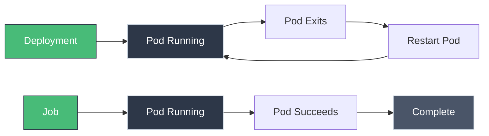

# Jobs and CronJobs: Batch and Scheduled Tasks

!!! tip "Part of Essentials: Workloads"
    This article is part of [Essentials](overview.md) — you should understand [Deployments](deployments.md) first.

A Deployment's entire purpose is keeping something running forever. A database migration, a nightly backup, a batch of image resizing has the opposite goal: run, finish, stop. For a Job, *not* finishing is the failure — that single inversion is what a Job actually is, and everything below follows from it. Once a resource's job is to finish rather than persist, three questions define the whole feature set: how many times does it need to succeed, on what schedule, and what happens when it doesn't.

---

## Jobs vs Deployments

<div class="grid cards two-col" markdown>

-   **Deployment**

    ---
    **Purpose:** Keep an application running forever

    **Behavior:** Restarts Pods if they exit

    **Success:** Pod stays `Running`

-   **Job**

    ---
    **Purpose:** Run a task to completion

    **Behavior:** Creates Pods, waits for a successful exit

    **Success:** Pod exits with status `0`

</div>



A Deployment treats "the container exited" as a failure to fix. A Job treats it as success. Same primitive underneath, a controller creating Pods from a template, but the definition of done is inverted — and that inversion is the whole spine of this article.

---

## Job Anatomy

Before any of those three questions, the base case: what does "run once, then stop" actually look like on the wire.

```yaml title="simple-job.yaml" linenums="1"
apiVersion: batch/v1
kind: Job
metadata:
  name: pi-calculation
spec:
  template:  # (1)!
    spec:
      containers:
      - name: pi
        image: perl:5.34
        command: ["perl", "-Mbignum=bpi", "-wle", "print bpi(2000)"]  # (2)!
      restartPolicy: Never  # (3)!
  backoffLimit: 4  # (4)!
```

1. Pod template — no `replicas` field, because a Job isn't holding a count steady.
2. Calculate π to 2000 digits, then exit.
3. **Required** for Jobs: `Never` or `OnFailure`. `Always` (the Deployment default) would fight the Job's own definition of "done."
4. Retry a failing Pod up to 4 times before giving up.

`template`, `backoffLimit`, and the completion/parallelism fields covered below all live on one real Go struct: [`JobSpec`, batch/v1/types.go](https://github.com/kubernetes/api/blob/v0.36.2/batch/v1/types.go#L302-L474) in the Kubernetes API source.

```bash
kubectl apply -f simple-job.yaml

kubectl get jobs -w
# NAME              COMPLETIONS   DURATION   AGE
# pi-calculation    0/1           5s         5s
# pi-calculation    1/1           10s        10s

kubectl logs job/pi-calculation
# 3.141592653589793238462643383279502884197...
```

That's a Job that succeeds exactly once. The first of the three questions — how many times does this need to succeed? — is answered by two fields on that same anatomy: `completions` and `parallelism`.

---

## Job Patterns

`completions` and `parallelism` combine into four shapes, depending on how many successes you need and how many can run at once:

<div class="grid cards two-col" markdown>

-   **Single Completion** (default)

    ---
    ```yaml
    completions: 1
    parallelism: 1
    ```
    One Pod, run once, done. Database migrations, one-off setup.

-   **Sequential**

    ---
    ```yaml
    completions: 5
    parallelism: 1
    ```
    Run the task 5 times, one after another.

-   **Parallel**

    ---
    ```yaml
    completions: 10
    parallelism: 3
    ```
    Need 10 successes; run 3 Pods at a time until you get there.

-   **Work Queue**

    ---
    ```yaml
    completions: null
    parallelism: 5
    ```
    No fixed count — Pods pull from a queue and exit when it's empty. The application, not the Job spec, decides when work is done.

</div>

---

## Real-World Example: Database Migration

That first question, grounded in the case every team eventually hits: a schema change that must run exactly once, and must succeed before anything else deploys.

```yaml title="db-migration-job.yaml" linenums="1"
apiVersion: batch/v1
kind: Job
metadata:
  name: db-migration
  labels:
    app: myapp
    component: migration
spec:
  template:
    metadata:
      labels:
        app: myapp
        component: migration
    spec:
      containers:
      - name: migrate
        image: myapp:v2.0  # (1)!
        command: ["python", "manage.py", "migrate"]  # (2)!
        env:
        - name: DATABASE_URL
          valueFrom:
            secretKeyRef:
              name: db-credentials
              key: url
      restartPolicy: Never  # (3)!
  backoffLimit: 3  # (4)!
```

1. Same image as the application — it already has the migration code.
2. Run the migration, then exit.
3. Don't restart the container on failure; retries are handled by `backoffLimit` instead.
4. Retry up to 3 times if the migration fails.

```bash
kubectl apply -f db-migration-job.yaml

kubectl wait --for=condition=complete --timeout=300s job/db-migration

kubectl logs job/db-migration
# Applying users.0001_initial... OK
# Applying users.0002_add_email... OK

kubectl delete job db-migration
```

**Ordering this before a Deployment rollout** — run the migration Job, wait for `condition=complete`, *then* apply the new Deployment — is how you avoid new Pods querying a schema that doesn't exist yet.

A one-off Job like this is a genuine exception to "GitOps applies everything," not a loophole around it. A Deployment is *supposed* to sit in Git forever, continuously reconciled. A migration Job is supposed to run exactly once and be done: there's nothing to reconcile after it succeeds. In practice that `kubectl apply` above is almost always a step in a CI/CD pipeline (run the migration, wait for completion, then let the pipeline continue to the Deployment step) rather than a person running it by hand, or a manifest sitting in Git for Flux to poll forever. The manifest itself still belongs in version control, same as everything else; it's *who applies it, and how often* that differs from a persistent resource.

---

## CronJobs: Scheduled Jobs

Question one, how many times, is settled. Question two is on what schedule — and a CronJob answers it by doing nothing clever: it creates an ordinary Job, on a timer, and otherwise gets out of the way.

```yaml title="backup-cronjob.yaml" linenums="1"
apiVersion: batch/v1
kind: CronJob
metadata:
  name: database-backup
spec:
  schedule: "0 2 * * *"  # (1)!
  jobTemplate:  # (2)!
    spec:
      template:
        spec:
          containers:
          - name: backup
            image: postgres:14
            command:
            - sh
            - -c
            - |
              pg_dump -h postgres-svc -U admin myapp > /backup/backup-$(date +%Y%m%d).sql
              aws s3 cp /backup/backup-$(date +%Y%m%d).sql s3://my-backups/
            env:
            - name: PGPASSWORD
              valueFrom:
                secretKeyRef:
                  name: db-credentials
                  key: password
            volumeMounts:
            - name: backup-volume
              mountPath: /backup
          volumes:
          - name: backup-volume
            emptyDir: {}
          restartPolicy: OnFailure
  successfulJobsHistoryLimit: 3  # (3)!
  failedJobsHistoryLimit: 1  # (4)!
```

1. Standard cron syntax: minute, hour, day, month, weekday. `0 2 * * *` = 2 AM daily.
2. A full Job spec, nested — the CronJob's only job is stamping this out on schedule.
3. Keep the last 3 successful Jobs around (for logs/history).
4. Keep the last failed Job (for debugging).

`schedule`, `jobTemplate`, `concurrencyPolicy`, and the history-limit fields are all on [`CronJobSpec`, batch/v1/types.go](https://github.com/kubernetes/api/blob/v0.36.2/batch/v1/types.go#L714-L765) — a separate, much smaller struct from `JobSpec` above, since a CronJob is really just a thin scheduling wrapper around one.

Unlike the one-off migration Job above, a CronJob is meant to sit around forever, doing its thing on schedule — that makes it a persistent resource exactly like a Deployment, not an exception. It belongs in Git and gets reconciled by Flux the same way; `kubectl apply -f backup-cronjob.yaml` is the learning path here too, not the production one. See the GitOps note on [Deployments](deployments.md) if that distinction isn't clear yet.

| Schedule | Meaning |
|----------|---------|
| `* * * * *` | Every minute |
| `0 * * * *` | Every hour |
| `0 2 * * *` | 2 AM daily |
| `0 0 * * 0` | Midnight every Sunday |
| `*/15 * * * *` | Every 15 minutes |
| `0 9-17 * * 1-5` | Hourly, 9 AM–5 PM, weekdays |

Use [crontab.guru](https://crontab.guru) if the syntax isn't muscle memory yet — nobody's is, at first.

### Concurrency Policy

A schedule creates a problem a one-off Job never has to think about: what happens if the previous run is still going when the next scheduled time hits?

=== "Allow (default)"
    ```yaml
    concurrencyPolicy: Allow
    ```
    Runs overlap. Fine when jobs are independent and safe to run concurrently.

=== "Forbid"
    ```yaml
    concurrencyPolicy: Forbid
    ```
    Skips the new run if the previous one is still active. Use when overlap would cause a real problem — two backups writing the same file, two migrations racing.

=== "Replace"
    ```yaml
    concurrencyPolicy: Replace
    ```
    Cancels the running Job, starts the new one. Use when only the latest run's result matters.

**Blast radius if you get this wrong:** `Allow` on a job that assumes exclusivity (like a database migration or a lock-taking cleanup) is how you get two Jobs racing each other against the same table. Default to `Forbid` unless you've confirmed concurrent runs are actually safe.

### Suspend, Resume, and History

Concurrency policy handles overlap automatically. Sometimes you want the schedule stopped entirely instead, without deleting the CronJob:

```bash
# Pause — no new Jobs are created (in-flight ones still finish)
kubectl patch cronjob database-backup -p '{"spec":{"suspend":true}}'

# Resume
kubectl patch cronjob database-backup -p '{"spec":{"suspend":false}}'
```

---

## Job Failure Handling

How many times, on what schedule — the last question a Job forces on you is the one it exists to answer in the first place: what happens when it doesn't finish?

```yaml
spec:
  backoffLimit: 6  # (1)!
  activeDeadlineSeconds: 600  # (2)!
  ttlSecondsAfterFinished: 86400  # (3)!
  template:
    spec:
      restartPolicy: OnFailure
```

1. Retry up to 6 times, with exponential backoff (10s, 20s, 40s, capped at 6 minutes).
2. Kill the Job if it's still running after 10 minutes — a safety net against a task that hangs instead of failing cleanly.
3. Auto-delete the Job 24 hours after it finishes, so completed Jobs don't pile up in `kubectl get jobs` forever.

---

## Troubleshooting

Every one of those failure modes leaves a trace. Here's where to look for each.

### Job Never Completes

The Pod is running, but the completion count never ticks up:

```bash
kubectl get job my-job
# COMPLETIONS   DURATION   AGE
# 0/1           5m         5m

kubectl get pods -l job-name=my-job
# READY   STATUS    RESTARTS   AGE
# 1/1     Running   0          5m
```

Likely causes: the container never exits (stuck in a loop), the application doesn't actually exit with status `0` on success, or it's blocked waiting on an external resource. `kubectl logs my-job-abc` is the first move; `kubectl exec -it my-job-abc -- sh` if the logs don't explain it.

### Job Fails Repeatedly

The opposite problem: it's exiting, just never with success:

```bash
kubectl describe job my-job
# Events:
#   Warning  BackoffLimitExceeded  Job has reached the specified backoff limit
```

Check the Pod's logs, not just the Job's events — the Job only knows the Pod failed, not why.

### CronJob Not Running

Common causes: the schedule string is wrong, the CronJob is suspended, or `concurrencyPolicy: Forbid` is skipping runs because the previous one never finished. Trigger a run manually to isolate schedule issues from application issues:

```bash
kubectl create job --from=cronjob/database-backup manual-backup-1
kubectl get job manual-backup-1
```

---

## Quick Recap

| Concept | Explanation |
|---------|-------------|
| **Job** | Runs Pods to completion, not forever |
| **completions** | How many successful Pods are needed |
| **parallelism** | How many Pods run at once |
| **backoffLimit** | Retries allowed on failure |
| **CronJob** | Creates Jobs on a schedule |
| **concurrencyPolicy** | `Allow`, `Forbid`, or `Replace` for overlapping runs |

---

## Practice Exercises

??? question "Exercise 1: Run a One-Time Job"
    Create a Job that prints "Hello Kubernetes" and exits.

    ??? tip "Solution"
        ```yaml title="hello-job.yaml"
        apiVersion: batch/v1
        kind: Job
        metadata:
          name: hello-job
        spec:
          template:
            spec:
              containers:
              - name: hello
                image: busybox
                command: ['echo', 'Hello Kubernetes']
              restartPolicy: Never
          backoffLimit: 2
        ```

        ```bash
        kubectl apply -f hello-job.yaml
        kubectl wait --for=condition=complete job/hello-job
        kubectl logs job/hello-job
        # Hello Kubernetes
        kubectl delete job hello-job
        ```

??? question "Exercise 2: Create a Scheduled Backup"
    Create a CronJob that runs a backup command every hour.

    ??? tip "Solution"
        ```yaml title="hourly-backup-cronjob.yaml"
        apiVersion: batch/v1
        kind: CronJob
        metadata:
          name: hourly-backup
        spec:
          schedule: "0 * * * *"
          jobTemplate:
            spec:
              template:
                spec:
                  containers:
                  - name: backup
                    image: busybox
                    command:
                    - sh
                    - -c
                    - |
                      echo "Running backup at $(date)"
                      echo "Backup complete"
                  restartPolicy: OnFailure
          successfulJobsHistoryLimit: 2
          failedJobsHistoryLimit: 1
        ```

        ```bash
        kubectl apply -f hourly-backup-cronjob.yaml
        kubectl create job --from=cronjob/hourly-backup test-backup   # trigger now, don't wait an hour
        kubectl logs job/test-backup
        kubectl delete job test-backup
        kubectl delete cronjob hourly-backup
        ```

---

## What's Next?

That's the whole shape of a Job, because it's really only three questions: how many times (`completions`/`parallelism`), on what schedule (CronJob's `schedule` and `jobTemplate`), and what happens when it doesn't finish (`backoffLimit`, `activeDeadlineSeconds`, `concurrencyPolicy`). Once you see a Job as "a resource whose entire purpose is to finish" rather than a stripped-down Deployment, none of those fields are arbitrary — they're just the questions that definition forces.

Two things every Job's Pod spec should still declare, same as a Deployment's: **[Resource Requests and Limits](resource_requests_limits.md)** — a runaway batch job without limits can starve everything else on the node — and the initContainer pattern covered in [Pods: The Atomic Unit](pods.md), for one-time setup that has to finish *before* your main container starts. Health probes rarely apply to Jobs the way they do to Deployments, since nothing is routing traffic to a Pod that's meant to exit.

StatefulSets and DaemonSets, the two workload types that stay Efficiency-tier rather than moving here since they're platform-specific rather than app-dev table stakes, cover ordered/stateful workloads and node-level agents respectively.

---

## Further Reading

### Official Documentation

- [Jobs](https://kubernetes.io/docs/concepts/workloads/controllers/job/)
- [CronJobs](https://kubernetes.io/docs/concepts/workloads/controllers/cron-jobs/)
- [Running Automated Tasks](https://kubernetes.io/docs/tasks/job/)

### Deep Dives

- [Parallel Processing with Jobs](https://kubernetes.io/docs/tasks/job/parallel-processing-expansion/)
- [Coarse Parallel Processing Using a Work Queue](https://kubernetes.io/docs/tasks/job/coarse-parallel-processing-work-queue/)

### Tools

- [Crontab Guru](https://crontab.guru) - Build and explain cron expressions

### Related Articles

- [Deployments](deployments.md) - For long-running applications
- [Resource Requests and Limits](resource_requests_limits.md) - Managing Job Pod resources
- [Pods: The Atomic Unit](pods.md) - initContainers for one-time setup
