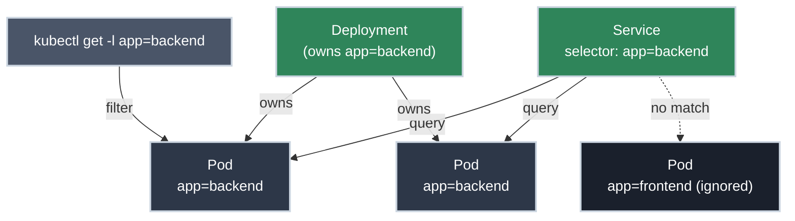

# Labels and Selectors: How Kubernetes Wires Itself Together

!!! tip "Part of Essentials: Core Primitives"
    This is the final article in [Essentials: Core Primitives](overview.md). It builds on [Pods](pods.md), [Services](services.md), [ConfigMaps and Secrets](config_and_secrets.md), and [Namespaces](namespaces.md).

Here's a question that exposes whether you actually understand Kubernetes: **how does a Service know which Pods to send traffic to?** It doesn't hold a list of Pod names. It doesn't reference Pods by IP. It runs a *query* — "give me every Pod with `app: backend`" — and the result set is whatever currently matches.

That query mechanism is **labels and selectors**, and it's not a side feature. It's the loose-coupling primitive the whole of Kubernetes is built on. Services find Pods this way. Deployments decide which Pods they own this way. NetworkPolicies pick their targets this way. You filter `kubectl get` output this way. Once you see labels as *the query layer*, a lot of Kubernetes behaviour stops being surprising.

!!! info "What You'll Learn"
    By the end of this article, you'll understand:

    - **Labels vs selectors** — tags on objects vs queries over those tags
    - **Why this design exists** — loose coupling between controllers and the objects they act on
    - **Equality-based and set-based selectors** — and where each is allowed
    - **The recommended `app.kubernetes.io/*` labels** — and why tooling depends on them
    - **How a Service selector finds its Pods** — equality matching in a real spec

---



---

## Labels Are the Loose-Coupling Primitive

A **label** is a key/value pair in an object's metadata. A **selector** is a query that returns objects whose labels match.

``` yaml
metadata:
  labels:
    app: backend
    tier: api
    version: v1.4.2
```

The design decision worth pausing on: controllers never hold direct references to the objects they manage. A Service doesn't store "Pod abc123, Pod def456." It stores a *selector*, and the set of matching Pods is recomputed continuously. That indirection is exactly why Kubernetes self-heals — when a Pod dies and a new one is created with the same labels, it silently joins every Service, Deployment, and policy whose selector it matches. Nothing has to be rewired, because nothing was wired by name in the first place.

This is the same idea as a database query versus a hardcoded primary-key list: the query keeps working as rows come and go. Internalize that and the rest of this article is just syntax.

!!! tip "Labels vs annotations"
    Both are key/value metadata, but **labels are for selecting** and **annotations are for storing**. If you'll ever query on it, it's a label. If it's descriptive data no selector cares about (a build URL, a changelog, a checksum), it's an annotation. Don't pile non-selectable junk into labels — selectors and label indexes pay for it.

---

## Adding Labels

Labels live in the manifest, right alongside the object's name — set there, they're part of the desired state that `kubectl apply` reconciles:

``` yaml title="pod-with-labels.yaml" linenums="1"
apiVersion: v1
kind: Pod
metadata:
  name: backend
  labels:  # (1)!
    app: backend
    tier: api
    environment: dev
    version: "1.4.2"
spec:
  containers:
  - name: app
    image: myapp:1.4.2
```

1. Services, Deployments, and selectors all find this Pod through these labels — they're load-bearing, not decoration.

---

## Querying with Selectors

### Equality-based

``` bash title="Equality selectors (✅ read-only)"
kubectl get pods -l app=backend  # (1)!
kubectl get pods -l app!=backend  # (2)!
kubectl get pods -l app=backend,environment=dev  # (3)!
kubectl get pods -l app=backend --show-labels  # (4)!
```

1. Exact match.
2. Not equal.
3. Comma = AND.
4. See the labels too.

### Set-based

``` bash title="Set-based selectors (✅ read-only)"
kubectl get pods -l 'app in (backend,frontend)'  # (1)!
kubectl get pods -l 'environment notin (prod)'  # (2)!
kubectl get pods -l tier  # (3)!
kubectl get pods -l '!tier'  # (4)!
```

1. Value in set.
2. Value not in set.
3. Label exists (any value).
4. Label absent.

---

## The Recommended Labels

Kubernetes defines a set of common labels under the `app.kubernetes.io/` prefix. They're not mandatory, but Helm, dashboards, and observability tooling key off them — adopt them and your resources slot into the ecosystem for free:

``` yaml title="recommended-labels.yaml" linenums="1"
metadata:
  labels:
    app.kubernetes.io/name: redis          # (1)!
    app.kubernetes.io/instance: redis-cache
    app.kubernetes.io/version: "7.2"
    app.kubernetes.io/component: cache      # (2)!
    app.kubernetes.io/part-of: storefront   # (3)!
    app.kubernetes.io/managed-by: helm
```

1. The name of the application.
2. The component's role within the larger app.
3. The higher-level application this belongs to — lets tools group everything in one system.

For your own organizational labels (`environment`, `team`, `tier`), keep them short, consistent, and *agreed on across teams* — inconsistent labelling is what makes cluster-wide queries and cost reporting useless.

---

## A Selector Inside a Service

You'll meet selectors most often in a Service's `spec.selector` — equality-based, an AND of exact matches:

``` yaml title="service.yaml" linenums="1"
apiVersion: v1
kind: Service
metadata:
  name: backend-svc
spec:
  selector:  # (1)!
    app: backend
    tier: api
  ports:
  - port: 80
    targetPort: 8080
```

1. Matches Pods that have **both** labels. A Pod with extra labels still matches; a Pod missing either one does not.

When a selector matches *no* Pods, the Service's endpoint list is empty and traffic goes nowhere — diagnosing that mismatch is its own topic, covered in the Troubleshooting section.

---

## Practice Exercises

??? question "Exercise 1: Predict the match set"
    A Service has selector `app: web`. Three Pods exist:

    - Pod A: `app: web, tier: frontend`
    - Pod B: `app: api, tier: backend`
    - Pod C: `app: web, version: v2`

    Which Pods receive traffic?

    ??? tip "Solution"
        **A and C.** The selector requires `app: web`; A and C have it (extra labels don't disqualify them), B has `app: api` and is excluded. A selector cares only about the labels it names — everything else is irrelevant.

??? question "Exercise 2: Design labels for a three-tier app"
    You're deploying a `storefront` app with three components — a web frontend, an API backend, and a Redis cache, each running several replicas. Design a label scheme that lets you (a) select just the API Pods, (b) select *everything* belonging to `storefront`, and (c) slot into ecosystem tooling for free.

    ??? tip "Solution"
        Use the recommended `app.kubernetes.io/*` labels, with `part-of` shared across all three tiers and `component` distinguishing them:

        ``` yaml title="api Pods (the other tiers differ only in name/component)"
        metadata:
          labels:
            app.kubernetes.io/name: api
            app.kubernetes.io/component: backend
            app.kubernetes.io/part-of: storefront
        ```

        - **(a) Just the API Pods:** `kubectl get pods -l app.kubernetes.io/component=backend`
        - **(b) Everything in storefront:** `kubectl get pods -l app.kubernetes.io/part-of=storefront` — frontend, backend, and cache all carry it
        - **(c) Ecosystem tooling:** because you used the `app.kubernetes.io/*` set, Helm, dashboards, and observability group these automatically

        The discipline that matters: `part-of` is shared (grab the whole system) while `component`/`name` distinguish the tiers (grab just one).

---

## Quick Recap

| Concept | What to Know |
|---------|-------------|
| **Label** | Key/value metadata you select on (vs annotation = metadata you don't) |
| **Selector** | A query over labels; controllers couple to objects this way |
| **Equality-based** | `app=web`, `app!=web`, comma = AND |
| **Set-based** | `app in (a,b)`, `notin`, existence — in `kubectl` queries |
| **Recommended labels** | `app.kubernetes.io/*` — tooling depends on them |

## What's Next?

You've finished **Essentials: Core Primitives**. You can reason about Pods, Services, configuration, namespaces, and the label-driven query layer that connects them — not just how to create each, but *why* Kubernetes is built this way and what each means for a shared cluster.

That foundation is exactly what the next tier assumes. **Efficiency** steps up to the intermediate platform-engineer's job: running these primitives at scale — Deployments and rollout strategies, StatefulSets and DaemonSets, Jobs, and the networking layer (Ingress, NetworkPolicies, DNS) that ties real applications together.

---

## Further Reading

### Official Documentation

- [Labels and Selectors](https://kubernetes.io/docs/concepts/overview/working-with-objects/labels/) - The full selector grammar
- [Recommended Labels](https://kubernetes.io/docs/concepts/overview/working-with-objects/common-labels/) - The `app.kubernetes.io/*` set
- [Annotations](https://kubernetes.io/docs/concepts/overview/working-with-objects/annotations/) - The non-selectable counterpart

### Related Articles

- [Services: Stable Networking for Pods](services.md) - Selectors in their most common form
- [Pods: What Actually Runs Your Application](pods.md) - Where labels are stamped
- [Namespaces](namespaces.md) - Namespace labels drive policy targeting

