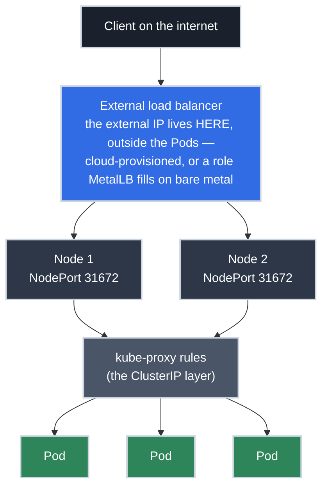

# LoadBalancer Services: From Cloud to Bare Metal

!!! tip "Part of a Learning Path"
    This article is a step in the [Put Your Kubernetes App on the Internet](https://bradpenney.io/pathways/cluster-to-internet) pathway on [bradpenney.io](https://bradpenney.io). It builds directly on [Services](services.md) — the selector, EndpointSlice, and `kube-proxy` mechanics from that article are assumed here.

Your app works. Inside the cluster, its [Service](services.md) answers on a stable address, other Pods reach it fine — and none of that helps the teammate who just asked *"what's the URL?"* Right now your only honest answer is `kubectl port-forward`, which stops existing the moment you close your laptop. The cluster's networking, so far, ends at the cluster's edge.

Kubernetes' built-in answer is a single field: set the Service's `type` to `LoadBalancer`. But what that field actually *does* depends entirely on where your cluster runs. On managed cloud, `kubectl get svc` shows a public IP about ninety seconds after you apply — and your cloud account quietly acquires a new monthly line item. On an on-premise cluster, the same manifest produces **nothing**: `EXTERNAL-IP` says `<pending>` and stays there forever.

Both outcomes come from the same fact: `type: LoadBalancer` isn't a feature, it's a *request* — and Kubernetes ships nothing that fulfills it. Something else must. This article follows that request end to end: who fulfills it in the cloud, the three-layer stack every fulfillment builds on, how you *become* the fulfiller on your own metal, and what the machine you're given can and can't do.

!!! info "What You'll Learn"
    By the end of this article, you'll understand:

    - **Why `type: LoadBalancer` is a request, not a feature** — and who fulfills it where
    - **The full traffic path** — how the external LB, NodePorts, and ClusterIP stack on each other
    - **MetalLB in depth** — how bare-metal clusters answer for an external IP: Layer 2 vs BGP mode
    - **`externalTrafficPolicy`** — the trade between an extra hop and the real client IP
    - **Why production clusters don't run one LoadBalancer per app** — cost, IPs, and the front-door pattern

---



---

## In the Cloud: One Field, One API Call

Kubernetes itself cannot conjure an external IP — nothing inside the cluster owns [address space the outside world can route to](https://networking.bradpenney.io/essentials/http/from_url_to_endpoint/). What it *can* do is record the request and let something fulfill it: the same [declare-and-reconcile pattern](../day_one/kubectl/understanding.md) behind everything else in Kubernetes. On a managed cloud cluster, that something is the **cloud controller manager**: a control-plane loop that watches Service objects, and when one requests `type: LoadBalancer`, calls the cloud provider's API to provision a real, external **[L4 load balancer](https://networking.bradpenney.io/essentials/load_balancers/load_balancer_basics/)** pointed at your cluster.

```yaml title="web-lb.yaml" linenums="1"
apiVersion: v1
kind: Service
metadata:
  name: web-lb
spec:
  type: LoadBalancer  # (1)!
  selector:
    app: web  # (2)!
  ports:
  - protocol: TCP
    port: 80  # (3)!
    targetPort: 8080
```

1. The request: "cloud, build me a load balancer." Everything else about provisioning happens outside the cluster, asynchronously.
2. The same [selector mechanics](labels_selectors.md) as every Service — the LoadBalancer type *adds* external reachability; it doesn't change how Pods are found.
3. The port the external load balancer listens on. Port 80 here means `http://<external-ip>/` works with no port in the URL.

Apply it and watch the asynchronous part play out:

```bash title="Watch the provisioning happen"
kubectl apply -f web-lb.yaml
# service/web-lb created

kubectl get svc web-lb  # (1)!
# NAME     TYPE           CLUSTER-IP     EXTERNAL-IP   PORT(S)        AGE
# web-lb   LoadBalancer   10.96.112.45   <pending>     80:31672/TCP   4s

kubectl get svc web-lb --watch  # (2)!
# NAME     TYPE           CLUSTER-IP     EXTERNAL-IP     PORT(S)        AGE
# web-lb   LoadBalancer   10.96.112.45   203.0.113.42    80:31672/TCP   93s
```

1. `<pending>` is normal at first — the cloud is still building. The Service object is done; the infrastructure isn't.
2. When the cloud API finishes (typically 1–3 minutes), the controller writes the result back into the Service's status, and `EXTERNAL-IP` fills in.

That write-back is worth appreciating: the Service object is the *declarative record* of a piece of cloud infrastructure. Which cuts both ways; see the blast radius below.

!!! danger "Deleting the Service deletes the cloud load balancer"
    `kubectl delete svc web-lb` doesn't just remove a cluster object — the cloud controller **tears down the external load balancer and releases its public IP**. If DNS points at that IP, your app is down and the IP may be handed to someone else's workload. Recovering means re-provisioning (new IP, DNS update, [TTL wait](https://networking.bradpenney.io/essentials/dns/how_dns_works/)). If an address must survive the Service's lifecycle, reserve a **static IP** with your cloud provider and reference it in the Service; then the address outlives any single object.

## It's Services All the Way Down

Look again at that `PORT(S)` column: `80:31672/TCP`. You never asked for port 31672; Kubernetes allocated it. That's because **a LoadBalancer Service is built on top of the other two Service types**, not beside them:

1. **ClusterIP** — the in-cluster virtual IP and `kube-proxy` routing you know from [Services](services.md). Still there, still how Pods are reached.
2. **NodePort** — Kubernetes also opens a high port (30000–32767) on *every node* for this Service. Any traffic hitting any node on that port gets routed into the ClusterIP layer.
3. **The cloud load balancer** — lives *outside* the cluster, so it can't reach Pod or ClusterIP addresses. The only stable targets it can see are the **nodes**. So it forwards to the NodePort, and the cluster machinery takes it from there.

That's the whole trick: the cloud LB's job is just *get traffic to any node*; `kube-proxy`'s job is *get it from the node to a Pod*. Two load-balancing layers, stacked; that becomes important in a moment.

## On Your Own Metal: MetalLB Makes You the Provider

On-premise and homelab clusters (k0s on your own machines, OpenShift in your datacenter, three boxes in a rack) have no cloud controller, so a `type: LoadBalancer` Service sits at `<pending>` forever: the request is recorded, and nothing in the universe is listening for it. [MetalLB](https://metallb.io/) is the standard way to *become* the listener. Integrated platforms sometimes bring their own answer (F5, NSX, `kube-vip`), but MetalLB is the common default and the one worth understanding, because it exposes the actual problem.

That problem is sharper than it first looks, and it's **two** problems:

1. **Assignment** — deciding which IP a Service gets. This part is easy: MetalLB's *controller* hands out addresses from a pool you define.
2. **Announcement** — making your physical network actually deliver packets for that IP to the cluster. This is the part the cloud always hid from you: an IP is just a number until some machine on the network claims to be it.

You configure both declaratively, with CRDs:

```yaml title="metallb-pool.yaml" linenums="1"
apiVersion: metallb.io/v1beta1
kind: IPAddressPool
metadata:
  name: lan-pool
  namespace: metallb-system
spec:
  addresses:
  - 192.168.10.240-192.168.10.250  # (1)!
---
apiVersion: metallb.io/v1beta1
kind: L2Advertisement
metadata:
  name: lan-l2
  namespace: metallb-system
spec:
  ipAddressPools:
  - lan-pool  # (2)!
```

1. Addresses MetalLB may assign — real IPs on your LAN, **outside your DHCP server's range** so nothing else ever claims them. This range is a contract between you and your network.
2. Announce this pool's addresses in Layer 2 mode. Swap this object for a `BGPAdvertisement` (plus a `BGPPeer`) to announce via BGP instead.

Apply that, and the same `web-lb.yaml` from earlier gets `192.168.10.240` in `EXTERNAL-IP` within seconds: same Service manifest, different fulfiller. The interesting engineering is in *how* the announcement works, and MetalLB gives you two modes:

=== ":material-lan: Layer 2 mode — one node answers for the IP"

    MetalLB runs a *speaker* on every node (a DaemonSet). In L2 mode, the speakers elect **one node per Service IP**, and that node answers **ARP** requests (IPv6: NDP) for it: when anything on the LAN asks "who has `192.168.10.240`?", the elected node replies "me." All traffic for that Service arrives at that single node, and from there the [stack you already know](#its-services-all-the-way-down), `kube-proxy`'s rules, fans it out to Pods anywhere in the cluster.

    Understand what that means:

    - **It is failover, not load balancing.** One node carries *all* ingress traffic for the Service; its NIC is the ceiling. (Different Services elect different leaders, so a cluster's Services spread out, but each individual Service bottlenecks on one node.)
    - **Failover is measured in seconds.** If the leader dies, the remaining speakers detect it (via memberlist gossip), elect a new leader, and broadcast **gratuitous ARP** so every device on the LAN updates its cache to the new node's MAC. Clients see a brief stall, not a permanent outage.
    - **It requires nothing from your network.** No router config, no protocols: any flat LAN works. This is why L2 is the default answer for homelabs and small on-prem clusters.

=== ":material-router-network: BGP mode — the routers spread the load"

    In BGP mode, each speaker establishes a **BGP peering session with your router(s)** (configured via a `BGPPeer` resource — your router's IP and ASN, your cluster's ASN) and advertises a route: "the Service IP is reachable through me." Every node advertises the *same* IP, so the router sees multiple equal paths and does **ECMP** — hashing each connection across all of them.

    What that buys and costs:

    - **True multi-node load balancing.** Traffic for one Service enters through *many* nodes simultaneously, with no single-NIC ceiling. This is the datacenter answer, and it's the same technique cloud providers use internally.
    - **It requires the network to participate.** You need BGP-capable routers and someone (possibly you) willing to peer them with the cluster — the network team is now part of your deployment.
    - **The sharp edge: ECMP re-hashing.** When the set of advertising nodes changes (node down, Pod moved under `externalTrafficPolicy: Local`), routers re-hash flows, and long-lived connections through re-mapped paths get **reset**. Short-lived HTTP barely notices; hours-long connections do.

The decision rule falls out of the mechanics: **L2 for simplicity** (any network, zero router config, single-node throughput per Service), **BGP for scale** (multi-node throughput, at the price of running real routing). And `externalTrafficPolicy` composes with both, the same way as in the cloud: with `Local`, MetalLB only announces from nodes actually hosting a ready Pod (leader eligibility in L2, route advertisement in BGP), so client IPs survive.

!!! tip "MetalLB is the better teacher"
    Notice what you had to think about that the cloud never showed you: address pools, ARP, who answers for an IP, what routers do with equal-cost paths. A cloud LoadBalancer is the same story with the answers pre-filled by someone else's network team. If you understand MetalLB, you understand what `type: LoadBalancer` *means* — everywhere.

## IP or Hostname: What You'll Point DNS At

However the request got fulfilled (cloud API or MetalLB), it ends the same way: a value in `EXTERNAL-IP`. What *kind* of value differs by fulfiller, and it decides which DNS record you create:

- **GCP and Azure** hand you an IP address (`203.0.113.42`): the kind of value a DNS **A record** points at.
- **AWS** hands you a hostname (`a1b2c3-1234.elb.amazonaws.com`); AWS moves the underlying IPs around, so you point a **CNAME** at it instead.

**MetalLB** always hands you an IP, an A record, with one on-prem wrinkle: it's an address on *your* network, so whether the internet can reach it depends on your edge (a firewall rule or port-forward at your router, not anything Kubernetes controls).

If those record types ring a bell, it's the [DNS machinery](https://networking.bradpenney.io/essentials/dns/how_dns_works/) showing up in `kubectl` output. Wiring your actual domain to this value — and keeping it wired automatically — is [its own automation story](../efficiency/networking/external_dns.md); for now, note which kind of value your setup gives you.

## `externalTrafficPolicy`: The Extra Hop vs. the Real Client

Those two stacked load-balancing layers create a subtlety Kubernetes makes you choose about. When the cloud LB sends traffic to a node, the Pod it's destined for might live on a *different* node — so `kube-proxy` forwards it on, and to make the reply path work, it **rewrites the source address** (SNAT). Your application then sees a node's internal IP as the "client"; the real caller's address is gone.

The `externalTrafficPolicy` field picks your trade:

| | `Cluster` (default) | `Local` |
| :--- | :--- | :--- |
| **Routing** | Any node accepts traffic, forwards anywhere | A node only accepts traffic for Pods it hosts |
| **Client IP** | **Lost** (SNAT rewrites it) | **Preserved** — the app sees the real caller |
| **Extra hop** | Possible (node → node) | Never |
| **Load spread** | Even across all Pods | Only as even as your Pod placement |
| **LB health checks** | Every node passes | Nodes *without* a Pod deliberately fail |

`Local` is what you want when the application needs the caller's address: per-IP rate limiting, allowlists, honest access logs. The catch is placement: with three Pods on two nodes of a six-node cluster, four nodes will fail the cloud LB's health checks *by design* — that's the mechanism working, not an outage. If you run `Local`, spread the Pods (and know that a node with two Pods gets the same share as a node with one).

## What This Load Balancer Won't Do

The thing the cloud built for you is a **Layer 4** load balancer: it moves TCP connections to nodes. The [L4 vs L7 distinction](https://networking.bradpenney.io/essentials/load_balancers/load_balancer_basics/) draws the boundary precisely:

- **No TLS termination.** Port 443 traffic arrives at your Pods still encrypted; something in the cluster must hold the certificate and do the [handshake](https://networking.bradpenney.io/essentials/tls/tls_basics/).
- **No routing.** It can't send `/api` one place and `/` another, or tell `app.example.com` from `admin.example.com`. Connections in, connections out.
- **No auth, no rate limits, no rewrites.** It never reads an HTTP request, so it can't act on one.

And each LoadBalancer Service provisions its **own** cloud load balancer with its **own** public IP and its own monthly cost. Twenty microservices as twenty LoadBalancer Services means twenty cloud LBs: a bill and an IP-management problem nobody signs up for twice.

Production clusters converge on the same shape: **one** LoadBalancer Service, pointed at an in-cluster L7 router that handles TLS, hostname and path routing, and policy for every app behind it. Building that front door is exactly what [Gateway API](../efficiency/networking/gateway_api.md) is for. `type: LoadBalancer` isn't the wrong tool; it's the entrance, and it's how your router itself gets exposed. (A dedicated LB per Service still earns its keep for raw non-HTTP TCP, such as a message broker's protocol, where L7 routing can't help.)

## Common Pitfalls

=== ":material-timer-sand: EXTERNAL-IP stuck on `<pending>`"

    Minutes are normal; forever means **nothing is fulfilling the request**. On bare metal with no MetalLB (or on kind/minikube), that's expected: install and configure the fulfiller (see [the MetalLB section](#on-your-own-metal-metallb-makes-you-the-provider)). With MetalLB installed, `<pending>` usually means the address pool is exhausted or missing; check `kubectl get ipaddresspool -n metallb-system` and the Service's events. On a managed cloud cluster, it points at the cloud controller's permissions or configuration — `kubectl describe svc web-lb` shows what it's complaining about.

=== ":material-download-network: One node carries all the traffic (MetalLB L2)"

    Every packet for the Service lands on the same node while the others sit idle. That's **Layer 2 mode working as designed**: one elected node answers ARP for the Service IP, and its NIC is the Service's throughput ceiling. If a single Service is outgrowing one node's bandwidth, the fix isn't tuning L2; it's **BGP mode**, where every node advertises the IP and the routers spread connections across them.

=== ":material-incognito: Every request logs the same client IP"

    Your access logs show one internal IP (or a node's IP) for all callers. That's `externalTrafficPolicy: Cluster` doing SNAT on the node-to-node hop: the real client address was rewritten in transit. Switch the Service to `Local` (and accept the placement caveats above), and the application sees genuine caller IPs again.

=== ":material-heart-off: The cloud console shows unhealthy nodes"

    Half your nodes are failing the cloud LB's health checks, but nothing is wrong with them. With `externalTrafficPolicy: Local`, nodes that don't host a Pod for this Service **fail the health check on purpose**: that's how the LB learns where it's allowed to send traffic. Only investigate if a node that *does* host a ready Pod is marked unhealthy.

=== ":material-target: Which nodes belong in the target pool?"

    Hand-building the front end (an external HAProxy pointed at NodePorts, say) raises a question managed clouds answer for you: which nodes should the balancer target? Not a dedicated [control plane](../day_one/what_is_kubernetes.md). User traffic doesn't belong on the machines running `etcd` and the API server: an ingress spike shouldn't threaten cluster control, and on managed clouds you don't own those nodes anyway. Target the nodes where the Pods behind the Service are eligible to run, which usually means all workers, and let health checks trim the set — with `externalTrafficPolicy: Local`, nodes without a local Pod exclude themselves automatically. (Small clusters whose "managers" are untainted and double as workers get a pragmatic pass; there, the managers *are* the worker pool.)

## Practice Exercises

??? question "Exercise 1: Trace the Packet"
    A browser requests `http://203.0.113.42/`. The matching Pod runs on Node 3; the cloud LB happens to forward the connection to Node 1. With the default `externalTrafficPolicy`, list each hop the traffic takes and name the mechanism at each one.

    ??? tip "Solution"
        1. **Internet → cloud load balancer** (203.0.113.42) — the L4 LB the cloud controller provisioned; the public IP lives here, not in the cluster.
        2. **Cloud LB → Node 1 on the NodePort** (e.g., :31672) — the LB can only target nodes, and with `Cluster` policy every node accepts.
        3. **Node 1 → Node 3** — `kube-proxy`'s rules route to a Pod behind the ClusterIP layer; the Pod is elsewhere, so the packet crosses nodes, and **SNAT rewrites the source** so the reply can retrace the path.
        4. **Node 3 → Pod** — final delivery on the Pod's `targetPort` (8080).

        The app sees Node 1's address as the client, which is exactly the `externalTrafficPolicy` trade from this article.

??? question "Exercise 2: The Rate-Limiting Requirement"
    Your API must rate-limit by client IP. It runs as 3 Pods on a 6-node cluster behind a LoadBalancer Service with default settings, and rate limiting is mysteriously "broken" — one bucket absorbs all traffic. Diagnose, fix, and name the operational consequence of the fix.

    ??? tip "Solution"
        **Diagnosis:** default `externalTrafficPolicy: Cluster` SNATs forwarded traffic, so every request appears to come from a handful of node IPs — all clients share a few rate-limit buckets. **Fix:** set `externalTrafficPolicy: Local` in the Service YAML and re-apply; the app now sees real client IPs and limits correctly. **Consequence:** only the nodes hosting the 3 Pods pass the cloud LB's health checks (the other 3 fail *by design*), and load is only as balanced as Pod placement, so use spreading (e.g., anti-affinity) to keep Pods on separate nodes.

??? question "Exercise 3: Design the On-Prem Setup"
    Your three-node on-prem cluster sits on a `192.168.10.0/24` LAN whose DHCP server hands out `.100`–`.200`. There's no BGP-capable router. Design the MetalLB deployment: what address range goes in the `IPAddressPool`, which announcement mode, and — walking the mechanics — what exactly happens to client traffic when the node currently handling a Service's IP loses power?

    ??? tip "Solution"
        **Pool:** a range *outside* DHCP's (say `192.168.10.240-192.168.10.250`), so the DHCP server can never lease an address MetalLB has announced (that collision produces maddening intermittent outages). **Mode:** Layer 2: BGP isn't on the table without a router to peer with, and L2 needs nothing from the network. **On node failure:** the dead node stops answering ARP for the Service IP; the surviving speakers notice via memberlist gossip and elect a new leader; the new leader broadcasts **gratuitous ARP** so every device on the LAN remaps the IP to its MAC. In-flight connections to the dead node are lost, new connections stall for the few seconds the election and cache update take, then flow to the new node, where `kube-proxy` routes them to Pods as before. Seconds of disruption, no human involved.

??? question "Exercise 4: Twelve Microservices"
    Your team is about to expose 12 HTTP microservices publicly and drafts 12 LoadBalancer Services. Argue the case against, and name the one kind of service in the fleet that might still justify its own LoadBalancer.

    ??? tip "Solution"
        Twelve LoadBalancer Services = **twelve cloud load balancers**: twelve monthly charges, twelve public IPs to secure and manage, twelve DNS entries pointing at twelve separate front doors; and since each is L4, *still* nothing doing TLS or path routing for you. The production shape is **one** LoadBalancer Service in front of an in-cluster L7 router: one IP, one bill, and hostname/path rules dispatch to all 12 apps internally (each of which stays a plain ClusterIP Service). The exception that earns its own LB: a **non-HTTP TCP service** (a message broker, a game server) whose protocol an HTTP router can't route.

## Quick Recap

| Concept | What to Know |
|---------|-------------|
| **`type: LoadBalancer`** | Asks the cloud controller to provision a real external L4 load balancer |
| **`<pending>`** | Normal for minutes; forever = nothing fulfilling the request (bare metal → install MetalLB) |
| **The stack** | External LB → NodePort (every node) → ClusterIP/`kube-proxy` → Pod |
| **MetalLB** | You define the IP pool; the *announcement* is the real work: assignment + announcement |
| **L2 mode** | One elected node answers ARP for the IP: failover in seconds, one-node throughput ceiling, works on any LAN |
| **BGP mode** | Every node advertises the IP to your routers; ECMP spreads real load, but needs a BGP-capable network |
| **IP vs hostname** | GCP/Azure/MetalLB give an IP (A record); AWS gives a hostname (CNAME) |
| **`externalTrafficPolicy`** | `Cluster`: even spread, client IP lost. `Local`: real client IP, placement matters |
| **Delete = teardown** | Removing the Service destroys the cloud LB and releases its IP; reserve static IPs for addresses that must survive |
| **L4 only** | No TLS, no path/host routing; that's the in-cluster router's job |
| **The pattern** | One LoadBalancer Service fronting one L7 router, not one per app |

---

## What's Next?

You can now put a real public address in front of a Service — you know who fulfills the request in both worlds, what stack the fulfillment builds, and why stopping there doesn't scale past a handful of apps. The production front door behind that address is an L7 router that terminates TLS and routes by hostname and path, so one load balancer serves every app in the cluster — exactly what [Gateway API with Traefik](../efficiency/networking/gateway_api.md) builds.

---

## Further Reading

### Official Documentation

- [Kubernetes Docs: type LoadBalancer](https://kubernetes.io/docs/concepts/services-networking/service/#loadbalancer) - The full field reference, including provider annotations
- [Cloud Controller Manager](https://kubernetes.io/docs/concepts/architecture/cloud-controller/) - The control loop that talks to your cloud

### Deep Dives

- [Create an External Load Balancer](https://kubernetes.io/docs/tasks/access-application-cluster/create-external-load-balancer/) - The task guide, including static IP and traffic policy notes
- [MetalLB Concepts](https://metallb.io/concepts/) - Layer 2 and BGP modes from the source, including the limitations discussed here
- [MetalLB Configuration](https://metallb.io/configuration/) - `IPAddressPool`, `L2Advertisement`, and `BGPPeer` reference

### Related Learning

- [Load Balancer Basics (networking.bradpenney.io)](https://networking.bradpenney.io/essentials/load_balancers/load_balancer_basics/) - L4 vs L7 and health checks — the theory this article's cloud LB implements
- [How DNS Actually Works (networking.bradpenney.io)](https://networking.bradpenney.io/essentials/dns/how_dns_works/) - A records vs CNAMEs, for the value in `EXTERNAL-IP`

### Related Articles

- [Services: Stable Networking for Pods](services.md) - The selector and `kube-proxy` foundations this builds on
- [Essentials Overview](overview.md) - The full Essentials learning path
