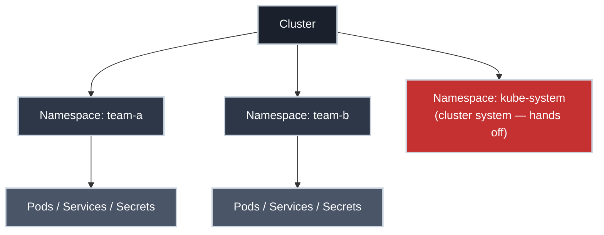

# Namespaces: The Boundary Everything Else Is Scoped To

!!! tip "Part of Essentials: Core Primitives"
    This article is part of [Essentials: Core Primitives](overview.md). It assumes you're comfortable with [Pods](pods.md), [Services](services.md), and [ConfigMaps and Secrets](config_and_secrets.md).

Almost everything you've created so far (Pods, Services, ConfigMaps, Secrets) lives **inside a namespace**. It's the partition that lets dozens of teams share one cluster without their object names colliding, lets one cluster hold `dev` and `staging` side by side, and gives the platform team a unit to attach quotas and access rules to.

The trap is assuming a namespace is more of a wall than it is. It cleanly separates *names* and *API objects*. It does **not**, by default, separate network traffic or grant any security isolation. Knowing exactly where that boundary stops, and what you bolt on to make it real, is what separates someone who *uses* namespaces from someone who can be trusted to *carve up* a cluster.

!!! info "What You'll Learn"
    By the end of this article, you'll understand:

    - **What a namespace actually scopes** — and the handful of things it doesn't
    - **Why namespaces exist** — name collisions, multi-tenancy, environment separation
    - **Creating and targeting namespaces** declaratively and from the CLI
    - **`requests` vs. `limits`** — the floor-and-ceiling model people get backwards
    - **ResourceQuotas and LimitRanges** — keeping one tenant from starving the others
    - **Cross-namespace DNS** — reaching a Service in another namespace
    - **The soft-boundary reality** — why RBAC and Network Policies are the real walls
    - **Deletion blast radius** — what a namespace delete cascades to, and why there's no undo

---



---

## What a Namespace Actually Scopes

A namespace is a scope for the *names* of namespaced API objects. Two teams can both have a Deployment named `web-app` as long as they're in different namespaces: the fully qualified identity is `namespace/name`, not just `name`.

<div class="grid cards two-col" markdown>

-   :material-package-variant-closed: **Inside a namespace**

    ---

    Scoped by name — two namespaces can each have their own.

    - Pods, Services, Deployments, ReplicaSets, StatefulSets, Jobs
    - ConfigMaps, Secrets, ServiceAccounts
    - PersistentVolumeClaims, Ingresses, NetworkPolicies, ResourceQuotas, LimitRanges

-   :material-earth: **Cluster-scoped**

    ---

    Live outside any namespace — one global instance, shared by everyone.

    - Nodes, PersistentVolumes, StorageClasses
    - Namespaces themselves
    - ClusterRoles & ClusterRoleBindings, CustomResourceDefinitions

</div>

A quick way to see which is which:

``` bash title="Which resources are namespaced? (✅ read-only)"
kubectl api-resources --namespaced=true   # (1)!
kubectl api-resources --namespaced=false  # (2)!
```

1. Everything scoped to a namespace.
2. Cluster-scoped resources.

That `api-resources` split is worth internalizing: it tells you, for any object type, whether a `-n` flag even applies.

---

## Why Namespaces Exist

Three overlapping reasons, in increasing order of how much they actually matter day to day:

### Name collisions

Without namespaces, object names would have to be globally unique across the cluster: unworkable the moment more than one team shares it. Namespaces make `team-a/web-app` and `team-b/web-app` distinct objects that never interfere.

### Multi-tenancy on a shared cluster

This is the real reason they matter operationally. One cluster, many tenants: teams, environments, or both. Each tenant gets a namespace, and the platform team hangs the controls off it: access rules, resource quotas, and network policy all attach *to* the namespace. That's why "give team-c their own namespace" is shorthand for an entire onboarding workflow.

### Environment separation

`dev`, `staging`, and `prod` as namespaces in one cluster is common for smaller setups: same manifests, different namespace. Be aware of the tradeoff: it's cheaper than separate clusters, but a namespace is a *soft* boundary (see below), so true prod isolation usually means a separate cluster, not just a separate namespace.

---

## The Default Namespaces

Every cluster ships with these:

| Namespace | Purpose |
|-----------|---------|
| `default` | Where objects land if you don't specify one — avoid using it for real work |
| `kube-system` | The cluster's own system and add-on components (CoreDNS, kube-proxy, CNI) |
| `kube-public` | World-readable; rarely used directly |
| `kube-node-lease` | Node heartbeat objects; ignore |

``` bash title="List namespaces (✅ read-only)"
kubectl get namespaces
```

!!! danger "kube-system is the cluster's life support"
    `kube-system` runs the components that make the cluster a cluster. Deleting or disrupting objects here can take down DNS, networking, or the cluster itself for **everyone** — the blast radius is the whole cluster, not your tenant. Read it to understand your cluster; don't modify it unless you own cluster operations and know exactly what you're doing.

---

## Creating Namespaces

A namespace is a Kubernetes object like any other, so the same declarative-vs-imperative split applies here too.

### Declaratively (the default)

A namespace is a versioned object like anything else, and putting it in Git lets you attach labels that drive policy (cost allocation, NetworkPolicy targeting, environment tagging):

``` yaml title="namespace.yaml" linenums="1"
apiVersion: v1
kind: Namespace
metadata:
  name: team-a-dev
  labels:
    team: team-a  # (1)!
    environment: development
    kubernetes.io/metadata.name: team-a-dev  # (2)!
```

1. Labels on the namespace are how NetworkPolicies and tooling target it — not decoration.
2. Kubernetes injects this immutable label on every namespace automatically; you can select on it.

Worth a glance for what it *doesn't* have: [`NamespaceSpec`, core/v1/types.go](https://github.com/kubernetes/api/blob/v0.36.2/core/v1/types.go#L7077-L7084) in the Kubernetes API source is almost empty — one `Finalizers` field. A namespace's real enforcement power lives in the separate objects below, not in the namespace's own `spec`.

``` bash title="Apply it (⚠️ creates a resource)"
kubectl apply -f namespace.yaml
```

!!! tip "The imperative shortcut"
    `kubectl create namespace team-a-dev` is fine for a throwaway namespace on a dev cluster. For anything that policy or other teams depend on, use the manifest — the labels are the whole point.

---

## Targeting the Right Namespace

Every command runs against *some* namespace. Getting this wrong is the classic "my resources vanished" confusion: they're fine, you're just looking in the wrong place.

``` bash title="Namespace targeting (✅ read-only)"
kubectl get pods -n team-a-dev  # (1)!
kubectl get pods -A  # (2)!
kubectl config view --minify | grep namespace:  # (3)!
```

1. A specific namespace.
2. Every namespace at once.
3. Which namespace am I defaulting to right now?

Typing `-n team-a-dev` on every command gets old fast. Pin it to your current context once:

``` bash title="Set your default namespace (⚠️ changes your kubeconfig)"
kubectl config set-context --current --namespace=team-a-dev  # (1)!
```

1. Now bare commands target `team-a-dev`.

!!! tip "kubens"
    On a multi-namespace cluster, `kubens` (from the `kubectx` project) switches your default namespace interactively, much faster than the `set-context` incantation. Worth installing.

Prefer **not** hardcoding `namespace:` in manifests: leaving it out keeps them portable, with the namespace supplied at apply time (`-n`, your context, or Kustomize). Hardcode it only when an object must always live in one place.

---

## Requests vs. Limits: Floor and Ceiling

Both the quota and LimitRange below hinge on two words — the two most-confused settings in Kubernetes. **`requests` is the floor: the absolute minimum your container needs to *start*, which the scheduler reserves. `limits` is the ceiling: the most you ever expect it to *grow* to.** Get that straight and most "why won't this schedule?" and "why did it get killed?" mysteries disappear:

| | What it is | Set it to | Get it wrong → |
| :-- | :-- | :-- | :-- |
| **`requests`** | Minimum reserved to start (the floor) | The smallest your app needs to run | Too high → won't schedule (wasted capacity); too low → starved or evicted under pressure |
| **`limits`** | Maximum it may use (the ceiling) | The biggest you realistically expect it to reach | Too low → throttled or `OOMKilled`; too high → one Pod can hog the whole node |

!!! warning "The model to unlearn"
    The wrong mental model — "`requests` is how much I want, `limits` is how much I *really* want" — is everywhere, and it quietly wastes clusters. Say it the right way until it sticks: **`requests` is the minimum to start; `limits` is the maximum before Kubernetes steps in.** Padding requests "to be safe" reserves capacity nobody uses and makes the scheduler treat a half-empty node as full.

This is the namespace-level view: aggregate ceilings across every tenant. For the per-container mechanics behind the same two words, including why a CPU limit can throttle a Pod whose average usage graph looks fine, see [Resource Requests and Limits](resource_requests_limits.md).

---

## Resource Quotas: Stopping One Tenant from Eating the Cluster

A namespace with no quota can schedule Pods until the cluster runs out of capacity. On a shared cluster, that's *everyone's* problem. A `ResourceQuota` puts a hard ceiling on aggregate consumption in the namespace:

``` yaml title="resource-quota.yaml" linenums="1"
apiVersion: v1
kind: ResourceQuota
metadata:
  name: team-a-quota
  namespace: team-a-dev
spec:
  hard:
    requests.cpu: "10"      # (1)!
    requests.memory: 20Gi
    limits.cpu: "20"
    limits.memory: 40Gi
    pods: "50"              # (2)!
    persistentvolumeclaims: "5"
```

1. Sum of all container CPU *requests* in the namespace can't exceed 10 cores.
2. Object-count ceilings matter too — runaway controllers create Pods, not just consume CPU.

The `hard:` block corresponds to exactly one field — `Hard` — on [`ResourceQuotaSpec`, core/v1/types.go](https://github.com/kubernetes/api/blob/v0.36.2/core/v1/types.go#L7822-L7838) in the Kubernetes API source. The struct also has `scopes`/`scopeSelector` fields for restricting a quota to a subset of objects (only `BestEffort` Pods, say) — a real feature, out of scope for this article.

``` bash title="Check quota usage (✅ read-only)"
kubectl describe resourcequota team-a-quota -n team-a-dev  # (1)!
```

1. Shows `Used` vs `Hard` for each resource.

!!! warning "A quota changes how Pods must be specified"
    Once a namespace has a `requests`/`limits` quota, **every** Pod created in it must declare the corresponding requests and limits, or the API server rejects it. This is a frequent "why won't my Pod schedule?" surprise. A `LimitRange` (next) supplies sensible defaults so developers don't have to annotate every Pod by hand.

---

## LimitRanges: Defaults and Guardrails per Container

Where a `ResourceQuota` caps the *namespace total*, a `LimitRange` sets *per-container* defaults, so Pods that don't declare resources still satisfy the quota:

``` yaml title="limit-range.yaml" linenums="1"
apiVersion: v1
kind: LimitRange
metadata:
  name: team-a-limits
  namespace: team-a-dev
spec:
  limits:
  - type: Container
    default:          # (1)!
      cpu: 500m
      memory: 512Mi
    defaultRequest:   # (2)!
      cpu: 250m
      memory: 256Mi
```

1. Applied as the container's *limit* if it doesn't set one.
2. Applied as the container's *request* if it doesn't set one — this is what auto-satisfies a quota.

`default`, `defaultRequest`, and the `max`/`min` bounds mentioned next are all fields on [`LimitRangeItem`, core/v1/types.go](https://github.com/kubernetes/api/blob/v0.36.2/core/v1/types.go#L7689-L7708) in the Kubernetes API source — a `LimitRangeSpec` is just a list of these.

A `LimitRange` can also set `max`/`min` bounds that reject any container asking for too much or too little. Together, a `ResourceQuota` plus a `LimitRange` are the standard "fair-share" setup a platform team drops on every tenant namespace.

---

## Cross-Namespace Communication

A Service is reachable by short name *within its own namespace*. From another namespace, you need the fully qualified DNS name:

**`<service>.<namespace>.svc.cluster.local`**

=== "Same namespace"

    ``` yaml
    env:
    - name: API_URL
      value: "http://backend-svc"  # (1)!
    ```

    1. Short name resolves because the caller is in the same namespace.

=== "Different namespace"

    ``` yaml
    env:
    - name: API_URL
      value: "http://backend-svc.team-b.svc.cluster.local"  # (1)!
    ```

    1. FQDN required to cross the namespace boundary.

This is exactly the cluster-DNS machinery from the [Services article](services.md), with the namespace segment made explicit. CoreDNS resolves it; there's no special permission needed — which leads directly to the next point.

---

## The Soft-Boundary Reality

Here's the part people get wrong: **by default, a Pod in one namespace can reach a Service in any other namespace.** The namespace scopes names and gives you a handle for policy. It does **not** isolate network traffic, and it grants **no** security on its own.

Real isolation is something you add:

<div class="grid cards two-col" markdown>

-   :material-shield-account: **RBAC** = who can touch the objects

    ---

    Restricts which users/ServiceAccounts can read or modify resources in a namespace. Without it, namespace membership says nothing about permissions. (Mastery covers RBAC in depth.)

-   :material-lan-disconnect: **NetworkPolicies** = who can talk to whom

    ---

    Until you apply one, the cluster network is wide open across namespaces. NetworkPolicies are how you actually stop `team-a` from reaching `team-b`'s Pods. (Efficiency: Networking covers these.)

</div>

!!! warning "Why this matters when you're carving up a cluster"
    Treating a namespace as a security boundary is how multi-tenant clusters get breached. If two tenants genuinely must not reach or affect each other, "different namespace" is the *start* — you need RBAC, NetworkPolicies, and quotas on top, and for hostile tenants, often separate clusters entirely. Namespace = organization and policy anchor; not a firewall.

---

## Deletion Blast Radius

!!! danger "Deleting a namespace deletes everything in it"
    `kubectl delete namespace team-a-dev` cascades to **every namespaced object inside** — Pods, Services, Deployments, ConfigMaps, Secrets, PVCs. There is no undo. Double-check the name; deleting the wrong namespace on a shared cluster is one of the fastest ways to ruin a day for another team.

``` bash title="Delete a namespace (🚨 destructive, cascading)"
kubectl delete namespace team-a-dev
```

If the namespace then hangs in `Terminating` instead of disappearing, that's a finalizer waiting on cleanup that isn't happening, a troubleshooting topic in its own right, covered in the Troubleshooting section.

---

## Practice Exercises

??? question "Exercise 1: Prove the namespace boundary is soft"
    Create two namespaces, run a Service in one, and reach it from a Pod in the other — with no NetworkPolicy in place.

    ??? tip "Solution"
        ``` bash
        kubectl create namespace svc-ns
        kubectl create namespace client-ns

        kubectl run web --image=nginx:1.21 -n svc-ns --labels=app=web  # (1)!
        kubectl expose pod web --port=80 --name=web-svc -n svc-ns

        kubectl run client --image=busybox:1.35 -n client-ns -it --rm -- \
          wget -qO- http://web-svc.svc-ns.svc.cluster.local  # (2)!
        ```

        1. A Service + backing Pod in `svc-ns`.
        2. Reach it from `client-ns` using the FQDN.

        It works with zero extra configuration — which is exactly the point. Cross-namespace traffic is open by default; a NetworkPolicy is what would block it.

??? question "Exercise 2: A quota that forces resource specs"
    Apply a `ResourceQuota` to a namespace, then try to create a Pod with no resource requests. Explain what happens.

    ??? tip "Solution"
        ``` bash
        kubectl create namespace quota-demo
        ```

        ``` yaml title="quota.yaml"
        apiVersion: v1
        kind: ResourceQuota
        metadata:
          name: demo-quota
          namespace: quota-demo
        spec:
          hard:
            requests.cpu: "2"
            requests.memory: 2Gi
        ```

        ``` bash
        kubectl apply -f quota.yaml
        kubectl run nginx --image=nginx:1.21 -n quota-demo
        # Error: failed quota: must specify requests.cpu, requests.memory
        ```

        The quota makes resource requests mandatory. In a real namespace you'd pair it with a `LimitRange` so Pods get default requests automatically instead of being rejected.

---

## Quick Recap

| Concept | What to Know |
|---------|-------------|
| **Namespace** | Scope for the names of namespaced objects; multi-tenancy anchor |
| **Namespaced vs cluster-scoped** | `kubectl api-resources --namespaced=true/false` |
| **`default`** | Where objects land with no namespace set — don't use it for real work |
| **`kube-system`** | The cluster's own system components; cluster-wide blast radius, hands off |
| **ResourceQuota** | Hard ceiling on a namespace's total consumption |
| **LimitRange** | Per-container defaults and bounds |
| **FQDN** | `service.namespace.svc.cluster.local` for cross-namespace access |
| **Soft boundary** | Namespaces don't isolate network or grant security — RBAC + NetworkPolicies do |
| **Deletion** | Cascades to everything inside — no undo |

## What's Next?

You can scope, isolate, and rein in resources per namespace, and you know precisely where that boundary stops. The last primitive ties the whole system together: the key/value query layer that Services, Deployments, quotas, and NetworkPolicies all use to find the objects they act on.

**Next:** [Labels and Selectors](labels_selectors.md) — the query language wired through every controller in Kubernetes.

---

## Further Reading

### Official Documentation

- [Namespaces](https://kubernetes.io/docs/concepts/overview/working-with-objects/namespaces/) - Concept reference
- [Resource Quotas](https://kubernetes.io/docs/concepts/policy/resource-quotas/) - All quota dimensions
- [Limit Ranges](https://kubernetes.io/docs/concepts/policy/limit-range/) - Defaults and constraints

### Deep Dives

- [Kubernetes Multi-Tenancy](https://kubernetes.io/docs/concepts/security/multi-tenancy/) - Where namespaces fit and where they don't
- [Three Tenancy Models for Kubernetes](https://kubernetes.io/blog/2021/04/15/three-tenancy-models-for-kubernetes/) - When a namespace is enough vs when you need separate clusters

### Related Articles

- [Services: Stable Networking for Pods](services.md) - The DNS that cross-namespace access builds on
- [ConfigMaps and Secrets](config_and_secrets.md) - Namespace-scoped, no cross-namespace references
- [Labels and Selectors](labels_selectors.md) - How namespace labels drive policy

