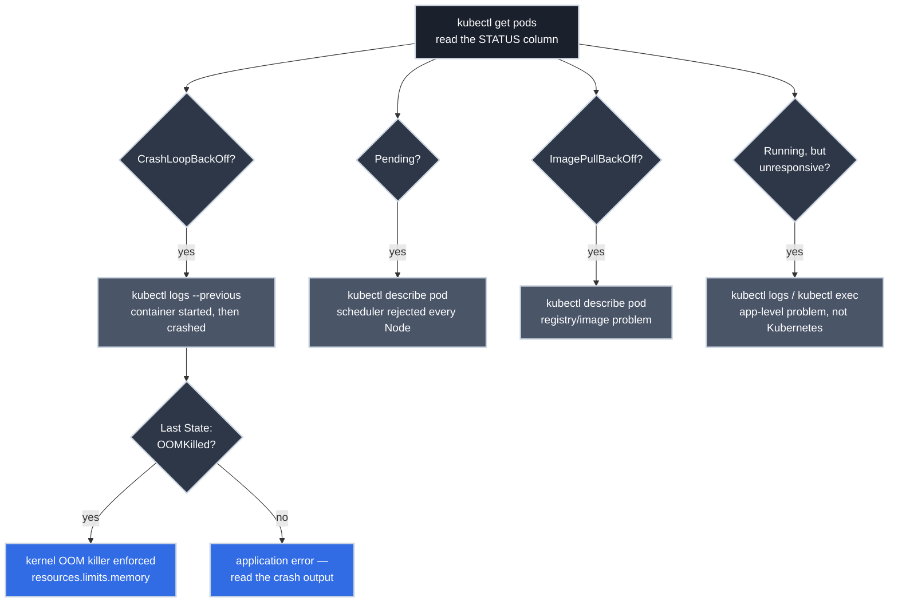

# Diagnosing Pod Failure States

<!-- PATHWAY_ROADMAP:START -->
<div class="pathway-pills" markdown>
:material-map-marker-path: <span class="pathway-pills__label">Part of a pathway:</span> [How Modern Software Really Runs on a CPU](https://bradpenney.io/pathways/cpu-to-cluster){: .pathway-pill }
</div>

??? abstract ":material-map-legend: Consult the map"

    <div class="grid cards" markdown>

    -   :material-chip: __How Modern Software Really Runs on a CPU__ — step 15 of 17

        ---

        ← [Resource Requests and Limits](https://k8s.bradpenney.io/essentials/resource_requests_limits/) · **you are here** · [Your Flux Workflow](https://gitops.bradpenney.io/day_one/your_flux_workflow/) →

        [Start the pathway →](https://bradpenney.io/pathways/cpu-to-cluster)

    </div>
<!-- PATHWAY_ROADMAP:END -->

These are the statuses you'll see in the `STATUS` column of `kubectl get pods` when something's wrong. Each maps to a small set of causes and a quick way to confirm which one you're hitting. For the Pod *lifecycle phases* themselves (Pending → Running → Succeeded/Failed), see [Pods Deep Dive](pods.md).

Most Pod problems announce themselves as one of a handful of statuses. Learn what each one is actually telling you, and the fix usually follows.



| Status | What Actually Failed | First Command |
|---|---|---|
| `CrashLoopBackOff` | The container starts, then exits repeatedly | `kubectl logs <pod> --previous` |
| `Pending` | The scheduler couldn't find a Node that qualifies | `kubectl describe pod <pod>` (Events) |
| `ImagePullBackOff` | The container image couldn't be pulled | `kubectl describe pod <pod>` (Events) |
| `OOMKilled` | The container exceeded its memory limit | `kubectl describe pod <pod>` (Last State) |
| Running, but unresponsive | The container is alive; your app inside it isn't | `kubectl logs` / `kubectl exec` |

## CrashLoopBackOff

`CrashLoopBackOff` is not a Pod phase. It's a container status that appears in `kubectl get pods` when a container starts, immediately crashes, and Kubernetes keeps trying to restart it.

**What it tells you:**

- The container started (image pulled correctly)
- The container crashed almost immediately (application error)
- Kubernetes is backing off between restart attempts (the "Backoff" part)

**What to do:**

```bash title="Investigate CrashLoopBackOff"
kubectl get pods  # (1)!
kubectl describe pod <pod-name>  # (2)!
kubectl logs <pod-name>  # (3)!
kubectl logs <pod-name> --previous  # (4)!
```

1. See the crash status.
2. Check events: often explains why.
3. Read the container's output before it crashed.
4. If the container is too fast to catch, read the previous run's logs.

The most common causes: missing environment variables, wrong command, misconfigured entrypoint, or a configuration file the app expected that isn't mounted.

## Pending: The Pod Won't Schedule

A Pod stuck in `Pending` hasn't been placed on a Node yet: the scheduler looked at every Node in the cluster and found none that qualified. **[The Kubernetes Scheduler](../efficiency/scheduler.md)** covers the two-phase filtering/scoring decision behind this; here, the diagnosis is simpler than the mechanism.

**Possible causes:**

- No Node has enough allocatable CPU or memory (`Insufficient cpu`/`Insufficient memory`)
- A taint on every eligible Node isn't tolerated by this Pod (`untolerated taint`)
- A `nodeSelector` or required affinity rule doesn't match any Node
- The container image name is wrong or the registry is inaccessible
- A required PersistentVolumeClaim doesn't exist

```bash title="Diagnose scheduling failure"
kubectl describe pod <pod-name>  # (1)!
```

1. Look at the `Events:` section at the bottom: for scheduling failures specifically, it lists exactly how many Nodes were rejected and why (e.g. `0/6 nodes are available: 4 Insufficient memory, 2 node(s) had untolerated taint`).

## ImagePullBackOff

The container image couldn't be pulled.

**Possible causes:** wrong image name, wrong tag, private registry without credentials, network issue.

```bash title="Diagnose ImagePullBackOff"
kubectl describe pod <pod-name>  # (1)!
```

1. The `Events` section shows the pull error (image not found, unauthorized, etc.).

## OOMKilled

`kubectl get pods` shows a container with `RESTARTS` climbing, and `kubectl describe pod` shows `Reason: OOMKilled`, `Exit Code: 137` under the container's Last State. The container tried to use more memory than its `resources.limits.memory` allows, and the kernel's OOM killer (the exact mechanism from [Swap and the OOM Killer](https://linux.bradpenney.io/efficiency/memory_swap_oom/), here scoped to one cgroup instead of the whole Node) terminated it.

```bash title="Confirm and Investigate an OOM Kill"
kubectl describe pod <pod-name>  # (1)!
kubectl top pod <pod-name>       # (2)!
```

```text title="What You're Looking For"
Last State:     Terminated
  Reason:       OOMKilled
  Exit Code:    137
```

1. Look at `Last State` under the specific container, not just the Pod-level Events: `OOMKilled` is a container-level termination reason.
2. Compare current usage against the configured limit, but remember `kubectl top` shows a point-in-time average; a short, sharp spike that triggered the kill can be invisible in that snapshot. This is the same "average looks fine, but it wasn't" trap covered in depth in [Resource Requests and Limits](resource_requests_limits.md), applied to memory instead of CPU.

**Possible causes:** the limit is set too low for genuine peak usage; a memory leak causing usage to climb unbounded over the container's lifetime; a batch or startup process that briefly needs far more memory than steady-state suggests. The fix is rarely "just raise the limit" without first confirming which of these it is: raising the limit on a genuine leak just delays the same kill.

## Running, but the App Doesn't Respond

`kubectl get pods` shows `Running` and `1/1 Ready`, but HTTP requests fail.

**This means:** the container is alive, but your application inside it isn't listening on the expected port, or is returning errors.

```bash title="Diagnose unresponsive app"
kubectl logs <pod-name>  # (1)!
kubectl exec -it <pod-name> -- sh  # (2)!
```

1. Look for application startup errors.
2. Check if the process is running.

## Why This Matters for Platform Work

- **The `STATUS` column is a starting point, not a diagnosis.** `Pending` and `OOMKilled` look like two words in a table, but they point to entirely different subsystems: the scheduler's placement decision versus the kernel's memory enforcement, with entirely different fixes.
- **`kubectl describe pod`'s Events section is almost always faster than guessing.** Every status in this article has a specific, readable explanation waiting in Events or Last State; reaching for it first beats reasoning from first principles every time.
- **"Just increase the limit/resources" is a fix for exactly one of these symptoms (a genuinely undersized memory limit), and a band-aid or a mistake for the others.** A CrashLoopBackOff from a missing environment variable, or a Pending from an untolerated taint, won't move an inch no matter how much CPU or memory you throw at them.

## Practice Exercises

??? question "Exercise 1: OOMKilled or CrashLoopBackOff?"

    A Pod shows `RESTARTS: 12` and status `CrashLoopBackOff`. `kubectl describe pod` shows `Last State: Terminated, Reason: OOMKilled, Exit Code: 137`. Which failure is this, actually?

    ??? tip "Solution"
        Both, in sequence. And this is a common point of confusion. `OOMKilled` is *why* the container terminated; `CrashLoopBackOff` is the *status describing the pattern of it terminating repeatedly*, regardless of the reason. The container is being OOM-killed, restarting, immediately hitting the same memory ceiling, and getting killed again: `CrashLoopBackOff` is true of any repeatedly-dying container, whether the cause is an application bug or a memory limit. Always check `Last State`'s `Reason` to find the actual root cause underneath the loop.

??? question "Exercise 2: Reading a Scheduling Failure vs. an OOM Kill"

    Two Pods are unhealthy. Pod A: `STATUS: Pending`. Pod B: `STATUS: CrashLoopBackOff`, `Last State: OOMKilled`. A teammate proposes raising memory requests and limits for both. Is that the right fix for either one?

    ??? tip "Solution"
        For Pod B, maybe: if `kubectl top` and recent history show genuine peak usage exceeding the current limit, raising it is legitimate. For Pod A, almost certainly not by itself: `Pending` means the scheduler rejected every Node, and *raising* a resource request makes that harder to satisfy, not easier. It shrinks the set of Nodes with enough allocatable capacity left. If Pod A's Events show `Insufficient memory`, the real fix is more/bigger Nodes or a smaller request; if they show `untolerated taint`, memory sizing is irrelevant entirely.

## Quick Recap

- `CrashLoopBackOff` describes a repeating pattern, not a root cause: always check `Last State`'s `Reason` underneath it.
- `Pending` is the scheduler reporting zero feasible Nodes: Events names exactly which filter rejected each one.
- `ImagePullBackOff` is a registry/image problem, confirmed in Events.
- `OOMKilled` (`Exit Code: 137`) is the kernel's OOM killer enforcing a memory limit. The same mechanism as a Linux host running out of memory, scoped to one container.
- `Running` with no response means the failure moved from Kubernetes' visibility into your application's: `kubectl logs`/`kubectl exec` from here.

## What's Next

This closes the loop on the [How Modern Software Really Runs on a CPU](https://bradpenney.io/pathways/cpu-to-cluster) pathway's Kubernetes steps. **[Your Flux Workflow](https://gitops.bradpenney.io/day_one/your_flux_workflow/)** covers how a Pod's spec (including the resource limits this article keeps referencing) gets onto the cluster declaratively in the first place.

---

## Further Reading

### Official Documentation

- [Debug Pods](https://kubernetes.io/docs/tasks/debug/debug-application/debug-pods/). The official troubleshooting walkthrough this article summarizes for common cases.
- [Determine the Reason for Pod Failure](https://kubernetes.io/docs/tasks/debug/debug-application/determine-reason-pod-failure/): container termination reasons, including `OOMKilled`, in full.

### Related Articles

- **[The Kubernetes Scheduler](../efficiency/scheduler.md):** the filtering/scoring decision behind every `Pending` Pod.
- **[Resource Requests and Limits](resource_requests_limits.md):** what a memory limit actually promises, and the CPU-throttling equivalent of the OOMKilled trap.
- **[Swap and the OOM Killer](https://linux.bradpenney.io/efficiency/memory_swap_oom/):** the same kernel mechanism behind `OOMKilled`, seen at the Linux host level instead of one container's cgroup.
