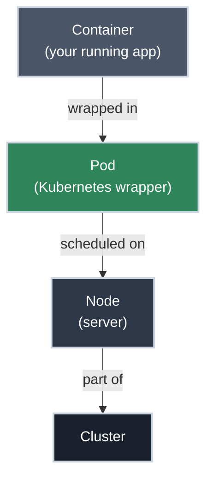

# Pods: What Actually Runs Your Application

!!! tip "Part of Essentials: Core Primitives"
    This article is part of [Essentials: Core Primitives](overview.md). Start with [Day One: Getting Started](../day_one/overview.md) if you're new to Kubernetes.

You've deployed an application. You've seen `kubectl get pods` return a name like `my-app-7c5ddbdf54-x8f9p`. You've seen `CrashLoopBackOff` in the STATUS column and felt that specific anxiety.

**Pods are where all of that actually lives.**

When you deploy to Kubernetes, you're creating Pods. When you check logs, you're reading from a Pod. When you debug, you're inspecting a Pod. When you scale, you're adding more Pods. Understanding what a Pod is — and isn't — is the single most important concept in Kubernetes.

!!! info "What You'll Learn"
    By the end of this article, you'll understand:

    - **What a Pod is** and why Kubernetes uses them instead of raw containers
    - **What containers share** inside a Pod (network, storage, lifecycle)
    - **When to use multiple containers** in one Pod (and when not to)
    - **How Pods work with init containers** — setup tasks that run before your app starts
    - **The Pod lifecycle** — the phases, what each one means, and which statuses signal trouble
    - **The essential `kubectl` commands** for creating, inspecting, and debugging Pods

---



---

## What Is a Pod?

If you've used Docker on your laptop, you're used to the container being the smallest thing you manage. In Kubernetes, there's a wrapper around your container called a **Pod**.

**The relationship:**

- Your container is your application (the code, the runtime, the dependencies)
- A Pod is the box that holds your container — plus network configuration, storage, and metadata
- Kubernetes schedules, manages, and monitors Pods (not containers directly)

**Think of it like a Linux process:** If you've worked with Linux, processes are the atomic unit the OS manages. Pods are the atomic unit Kubernetes manages. Just like you use `ps` to list running processes, you use `kubectl get pods` to list running Pods. If the Linux side feels unfamiliar, [Processes](https://linux.bradpenney.io/essentials/processes/) on the Linux site covers listing and managing them with `ps`, `top`, and signals.

A Pod can hold one container (most common) or several containers that must run together on the same node.

---

## Why Not Just Manage Containers Directly?

Kubernetes adds the Pod wrapper for one critical reason: **co-location guarantees**.

Imagine you have two containers that must run on the same physical machine to work correctly — a web server and a log collector that reads the web server's log files directly from disk. If Kubernetes managed containers individually, it might schedule them on different nodes. The log collector couldn't find the log files.

A Pod solves this by **guaranteeing all its containers run on the same node**, every time. The scheduler treats the Pod as a single unit and places all of its containers together.

---

## What Containers Share Inside a Pod

Containers inside a Pod share three things:

<div class="grid cards" markdown>

-   :material-lan: **Shared Network**

    ---

    **Why it matters:** The Pod gets one IP address. Every container inside uses `localhost` to talk to the others.

    A web server on port 8080 and a sidecar on port 9090 can communicate on `localhost:8080` and `localhost:9090` — as if they're running on the same machine, because from a network perspective they are.

    **Implication:** No two containers in the same Pod can bind to the same port number.

-   :material-harddisk: **Shared Storage (Volumes)**

    ---

    **Why it matters:** You can attach a volume to a Pod and all containers can read and write to it.

    This is how the sidecar log pattern works: the main container writes logs to `/var/log/app`, the sidecar container reads from the same path. One volume, both containers, same node.

-   :material-timer: **Shared Lifecycle**

    ---

    **Why it matters:** The Pod lives and dies as a unit.

    If the Pod is deleted, all containers inside are terminated. If the Pod is moved to a different node, the entire group moves together. You cannot keep one container alive while terminating another in the same Pod.

</div>

!!! info "How this actually works under the hood"
    The shared network and (optionally) IPC come from **shared Linux namespaces**. When the kubelet starts a Pod, it first creates a tiny `pause` container that holds the network namespace open; every application container in the Pod then *joins* that namespace instead of creating its own. That's the mechanism behind "one IP, talk over `localhost`" — they're literally in the same network namespace. The shared volumes are bind-mounted into each container's filesystem. Containers do **not** share a process namespace by default (so `ps` in one container won't see the other's processes) unless you set `shareProcessNamespace: true`. Knowing this is the difference between memorizing "Pods share a network" and understanding *why*.

---

## Pods Are Cattle, Not Pets

Pods are **disposable by design**, and Kubernetes leans on that fact constantly:

- A node fails → its Pods are deleted and recreated on a healthy node
- You roll out a new version → old Pods are killed, new Pods with the new code start
- The scheduler needs to rebalance → a Pod is evicted and rescheduled elsewhere
- Each new Pod gets a **new IP** — the old one is released back to the pool

This isn't a limitation you tolerate; it's the property that makes self-healing and zero-downtime rollouts possible. Kubernetes never edits a running Pod in place — it replaces it. A Deployment update is just "create new Pods, delete old ones" with ordering rules on top.

**The direct consequence for anything you build:** never address a Pod by its IP, and never store anything in a Pod you can't afford to lose. Pod IPs are ephemeral, so traffic goes through a **Service** ([next article](services.md)) that tracks healthy Pods and routes to whatever IPs currently exist. Local Pod storage dies with the Pod, so durable state goes to a volume backed by real storage (Mastery covers PVs/PVCs).

!!! warning "Why this matters on a shared cluster"
    Treating Pods as cattle is also what lets the scheduler pack many teams' workloads onto the same nodes and move them around freely. The moment someone treats a Pod as a pet — SSHing in to fix it by hand, depending on its IP, writing important data to its local disk — they've created a fragile snowflake that breaks the next time the scheduler does its job.

---

## Pod Lifecycle

A Pod moves through these phases:

| Phase | Meaning | What to Do |
|-------|---------|-----------|
| **Pending** | Pod accepted by cluster, but containers not yet running | Normal during scheduling; wait and watch |
| **Running** | At least one container is running | Expected steady state |
| **Succeeded** | All containers terminated successfully | Normal for Jobs and batch tasks |
| **Failed** | At least one container exited with non-zero status | Check logs with `kubectl logs` |
| **Unknown** | Node communication lost | Possible node failure; check node status |

!!! info "Statuses that aren't phases"
    Some things you'll see in the `STATUS` column — `CrashLoopBackOff`, `ImagePullBackOff`, `ContainerCreating` — aren't lifecycle *phases*; they're container-level states, usually signalling a problem. Reading them and mapping each to its fix is its own skill, covered in the **Troubleshooting** section of Essentials (Diagnosing Pod Failure States).

---

## Creating Pods

You never tell Kubernetes *how* to build a Pod step by step. You write down the Pod you want — a **manifest** — and hand it to the cluster with `kubectl apply`. Kubernetes compares what you asked for against what's actually running and makes reality match. That distinction matters more than it first sounds: the manifest is a durable description you keep in Git, not a one-off command that vanishes from your shell history. Apply the same file a hundred times and you get the same Pod; lose the file and you've lost the source of truth.

!!! warning "`kubectl run` is for experimentation only"
    There *is* an imperative shortcut — `kubectl run nginx --image=nginx:1.21` creates a Pod in a single line. **Use it for nothing but throwaway experiments.** It leaves no manifest behind: nothing in Git, nothing to review, nothing to re-apply, nothing to roll back to. Production runs off committed YAML, not shell history. Everything here is declarative: edit YAML, `kubectl apply`, commit.

### Single-Container Pod

Before the example, the shape of the thing. **Every** Kubernetes manifest — a Pod, a Service, a Deployment, a Secret — is built from the same four top-level keys. Learn them once and every resource you'll ever write is a variation on this skeleton:

- `apiVersion` — which slice of the Kubernetes API you're addressing. Core objects like Pods live in `v1`; newer or optional ones live in named groups such as `apps/v1` (Deployments) or `batch/v1` (Jobs).
- `kind` — *what* you're creating. This single word is the entire difference between a Pod and a Deployment.
- `metadata` — the object's identity: its `name`, its `namespace`, and the `labels` other resources use to find it.
- `spec` — the desired state: *what you actually want to exist*. Everything specific to this kind of object lives here.

Here's the simplest Pod worth running — a single nginx container:

```yaml title="nginx-pod.yaml" linenums="1"
apiVersion: v1  # (1)!
kind: Pod  # (2)!
metadata:
  name: nginx-pod  # (3)!
  labels:
    app: nginx  # (4)!
spec:
  containers:
  - name: nginx  # (5)!
    image: nginx:1.21  # (6)!
    ports:
    - containerPort: 80  # (7)!
```

1. `v1` is the API group for core resources like Pods and Services
2. Tells Kubernetes to create a Pod (not a Deployment or Service)
3. Pod names must be unique within a namespace
4. Labels are how Services and Deployments find this Pod — always set them
5. Container name must be unique within the Pod
6. Always pin to a specific version — never use `:latest` in real deployments
7. Documents which port the container listens on (doesn't actually open the port — that's what Services are for)

Read it top to bottom and you can now name what every block is doing: the API to talk to, the kind of object, who it is, and what it should look like. No magic — just the four keys, filled in. Hand it to the cluster:

```bash title="Apply and verify"
kubectl apply -f nginx-pod.yaml
# pod/nginx-pod created

kubectl get pods
# NAME        READY   STATUS    RESTARTS   AGE
# nginx-pod   1/1     Running   0          10s
```

That `READY 1/1` is worth reading closely: one of the Pod's one containers is ready, and `STATUS Running` means it started and hasn't crashed. A two-container Pod would read `2/2` when healthy — and the moment it shows `1/2`, you know one container is in trouble while the other carries on.

!!! warning "Use Deployments in practice"
    You'll rarely create standalone Pods directly in real work. A standalone Pod has no controller watching it, so if it crashes hard or its node dies, nothing recreates it — it's just gone. A Deployment (Efficiency tier) adds that reconciliation loop, which is why real workloads are always managed by a controller, never naked Pods.

---

## Multi-Container Patterns

### Sidecar Pattern

The most common multi-container pattern: a "helper" container that supports the main container without being part of the main application.

Notice the shape of it below: `containers:` is a **list**, and each container is its own self-contained definition that begins with a `- name:` entry. The two highlighted lines are exactly where each container's definition starts — everything indented beneath a `- name:` (its image, ports, volume mounts) belongs to *that* container until the next `- name:` begins the next one.

```yaml title="web-with-log-sidecar.yaml" linenums="1" hl_lines="9 17"
apiVersion: v1
kind: Pod
metadata:
  name: web-with-logger
  labels:
    app: web
spec:
  containers:
  - name: web-server  # (1)!
    image: nginx:1.21
    ports:
    - containerPort: 80
    volumeMounts:
    - name: shared-logs
      mountPath: /var/log/nginx  # (2)!

  - name: log-sidecar  # (3)!
    image: busybox:1.35
    command: ['sh', '-c', 'tail -f /logs/access.log']
    volumeMounts:
    - name: shared-logs
      mountPath: /logs  # (4)!

  volumes:
  - name: shared-logs  # (5)!
    emptyDir: {}
```

1. Main container — runs the application
2. nginx writes logs to `/var/log/nginx`
3. Sidecar container — reads and processes logs from the main container
4. Same volume, different mount path — the sidecar sees nginx's logs at `/logs`
5. `emptyDir` creates a temporary directory that exists for the lifetime of the Pod; both containers can read and write to it

**Key insight:** Both containers communicate through the shared volume. The web server doesn't know or care about the sidecar. The sidecar doesn't need to understand nginx — it just tails a file.

**When to use sidecars:** Log shipping, metrics collection, configuration reloading, or proxies (like Envoy/Istio service mesh proxies).

---

## Init Containers

Init containers run **before** your main application container starts. They run in sequence, each must complete successfully before the next starts, and all must succeed before the main container starts at all.

**Common use cases:**

- Wait for a dependency — a cache, message broker, or backend API — to be reachable
- Run a schema migration against your managed (external) database before the app boots
- Copy configuration files into a shared volume the main container reads

```yaml title="app-with-init.yaml" linenums="1"
apiVersion: v1
kind: Pod
metadata:
  name: app-with-init
spec:
  initContainers:
  - name: wait-for-cache  # (1)!
    image: busybox:1.35
    command: ['sh', '-c', 'until nslookup redis-svc; do echo waiting for cache; sleep 2; done']  # (2)!

  containers:
  - name: my-app  # (3)!
    image: my-company/my-app:v1.0.0
```

1. This init container runs first, before `my-app` starts
2. Loops until DNS resolves `redis-svc` — the app won't start until its cache Service exists
3. Only starts after all init containers have completed successfully

**In `kubectl get pods`:** While init containers are running, you'll see `Init:0/1` instead of `Running`. This is normal — the Pod is preparing, not failing.

---

## Working with Pods: Essential kubectl Commands

<div class="grid cards" markdown>

-   :material-eye: **Viewing Pods**

    ---

    ✅ **Safe — read-only. Use these freely.**

    ```bash title="List and inspect pods"
    kubectl get pods  # (1)!
    kubectl get pods -o wide  # (2)!
    kubectl describe pod nginx-pod  # (3)!
    kubectl get pods --watch  # (4)!
    ```

    1. List all pods in the current namespace.
    2. More detail: IP, node, status conditions.
    3. Detailed info: events, resource limits, conditions.
    4. Continuous watching (updates every few seconds).

-   :material-text-box-outline: **Reading Logs**

    ---

    ✅ **Safe — read-only.**

    ```bash title="View container logs"
    kubectl logs nginx-pod  # (1)!
    kubectl logs nginx-pod --follow  # (2)!
    kubectl logs nginx-pod --previous  # (3)!
    kubectl logs web-with-logger -c web-server  # (4)!
    kubectl logs web-with-logger -c log-sidecar
    ```

    1. Current logs.
    2. Follow (stream in real time, like `tail -f`).
    3. Previous run's logs (for CrashLoopBackOff).
    4. A specific container in a multi-container pod.

-   :material-console: **Executing Commands**

    ---

    ⚠️ **Caution — you're running commands inside a live container.**

    ```bash title="Execute commands in a running pod"
    kubectl exec nginx-pod -- ls /usr/share/nginx/html  # (1)!
    kubectl exec -it nginx-pod -- /bin/bash  # (2)!
    exit  # (3)!
    ```

    1. Run a one-off command.
    2. Open an interactive shell (if the container has `bash`/`sh`).
    3. Exit the shell.

    !!! tip "Not all containers have a shell"
        Minimal containers (distroless, scratch-based images) may not have `bash` or `sh`. Try `/bin/sh` if `/bin/bash` fails. Some containers have neither — use `kubectl describe pod` and `kubectl logs` for those.

-   :material-delete-outline: **Deleting Pods**

    ---

    🚨 **Destructive — the Pod and its local data are gone.**

    ```bash title="Delete a pod"
    kubectl delete pod nginx-pod  # (1)!
    kubectl delete -f nginx-pod.yaml  # (2)!
    ```

    1. Delete by name.
    2. Delete using the file you applied.

    !!! info "Managed pods recreate automatically"
        If the Pod was created by a Deployment or ReplicaSet, a new Pod will start immediately to replace it. This is expected — it's the self-healing behavior Kubernetes is designed for.

</div>

---

## The One-Container-Per-Pod Rule

Even though Pods can hold multiple containers, **90% of Pods in practice contain exactly one container.**

Use multiple containers in a Pod only when:

- The containers must run on the same node (shared filesystem, inter-process communication)
- They have the same lifecycle — one shouldn't be running without the other
- They're so tightly coupled that deploying them separately would be operationally painful

**The scaling signal:** If you want to run more copies of your application to handle more traffic, create more Pods — not more containers inside one Pod. Adding a second web server container to an existing Pod doesn't help (both would be on the same node, sharing the same IP). That's what Deployments and replica counts are for.

---

## Practice Exercises

??? question "Exercise 1: Shared Network — Containers Talking to Each Other"
    Container A runs your web server on port 8080. Container B is a health-check sidecar. Both are in the same Pod. How does Container B send an HTTP request to Container A?

    ??? tip "Solution"
        Container B sends the request to `localhost:8080`.

        Because all containers in a Pod share the same network namespace, they communicate using `localhost` — exactly as if they were two processes on the same machine. No Service required; no external IP needed.

??? question "Exercise 2: Scaling — Pod or Container?"
    Your web server Pod is receiving too much traffic. You want to handle more requests. Should you:

    A. Add a second web server container inside the same Pod
    B. Create a second Pod running the same web server

    ??? tip "Solution"
        **B. Create a second Pod.**

        Kubernetes scales horizontally by adding more Pods — each Pod runs on a potentially different node and gets its own IP. Adding a second container inside the same Pod doesn't help: both would share the same node and the same IP, creating a more complex single point of failure.

        This horizontal scaling (more Pods, not bigger Pods) is exactly what Deployments automate. You'll cover this in the Efficiency tier.

??? question "Exercise 3: Deploy, Inspect, and Debug"
    Create the `nginx-pod.yaml` from this article, apply it, and answer these questions using only `kubectl` commands:

    1. What node is the Pod running on?
    2. What is the Pod's IP address?
    3. What is the exact container image being used?
    4. What events occurred when the Pod started?

    ??? tip "Solution"
        ```bash title="Inspect the Pod"
        kubectl apply -f nginx-pod.yaml  # (1)!
        kubectl get pods -o wide  # (2)!
        kubectl describe pod nginx-pod  # (3)!
        ```

        1. Apply the pod.
        2. Questions 1 and 2 (node and IP): the output includes `NODE` and `IP` columns.
        3. Questions 3 and 4 (image and events): the `Containers:` section shows the image; the `Events:` section at the bottom shows the startup sequence.

        The `Events:` section in `kubectl describe` is the single most useful debugging tool in Kubernetes. Get comfortable reading it — it tells the story of everything that happened to the Pod.

---

## Quick Recap

| Concept | What to Know |
|---------|-------------|
| **Pod** | The smallest unit Kubernetes manages; wraps one or more containers |
| **Co-location** | All containers in a Pod always run on the same node |
| **Shared network** | Containers in a Pod communicate via `localhost`; Pod gets one IP |
| **Shared storage** | Volumes mounted in a Pod are accessible by all containers |
| **Ephemeral** | Pods are temporary; IP addresses change on every restart |
| **Sidecar** | A helper container in the same Pod as the main application |
| **Init containers** | Run before the main container; must succeed for the app to start |

---

## Further Reading

### Official Documentation

- [Kubernetes Docs: Pods](https://kubernetes.io/docs/concepts/workloads/pods/) - Complete Pod reference
- [Pod Lifecycle](https://kubernetes.io/docs/concepts/workloads/pods/pod-lifecycle/) - Phases, conditions, and container states
- [Init Containers](https://kubernetes.io/docs/concepts/workloads/pods/init-containers/) - How init containers work and when to use them

### Deep Dives

- [The Distributed System Toolkit: Patterns for Composite Containers](https://kubernetes.io/blog/2015/06/the-distributed-system-toolkit-patterns/) - The sidecar, ambassador, and adapter patterns from Kubernetes creator Brendan Burns
- [Kubernetes Best Practices: Resource Limits](https://cloud.google.com/blog/products/containers-kubernetes/kubernetes-best-practices-resource-requests-and-limits) - Why you should always set resource requests and limits on Pods

### Related Learning

- [Processes](https://linux.bradpenney.io/essentials/processes/) - Listing and managing Linux processes with `ps`, `top`, and signals — the OS-level parallel to managing Pods
- [Finite State Machines](https://cs.bradpenney.io/efficiency/finite_state_machines/) - Pod lifecycle phases (Pending → Running → Succeeded/Failed) are a finite state machine — understanding FSMs makes the lifecycle click

### Related Articles

- [Services: Stable Networking for Pods](services.md) - How to access Pods reliably as they come and go
- [Day One Overview](../day_one/overview.md) - The deployment skills that Pods are built on

---

## What's Next?

You understand Pods — the atomic unit of Kubernetes. But you can't connect to them directly, because their IP addresses change. That's what Services solve.

**Next:** [Services: Stable Networking for Pods](services.md) — how to expose your Pods reliably, route traffic to them, and let different parts of your application discover each other.
