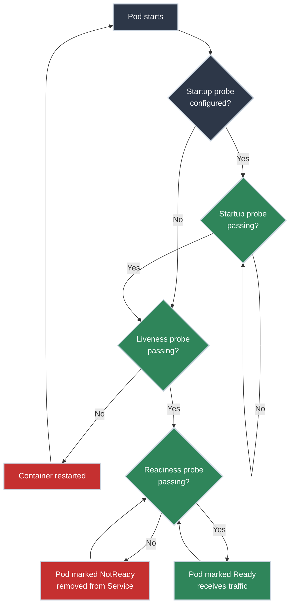

# Health Checks and Probes

!!! tip "Part of Essentials: Workloads"
    This article is part of [Essentials](overview.md) — read [Deployments](deployments.md) first.

A Pod can be `Running` and still be completely broken. The container process is alive, `kubectl get pods` shows `1/1`, and every request to it returns a 500 — because its database connection died five minutes ago and nothing restarted it. As far as Kubernetes is concerned, a `Running` container *is* healthy, unless you tell it otherwise.

**Probes are how you tell it otherwise.** They let you define "healthy" on your application's terms, and Kubernetes acts on that definition — restarting containers that are stuck, and routing traffic only to Pods that are actually ready for it.

!!! info "What You'll Learn"
    - The three probe types and what each one actually triggers when it fails
    - HTTP, TCP, and exec probe mechanisms
    - The mistake that turns a temporary outage into a permanent crash loop

---



---

## Three Probes, Three Different Actions

<div class="grid cards" markdown>

-   :material-heart-pulse: **Liveness — is it alive?**

    ---

    **On failure:** the container is restarted.

    **Use for:** deadlocks, hung state, anything a restart would actually fix.

    **Don't use for:** anything a restart *won't* fix — see below, this is the mistake almost everyone makes once.

-   :material-traffic-light: **Readiness — is it ready for traffic?**

    ---

    **On failure:** the Pod is marked `NotReady` and pulled from the owning Service's endpoints. **The container is not restarted** — it's just temporarily removed from load balancing.

    **Use for:** startup warm-up, and checking dependencies (database, cache) the app genuinely can't serve requests without.

-   :material-rocket-launch: **Startup — has it finished starting?**

    ---

    **What it does:** suspends liveness and readiness checks until it passes once. Exists for applications with long, unpredictable boot times that a normal liveness probe would kill mid-startup.

    **Use for:** legacy apps, anything that takes minutes rather than seconds to become ready.

</div>

---

## The Mistake: Checking Dependencies in the Liveness Probe

This is the single most common probe mistake, and it's worth understanding *why* it's wrong, not just that it is.

```yaml title="WRONG — liveness checks the database"
livenessProbe:
  httpGet:
    path: /healthz   # /healthz internally checks: "is the database reachable?"
    port: 8080
```

**What happens when the database has a routine hiccup:** the database is briefly unreachable → `/healthz` fails → Kubernetes restarts the container → the database is *still* unreachable (restarting your app didn't fix the database) → the new container fails its liveness probe too → restart again. You've turned a transient, five-second database blip into a crash loop that outlasts the original problem by minutes.

**The fix** is a division of labor: liveness checks only whether the process itself is stuck; readiness checks whether it can currently serve traffic, dependencies included.

```yaml title="RIGHT — dependencies belong in readiness"
readinessProbe:
  httpGet:
    path: /ready      # checks the database — if it's down, Pod is pulled from traffic
    port: 8080

livenessProbe:
  httpGet:
    path: /healthz    # only checks "is the process responding at all"
    port: 8080
```

When the database goes down under this setup: the readiness probe fails, the Pod is quietly pulled from the Service's endpoints, and traffic routes to other healthy Pods instead. Nothing restarts. When the database recovers, the readiness probe starts passing again and the Pod rejoins automatically — no crash loop, no manual intervention.

---

## Probe Mechanisms

Every example so far used `httpGet`, but that's a choice, not a requirement — Kubernetes checks a Pod's health one of three ways, and the right one depends on what the container actually exposes:

=== "HTTP"
    The most common type. Kubernetes sends an HTTP GET; success is any `2xx`/`3xx` response.

    ``` yaml title="HTTP probe" linenums="1"
    livenessProbe:
      httpGet:
        path: /healthz  # (1)!
        port: 8080  # (2)!
      initialDelaySeconds: 30
      periodSeconds: 10
      timeoutSeconds: 5
      failureThreshold: 3
    ```

    1. Your application must implement this endpoint.
    2. Container port, not the Service port.

    **Use for:** anything with an HTTP interface — most services.

=== "TCP"
    Simplest possible check: can Kubernetes open a connection to the port at all?

    ``` yaml title="TCP probe" linenums="1"
    readinessProbe:
      tcpSocket:
        port: 3306  # (1)!
      initialDelaySeconds: 5
      periodSeconds: 10
    ```

    1. e.g., 3306 for MySQL, 6379 for Redis.

    **Use for:** non-HTTP services. **Limitation:** confirms the port is listening, nothing about whether the application behind it is actually functional.

=== "Exec"
    Runs a command inside the container; success is exit code `0`.

    ``` yaml title="Exec probe" linenums="1"
    livenessProbe:
      exec:
        command:  # (1)!
        - cat
        - /tmp/healthy
      initialDelaySeconds: 5
      periodSeconds: 10
    ```

    1. Must be available inside the container — no shell, no probe.

    **Use for:** when HTTP/TCP aren't sufficient and you need custom check logic. **Caution:** forking a process per probe has real overhead; prefer HTTP when you can.

---

## Timing Fields

| Field | Purpose | Recommendation |
|-------|---------|----------------|
| `initialDelaySeconds` | Delay before the first probe | Match expected startup time, or use a startup probe instead |
| `periodSeconds` | How often to probe | 5-10s for readiness, 10-30s for liveness |
| `timeoutSeconds` | Probe timeout | 3-5s, always less than `periodSeconds` |
| `failureThreshold` | Consecutive failures before acting | 3-5 — avoids reacting to a single blip |

**A fast-starting service** (a lightweight Go binary, say) might use `initialDelaySeconds: 5` on readiness and rely on defaults elsewhere. **A slow-starting one** (a JVM app warming up for a minute or two) needs either a generous `initialDelaySeconds` or, better, a startup probe so the liveness probe isn't racing the boot sequence:

```yaml title="Startup probe covering a slow boot"
startupProbe:
  httpGet:
    path: /healthz
    port: 8080
  periodSeconds: 10
  failureThreshold: 18  # 18 × 10s = 180s max startup time allowed
livenessProbe:
  httpGet:
    path: /healthz
    port: 8080
  periodSeconds: 10
  failureThreshold: 3
```

Without the startup probe here, the liveness probe alone would start failing well before a two-minute boot finished, and Kubernetes would restart the container repeatedly — never actually letting it reach `Running`.

---

## Practice Exercises

??? question "Exercise 1: Add Probes to a Deployment"
    Add liveness and readiness probes to an nginx Deployment.

    ??? tip "Solution"
        ``` yaml title="deployment-with-probes.yaml" linenums="1"
        spec:
          template:
            spec:
              containers:
              - name: nginx
                image: nginx:1.21
                ports:
                - containerPort: 80
                livenessProbe:
                  httpGet:
                    path: /
                    port: 80
                  initialDelaySeconds: 10
                  periodSeconds: 10
                  failureThreshold: 3
                readinessProbe:
                  httpGet:
                    path: /
                    port: 80
                  initialDelaySeconds: 5
                  periodSeconds: 5
                  failureThreshold: 3
        ```

        ```bash
        kubectl apply -f deployment-with-probes.yaml
        kubectl describe pod <pod-name>
        # Events section shows probe results
        ```

??? question "Exercise 2: Spot the Bug"
    A teammate wrote this probe config for a service with a flaky third-party payment API dependency. What will happen the next time that API has an outage, and how would you fix it?

    ```yaml
    livenessProbe:
      httpGet:
        path: /healthz   # checks payment API connectivity
        port: 8080
      periodSeconds: 10
      failureThreshold: 3
    ```

    ??? tip "Solution"
        **What happens:** the payment API goes down → `/healthz` starts failing → after 3 failures (30 seconds), Kubernetes restarts the container → the payment API is still down → the new container fails too → repeated restarts until the third-party outage resolves. A dependency outage becomes a self-inflicted crash loop on your own service.

        **The fix:** move the payment-API check into a `readinessProbe`, and make `/healthz` (liveness) check only internal application state:

        ```yaml
        readinessProbe:
          httpGet:
            path: /ready   # checks payment API
            port: 8080
          periodSeconds: 5
          failureThreshold: 3
        livenessProbe:
          httpGet:
            path: /healthz   # internal state only
            port: 8080
          periodSeconds: 10
          failureThreshold: 3
        ```

        Now an outage pulls the Pod from traffic (if it can't process payments, it shouldn't receive payment requests) without restarting anything — and it rejoins automatically once the dependency recovers.

---

## Quick Recap

| Probe | Purpose | On Failure |
|------------|---------|---------------|
| **Liveness** | Is the process alive? | Container restarted |
| **Readiness** | Ready for traffic? | Pulled from Service endpoints — not restarted |
| **Startup** | Finished starting? | Delays liveness/readiness until it passes once |

**Mechanisms:** HTTP (most common), TCP (port-open check only), exec (custom command, has overhead).

**The rule that prevents crash loops:** dependencies go in readiness, never in liveness.

## What's Next?

You've covered the two things every production Deployment needs beyond a bare container image: **[Resource Requests and Limits](resource_requests_limits.md)** and probes. Production-scale probe patterns — graceful shutdown coordination with `terminationGracePeriodSeconds`, circuit-breaker readiness checks, and load-shedding under queue pressure — are platform-engineering-depth topics for when you're operating this at scale, not something you need to ship a correct Deployment today.

---

## Further Reading

### Official Documentation

- [Kubernetes Docs: Configure Liveness, Readiness, and Startup Probes](https://kubernetes.io/docs/tasks/configure-pod-container/configure-liveness-readiness-startup-probes/) - Complete probe configuration reference
- [Kubernetes Docs: Pod Lifecycle](https://kubernetes.io/docs/concepts/workloads/pods/pod-lifecycle/) - Pod phases and conditions

### Related Articles

- [Deployments](deployments.md) - Where probes live in a real Pod spec
- [Resource Requests and Limits](resource_requests_limits.md) - The other half of a production-ready Pod spec
