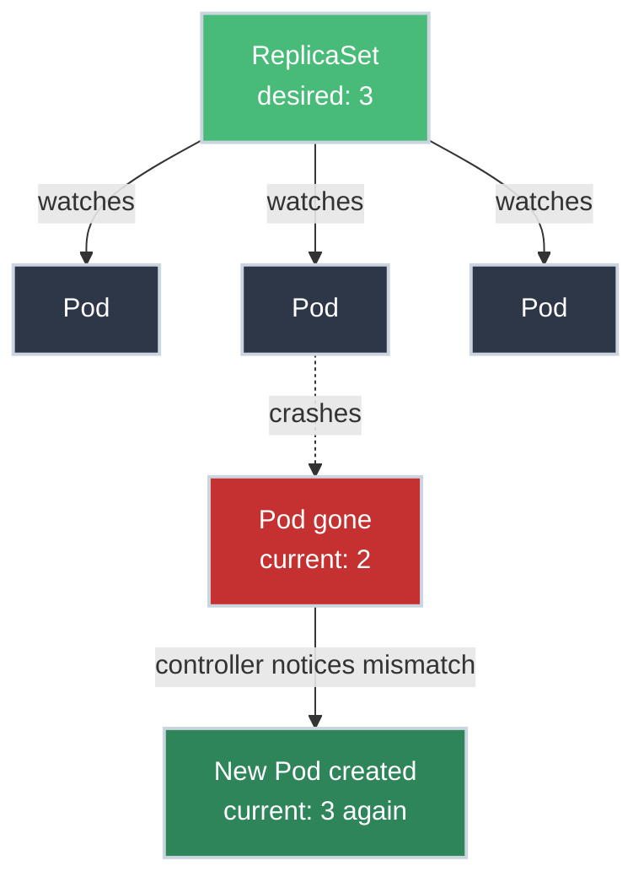

# ReplicaSets Under the Hood

!!! tip "Part of Essentials: Workloads"
    This article is part of [Essentials](overview.md) — read [Deployments](deployments.md) first.

You've been creating Deployments, which automatically create ReplicaSets. So what does a ReplicaSet actually do, and why does Kubernetes bother with the extra layer?

**Short answer:** a ReplicaSet is deliberately dumb. It has exactly two inputs — a target count, a way to find Pods — and one job: make reality match the count. No memory of versions, no rollout logic, no opinions. Everything below is a consequence of that narrowness: what a controller this simple is good at, what it can't do (hence Deployment), and what breaks when one of its two inputs goes wrong.



---

## What ReplicaSets Do

A ReplicaSet has one responsibility: **maintain a stable set of replica Pods.**

- You want 3 Pods running? It makes that true.
- A Pod crashes? It creates a replacement.
- Too many Pods somehow exist? It deletes the extras.

Think of it as a thermostat, not a manager: it doesn't know or care about application versions, rollout strategy, or history. It watches a number and corrects toward it, continuously.

A thermostat that dumb can't do everything a real deployment needs, though — which is exactly why it isn't the resource you create directly.

---

## ReplicaSet vs Deployment

<div class="grid cards two-col" markdown>

-   **ReplicaSet**

    ---
    **Purpose:** Maintain a steady Pod count

    **When you'd touch it:** Almost never directly

-   **Deployment**

    ---
    **Purpose:** Manage ReplicaSets, plus versioning

    **When you'd touch it:** Always, in production

</div>

**Why the separation exists:** a ReplicaSet only knows how to hold a count steady. It has no concept of "old version" vs "new version." A Deployment adds that layer: when you change the image, it creates a *new* ReplicaSet for the new Pod template and scales the old one down, coordinating the handoff. Splitting these means each controller has exactly one job.

``` yaml title="replicaset.yaml" linenums="1"
apiVersion: apps/v1
kind: ReplicaSet
metadata:
  name: web-rs
  labels:
    app: web
spec:
  replicas: 3  # (1)!
  selector:  # (2)!
    matchLabels:
      app: web
  template:  # (3)!
    metadata:
      labels:
        app: web
    spec:
      containers:
      - name: nginx
        image: nginx:1.21
```

1. Desired Pod count.
2. How the ReplicaSet finds the Pods it's responsible for.
3. The Pod spec to stamp out to reach that count.

Those three fields aren't a convention this site made up — they're the actual `ReplicaSetSpec` struct in the Kubernetes API source: [`Replicas`, `Selector`, `Template`, apps/v1/types.go](https://github.com/kubernetes/api/blob/v0.36.2/apps/v1/types.go#L856-L882). The YAML you write is a JSON-serializable view of that exact Go struct — nothing more mysterious than that.

!!! warning "Selector Must Match Template Labels"
    `selector` must match the labels under `template.metadata.labels`. If they diverge, the ReplicaSet creates Pods it then can't find — it'll keep creating more, since as far as it's concerned, none of them exist.

---

## How a Deployment Uses Its ReplicaSet

Those two inputs, count and selector, are all a ReplicaSet ever sees — a Deployment is the thing actually deciding what values to hand it:

```bash
kubectl create deployment web --image=nginx:1.21 --replicas=3
```

Creates three objects, layered:

1. **Deployment** (`web`)
2. **ReplicaSet** (`web-7c5ddbdf54`) — name is the Deployment name plus a hash of the Pod template
3. **3 Pods** (`web-7c5ddbdf54-xxxxx`)

```bash
kubectl get replicasets
# NAME              DESIRED   CURRENT   READY   AGE
# web-7c5ddbdf54    3         3         3       1m
```

### Rolling Updates: Two ReplicaSets, Briefly

That single ReplicaSet is the steady state. Updating the image is where the "one job, tracked by two controllers" split actually earns its keep:

```bash
kubectl set image deployment/web nginx=nginx:1.22
```

```bash
kubectl get replicasets
# NAME              DESIRED   CURRENT   READY   AGE
# web-7c5ddbdf54    0         0         0       10m  ← old version, scaled to 0
# web-5d9c8b9f7b    3         3         3       1m   ← new version
```

The old ReplicaSet isn't deleted — it's scaled to zero and kept around. That's the entire mechanism behind an instant rollback:

```bash
kubectl rollout undo deployment/web
# Scales the old ReplicaSet back up, scales the new one down
```

There's no rebuild, no re-apply. The Deployment already has the old ReplicaSet's exact template on hand.

---

## When You'd Touch a ReplicaSet Directly

**Almost never in production.** The two legitimate cases:

**Static replication with no updates ever.** Rare — the moment you need to change the image, you're back to manual delete-and-recreate, which is exactly what a Deployment automates away.

**Debugging.** Understanding what a ReplicaSet is doing is often the fastest way to understand *why* a Deployment is stuck — see below.

---

## ReplicaSet Behavior

Three scenarios, and all three are just that one dumb job — matching a count — playing out in different directions: succeeding on its own, being fought, or being switched off entirely.

### Self-Healing

The job succeeding on its own, no fight required:

```bash
kubectl delete pod web-7c5ddbdf54-xxxxx

kubectl get pods
# A replacement Pod is already being created
```

### Manual Scaling (Don't, in Production)

The job being fought, and losing:

```bash
# ⚠️ Bypasses the Deployment — it'll fight you on the next reconcile
kubectl scale replicaset web-7c5ddbdf54 --replicas=5

# Scale the Deployment instead
kubectl scale deployment web --replicas=5
```

Scaling the ReplicaSet directly works for exactly as long as the Deployment doesn't reconcile again. Since the Deployment owns the "correct" replica count, it will eventually overwrite your change. This is the same class of mistake as editing a Pod that a ReplicaSet manages: you're modifying state a controller considers its own.

### Orphaned Pods

And the job switched off entirely, deliberately:

```bash
kubectl delete replicaset web-rs --cascade=orphan
# ReplicaSet is gone; its Pods keep running, now unmanaged
```

**Blast radius:** an orphaned Pod has no controller watching it. If it crashes, nothing restarts it. Useful only for deliberate, advanced scenarios (like handing Pod ownership to a different controller), never a routine operation.

---

## Troubleshooting ReplicaSets

Every failure mode below traces back to one of the same two inputs from the top of this article: the count isn't being met, or the selector isn't finding what you expect it to (the same query mechanism from [Labels and Selectors](labels_selectors.md), just applied to a ReplicaSet instead of a Service).

### Pods Not Starting

A count problem — the ReplicaSet knows it's short, but something's stopping it from closing the gap:

```bash
kubectl describe replicaset web-7c5ddbdf54
# Check the Events section
```

Common causes: image pull errors, insufficient cluster resources for the Pod's `resources.requests` (see [Resource Requests and Limits](resource_requests_limits.md)), or an invalid Pod template.

### Wrong Number of Pods

Also a count problem, seen from the ReplicaSet's own status instead of Pod-level symptoms:

```bash
kubectl get replicaset web-7c5ddbdf54
# DESIRED   CURRENT   READY
# 3         2         2

kubectl describe replicaset web-7c5ddbdf54
# Check Events for why the 3rd Pod can't schedule
```

### Pods Not Managed by the ReplicaSet You Expect

And the other input: the selector itself, quietly not matching what you assumed it would:

```yaml
# ReplicaSet selector
spec:
  selector:
    matchLabels:
      app: web

# Pod with a near-miss label
metadata:
  labels:
    app: website  # ❌ doesn't match — this Pod is invisible to the ReplicaSet
```

The fix is always to align the label, not to assume the ReplicaSet is broken. This is a selector-matching problem, the same class you'll debug on Services.

---

## Practice Exercises

??? question "Exercise 1: Predict the Match"
    A ReplicaSet has `selector: matchLabels: {app: web}`. A Pod exists with labels `app: web, version: v2`. Another Pod exists with labels `app: Web` (capital W). Which Pod(s) does the ReplicaSet manage?

    ??? tip "Solution"
        **Only the first Pod.** Label matching is case-sensitive and exact on every key the selector names — extra labels like `version: v2` don't disqualify a match, but `Web` with a capital `W` is a different string from `web` as far as Kubernetes is concerned. The second Pod is invisible to this ReplicaSet; if nothing else manages it, it's also an orphaned, unmonitored Pod.

??? question "Exercise 2: Why Keep the Old ReplicaSet?"
    After a rolling update, `kubectl get replicasets` shows the old ReplicaSet scaled to `0/0/0` instead of deleted. Why does Kubernetes keep an object around that's doing nothing, and what would break if it were deleted immediately instead?

    ??? tip "Solution"
        **It's the entire rollback mechanism.** The scaled-down ReplicaSet still holds the exact Pod template of the previous version — image tag, env vars, everything. `kubectl rollout undo` doesn't rebuild that template from scratch; it just scales this ReplicaSet back up and the current one down. Delete it immediately and a rollback would have nothing to restore *to* — you'd be back to re-applying old YAML by hand (if you even still have it) rather than a one-command recovery. This is also why `revisionHistoryLimit` exists: keeping every old ReplicaSet forever is its own kind of clutter, so Kubernetes caps how many it retains (default 10).

---

## Quick Recap

| Concept | Explanation |
|---------|-------------|
| **ReplicaSet** | Maintains desired Pod count |
| **Deployment** | Manages ReplicaSets for versioning and updates |
| **Selector** | How a ReplicaSet finds its Pods |
| **Template** | Pod spec used to create new Pods |
| **Self-Healing** | Automatic replacement of failed Pods |
| **Rolling Update** | Two ReplicaSets, briefly — old scaled to 0, kept for rollback |

## What's Next?

Two inputs, one job, no opinions — that's the whole of a ReplicaSet, and now every behavior in this article (self-healing, the rollback trick, the selector-mismatch bugs) is a direct consequence of that narrowness rather than a separate thing to memorize. Next: **[Jobs and CronJobs](jobs_cronjobs.md)** for work that should run to completion instead of forever.

---

## Further Reading

- [Kubernetes Docs: ReplicaSet](https://kubernetes.io/docs/concepts/workloads/controllers/replicaset/) - Official reference
- [Kubernetes Docs: ReplicationController](https://kubernetes.io/docs/concepts/workloads/controllers/replicationcontroller/) - The legacy predecessor ReplicaSet replaced
- [Deployments](deployments.md) - How Deployments use ReplicaSets to manage rollouts
