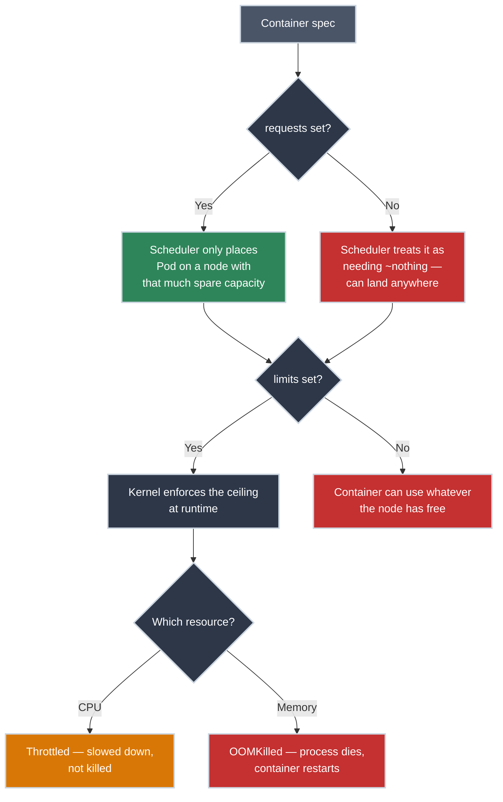

# Resource Requests and Limits: What You're Actually Promising

!!! tip "Part of Essentials: Workloads"
    This article is part of [Essentials](overview.md) — read [Deployments](deployments.md) first.

Here's a scenario that confuses almost everyone the first time it happens: your service's CPU usage graph shows a calm, flat line at 40% of its limit. Latency dashboards show periodic spikes anyway — a request that should take 10ms occasionally takes 400ms. Nothing in `kubectl top` explains it. `kubectl describe pod` eventually does: `cpu throttled`.

The pod was never close to its limit — *on average*. That distinction is the single most misunderstood thing about Kubernetes resource management, and it's worth understanding precisely, because "just raise the limit" is usually not the fix.

!!! info "What You'll Learn"
    - What `requests` actually control (scheduling) versus what `limits` actually control (runtime enforcement)
    - Why CPU and memory fail in completely different ways when a container hits its ceiling
    - **The throttling gotcha**: why low *average* CPU usage doesn't mean you're safe from limits
    - A sane starting point for setting both, without needing platform-admin depth yet

---



---

## Requests and Limits Are Two Different Promises

<div class="grid cards two-col" markdown>

-   :material-hand-extended: **Requests: a scheduling promise**

    ---

    **What it actually does:** the scheduler will only place your Pod on a node that has at least this much CPU and memory unclaimed. Nothing more.

    ``` yaml title="deployment-with-requests.yaml" linenums="1"
    spec:
      containers:
      - name: nginx
        image: nginx:1.21
        resources:
          requests:
            cpu: "250m"        # (1)!
            memory: "256Mi"    # (2)!
    ```

    1. 250 millicores — a quarter of one CPU core.
    2. 256 mebibytes.

    **What it is not:** a dedicated, walled-off slice of CPU that's yours alone. Under contention, `requests` become the *relative weight* the kernel uses to divide leftover CPU between containers, closer to "shares" than "reservation." If nothing else on the node wants that CPU, your container can burst well past its request for free.

-   :material-speedometer: **Limits: a runtime ceiling**

    ---

    **What it actually does:** caps how much of that resource the container is *allowed* to use once it's running, enforced by the kernel, not the scheduler.

    ``` yaml title="deployment-with-limits.yaml" linenums="1"
    spec:
      containers:
      - name: nginx
        image: nginx:1.21
        resources:
          requests:
            cpu: "250m"
            memory: "256Mi"
          limits:
            cpu: "500m"        # (1)!
            memory: "512Mi"    # (2)!
    ```

    1. Hard CPU ceiling — exceeding it doesn't crash you, see below.
    2. Hard memory ceiling — exceeding it does crash you.

    **The asymmetry that matters:** CPU and memory are enforced completely differently, because one is *compressible* and the other isn't.

</div>

---

## CPU and Memory Fail Differently

That asymmetry from the cards above has a concrete consequence the moment a container actually hits its ceiling — CPU and memory don't fail the same way, and knowing which one you're looking at changes how you debug it:

=== "CPU — throttled, not killed"
    CPU is **compressible**: the kernel can just give a process less of it, moment to moment, without destroying anything. Exceed your CPU limit and the container isn't killed — it's throttled, meaning the kernel refuses it CPU time until the next accounting window. Your process is still alive; it's just waiting.

    - `100m` = 0.1 of a core
    - `500m` = half a core
    - `1000m` or `1` = one full core

    **What throttling looks like from the outside:** requests get slower, not rejected. No error, no restart, no obvious signal in a Pod's status: you have to go looking for it (`kubectl describe pod`, `container_cpu_cfs_throttled_periods_total` if you have metrics).

=== "Memory — OOMKilled, not throttled"
    Memory is **incompressible**: there's no "slow down and use less RAM" the kernel can ask a process to do. Exceed your memory limit and the kernel kills the container outright — `OOMKilled`, exit code 137 (128 + signal 9, `SIGKILL`).

    - `256Mi` = roughly 268 MB
    - `1Gi` = roughly 1.07 GB

    **What it looks like from the outside:** a hard, visible failure. The Pod restarts (if `restartPolicy` allows it), and `kubectl describe pod` shows `Last State: Terminated, Reason: OOMKilled` immediately. Unlike CPU throttling, this is loud — which, in a strange way, makes it the easier of the two problems to diagnose.

---

## The Part That Actually Confuses People: CPU Throttling With Room to Spare

This is the mechanism behind the opening scenario, and it's worth understanding precisely rather than just memorizing "CPU limits can be bad."

None of this is Kubernetes-specific: a `resources.limits.cpu` value is Kubernetes configuring the Linux [CFS cgroups controller](https://linux.bradpenney.io/efficiency/namespaces_cgroups/) underneath the container, via that controller's own `cpu.max` quota-per-period setting. The kernel enforces a CPU limit using a **quota over a fixed period** — by default, a 100-millisecond window. A `500m` limit doesn't mean "never exceed 50% of a core, smoothly" — it means "in any given 100ms window, this container gets a total of 50ms of CPU time across however many threads it runs, then it's cut off until the next window starts."

That's fine for a single-threaded process trickling out CPU evenly. It's a trap for anything with multiple threads or a Go/Java-style runtime that parallelizes work across cores: if your container briefly uses 4 threads at once (a request handler, a GC pass, a background goroutine, a logging flush, all landing in the same few milliseconds), it can burn through the *entire 100ms quota in under 10ms of wall-clock time*, then sit throttled for the remaining 90ms of that window. Do that a few times a second and you get exactly what the opening scenario described: a CPU graph averaged over a minute that looks nowhere near the limit, and real, repeated latency spikes that the averaged graph completely hides.

!!! warning "Averages Hide This On Purpose"
    `kubectl top` and most dashboards report CPU as a time-averaged percentage. Throttling happens in sub-period bursts far shorter than any sampling interval you're likely watching. **"My CPU graph looks fine" is not evidence you aren't being throttled** — check throttling directly, not usage.

**What this means in practice, not just in theory:**

- **Set CPU `requests` generously and honestly** — they drive scheduling fairness and cost you nothing extra if the node has spare capacity.
- **Think hard before setting a CPU `limit` at all**, especially on latency-sensitive, multi-threaded, or multi-core-aware services. Many production teams deliberately request CPU but leave it unlimited, accepting that a runaway process could consume free node capacity, and defend against that at the namespace level instead with a [`ResourceQuota`](namespaces.md).
- **Always set a memory `limit`.** There's no equivalent throttling escape hatch for memory: an unbounded container can take down its neighbors by consuming everything the node has, and unlike CPU there's no graceful degradation to fall back on.
- If you *do* need a CPU limit (multi-tenant clusters where a noisy neighbor is a real risk, cost-control mandates), set it well above your actual steady-state usage rather than tight against it, and watch throttling metrics, not just usage, to know if it's biting.

---

## Recognizing OOMKilled

CPU throttling hides; memory limits do the opposite. Here's what it looks like the moment it happens:

```bash title="A Pod that hit its memory limit"
kubectl get pods
# NAME                      READY   STATUS      RESTARTS   AGE
# web-app-7c5ddbdf54-2xkqn  0/1     OOMKilled   3          5m

kubectl describe pod web-app-7c5ddbdf54-2xkqn
# Last State:     Terminated
#   Reason:       OOMKilled
#   Exit Code:    137
```

The three usual causes: a genuine memory leak (usage climbs steadily, restarts happen at roughly the same uptime each time — check with `kubectl top pod` over time), a limit set too low for legitimate peak usage (correlates with traffic spikes or specific operations, not steady climb), or a startup spike where initialization briefly needs more memory than steady-state operation does. Reading logs from before the kill with `kubectl logs --previous` and distinguishing these three causes with confidence is Mastery-tier depth, not something you need to master to ship a correct Deployment today. The namespace-level side of this, capping aggregate consumption with a [`ResourceQuota`, and setting per-container defaults with a `LimitRange`](namespaces.md), is Essentials-tier and worth knowing now: it's what a platform engineer reaches for to stop one noisy namespace from starving everyone else on a shared cluster.

---

## Setting Sane Starting Values

You don't need to get this perfect on day one — you need to not leave it blank.

1. **Never ship `resources: {}`.** An empty or missing block means the scheduler treats your Pod as needing almost nothing, and there's no ceiling on what it can consume at runtime. That Pod is also first in line to be evicted if the node comes under memory pressure — you've opted into being the noisy neighbor *and* the first casualty.
2. **Run it under real load, then look at `kubectl top pod`.** Guessing numbers before you've seen actual usage is how you end up either starving your own Pod or wasting a rack's worth of unused capacity.
3. **Set `requests` near typical usage, `limits.memory` above observed peak with real headroom** (20-30% is a reasonable starting buffer, not a rule).
4. **For CPU, default to requesting what you need and skipping a hard limit** unless you have a specific reason (see above) — then revisit once you have real throttling data, not before.

---

## Practice Exercises

??? question "Exercise 1: Diagnose the Opening Scenario"
    A service shows steady 35% CPU usage on its dashboard (limit: `1000m`, so it's using roughly 350m on average) but users report intermittent slow requests with no corresponding error logs. What's the most likely cause, and what would you check to confirm it — not fix it, just confirm it?

    ??? tip "Solution"
        **Most likely cause:** CPU throttling within short bursts that a time-averaged graph doesn't show. The service is probably multi-threaded (or running a runtime with background GC/scheduling threads) and occasionally spikes across several threads at once, exhausting its 100ms quota in a few milliseconds, then sitting throttled for the rest of that window.

        **To confirm (not fix):**

        ```bash
        kubectl describe pod <pod-name>
        # look for throttling-related events, though these are often not surfaced here directly

        kubectl top pod <pod-name>
        # confirm the average really is well under the limit — rules out "limit is just too low overall"
        ```

        If you have cluster metrics (Prometheus/cAdvisor), `container_cpu_cfs_throttled_periods_total` climbing steadily while `container_cpu_usage_seconds_total` looks flat is the direct confirmation. Without metrics infrastructure, the pattern itself (flat average, real latency spikes, no errors) is strong circumstantial evidence — this is exactly why "the graph looks fine" isn't reassuring on its own.

??? question "Exercise 2: Choose Requests and Limits"
    You're deploying a new API service. Load testing shows it steady-state uses about 150m CPU and 180Mi memory, with brief startup spikes to 300Mi while it warms an in-memory cache. What would you set, and why?

    ??? tip "Solution"
        ```yaml
        resources:
          requests:
            cpu: "150m"      # matches observed steady-state — honest scheduling promise
            memory: "256Mi"  # a bit above steady-state, not startup peak
          limits:
            memory: "384Mi"  # above the 300Mi startup spike, with headroom
            # no CPU limit set — a single API service isn't the multi-tenant-noisy-neighbor
            # case that justifies fighting the throttling risk described above
        ```

        **What you learned:** the memory limit has to clear the *startup* peak, not just steady-state, or you'll OOMKill the Pod every time it boots. The CPU decision is deliberate, not an oversight — for a service like this, requesting honestly and skipping the limit avoids trading a real throttling risk for a hypothetical noisy-neighbor problem this workload doesn't actually present.

---

## Quick Recap

| Concept | What to Know |
|---------|---------------|
| **Requests** | Scheduling promise + relative CPU share under contention — not a hard reservation |
| **Limits** | Runtime ceiling enforced by the kernel |
| **CPU over limit** | Throttled — slowed down, not killed, and often invisible on averaged graphs |
| **Memory over limit** | OOMKilled — process killed immediately, exit code `137` |
| **CFS quota/period** | Limits are enforced per ~100ms window, not smoothly — bursty multi-threaded apps can be throttled well under their average |
| **`resources: {}`** | Worst of both worlds: unpredictable scheduling, no runtime ceiling, first evicted under pressure |

## What's Next?

You've covered the half of "is my Pod actually production-ready" that concerns the kernel. The other half concerns Kubernetes' own traffic routing: **[Health Checks and Probes](probes.md)** — how Kubernetes decides a Pod is actually ready to receive requests, not just running.

---

## Further Reading

### Official Documentation

- [Kubernetes Docs: Managing Resources for Containers](https://kubernetes.io/docs/concepts/configuration/manage-resources-containers/) - Comprehensive requests/limits reference
- [Kubernetes Docs: CPU Management Policies](https://kubernetes.io/docs/tasks/administer-cluster/cpu-management-policies/) - CPU pinning, isolation, and the mechanisms behind CFS enforcement

### Related Articles

- [Deployments](deployments.md) - Where `resources` lives in a real Pod spec
- [Health Checks and Probes](probes.md) - The other half of a production-ready Pod spec
