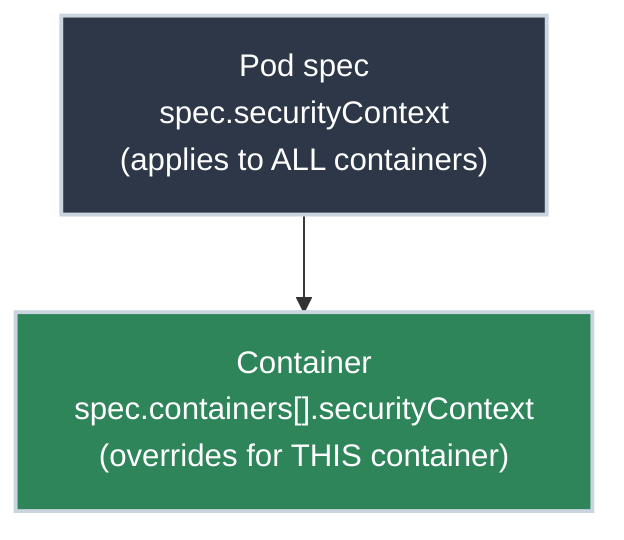

# Securing Your Containers

!!! tip "Part of [Essentials: Security](security_overview.md)"
    This is the first article in the Security section. `securityContext` is a field *inside* the [Pod spec](pods.md) you already know — this is that spec used deliberately.

A container runs fine, ships, and gets forgotten — until a security review flags it or the cluster suddenly refuses to schedule it. The cause is almost always the same: by default a container runs as **root**, holding far more privilege than the workload will ever use. That default is the difference between "a compromised container" and "a compromised container with root, one kernel bug away from the node."

Closing that gap lives in YAML you already write and takes about ten lines. The field is `securityContext`, and it's the highest security-per-line-of-YAML you'll find in Kubernetes — which is exactly why the `restricted` Pod Security Standard (later in this section) ends up *requiring* most of it.

## What You'll Learn

- What `securityContext` is and where it sits in your Pod spec
- The four settings that deliver most of the value: non-root user, read-only filesystem, dropped capabilities, and no privilege escalation
- How to apply them without breaking your app
- The common gotchas (and how to work around them)

## Where securityContext Lives

`securityContext` can be set in two places, and the difference matters:



- **Pod-level** (`spec.securityContext`) sets defaults for every container in the Pod — good for things like the user ID.
- **Container-level** (`spec.containers[].securityContext`) applies to one container and *overrides* the Pod-level setting — good for per-container details like the filesystem and capabilities.

When in doubt, set user/group at the Pod level and the filesystem/capabilities at the container level. The full example at the end shows both.

## The Four Settings That Matter

<div class="grid cards" markdown>

-   :material-account-off: **Run as a non-root user**

    ---

    **Why it matters:** If your container is compromised and it's running as root, the attacker has root *inside* the container — a far better launchpad for escaping to the node. Most apps don't need root at all.

    ``` yaml title="Non-root user"
    securityContext:
      runAsNonRoot: true  # (1)!
      runAsUser: 1000     # (2)!
    ```

    1. Kubernetes refuses to start the container if the image would run as root
    2. Run as UID 1000 instead

-   :material-harddisk-remove: **Read-only root filesystem**

    ---

    **Why it matters:** A read-only filesystem means an attacker can't drop a malicious binary or modify your app's files at runtime. Most apps only need to write to a temp directory — which you can grant explicitly.

    ``` yaml title="Read-only filesystem"
    securityContext:
      readOnlyRootFilesystem: true  # (1)!
    ```

    1. The container's root filesystem is mounted read-only

-   :material-format-list-checks: **Drop Linux capabilities**

    ---

    **Why it matters:** Containers get a set of Linux "capabilities" (fine-grained root powers) by default. Your web app almost certainly needs none of them. Drop them all; add back only what you can name.

    ``` yaml title="Drop all capabilities"
    securityContext:
      capabilities:
        drop:
          - ALL  # (1)!
    ```

    1. Removes every default capability — add specific ones back only if needed

-   :material-arrow-up-bold-box: **Block privilege escalation**

    ---

    **Why it matters:** This stops a process from gaining *more* privileges than its parent (for example, via a `setuid` binary). There's rarely a legitimate reason for an app container to need this.

    ``` yaml title="No privilege escalation"
    securityContext:
      allowPrivilegeEscalation: false  # (1)!
    ```

    1. A process can never gain more privileges than it started with

</div>

## Putting It Together

Here's a Deployment with all four settings applied. This is a sensible, copy-pasteable baseline for a typical stateless web app:

``` yaml title="deployment.yaml" linenums="1"
apiVersion: apps/v1
kind: Deployment
metadata:
  name: web
spec:
  replicas: 2
  selector:
    matchLabels:
      app: web
  template:
    metadata:
      labels:
        app: web
    spec:
      securityContext:        # (1)!
        runAsNonRoot: true
        runAsUser: 1000
        fsGroup: 1000         # (2)!
      containers:
        - name: web
          image: nginxinc/nginx-unprivileged:1.27  # (3)!
          ports:
            - containerPort: 8080  # (4)!
          securityContext:    # (5)!
            readOnlyRootFilesystem: true
            allowPrivilegeEscalation: false
            capabilities:
              drop:
                - ALL
          volumeMounts:
            - name: tmp
              mountPath: /tmp   # (6)!
      volumes:
        - name: tmp
          emptyDir: {}          # (7)!
```

1. Pod-level: every container runs as UID 1000, non-root
2. `fsGroup` makes mounted volumes owned by group 1000 so the non-root user can write to them
3. An image *built* to run unprivileged — note it listens on 8080, not 80
4. Non-root users can't bind ports below 1024, so the app uses 8080
5. Container-level hardening: read-only FS, no escalation, no capabilities
6. The app still needs *somewhere* to write — we mount a writable temp dir
7. `emptyDir` is an ephemeral scratch volume, wiped when the Pod restarts

!!! success "Verify it (read-only, safe)"
    After deploying, confirm the container is actually running as you intended:

    ``` bash title="Check the running user"
    kubectl exec deploy/web -- id
    # uid=1000 gid=0 groups=1000
    ```

    `kubectl exec` and `kubectl get` are read-only here — you're inspecting, not changing anything.

## Watch Out For

Hardening breaks apps that assumed they had root. These are the three you'll hit most:

!!! warning "Common breakages"
    **"The app crashes with a permission error on startup."**
    It's trying to write to its root filesystem. Find what it writes (often `/tmp`, a cache, or a PID file) and mount an `emptyDir` volume there, as in the example above.

    **"`runAsNonRoot: true` won't start — `container has runAsNonRoot and image will run as root`."**
    The *image* defaults to root. Either pick an image built to run unprivileged (like `nginx-unprivileged`), or set an explicit `runAsUser`, or rebuild the image with a `USER` instruction.

    **"My app needs to listen on port 80."**
    Non-root processes can't bind ports below 1024. Listen on a high port (8080) inside the container; your Service can still expose port 80 externally and route to `targetPort: 8080`.

## Practice Exercises

??? question "Exercise 1: Spot the risky Pod"
    A teammate's Pod spec has *no* `securityContext` at all. Without changing anything, what user is the container most likely running as, and how would you confirm it?

    ??? tip "Solution"
        Without a `securityContext`, the container runs as whatever user the **image** specifies — and most base images default to **root (UID 0)**.

        Confirm it with a read-only command:

        ``` bash title="Check the user (read-only)"
        kubectl exec deploy/their-app -- id
        # uid=0(root) gid=0(root) groups=0(root)
        ```

        Seeing `uid=0(root)` is the signal that this Pod should be hardened.

??? question "Exercise 2: Make a writable temp dir"
    You've set `readOnlyRootFilesystem: true` and now your app crashes because it writes session files to `/var/cache/app`. How do you fix it *without* removing the read-only filesystem?

    ??? tip "Solution"
        Mount a writable `emptyDir` volume at exactly that path. The root filesystem stays read-only; only the mounted path is writable.

        ``` yaml title="Writable cache, read-only root"
        spec:
          containers:
            - name: app
              securityContext:
                readOnlyRootFilesystem: true
              volumeMounts:
                - name: cache
                  mountPath: /var/cache/app
          volumes:
            - name: cache
              emptyDir: {}
        ```

        **What you learned:** A read-only root filesystem doesn't mean *no* writes — it means you grant writable paths explicitly, one mount at a time.

## Quick Recap

| Setting | What it does | Default (unsafe) |
| :--- | :--- | :--- |
| `runAsNonRoot: true` | Refuses to run the container as root | Runs as image's user (often root) |
| `runAsUser: 1000` | Sets the user ID explicitly | Image default |
| `readOnlyRootFilesystem: true` | Blocks writes to the root filesystem | Writable |
| `capabilities.drop: [ALL]` | Removes default Linux capabilities | A default set is granted |
| `allowPrivilegeEscalation: false` | Prevents gaining more privileges | Allowed |

## What's Next?

You've hardened *how* your container runs. Next in this section: **[Handling Secrets Safely](handling_secrets.md)** — making sure the credentials your app needs don't end up baked into the image or leaked in plaintext.

## Further Reading

### Official Documentation

- [Configure a Security Context for a Pod or Container](https://kubernetes.io/docs/tasks/configure-pod-container/security-context/) - The canonical reference for every field
- [Pod Security Standards](https://kubernetes.io/docs/concepts/security/pod-security-standards/) - The `baseline` and `restricted` profiles these settings satisfy

### Deep Dives

- [Linux Capabilities (capabilities(7))](https://man7.org/linux/man-pages/man7/capabilities.7.html) - What each capability actually grants
- [NSA/CISA Kubernetes Hardening Guidance](https://www.cisa.gov/news-events/alerts/2022/03/15/updated-kubernetes-hardening-guidance) - The non-root, least-privilege rationale in context

### Related Articles

- [Pods Deep Dive](pods.md) - The Pod spec that `securityContext` lives inside
- [Essentials: Security Overview](security_overview.md) - The rest of the Security section
