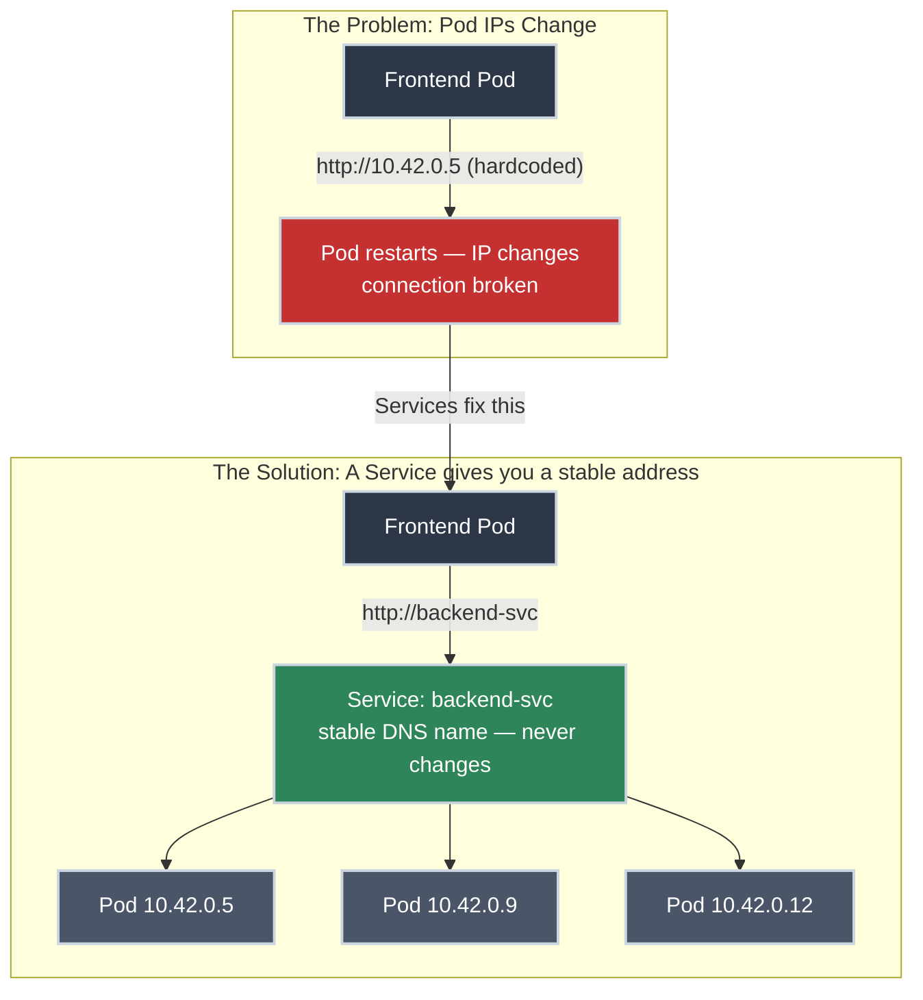
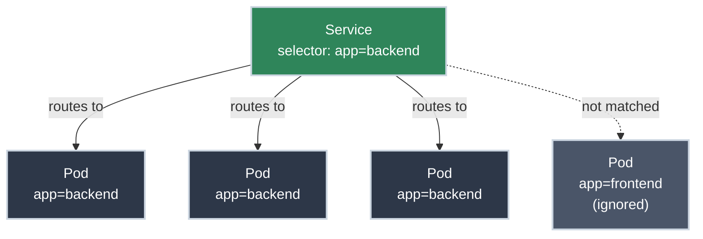

# Services: How Your Apps Talk to Each Other

!!! tip "Part of Essentials: Core Primitives"
    This article is part of [Essentials: Core Primitives](overview.md). Make sure you've read [Pods: The Atomic Unit](pods.md) first — Services only make sense once you understand why Pod IPs are unreliable.

You have a frontend app that needs to call a backend API. The backend is running in three Pods. What URL do you hardcode in your frontend config?

The answer is: **you don't hardcode a URL at all.** You create a Service.

Services provide a permanent name and IP address for a group of Pods — even as those Pods die, restart, and get replaced with new IPs dozens of times a day.

!!! info "What You'll Learn"
    By the end of this article, you'll understand:

    - **Why Pod IPs can't be used directly** — and what Services do instead
    - **How Services find Pods** using labels and selectors
    - **The three Service types** — ClusterIP, NodePort, and LoadBalancer — and when to use each
    - **Port-forwarding** — how to access a Service from your local machine during development
    - **Essential `kubectl` commands** for creating and debugging Services

---



---

## The Networking Problem Services Solve

In the [Pods article](pods.md), we established that Pods are temporary. Every time a Pod restarts — whether from a crash, a deployment update, or a node failure — it gets a **new IP address**. The old IP is gone.

If you hardcode `http://10.42.0.5` in your frontend config, you're one deployment away from a broken application. And even if you tried to keep up with changing IPs, you'd miss the load balancing across all three backend Pods.

**Services solve this with two things:**

1. A **stable virtual IP** that never changes (called the ClusterIP)
2. A **stable DNS name** you can use in application code (like `http://backend-svc`)

Kubernetes continuously tracks which Pods are healthy and updates the routing behind the scenes. Your application never needs to know or care which Pods are currently running.

---

## How Services Find Pods: Labels and Selectors

A Service doesn't hardcode Pod names or IPs — it uses **label selectors** to dynamically find matching Pods.

1. You give your Pods a label: `app: backend`
2. You configure the Service to select Pods with `app: backend`
3. Kubernetes continuously scans the cluster and routes traffic to any running Pod matching that label



When a Pod dies, Kubernetes removes it from the Service's routing list automatically. When a new Pod with the right label starts, it's added. You don't manage this — Kubernetes does.

Labels and selectors aren't just a Service feature — they're the query layer the whole cluster runs on. This is enough to make Services work; for the full picture (set-based selectors, the recommended label set, and the design rationale), see **[Labels and Selectors](labels_selectors.md)**.

!!! info "What's actually doing the work"
    There's no proxy process sitting in the request path for a ClusterIP Service — the "virtual IP" is a routing illusion maintained on every node. Two Kubernetes components make it happen:

    - **The EndpointSlice controller** watches Pods matching the Service's selector and keeps a list of their current IP:port pairs (the `Endpoints` / `EndpointSlice` objects). This is the live membership list — when a Pod's readiness probe fails, it's pulled from here, which is *why* a NotReady Pod stops receiving traffic.
    - **`kube-proxy`** runs on every node, watches those EndpointSlices, and programs the kernel — **iptables** rules or, on larger clusters, **IPVS** — so that any packet sent to the ClusterIP is DNAT'd to one of the real Pod IPs, load-balanced roughly evenly.

    So a Service is really *cluster-side bookkeeping plus per-node kernel rules*. When traffic mysteriously isn't balancing or a "dead" Pod still gets hits, this is the layer you're debugging — start with `kubectl get endpointslices`.

---

## Service Types

The type of Service you create determines **who can reach it**.

=== ":material-lock: ClusterIP (default)"

    **Why it matters:** The most secure option. Traffic can only come from inside the cluster — other Pods, internal tools, but nothing external.

    **When to use it:** Any service that should only be reachable by other parts of your application.

    - Gets a stable cluster-internal IP (e.g., `10.96.45.123`)
    - Reachable by DNS name from within the cluster (e.g., `http://backend-svc`)
    - **Not** reachable from outside the cluster

    **Example:** A backend API only your frontend calls. An internal cache. A worker queue processor.

=== ":material-network: NodePort"

    **Why it matters:** Exposes the Service on a specific port on every node's IP address — accessible from outside the cluster without cloud infrastructure.

    **When to use it:** Development testing, on-premise clusters without a cloud load balancer.

    - Port range: 30000–32767
    - Accessible at `<NodeIP>:<NodePort>` from outside the cluster
    - Less production-ready than LoadBalancer (requires knowing node IPs)

=== ":material-cloud: LoadBalancer"

    **Why it matters:** Provisions a real external load balancer from your cloud provider (AWS, GCP, Azure), giving you a public IP with managed traffic distribution.

    **When to use it:** Exposing public-facing services in cloud-hosted clusters.

    - Cloud provider creates an actual load balancer (costs money)
    - You get a stable external IP from the cloud provider
    - Requires cloud support (EKS, GKE, AKS all do; bare-metal needs MetalLB)

---

## Creating a ClusterIP Service

ClusterIP is the type you'll use most — any service that other Pods in your cluster need to reach.

```yaml title="backend-service.yaml" linenums="1"
apiVersion: v1
kind: Service
metadata:
  name: backend-svc  # (1)!
spec:
  type: ClusterIP  # (2)!
  selector:
    app: backend  # (3)!
  ports:
  - protocol: TCP
    port: 80  # (4)!
    targetPort: 8080  # (5)!
```

1. The Service name becomes the DNS hostname — other Pods call `http://backend-svc`
2. ClusterIP is the default; you can omit `type` and get this automatically
3. Routes traffic to any Pod with `app: backend` as a label
4. The port the Service listens on (what callers connect to)
5. The port the Pods are actually listening on — can differ from `port`

```bash title="Apply and verify"
kubectl apply -f backend-service.yaml
# service/backend-svc created

kubectl get services
# NAME           TYPE        CLUSTER-IP      EXTERNAL-IP   PORT(S)   AGE
# backend-svc    ClusterIP   10.96.45.123    <none>        80/TCP    5s
```

Once the Service exists, any Pod in the same namespace can reach it at `http://backend-svc` — no IP addresses required. Kubernetes DNS handles the rest.

---

## Port-Forwarding: Local Development Access

For development — "I just want to hit this endpoint from my laptop to test it" — `kubectl port-forward` creates a tunnel from your local machine to a Service in the cluster.

```bash title="Forward a local port to a Service"
kubectl port-forward service/backend-svc 8080:80
# Forwarding from 127.0.0.1:8080 -> 80
```

Open your browser to `http://localhost:8080` — you're hitting the Service in the cluster.

!!! tip "Port-forward stays active until you press Ctrl+C"
    It's a temporary tunnel, not a permanent connection. Use it for quick tests and debugging sessions.

---

## Essential kubectl Commands

```bash title="Read-only — safe to run anytime"
kubectl get svc  # (1)!
kubectl describe service backend-svc  # (2)!
kubectl get endpoints backend-svc  # (3)!
# NAME          ENDPOINTS                         AGE
# backend-svc   10.42.0.5:8080,10.42.0.9:8080   5m
```

1. List all services in the current namespace.
2. Show service details: selector, endpoints, events.
3. Show the actual Pod IPs behind a service.

When a Service exists but traffic reaches nothing, its selector almost certainly matches no Pods and the endpoint list is empty. Diagnosing and fixing that mismatch is its own topic, covered in the Troubleshooting section.

---

## Practice Exercises

??? question "Exercise 1: Label Selectors"
    A Service has the selector `app: web`. You have three Pods with these labels:

    - Pod A: `app: web, tier: frontend`
    - Pod B: `app: api, tier: backend`
    - Pod C: `app: web, version: v2`

    Which Pods receive traffic from this Service?

    ??? tip "Solution"
        **Pod A and Pod C.**

        A Service's selector is an "AND" condition — the Pod must have **all** specified labels to match. Pod A has `app: web` ✅. Pod C has `app: web` ✅. Pod B has `app: api` ❌ — doesn't match.

        Having **extra** labels on a Pod (like `tier: frontend` or `version: v2`) doesn't prevent a match. Only the absence of required labels matters.

??? question "Exercise 2: Service Type Selection"
    You're working on a microservices app with these components:

    1. A payments API — should only be reachable by your order service, never from the internet
    2. A public web frontend — needs to be accessible from the internet on AWS EKS
    3. An internal metrics dashboard — you want to access it from your laptop during development

    What Service type (or tool) fits each scenario?

    ??? tip "Solution"
        1. **ClusterIP** — The payments API should never be exposed externally. ClusterIP restricts access to inside the cluster only.

        2. **LoadBalancer** — On AWS EKS, LoadBalancer provisions an AWS ALB/NLB automatically with a public IP.

        3. **`kubectl port-forward`** — For dev-only access, port-forwarding to a ClusterIP Service is the right approach. No need to expose it externally.

??? question "Exercise 3: Debug a Broken Service"
    You deployed a Service named `my-svc` with selector `app: backend`. Pods are running, but `kubectl get endpoints my-svc` shows `<none>`. What's the most likely cause and how do you confirm it?

    ??? tip "Solution"
        The Service selector doesn't match the Pod labels.

        ```bash title="Diagnose Service selector mismatch"
        kubectl describe service my-svc  # (1)!
        # Selector: app=backend

        kubectl get pods --show-labels  # (2)!
        # Maybe they have: app=my-backend (typo) or app=Backend (wrong case)
        ```

        1. Check what the Service is looking for.
        2. Check what labels the Pods actually have.

        Fix the label in either your Pod spec or your Service selector, then re-apply.

---

## Quick Recap

| Concept | What to Know |
|---------|-------------|
| **Service** | A stable IP and DNS name for a group of ephemeral Pods |
| **ClusterIP** | Internal-only access; the default type |
| **NodePort** | External access via node IPs (testing and on-premise) |
| **LoadBalancer** | External access via cloud-provisioned load balancer |
| **Labels and Selectors** | How Services find Pods — must match exactly (case-sensitive) |
| **Endpoints** | The actual Pod IPs behind a Service; `<none>` means label mismatch |
| **Port-forwarding** | Local tunnel to a Service for development testing |

---

## Further Reading

### Official Documentation

- [Kubernetes Docs: Services](https://kubernetes.io/docs/concepts/services-networking/service/) - Complete Service reference with all types
- [kubectl port-forward](https://kubernetes.io/docs/tasks/access-application-cluster/port-forward-access-application-cluster/) - Port-forwarding reference

### Deep Dives

- [Kubernetes Services, Load Balancing, and Networking](https://kubernetes.io/docs/concepts/services-networking/service/#virtual-ips-and-service-proxies) - How kube-proxy implements the virtual IP

### Related Learning

- [YAML](https://python.bradpenney.io/essentials/yaml/) - Every Service is defined in YAML — indentation, mappings, and lists explained if the manifest syntax feels unfamiliar

### Related Articles

- [Pods: The Atomic Unit](pods.md) - What Services are routing traffic to
- [Essentials: Core Primitives Overview](overview.md) - The full Essentials learning path

---

## What's Next?

You understand how Pods run your application and how Services give them stable networking. That's the foundation of Kubernetes application architecture.

**Next:** [ConfigMaps and Secrets](config_and_secrets.md) — how to keep configuration and credentials out of your container images, and the real security limits of a Secret.
