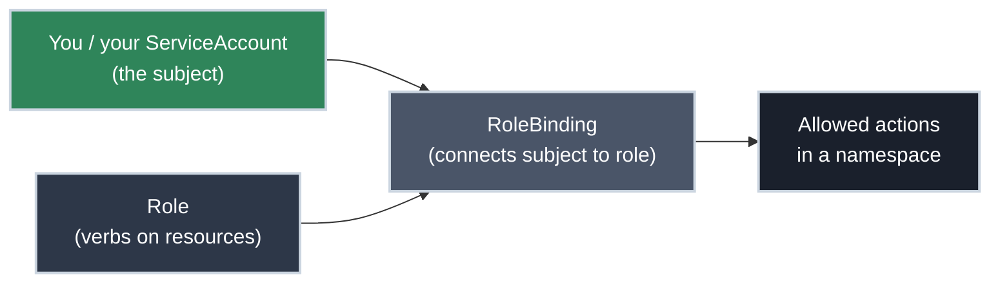
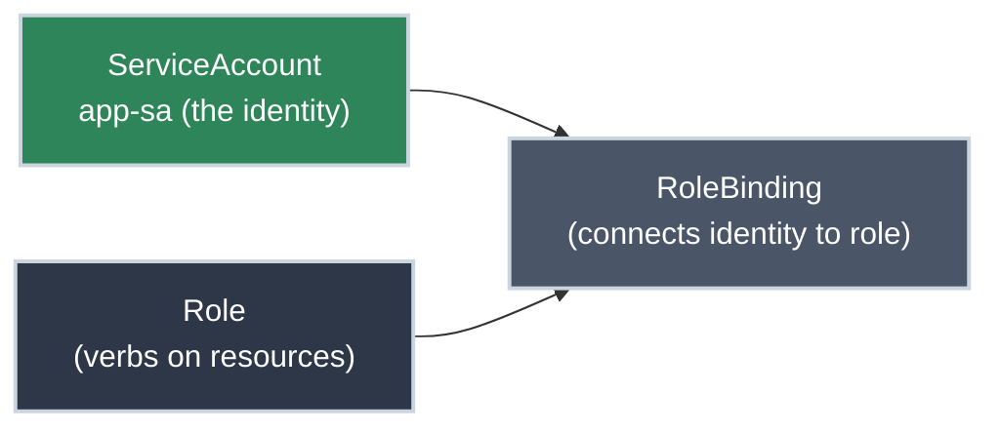

# Understanding Your Access

!!! tip "Part of [Essentials: Security](security_overview.md)"
    This is RBAC from **both sides** — understanding the access you've been given *and* authoring the access you grant others. Designing RBAC at cluster scale (aggregated ClusterRoles, least-privilege across many teams) is platform-engineering depth in the Mastery tier; the building blocks are here.

Sooner or later, Kubernetes tells you **no**:

``` text
Error from server (Forbidden): pods is forbidden: User "you" cannot
list resource "pods" in API group "" in the namespace "payments"
```

It's not a bug and nothing broke. Kubernetes uses **RBAC** (Role-Based Access Control) to decide who can do what, and someone scoped that access deliberately. There are two skills here, and on a shared cluster you need both: **reading** the access you have so you can work and ask precisely when blocked, and **writing** the Role and binding that grant a workload or teammate exactly what they need — no more.

## What You'll Learn

- How to read a `Forbidden` error and check yourself with `kubectl auth can-i`
- What a ServiceAccount is and why your Pods have permissions of their own
- **The operator side:** authoring a Role, RoleBinding, and ServiceAccount for least-privilege access
- What to ask for (or grant) when more access is genuinely needed

## The RBAC Mental Model (User's View)

You don't need to design RBAC to understand your place in it. Four pieces:



- A **Role** is a list of allowed **verbs** (`get`, `list`, `create`, `delete`…) on **resources** (`pods`, `services`…) within one namespace.
- A **RoleBinding** grants a Role to a **subject** — you, a group, or a ServiceAccount.
- If no binding grants the verb you're attempting, the answer is `Forbidden`. RBAC is deny-by-default: you can do only what was explicitly allowed.

!!! note "Namespace-scoped vs cluster-wide"
    A `Role` + `RoleBinding` applies in **one namespace** — the usual case for developers. A `ClusterRole` + `ClusterRoleBinding` applies cluster-wide. If you can `list pods` in `dev` but not in `payments`, you're seeing namespace-scoped access at work.

## Reading a Forbidden Error

Every `Forbidden` message names exactly what failed. Pull it apart:

``` text title="Anatomy of a Forbidden error"
User "you" cannot list resource "pods" in API group "" in the namespace "payments"
      └─ subject     └ verb └─ resource              └─ namespace
```

That tells you precisely what to request: "Please grant me `list pods` in the `payments` namespace." Specific requests get approved faster than "I need more access."

## Check Before You Hit the Wall

`kubectl auth can-i` answers the question *without* attempting the action — it's completely read-only and safe to run anywhere.

<div class="grid cards" markdown>

-   :material-help-circle: **Ask about one action**

    ---

    **Why it matters:** Confirm you can do something before you build a workflow around it.

    ``` bash title="Can I do X? (read-only)"
    kubectl auth can-i create deployments
    # yes

    kubectl auth can-i delete nodes
    # no
    ```

-   :material-format-list-bulleted: **List everything you can do**

    ---

    **Why it matters:** Get the full picture of your access in a namespace at a glance.

    ``` bash title="Everything I can do here"
    kubectl auth can-i --list -n payments
    # Resources    Verbs
    # pods         [get list watch]
    # pods/log     [get]
    ```

-   :material-target: **Check a specific namespace**

    ---

    **Why it matters:** Your access often differs per namespace — verify the one you care about.

    ``` bash title="Scoped to a namespace"
    kubectl auth can-i get secrets -n payments
    # no
    ```

</div>

## Your Pods Have Access Too: ServiceAccounts

You authenticate as a *user*. But the Pods you deploy authenticate as a **ServiceAccount** — an in-cluster identity with its own RBAC. Every Pod gets one (the namespace's `default` ServiceAccount if you don't specify), and its token is mounted into the container automatically.

``` yaml title="Run a Pod as a specific ServiceAccount" linenums="1"
spec:
  serviceAccountName: app-sa  # (1)!
  containers:
    - name: app
      image: myapp:1.4
```

1. The Pod (and anything it does against the Kubernetes API) acts with `app-sa`'s permissions

!!! warning "The default ServiceAccount and least privilege"
    If your app doesn't talk to the Kubernetes API at all, it doesn't need API access. Mounting a token it never uses is needless exposure. You can opt out:

    ``` yaml title="Don't mount a token you won't use"
    spec:
      automountServiceAccountToken: false
    ```

    If your app *does* call the API, it needs a dedicated ServiceAccount with only the verbs it needs — not the broad `default`. The next section is how that gets authored.

## From the Other Side: Granting Access

When you own a namespace, you're the one writing the RBAC, not just living under it. The least-privilege pattern is three objects, all declarative and committed to Git like any other manifest:



Say a workload needs to *read* Pods in its namespace (and nothing else):

``` yaml title="rbac.yaml" linenums="1"
apiVersion: v1
kind: ServiceAccount
metadata:
  name: pod-reader-sa        # (1)!
  namespace: payments
---
apiVersion: rbac.authorization.k8s.io/v1
kind: Role
metadata:
  name: pod-reader
  namespace: payments        # (2)!
rules:
  - apiGroups: [""]          # (3)!
    resources: ["pods", "pods/log"]
    verbs: ["get", "list", "watch"]   # (4)!
---
apiVersion: rbac.authorization.k8s.io/v1
kind: RoleBinding
metadata:
  name: pod-reader-binding
  namespace: payments
subjects:
  - kind: ServiceAccount     # (5)!
    name: pod-reader-sa
    namespace: payments
roleRef:
  kind: Role                 # (6)!
  name: pod-reader
  apiGroup: rbac.authorization.k8s.io
```

1. The identity the Pod will run as (`serviceAccountName: pod-reader-sa` in the Pod spec).
2. A `Role` is namespace-scoped — these grants apply only in `payments`.
3. `""` is the core API group (Pods, Services, ConfigMaps live here).
4. Read verbs only — no `create`, `update`, or `delete`. This is the whole point: name exactly what's needed.
5. The binding's *subject* can be a ServiceAccount (as here), a user, or a group.
6. `roleRef` wires the binding to the Role above. A `RoleBinding` can also reference a `ClusterRole` to reuse a common permission set within one namespace.

``` bash title="Apply and verify the grant (⚠️ creates RBAC objects)"
kubectl apply -f rbac.yaml

kubectl auth can-i list pods \
  --as=system:serviceaccount:payments:pod-reader-sa -n payments  # (1)!
# yes
kubectl auth can-i delete pods \
  --as=system:serviceaccount:payments:pod-reader-sa -n payments
# no
```

1. Confirm the ServiceAccount got exactly what you intended — no more.

!!! note "Where Essentials stops"
    A single Role + RoleBinding + ServiceAccount is Essentials. The moment you're reaching for `ClusterRole` aggregation, granting cross-namespace access, or designing a permission model for many teams, you're in Mastery territory. Two guardrails that apply even here: **never bind `cluster-admin`** to a workload or a routine user, and **avoid wildcards** (`verbs: ["*"]`, `resources: ["*"]`) — they quietly grant far more than anyone audits for.

## What to Do When You're Blocked (or Asked to Unblock Someone)

1. **Read the error** — note the verb, resource, and namespace.
2. **Confirm with `kubectl auth can-i`** — make sure it's RBAC, not a typo or wrong context.
3. **Ask specifically** — "Grant `<verb> <resource>` in `<namespace>`," not "I need admin."
4. **Prefer the smallest grant** — narrow access is easier to approve and safer for everyone.

And from the other chair, when *you're* the one granting it: add only the verb/resource that was asked for to the relevant Role (or write a new narrowly-scoped one), `kubectl apply`, and verify with `kubectl auth can-i --as=...` that you granted that and nothing extra. Resist the "just give them edit" shortcut — every over-grant is something a future audit has to unwind.

## Practice Exercises

??? question "Exercise 1: Decode the denial"
    You run a deploy and get:

    ``` text
    Error from server (Forbidden): secrets is forbidden: User "dev-ci"
    cannot create resource "secrets" in API group "" in the namespace "staging"
    ```

    What exactly would you ask your platform team for?

    ??? tip "Solution"
        Read the components: subject `dev-ci`, verb `create`, resource `secrets`, namespace `staging`.

        The precise request is: **"Please grant `dev-ci` the `create` verb on `secrets` in the `staging` namespace."**

        That's far more actionable (and more likely to be approved quickly) than "dev-ci needs more permissions." Specific, least-privilege requests are the norm.

??? question "Exercise 2: Will this Pod be able to list Pods?"
    Your app calls the Kubernetes API to list Pods in its namespace. You deploy it without setting `serviceAccountName`. Will it work?

    ??? tip "Solution"
        **Only if the namespace's `default` ServiceAccount has been granted `list pods`** — and by default it usually has *no* extra permissions.

        Check what the Pod's identity can do:

        ``` bash
        kubectl auth can-i list pods \
          --as=system:serviceaccount:myns:default -n myns
        # no
        ```

        The fix is to request a dedicated ServiceAccount bound to a Role that allows `list pods`, then set `serviceAccountName` on the Pod.

        **What you learned:** Pods don't inherit *your* permissions — they act as a ServiceAccount with its own (usually minimal) access.

## Quick Recap

| Question | Command (read-only) |
| :--- | :--- |
| Can I do this action? | `kubectl auth can-i <verb> <resource>` |
| Everything I can do here? | `kubectl auth can-i --list -n <ns>` |
| Can a ServiceAccount do it? | `kubectl auth can-i <verb> <resource> --as=system:serviceaccount:<ns>:<sa>` |
| Why was I denied? | Read the `Forbidden` error: subject · verb · resource · namespace |

## What's Next?

You understand how the container runs, how its secrets are handled, and what your account can do. The last piece ties it together: **[Meeting Pod Security Standards](pod_security_standards.md)** — the cluster-wide rules that may *require* the hardening you learned in this section.

## Further Reading

### Official Documentation

- [Using RBAC Authorization](https://kubernetes.io/docs/reference/access-authn-authz/rbac/) - The full RBAC reference
- [Checking API Access (`kubectl auth can-i`)](https://kubernetes.io/docs/reference/access-authn-authz/authorization/#checking-api-access) - The read-only access-check tool
- [Configure Service Accounts for Pods](https://kubernetes.io/docs/tasks/configure-pod-container/configure-service-account/) - ServiceAccounts and token mounting

### Deep Dives

- [Kubernetes RBAC Good Practices](https://kubernetes.io/docs/concepts/security/rbac-good-practices/) - Why least privilege matters, from the cluster's side

### Related Articles

- [Securing Your Containers](security_context.md) - Hardening the container itself
- [Handling Secrets Safely](handling_secrets.md) - Protecting the credentials your access grants you
