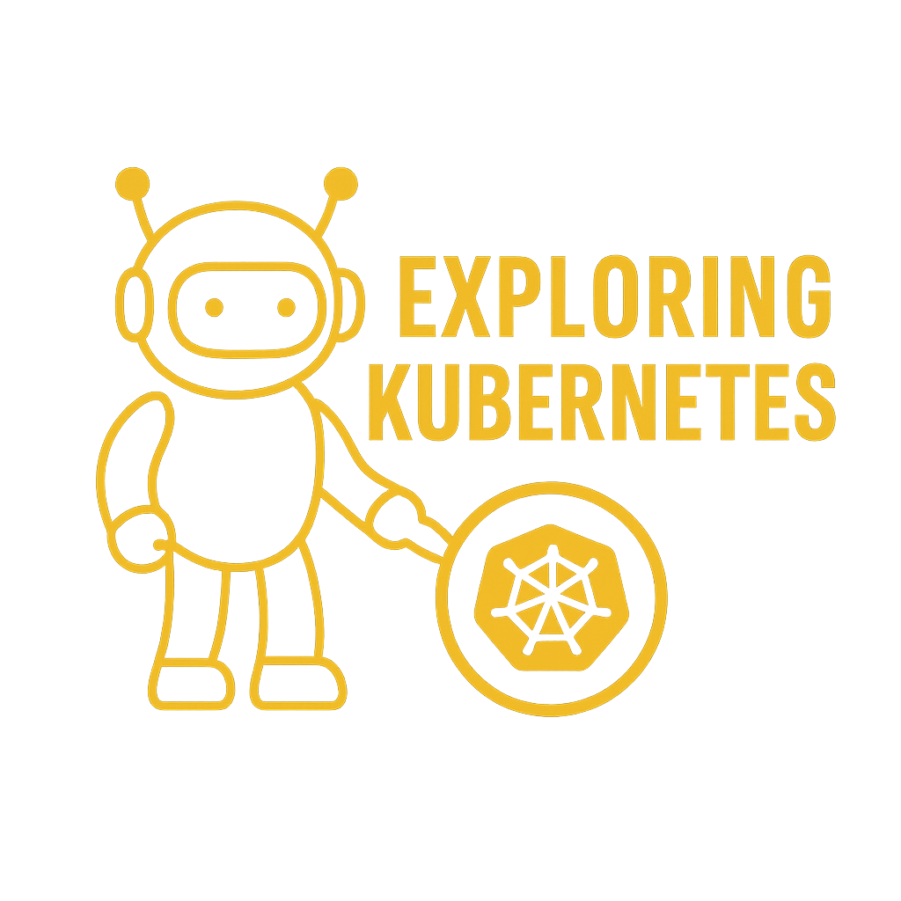
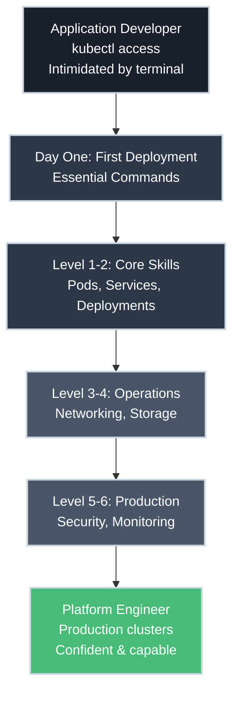

# Exploring Kubernetes

**From first deployment to production operations.**

A subsection of [BradPenney.io](https://bradpenney.io), this site teaches practical Kubernetes skills through a progressive learning journey—from application developer deploying your first app to platform engineer running production clusters.

It emphasizes real-world scenarios, production safety, and the "why" behind every resource and command.

---

## Learning Path

- :material-rocket-launch: **[Day One - Getting Started](day_one/overview.md)**

    ---

    **For:** Application developers with `kubectl` access to a real cluster (that's probably you!)

    **Goal:** Deploy your first application successfully and understand what you're doing

    **Your situation:** Your manager said "we're using Kubernetes now," your team doesn't know it, and you need to deploy your app to dev so QA can test it.

    **Articles:**

    - [What Is Kubernetes?](day_one/what_is_kubernetes.md)
    - Getting kubectl Access *(coming soon)*
    - Your First Deployment *(coming soon)*
    - Essential kubectl Commands *(coming soon)*
    - Understanding What Happened *(coming soon)*

- :material-cube: **Level 1 - Core Primitives** *(Coming Soon)*

    ---

    **For:** App developers getting comfortable

    **Goal:** Master the fundamental building blocks

    - Pods Deep Dive
    - Services: Connecting to Pods
    - ConfigMaps and Secrets
    - Namespaces
    - Labels and Selectors

- :material-sync: **Level 2 - Workload Management** *(Coming Soon)*

    ---

    **For:** App developers deploying real applications

    **Goal:** Manage applications at scale

    - Deployments Explained
    - ReplicaSets Under the Hood
    - StatefulSets
    - DaemonSets
    - Jobs and CronJobs

- :material-lan: **Level 3 - Networking** *(Coming Soon)*

    ---

    **For:** App developers + Platform engineers

    **Goal:** Connect services, expose applications

    - Services Deep Dive
    - Ingress Controllers
    - Network Policies
    - DNS and Service Discovery
    - Troubleshooting Networking

- :material-database: **Level 4 - Storage and State** *(Coming Soon)*

    ---

    **For:** Both personas, stateful applications

    **Goal:** Handle persistent data

    - Understanding Volumes
    - Persistent Volumes (PV)
    - Persistent Volume Claims (PVC)
    - StorageClasses
    - Running Databases on Kubernetes

- :material-shield-lock: **Level 5 - Advanced Scheduling & Security** *(Coming Soon)*

    ---

    **For:** Platform engineers

    **Goal:** Production-ready operations

    - Resource Requests and Limits
    - Taints and Tolerations
    - Node Affinity and Pod Affinity
    - RBAC
    - Security Best Practices

- :material-eye: **Level 6 - Production Operations** *(Coming Soon)*

    ---

    **For:** SREs and platform engineers

    **Goal:** Observe, maintain, scale

    - Logging Architecture
    - Monitoring and Metrics
    - Health Checks and Probes
    - Helm Package Manager
    - Operators and Custom Resources

## Philosophy

-   :material-shield-check: **Production Safety**

    ---

    Real-world scenarios you'll encounter with actual clusters. Learn when commands are dangerous and why. Safety-first approach throughout.

-   :material-lightbulb-on: **Purpose-Driven Learning**

    ---

    Understand the "why," not just memorize YAML. Every resource type, every command—you'll know why it exists and when to use it.

-   :material-stairs: **Progressive Complexity**

    ---

    From Day One deployment to production operations. Start as an intimidated app developer, become a confident platform engineer.

-   :material-account-group: **Dual Personas**

    ---

    Serving both application developers (Day One - Level 2) AND platform engineers (Level 3-6). The content meets you where you are.

## Your Learning Journey

## Your Journey

=== "Starting Point: Application Developer"

    **Day One and Level 1-2** assume you're an application developer with:

    - `kubectl` access to a real development cluster (not minikube!)
    - An application to deploy
    - Limited command-line experience
    - No Kubernetes knowledge
    - **A team where nobody knows Kubernetes either** (you're all figuring this out)
    - **A manager who said "we're using Kubernetes now"** (but can't teach you)

    **The reality:** Your company adopted Kubernetes. Your teammates are learning alongside you. Nobody expects you to become an expert—just functional enough to deploy your code and debug when things break.

    **This site gets you unblocked.** Not certified, not expert-level—just competent enough to ship code.

=== "Destination: Platform Engineer"

    **Level 3-6** shift to platform engineering concerns:

    - Networking and security (Ingress, Network Policies, DNS)
    - Storage and state management (PV, PVC, StorageClasses)
    - Resource management and scheduling (Requests, Limits, Affinity)
    - Production operations and observability (Logging, Monitoring, Helm)

    By Level 6, you'll be running production Kubernetes clusters with confidence.

## What Makes This Different

This site takes a unique approach to teaching Kubernetes:

- **Assumes real cluster access** — You already have `kubectl` credentials, skip the local setup
- **Starts with deployment** — Get working first, understand architecture later
- **Acknowledges the reality** — Your team is figuring this out together, you're not alone
- **Builds confidence gradually** — Read-only commands first, then move to changes
- **Progressive personas** — Start as app developer (Day One - Level 2), grow into platform engineer (Level 3-6)
- **Production safety throughout** — Namespace awareness, command labels, safety-first approach

**If you just received `kubectl` credentials to your company's dev cluster** and need to deploy your app, start with [Day One](day_one/overview.md).

**If you're a platform engineer** preparing to run production clusters, you'll still benefit from the progressive learning path, but can move faster through early levels.

## Connect

- Main site: [bradpenney.io](https://bradpenney.io)
- Source code: [GitHub](https://github.com/bradpenney/exploring_kubernetes)
- Related: [Exploring Enterprise Linux](https://linux.bradpenney.io) - Progressive Linux learning
