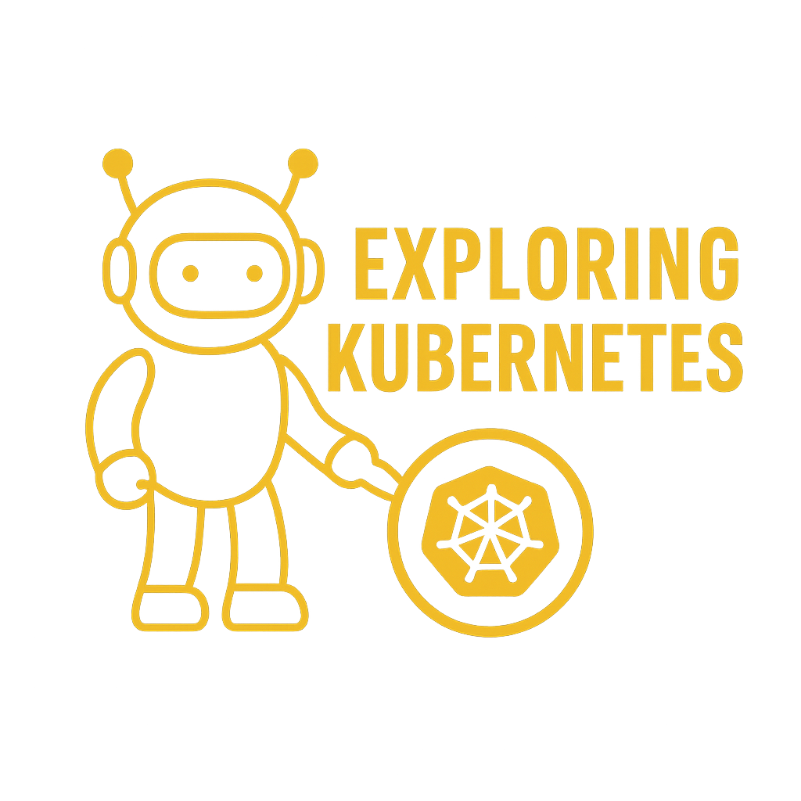
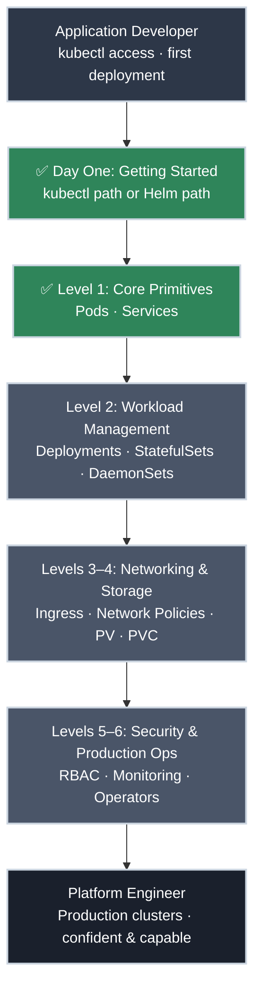

# Exploring Kubernetes

**From first deployment to production operations.**

Your manager just said "we're using Kubernetes now." Or you saw it on a job description. Or your team adopted it and you're expected to figure it out.

This site gets you there — from "what even is this?" through deploying your first application, to running production clusters with confidence. Every article starts with a real scenario you'll recognize and builds toward genuine understanding, not just memorized commands.

A subsection of [BradPenney.io](https://bradpenney.io), written from years of production Kubernetes experience.

---

## Learning Path

### Day One: Getting Started

**Everyone starts here.** Two articles establish the foundation, then you choose the deployment path that matches how your team works.

**Start with these:**

- [Day One Overview](day_one/overview.md) — Your complete Day One roadmap and what to expect
- [What Is Kubernetes?](day_one/what_is_kubernetes.md) — The problem Kubernetes solves and why companies adopt it

**Then choose your path:**

-   :material-code-braces: **Path 1: From Scratch (kubectl)**

    ---

    **Your situation:** You're learning Kubernetes fundamentals, or your team deploys with raw YAML manifests

    **What you'll do:** Write Deployment and Service YAML, apply with `kubectl`, understand Pods and Services from first principles

    - [Getting `kubectl` Access](day_one/kubectl/access.md)
    - [Your First Deployment](day_one/kubectl/first_deploy.md)
    - [Essential `kubectl` Commands](day_one/kubectl/commands.md)
    - [Understanding What Happened](day_one/kubectl/understanding.md)

-   :material-package-variant: **Path 2: Using Helm**

    ---

    **Your situation:** Your CI/CD pipeline generates Helm charts, or you need to deploy vendor software (Prometheus, Grafana, nginx) using community charts

    **What you'll do:** Deploy and customize Helm charts with `values.yaml`, manage releases, understand what Helm creates under the hood

    - [Getting Helm Access](day_one/helm/access.md)
    - [Your First Helm Deployment](day_one/helm/first_deploy.md)
    - [Essential Helm Commands](day_one/helm/commands.md)
    - [Understanding What Helm Created](day_one/helm/understanding.md)

!!! tip "Both Paths Converge at Level 1"
    Whether you start from scratch with `kubectl` or with Helm charts, both paths land in the same place: running Pods, stable Services, and the confidence to deploy and debug. Level 1 is where everyone deepens their understanding of the same core Kubernetes primitives.

---

### Level 1: Core Primitives

**Building on Day One.** Master the fundamental Kubernetes building blocks you'll use in every deployment.

-   :material-cube: **[Pods Deep Dive](level_1/pods.md)**

    ---

    The atomic unit of Kubernetes — what a Pod is, why it exists, multi-container sidecars, init containers, the Pod lifecycle, and `CrashLoopBackOff` explained.

-   :material-lan: **[Services: Stable Networking for Pods](level_1/services.md)**

    ---

    Why Pod IPs are unreliable and how Services solve it — ClusterIP, NodePort, LoadBalancer types, DNS service discovery, and `kubectl port-forward` for local testing.

-   :material-cog: **ConfigMaps and Secrets** *(coming soon)*

    ---

    Decoupling configuration from your container images — environment variables, mounted config files, and managing sensitive data.

-   :material-folder: **Namespaces** *(coming soon)*

    ---

    Logical separation, resource quotas, working across namespaces.

-   :material-tag: **Labels and Selectors** *(coming soon)*

    ---

    The "glue" of Kubernetes — organizing and targeting resources, filtering, best practices.

---

### Levels 2–6: The Full Journey

-   :material-sync: **Level 2 — Workload Management** *(coming soon)*

    ---

    **For:** App developers deploying real applications

    Deployments, ReplicaSets, StatefulSets, DaemonSets, Jobs and CronJobs

-   :material-lan: **Level 3 — Networking** *(coming soon)*

    ---

    **For:** App developers + Platform engineers

    Ingress controllers, Network Policies, DNS and service discovery, troubleshooting

-   :material-database: **Level 4 — Storage and State** *(coming soon)*

    ---

    **For:** Stateful applications and platform engineers

    Persistent Volumes, PVCs, StorageClasses, volume types

-   :material-shield-lock: **Level 5 — Advanced Scheduling & Security** *(coming soon)*

    ---

    **For:** Platform engineers

    Resource requests and limits, Taints and Tolerations, RBAC, Pod Security

-   :material-eye: **Level 6 — Production Operations** *(coming soon)*

    ---

    **For:** SREs and platform engineers

    Logging architecture, Monitoring and metrics, Health probes, Operators

---

## Your Learning Journey

```mermaid
flowchart TD
    Start["Application Developer<br/>kubectl access · first deployment"]
    D1["✅ Day One: Getting Started<br/>kubectl path or Helm path"]
    L1["✅ Level 1: Core Primitives<br/>Pods · Services"]
    L2["Level 2: Workload Management<br/>Deployments · StatefulSets · DaemonSets"]
    L34["Levels 3–4: Networking & Storage<br/>Ingress · Network Policies · PV · PVC"]
    L56["Levels 5–6: Security & Production Ops<br/>RBAC · Monitoring · Operators"]
    End["Platform Engineer<br/>Production clusters · confident & capable"]

    Start --> D1
    D1 --> L1
    L1 --> L2
    L2 --> L34
    L34 --> L56
    L56 --> End

    style Start fill:#2d3748,stroke:#cbd5e0,stroke-width:2px,color:#fff
    style D1 fill:#2f855a,stroke:#cbd5e0,stroke-width:2px,color:#fff
    style L1 fill:#2f855a,stroke:#cbd5e0,stroke-width:2px,color:#fff
    style L2 fill:#4a5568,stroke:#cbd5e0,stroke-width:2px,color:#fff
    style L34 fill:#4a5568,stroke:#cbd5e0,stroke-width:2px,color:#fff
    style L56 fill:#4a5568,stroke:#cbd5e0,stroke-width:2px,color:#fff
    style End fill:#1a202c,stroke:#cbd5e0,stroke-width:2px,color:#fff
```

=== "Starting Point: Application Developer"

    **Day One and Level 1–2** assume you're an application developer with:

    - Access to a real development cluster (your platform team set this up)
    - An application to deploy — or vendor software to install
    - Limited command-line experience
    - No Kubernetes knowledge yet

    **The reality this site acknowledges:** Your company adopted Kubernetes. Your teammates are figuring it out alongside you. Nobody expects you to be an expert — just functional enough to deploy your code and debug when things break.

    **This site gets you unblocked.** Not certified, not expert-level — capable enough to ship confidently.

=== "Destination: Platform Engineer"

    **Level 3–6** shift to platform engineering concerns:

    - Networking and traffic management (Ingress, Network Policies, service mesh)
    - Storage and persistent state (PV, PVC, StorageClasses, StatefulSets)
    - Resource management and scheduling (Requests, Limits, Taints, Affinity)
    - Production operations (Logging, Monitoring, Helm at scale, Operators)

    By Level 6, you'll be designing and running production Kubernetes clusters with confidence — making architectural decisions rather than just following instructions.

---

## Philosophy

-   :material-map-marker-path: **Progressive Depth, Not Repetition**

    ---

    Each level builds on the last without re-explaining what came before. Day One gets you deployed. Level 1 explains what that deployment actually created. Level 2 shows you how to manage it at scale. Cross-linked, not duplicated.

-   :material-lightbulb-on: **Why Before How**

    ---

    Every resource type, every command — you'll understand why it exists before learning how to use it. Memorizing YAML is easy; knowing *which* resource to reach for and *when* is the skill that takes years without a guide like this.

-   :material-shield-check: **Production Safety Throughout**

    ---

    Commands are clearly labeled: ✅ read-only, ⚠️ modifies resources, 🚨 destructive. Namespace awareness is built into every hands-on section. Real cluster access assumed — because that's what you actually have.

-   :material-account-group: **Two Personas, One Journey**

    ---

    Day One through Level 2 speaks directly to application developers: intimidated by the terminal, responsible for deploying their own code. Level 3–6 shifts to platform engineers: responsible for the cluster, making architectural decisions. The content meets you where you are.

---

## Related Learning

Kubernetes runs on Linux. Configuration lives in YAML. The platform engineer who understands both is dangerous in the best way.

-   :material-linux: **[Exploring Linux](https://linux.bradpenney.io)**

    ---

    The foundation under every Kubernetes cluster. Covers the command line, filesystem, permissions, systemd, shell scripting, and production Linux administration.

    Start with [Day One: Getting Access](https://linux.bradpenney.io/day_one/getting_access/) if you're new to the terminal. The [Processes](https://linux.bradpenney.io/essentials/processes/) and [Pipes and Redirection](https://linux.bradpenney.io/essentials/pipes_and_redirection/) articles are referenced throughout this site.

-   :material-language-python: **[Exploring Python](https://python.bradpenney.io)**

    ---

    Python for infrastructure engineers — not data science, not web apps. Covers writing CLI tools, parsing logs, wrapping shell commands, and working with YAML and environment configuration.

    The [YAML article](https://python.bradpenney.io/essentials/yaml/) is directly useful for Helm `values.yaml` and Kubernetes manifests. The [Health Check](https://python.bradpenney.io/day_one/health_check/) article shows patterns you'll recognize from Kubernetes readiness probes.

-   :material-school: **[Exploring Computer Science](https://cs.bradpenney.io)**

    ---

    The CS theory that explains why Kubernetes works the way it does — without the academic jargon. Covers algorithms, data structures, and computational thinking from the perspective of working engineers.

    [Finite State Machines](https://cs.bradpenney.io/efficiency/finite_state_machines/) explains Kubernetes' reconciliation loop. [Type Systems](https://cs.bradpenney.io/essentials/type_systems_basics/) makes sense of Kubernetes' strict API schema validation.

---

## Connect

- Main site: [bradpenney.io](https://bradpenney.io)
- Source code: [GitHub](https://github.com/bradpenney/exploring_kubernetes)
