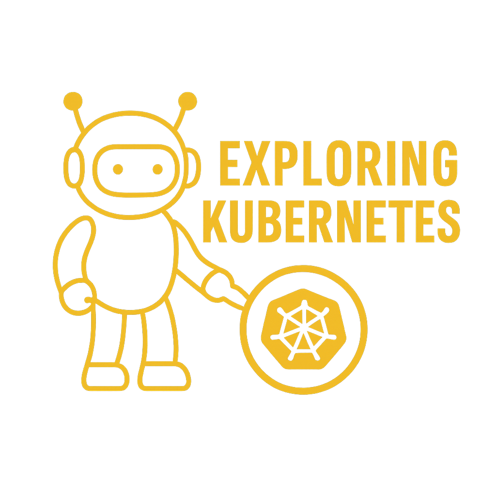

# Exploring Kubernetes

**From first deployment to production operations.**

Your manager said "we're using Kubernetes now," or you saw it on a job description, or your team adopted it and you're expected to figure it out. This site takes you from "what even is this?" through deploying your first application to running production clusters — at whatever level you need.

---

## 🏥 Day One: Getting Started

**Everyone starts here.** Two articles set the foundation, then you choose the deployment path that matches how your team works:

- [Day One Overview](day_one/overview.md) — your roadmap and what to expect
- [What Is Kubernetes?](day_one/what_is_kubernetes.md) — the problem it solves and why companies adopt it

-   :material-code-braces: **Path 1: From Scratch (`kubectl`)**

    ---

    You're learning the fundamentals, or your team deploys with raw YAML. Write Deployment and Service manifests, apply them with `kubectl`, and understand Pods and Services from first principles.

    [:octicons-arrow-right-24: Start the kubectl path](day_one/kubectl/access.md)

-   :material-package-variant: **Path 2: Using Helm**

    ---

    Your pipeline generates Helm charts, or you're installing vendor software (Prometheus, Grafana, nginx) from community charts. Deploy and customize with `values.yaml`, and see what Helm creates underneath.

    [:octicons-arrow-right-24: Start the Helm path](day_one/helm/access.md)

!!! tip "Both paths converge at Essentials"
    Whether you start with raw `kubectl` or with Helm, you land in the same place: running Pods, stable Services, and the confidence to deploy and debug.

---

## How It's Organized

Three tiers past Day One, each with its own overview covering exactly what's inside.

-   :material-package-variant: **[Essentials](essentials/overview.md)**

    ---

    What every primitive *is* and why it's built this way — Cluster Architecture, Core Primitives (Pods, Services, ConfigMaps, Namespaces, Labels), Networking, Workloads, and Troubleshooting.

-   :material-lightning-bolt: **[Efficiency](efficiency/overview.md)**

    ---

    The platform underneath: the CRI and container runtime, the scheduler, and putting a cluster app on the real internet with Gateway API, cert-manager, and external-dns.

-   :material-target: **Mastery** *(coming soon)*

    ---

    Production Kubernetes — Storage & State, Scheduling & Security, and Production Operations, for platform engineers and SREs running clusters others depend on.

---

**Ready to start?** Begin with the **[Day One Overview](day_one/overview.md)** to pick your deployment path, or jump straight to **[Essentials](essentials/overview.md)** if you're already comfortable with `kubectl`.

## Part of the BradPenney.io Network

This site is part of a family of progressive technical learning resources:

- [Exploring Containers](https://containers.bradpenney.io) — what a container actually is before Kubernetes schedules it
- [Exploring GitOps](https://gitops.bradpenney.io) — how production teams actually ship changes to a cluster
- [Exploring Linux](https://linux.bradpenney.io) — the kernel primitives (namespaces, cgroups) a cluster runs on
- [Exploring Networking](https://networking.bradpenney.io) — how Services and Ingress actually route traffic on the wire

## Subscribe by RSS

New articles publish straight to the [RSS feed](https://k8s.bradpenney.io/feed_rss_created.xml) — no algorithm, no email required.

