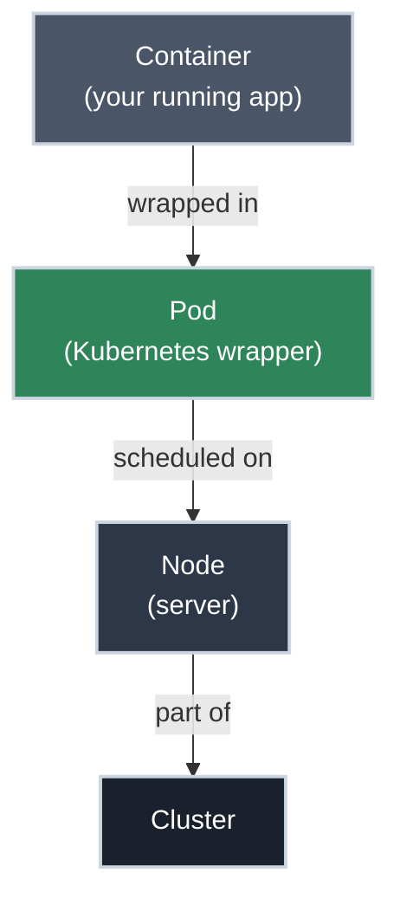

# Pods: What Actually Runs Your Application

!!! tip "Part of Level 1: Core Primitives"
    This article is part of [Level 1: Core Primitives](overview.md). Start with [Day One: Getting Started](../day_one/overview.md) if you're new to Kubernetes.

You've deployed an application. You've seen `kubectl get pods` return a name like `my-app-7c5ddbdf54-x8f9p`. You've seen `CrashLoopBackOff` in the STATUS column and felt that specific anxiety.

**Pods are where all of that actually lives.**

When you deploy to Kubernetes, you're creating Pods. When you check logs, you're reading from a Pod. When you debug, you're inspecting a Pod. When you scale, you're adding more Pods. Understanding what a Pod is — and isn't — is the single most important concept in Kubernetes.

!!! info "What You'll Learn"
    By the end of this article, you'll understand:

    - **What a Pod is** and why Kubernetes uses them instead of raw containers
    - **What containers share** inside a Pod (network, storage, lifecycle)
    - **When to use multiple containers** in one Pod (and when not to)
    - **How Pods work with init containers** — setup tasks that run before your app starts
    - **The Pod lifecycle** — phases, what they mean, and what CrashLoopBackOff actually tells you
    - **The essential `kubectl` commands** for creating, inspecting, and debugging Pods

---



---

## What Is a Pod?

If you've used Docker on your laptop, you're used to the container being the smallest thing you manage. In Kubernetes, there's a wrapper around your container called a **Pod**.

**The relationship:**

- Your container is your application (the code, the runtime, the dependencies)
- A Pod is the box that holds your container — plus network configuration, storage, and metadata
- Kubernetes schedules, manages, and monitors Pods (not containers directly)

**Think of it like a Linux process:** If you've worked with Linux, processes are the atomic unit the OS manages. Pods are the atomic unit Kubernetes manages. Just like you use `ps` to list running processes, you use `kubectl get pods` to list running Pods. [Processes](https://linux.bradpenney.io/essentials/processes/) on the Linux site covers the analogy in more depth if it's useful.

A Pod can hold one container (most common) or several containers that must run together on the same node.

---

## Why Not Just Manage Containers Directly?

Kubernetes adds the Pod wrapper for one critical reason: **co-location guarantees**.

Imagine you have two containers that must run on the same physical machine to work correctly — a web server and a log collector that reads the web server's log files directly from disk. If Kubernetes managed containers individually, it might schedule them on different nodes. The log collector couldn't find the log files.

A Pod solves this by **guaranteeing all its containers run on the same node**, every time. The scheduler treats the Pod as a single unit and places all of its containers together.

---

## What Containers Share Inside a Pod

Containers inside a Pod share three things:

<div class="grid cards" markdown>

-   :material-lan: **Shared Network**

    ---

    **Why it matters:** The Pod gets one IP address. Every container inside uses `localhost` to talk to the others.

    A web server on port 8080 and a sidecar on port 9090 can communicate on `localhost:8080` and `localhost:9090` — as if they're running on the same machine, because from a network perspective they are.

    **Implication:** No two containers in the same Pod can bind to the same port number.

-   :material-harddisk: **Shared Storage (Volumes)**

    ---

    **Why it matters:** You can attach a volume to a Pod and all containers can read and write to it.

    This is how the sidecar log pattern works: the main container writes logs to `/var/log/app`, the sidecar container reads from the same path. One volume, both containers, same node.

-   :material-timer: **Shared Lifecycle**

    ---

    **Why it matters:** The Pod lives and dies as a unit.

    If the Pod is deleted, all containers inside are terminated. If the Pod is moved to a different node, the entire group moves together. You cannot keep one container alive while terminating another in the same Pod.

</div>

---

## Pods Are Temporary — Don't Get Attached

This is the hardest concept for developers coming from traditional server deployments: **Pods are disposable.**

- Server fails → Pod is deleted and recreated on a healthy node
- You deploy a new version → old Pods are killed, new Pods with the new code start
- Each new Pod gets a **new IP address** — the old one is gone

**The consequence:** You never connect directly to a Pod's IP address. IP addresses change. Instead, you use a **Service** (covered in the [next article](services.md)) which automatically finds healthy Pods and routes traffic to them regardless of which IPs they currently have.

**Translation for app developers:** When you push a new deployment, Kubernetes doesn't update your running Pod in place — it creates new Pods with the new code and kills the old ones. This is intentional. It's what makes zero-downtime deployments possible.

---

## Pod Lifecycle

A Pod moves through these phases:

| Phase | Meaning | What to Do |
|-------|---------|-----------|
| **Pending** | Pod accepted by cluster, but containers not yet running | Normal during scheduling; wait and watch |
| **Running** | At least one container is running | Expected steady state |
| **Succeeded** | All containers terminated successfully | Normal for Jobs and batch tasks |
| **Failed** | At least one container exited with non-zero status | Check logs with `kubectl logs` |
| **Unknown** | Node communication lost | Possible node failure; check node status |

### Understanding CrashLoopBackOff

`CrashLoopBackOff` is not a Pod phase — it's a container status that appears in `kubectl get pods` when a container starts, immediately crashes, and Kubernetes keeps trying to restart it.

**What it tells you:**

- The container started (image pulled correctly)
- The container crashed almost immediately (application error)
- Kubernetes is backing off between restart attempts (the "Backoff" part)

**What to do:**

```bash title="Investigate CrashLoopBackOff"
# See the crash status
kubectl get pods

# Check events — often explains why
kubectl describe pod <pod-name>

# Read the container's output before it crashed
kubectl logs <pod-name>

# If the container is too fast to catch, read the previous run's logs
kubectl logs <pod-name> --previous
```

The most common causes: missing environment variables, wrong command, misconfigured entrypoint, or a configuration file the app expected that isn't mounted.

---

## Creating Pods

### Single-Container Pod

```yaml title="nginx-pod.yaml" linenums="1"
apiVersion: v1  # (1)!
kind: Pod  # (2)!
metadata:
  name: nginx-pod  # (3)!
  labels:
    app: nginx  # (4)!
spec:
  containers:
  - name: nginx  # (5)!
    image: nginx:1.21  # (6)!
    ports:
    - containerPort: 80  # (7)!
```

1. `v1` is the API group for core resources like Pods and Services
2. Tells Kubernetes to create a Pod (not a Deployment or Service)
3. Pod names must be unique within a namespace
4. Labels are how Services and Deployments find this Pod — always set them
5. Container name must be unique within the Pod
6. Always pin to a specific version — never use `:latest` in real deployments
7. Documents which port the container listens on (doesn't actually open the port — that's what Services are for)

```bash title="Apply and verify"
kubectl apply -f nginx-pod.yaml
# pod/nginx-pod created

kubectl get pods
# NAME        READY   STATUS    RESTARTS   AGE
# nginx-pod   1/1     Running   0          10s
```

!!! warning "Use Deployments in practice"
    You'll rarely create standalone Pods directly in real work. Standalone Pods are not automatically restarted if they crash or if a node fails. Level 2 covers Deployments — the right way to run application Pods in production.

---

## Multi-Container Patterns

### Sidecar Pattern

The most common multi-container pattern: a "helper" container that supports the main container without being part of the main application.

```yaml title="web-with-log-sidecar.yaml" linenums="1"
apiVersion: v1
kind: Pod
metadata:
  name: web-with-logger
  labels:
    app: web
spec:
  containers:
  - name: web-server  # (1)!
    image: nginx:1.21
    ports:
    - containerPort: 80
    volumeMounts:
    - name: shared-logs
      mountPath: /var/log/nginx  # (2)!

  - name: log-sidecar  # (3)!
    image: busybox:1.35
    command: ['sh', '-c', 'tail -f /logs/access.log']
    volumeMounts:
    - name: shared-logs
      mountPath: /logs  # (4)!

  volumes:
  - name: shared-logs  # (5)!
    emptyDir: {}
```

1. Main container — runs the application
2. nginx writes logs to `/var/log/nginx`
3. Sidecar container — reads and processes logs from the main container
4. Same volume, different mount path — the sidecar sees nginx's logs at `/logs`
5. `emptyDir` creates a temporary directory that exists for the lifetime of the Pod; both containers can read and write to it

**Key insight:** Both containers communicate through the shared volume. The web server doesn't know or care about the sidecar. The sidecar doesn't need to understand nginx — it just tails a file.

**When to use sidecars:** Log shipping, metrics collection, configuration reloading, or proxies (like Envoy/Istio service mesh proxies).

---

## Init Containers

Init containers run **before** your main application container starts. They run in sequence, each must complete successfully before the next starts, and all must succeed before the main container starts at all.

**Common use cases:**

- Wait for a database or service to be available
- Run a database migration before the app boots
- Copy configuration files into a shared volume the main container reads

```yaml title="app-with-init.yaml" linenums="1"
apiVersion: v1
kind: Pod
metadata:
  name: app-with-init
spec:
  initContainers:
  - name: wait-for-db  # (1)!
    image: busybox:1.35
    command: ['sh', '-c', 'until nslookup postgres-svc; do echo waiting for db; sleep 2; done']  # (2)!

  containers:
  - name: my-app  # (3)!
    image: my-company/my-app:v1.0.0
```

1. This init container runs first, before `my-app` starts
2. Loops until DNS resolves `postgres-svc` — the app won't start until the database service exists
3. Only starts after all init containers have completed successfully

**In `kubectl get pods`:** While init containers are running, you'll see `Init:0/1` instead of `Running`. This is normal — the Pod is preparing, not failing.

---

## Working with Pods: Essential kubectl Commands

<div class="grid cards" markdown>

-   :material-eye: **Viewing Pods**

    ---

    ✅ **Safe — read-only. Use these freely.**

    ```bash title="List and inspect pods"
    # List all pods in current namespace
    kubectl get pods

    # More detail: IP, node, status conditions
    kubectl get pods -o wide

    # Detailed info: events, resource limits, conditions
    kubectl describe pod nginx-pod

    # Continuous watching (updates every few seconds)
    kubectl get pods --watch
    ```

-   :material-text-box-outline: **Reading Logs**

    ---

    ✅ **Safe — read-only.**

    ```bash title="View container logs"
    # Current logs
    kubectl logs nginx-pod

    # Follow (stream in real time, like tail -f)
    kubectl logs nginx-pod --follow

    # Previous run's logs (for CrashLoopBackOff)
    kubectl logs nginx-pod --previous

    # Specific container in multi-container pod
    kubectl logs web-with-logger -c web-server
    kubectl logs web-with-logger -c log-sidecar
    ```

-   :material-console: **Executing Commands**

    ---

    ⚠️ **Caution — you're running commands inside a live container.**

    ```bash title="Execute commands in a running pod"
    # Run a one-off command
    kubectl exec nginx-pod -- ls /usr/share/nginx/html

    # Open an interactive shell (if the container has bash/sh)
    kubectl exec -it nginx-pod -- /bin/bash

    # Exit the shell:
    exit
    ```

    !!! tip "Not all containers have a shell"
        Minimal containers (distroless, scratch-based images) may not have `bash` or `sh`. Try `/bin/sh` if `/bin/bash` fails. Some containers have neither — use `kubectl describe pod` and `kubectl logs` for those.

-   :material-delete-outline: **Deleting Pods**

    ---

    🚨 **Destructive — the Pod and its local data are gone.**

    ```bash title="Delete a pod"
    # Delete by name
    kubectl delete pod nginx-pod

    # Delete using the file you applied
    kubectl delete -f nginx-pod.yaml
    ```

    !!! info "Managed pods recreate automatically"
        If the Pod was created by a Deployment or ReplicaSet, a new Pod will start immediately to replace it. This is expected — it's the self-healing behavior Kubernetes is designed for.

</div>

---

## The One-Container-Per-Pod Rule

Even though Pods can hold multiple containers, **90% of Pods in practice contain exactly one container.**

Use multiple containers in a Pod only when:

- The containers must run on the same node (shared filesystem, inter-process communication)
- They have the same lifecycle — one shouldn't be running without the other
- They're so tightly coupled that deploying them separately would be operationally painful

**The scaling signal:** If you want to run more copies of your application to handle more traffic, create more Pods — not more containers inside one Pod. Adding a second web server container to an existing Pod doesn't help (both would be on the same node, sharing the same IP). That's what Deployments and replica counts are for.

---

## Common Pitfalls

??? warning "Pod is Pending but won't start"
    **Possible causes:**

    - No node has enough CPU or memory to schedule the Pod
    - The container image name is wrong or the registry is inaccessible
    - A required PersistentVolumeClaim doesn't exist

    **Diagnose with:**
    ```bash title="Diagnose scheduling failure"
    kubectl describe pod <pod-name>
    # Look at the "Events:" section at the bottom — it explains why scheduling failed
    ```

??? warning "ImagePullBackOff"
    The container image couldn't be pulled.

    **Possible causes:** Wrong image name, wrong tag, private registry without credentials, network issue.

    **Diagnose with:**
    ```bash title="Diagnose ImagePullBackOff"
    kubectl describe pod <pod-name>
    # The Events section shows the pull error (image not found, unauthorized, etc.)
    ```

??? warning "Pod is Running but app doesn't respond"
    `kubectl get pods` shows `Running` and `1/1 Ready`, but HTTP requests fail.

    **This means:** The container is alive, but your application inside it isn't listening on the expected port, or is returning errors.

    **Diagnose with:**
    ```bash title="Diagnose unresponsive app"
    kubectl logs <pod-name>   # Look for application startup errors
    kubectl exec -it <pod-name> -- sh   # Check if the process is running
    ```

---

## Practice Exercises

??? question "Exercise 1: Shared Network — Containers Talking to Each Other"
    Container A runs your web server on port 8080. Container B is a health-check sidecar. Both are in the same Pod. How does Container B send an HTTP request to Container A?

    ??? tip "Solution"
        Container B sends the request to `localhost:8080`.

        Because all containers in a Pod share the same network namespace, they communicate using `localhost` — exactly as if they were two processes on the same machine. No Service required; no external IP needed.

??? question "Exercise 2: Scaling — Pod or Container?"
    Your web server Pod is receiving too much traffic. You want to handle more requests. Should you:

    A. Add a second web server container inside the same Pod
    B. Create a second Pod running the same web server

    ??? tip "Solution"
        **B. Create a second Pod.**

        Kubernetes scales horizontally by adding more Pods — each Pod runs on a potentially different node and gets its own IP. Adding a second container inside the same Pod doesn't help: both would share the same node and the same IP, creating a more complex single point of failure.

        This horizontal scaling (more Pods, not bigger Pods) is exactly what Deployments automate. You'll cover this in Level 2.

??? question "Exercise 3: Deploy, Inspect, and Debug"
    Create the `nginx-pod.yaml` from this article, apply it, and answer these questions using only `kubectl` commands:

    1. What node is the Pod running on?
    2. What is the Pod's IP address?
    3. What is the exact container image being used?
    4. What events occurred when the Pod started?

    ??? tip "Solution"
        ```bash title="Inspect the Pod"
        # Apply the pod
        kubectl apply -f nginx-pod.yaml

        # 1 and 2: Node and IP
        kubectl get pods -o wide
        # Output includes NODE and IP columns

        # 3 and 4: Image and events
        kubectl describe pod nginx-pod
        # "Containers:" section shows the image
        # "Events:" section at the bottom shows startup sequence
        ```

        The `Events:` section in `kubectl describe` is the single most useful debugging tool in Kubernetes. Get comfortable reading it — it tells the story of everything that happened to the Pod.

---

## Quick Recap

| Concept | What to Know |
|---------|-------------|
| **Pod** | The smallest unit Kubernetes manages; wraps one or more containers |
| **Co-location** | All containers in a Pod always run on the same node |
| **Shared network** | Containers in a Pod communicate via `localhost`; Pod gets one IP |
| **Shared storage** | Volumes mounted in a Pod are accessible by all containers |
| **Ephemeral** | Pods are temporary; IP addresses change on every restart |
| **Sidecar** | A helper container in the same Pod as the main application |
| **Init containers** | Run before the main container; must succeed for the app to start |
| **CrashLoopBackOff** | App crashed on startup; check `kubectl logs --previous` |

---

## Further Reading

### Official Documentation

- [Kubernetes Docs: Pods](https://kubernetes.io/docs/concepts/workloads/pods/) - Complete Pod reference
- [Pod Lifecycle](https://kubernetes.io/docs/concepts/workloads/pods/pod-lifecycle/) - Phases, conditions, and container states
- [Init Containers](https://kubernetes.io/docs/concepts/workloads/pods/init-containers/) - How init containers work and when to use them

### Deep Dives

- [The Distributed System Toolkit: Patterns for Composite Containers](https://kubernetes.io/blog/2015/06/the-distributed-system-toolkit-patterns/) - The sidecar, ambassador, and adapter patterns from Kubernetes creator Brendan Burns
- [Kubernetes Best Practices: Resource Limits](https://cloud.google.com/blog/products/containers-kubernetes/kubernetes-best-practices-resource-requests-and-limits) - Why you should always set resource requests and limits on Pods

### Related Learning

- [Processes](https://linux.bradpenney.io/essentials/processes/) - The Linux process model that Pods are analogous to
- [Finite State Machines](https://cs.bradpenney.io/efficiency/finite_state_machines/) - Pod lifecycle phases (Pending → Running → Succeeded/Failed) are a finite state machine — understanding FSMs makes the lifecycle click

### Related Articles

- [Services: Stable Networking for Pods](services.md) - How to access Pods reliably as they come and go
- [Day One Overview](../day_one/overview.md) - The deployment skills that Pods are built on

---

## What's Next?

You understand Pods — the atomic unit of Kubernetes. But you can't connect to them directly, because their IP addresses change. That's what Services solve.

**Next:** [Services: Stable Networking for Pods](services.md) — how to expose your Pods reliably, route traffic to them, and let different parts of your application discover each other.
