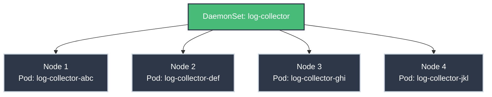

# DaemonSets: One Pod Per Node

!!! tip "Part of Level 2: Workload Management"
    This article is part of [Level 2: Workload Management](overview.md). You should understand [Deployments](deployments.md) before reading this.

Some workloads need to run on **every node** in your cluster:

- Log collectors (gather logs from all nodes)
- Monitoring agents (collect metrics from every host)
- Network plugins (manage networking on each node)
- Storage daemons (provide local storage on nodes)

**That's what DaemonSets are for.**

---

## What DaemonSets Do

A DaemonSet ensures a copy of a Pod runs on all (or selected) nodes in your cluster.



**Behavior:**

- New node joins cluster → DaemonSet automatically schedules pod on it
- Node leaves cluster → DaemonSet pod is garbage collected
- DaemonSet deleted → All pods are cleaned up

**Think of it like installing software on every server in a data center.**

---

## DaemonSet vs Deployment

| Feature | Deployment | DaemonSet |
|---------|-----------|-----------|
| **Purpose** | Run N replicas anywhere | Run 1 pod per node |
| **Scaling** | Manual (`replicas: 3`) | Automatic (matches node count) |
| **Scheduling** | Kubernetes decides placement | One pod per node (unless node selector) |
| **Use Case** | Application workloads | Infrastructure workloads |
| **Typical Examples** | Web app, API, microservice | Log collector, monitoring agent |

---

## When to Use DaemonSets

<div class="grid cards" markdown>

-   **Logging Agents**

    ---
    **Why:** Collect logs from all containers on all nodes.

    **Examples:** Fluentd, Logstash, Filebeat

    **Pattern:** Read from `/var/log` or Docker socket on each node

-   **Monitoring Agents**

    ---
    **Why:** Gather node metrics (CPU, memory, disk, network).

    **Examples:** Prometheus Node Exporter, Datadog agent, New Relic

    **Pattern:** Expose metrics endpoint on each node

-   **Network Plugins**

    ---
    **Why:** Configure networking for all pods on each node.

    **Examples:** Calico, Weave, Cilium CNI components

    **Pattern:** Manage iptables, routes, or eBPF on each node

-   **Storage Daemons**

    ---
    **Why:** Provide local storage or distributed storage on each node.

    **Examples:** Ceph, GlusterFS, local volume provisioner

    **Pattern:** Manage disk resources on each node

</div>

---

## DaemonSet Anatomy

```yaml title="daemonset.yaml" linenums="1"
apiVersion: apps/v1
kind: DaemonSet
metadata:
  name: log-collector
  labels:
    app: log-collector
spec:
  selector:
    matchLabels:
      app: log-collector
  template:  # (1)!
    metadata:
      labels:
        app: log-collector
    spec:
      containers:
      - name: fluentd
        image: fluentd:v1.14
        volumeMounts:
        - name: varlog  # (2)!
          mountPath: /var/log
          readOnly: true
        - name: varlibdockercontainers  # (3)!
          mountPath: /var/lib/docker/containers
          readOnly: true
      volumes:
      - name: varlog
        hostPath:  # (4)!
          path: /var/log
      - name: varlibdockercontainers
        hostPath:
          path: /var/lib/docker/containers
```

1. Pod template (like Deployment)
2. Mount node's `/var/log` into container
3. Access container logs on node
4. hostPath accesses node's filesystem

**Notice:** No `replicas` field! DaemonSet automatically matches node count.

---

## Real-World Example: Prometheus Node Exporter

Monitor all nodes in your cluster:

```yaml title="node-exporter-daemonset.yaml" linenums="1"
apiVersion: apps/v1
kind: DaemonSet
metadata:
  name: node-exporter
  namespace: monitoring
  labels:
    app: node-exporter
spec:
  selector:
    matchLabels:
      app: node-exporter
  template:
    metadata:
      labels:
        app: node-exporter
    spec:
      hostNetwork: true  # (1)!
      hostPID: true  # (2)!
      containers:
      - name: node-exporter
        image: prom/node-exporter:v1.5.0
        args:  # (3)!
        - --path.procfs=/host/proc
        - --path.sysfs=/host/sys
        - --path.rootfs=/host/root
        - --collector.filesystem.mount-points-exclude=^/(dev|proc|sys|var/lib/docker/.+|var/lib/kubelet/.+)($|/)
        - --collector.netclass.ignored-devices=^(veth.*)$
        ports:
        - containerPort: 9100
          name: metrics
        volumeMounts:
        - name: proc  # (4)!
          mountPath: /host/proc
          readOnly: true
        - name: sys
          mountPath: /host/sys
          readOnly: true
        - name: root
          mountPath: /host/root
          readOnly: true
      volumes:
      - name: proc
        hostPath:
          path: /proc
      - name: sys
        hostPath:
          path: /sys
      - name: root
        hostPath:
          path: /
```

1. Use host's network namespace (see host's network interfaces)
2. Use host's PID namespace (see host's processes)
3. Configure paths to read host metrics
4. Mount host filesystem directories into container

**Deploy it:**

```bash
kubectl apply -f node-exporter-daemonset.yaml

# Check it's running on all nodes
kubectl get daemonset -n monitoring
# NAME            DESIRED   CURRENT   READY   UP-TO-DATE   AVAILABLE
# node-exporter   4         4         4       4            4

kubectl get pods -n monitoring -o wide
# NAME                  READY   STATUS    NODE
# node-exporter-abc     1/1     Running   node-1
# node-exporter-def     1/1     Running   node-2
# node-exporter-ghi     1/1     Running   node-3
# node-exporter-jkl     1/1     Running   node-4
```

---

## Node Selection

By default, DaemonSets run on **all nodes**. To target specific nodes:

### Option 1: Node Selector

Run only on nodes with specific labels:

```yaml
spec:
  template:
    spec:
      nodeSelector:  # (1)!
        disktype: ssd
        zone: us-east-1a
```

1. Only schedules on nodes with BOTH labels

**Label a node:**
```bash
kubectl label nodes node-1 disktype=ssd
kubectl label nodes node-1 zone=us-east-1a
```

### Option 2: Node Affinity

More flexible node selection:

```yaml
spec:
  template:
    spec:
      affinity:
        nodeAffinity:
          requiredDuringSchedulingIgnoredDuringExecution:
            nodeSelectorTerms:
            - matchExpressions:
              - key: disktype
                operator: In  # (1)!
                values:
                - ssd
                - nvme
```

1. Runs on nodes with `disktype=ssd` OR `disktype=nvme`

### Option 3: Taints and Tolerations

Run on nodes that other pods can't:

```yaml
spec:
  template:
    spec:
      tolerations:  # (1)!
      - key: dedicated
        operator: Equal
        value: monitoring
        effect: NoSchedule
```

1. Tolerates taint, allowing scheduling on dedicated nodes

**Taint a node:**
```bash
kubectl taint nodes node-1 dedicated=monitoring:NoSchedule
```

---

## DaemonSet Updates

### Update Strategy: RollingUpdate (Default)

```yaml
spec:
  updateStrategy:
    type: RollingUpdate  # (1)!
    rollingUpdate:
      maxUnavailable: 1  # (2)!
```

1. Updates pods one at a time
2. Only update 1 pod at a time (or % of total)

**Update the image:**
```bash
kubectl set image daemonset/log-collector fluentd=fluentd:v1.15

# Watch the rollout
kubectl rollout status daemonset/log-collector
```

### Update Strategy: OnDelete

```yaml
spec:
  updateStrategy:
    type: OnDelete  # (1)!
```

1. Only updates pods when manually deleted

**Manual update:**
```bash
# Update DaemonSet definition
kubectl apply -f daemonset.yaml

# Pods DON'T update automatically
# Delete pods manually to trigger update:
kubectl delete pod log-collector-abc -n monitoring
# New pod created with updated template
```

---

## Common Patterns

### Pattern 1: Logging Agent

```yaml title="fluentd-daemonset.yaml" linenums="1"
apiVersion: apps/v1
kind: DaemonSet
metadata:
  name: fluentd
  namespace: logging
spec:
  selector:
    matchLabels:
      app: fluentd
  template:
    metadata:
      labels:
        app: fluentd
    spec:
      containers:
      - name: fluentd
        image: fluent/fluentd-kubernetes-daemonset:v1.14
        env:
        - name: FLUENT_ELASTICSEARCH_HOST
          value: "elasticsearch.logging.svc.cluster.local"
        - name: FLUENT_ELASTICSEARCH_PORT
          value: "9200"
        volumeMounts:
        - name: varlog
          mountPath: /var/log
        - name: containers
          mountPath: /var/lib/docker/containers
          readOnly: true
      volumes:
      - name: varlog
        hostPath:
          path: /var/log
      - name: containers
        hostPath:
          path: /var/lib/docker/containers
```

**What it does:** Collects logs from all containers on all nodes and ships to Elasticsearch.

### Pattern 2: Security Agent

```yaml title="security-agent-daemonset.yaml" linenums="1"
apiVersion: apps/v1
kind: DaemonSet
metadata:
  name: security-agent
  namespace: security
spec:
  selector:
    matchLabels:
      app: security-agent
  template:
    metadata:
      labels:
        app: security-agent
    spec:
      hostNetwork: true  # (1)!
      hostPID: true
      containers:
      - name: agent
        image: security-vendor/agent:latest
        securityContext:  # (2)!
          privileged: true
        volumeMounts:
        - name: dockersock  # (3)!
          mountPath: /var/run/docker.sock
      volumes:
      - name: dockersock
        hostPath:
          path: /var/run/docker.sock
```

1. Access host network for packet inspection
2. Privileged container can access host resources
3. Monitor Docker daemon activity

!!! danger "Privileged Containers"
    Privileged DaemonSets have full host access. Only use for trusted workloads (monitoring, security agents).

### Pattern 3: GPU Driver Installer

```yaml title="nvidia-gpu-driver-daemonset.yaml" linenums="1"
apiVersion: apps/v1
kind: DaemonSet
metadata:
  name: nvidia-gpu-driver
spec:
  selector:
    matchLabels:
      app: nvidia-gpu-driver
  template:
    metadata:
      labels:
        app: nvidia-gpu-driver
    spec:
      nodeSelector:  # (1)!
        accelerator: nvidia-gpu
      hostPID: true
      containers:
      - name: nvidia-driver-installer
        image: nvidia/driver:510.47.03
        securityContext:
          privileged: true
        volumeMounts:
        - name: dev
          mountPath: /dev
        - name: nvidia-install-dir
          mountPath: /usr/local/nvidia
      volumes:
      - name: dev
        hostPath:
          path: /dev
      - name: nvidia-install-dir
        hostPath:
          path: /usr/local/nvidia
```

1. Only run on GPU nodes

**What it does:** Installs NVIDIA GPU drivers on GPU-enabled nodes.

---

## Troubleshooting DaemonSets

### Problem: Pods Not Starting on All Nodes

```bash
kubectl get daemonset
# NAME            DESIRED   CURRENT   READY
# log-collector   4         2         2

kubectl describe daemonset log-collector
# Events:
#   Warning  FailedCreate  Pod "log-collector-xxx" is forbidden: unable to validate against any security context constraint
```

**Common causes:**

- Node taints preventing scheduling
- Insufficient permissions (RBAC)
- Node selector doesn't match any nodes
- Resource constraints

**Debug:**
```bash
# Check if nodes are tainted
kubectl describe nodes | grep Taints

# Check node labels
kubectl get nodes --show-labels

# Check pod status
kubectl get pods -l app=log-collector -o wide
```

### Problem: Permission Denied Errors

```bash
kubectl logs log-collector-abc
# Error: permission denied: /var/log/syslog
```

**Solution:** DaemonSet needs proper security context:

```yaml
spec:
  template:
    spec:
      securityContext:
        runAsUser: 0  # Run as root (needed for /var/log access)
      containers:
      - name: fluentd
        securityContext:
          privileged: true  # If reading host files
```

### Problem: DaemonSet Won't Update

```bash
kubectl set image daemonset/log-collector fluentd=fluentd:v1.15
# No pods updated!
```

**Check update strategy:**
```bash
kubectl get daemonset log-collector -o yaml | grep -A 5 updateStrategy
# type: OnDelete  ← Manual deletion required!
```

**Solution:** Change to RollingUpdate or manually delete pods.

---

## Working with DaemonSets

```bash title="Essential DaemonSet Commands"
# List DaemonSets
kubectl get daemonsets
kubectl get ds  # Short form

# Get DaemonSet in specific namespace
kubectl get ds -n monitoring

# Describe DaemonSet
kubectl describe daemonset log-collector

# View pods created by DaemonSet
kubectl get pods -l app=log-collector -o wide

# Update DaemonSet image
kubectl set image daemonset/log-collector fluentd=fluentd:v1.15

# Check rollout status
kubectl rollout status daemonset/log-collector

# View rollout history
kubectl rollout history daemonset/log-collector

# Rollback to previous version
kubectl rollout undo daemonset/log-collector

# Delete DaemonSet (deletes all pods)
kubectl delete daemonset log-collector
```

---

## Quick Recap

| Concept | Explanation |
|---------|-------------|
| **DaemonSet** | Runs one pod per node automatically |
| **Use Case** | Infrastructure workloads (logging, monitoring, networking) |
| **Scheduling** | Automatic—follows node count |
| **hostPath** | Mounts node's filesystem into container |
| **hostNetwork** | Uses node's network namespace |
| **Privileged** | Full host access (use carefully) |
| **Node Selector** | Targets specific nodes |
| **Update Strategy** | RollingUpdate (default) or OnDelete |

---

## Practice Exercises

??? question "Exercise 1: Deploy a Monitoring Agent"
    Deploy a DaemonSet that runs on all nodes to collect metrics.

    **Goal:** Create a DaemonSet running nginx (as a placeholder for a real agent) on all nodes.

    ??? tip "Solution"
        ```yaml title="nginx-daemonset.yaml"
        apiVersion: apps/v1
        kind: DaemonSet
        metadata:
          name: nginx-agent
        spec:
          selector:
            matchLabels:
              app: nginx-agent
          template:
            metadata:
              labels:
                app: nginx-agent
            spec:
              containers:
              - name: nginx
                image: nginx:1.21
                ports:
                - containerPort: 80
        ```

        ```bash
        kubectl apply -f nginx-daemonset.yaml

        # Verify one pod per node
        kubectl get pods -o wide -l app=nginx-agent
        # Should see one pod per node

        # Check DaemonSet status
        kubectl get daemonset nginx-agent
        # DESIRED should match your cluster's node count
        ```

??? question "Exercise 2: Target Specific Nodes"
    Modify the DaemonSet to only run on nodes labeled `env=production`.

    ??? tip "Solution"
        ```bash
        # Label some nodes
        kubectl label nodes node-1 env=production
        kubectl label nodes node-2 env=production

        # Update DaemonSet
        kubectl edit daemonset nginx-agent
        ```

        Add `nodeSelector`:
        ```yaml
        spec:
          template:
            spec:
              nodeSelector:
                env: production
        ```

        ```bash
        # Verify pods only on production nodes
        kubectl get pods -l app=nginx-agent -o wide
        # Should only see pods on node-1 and node-2
        ```

---

## Further Reading

### Official Documentation
- [DaemonSets](https://kubernetes.io/docs/concepts/workloads/controllers/daemonset/)
- [Perform a Rolling Update on a DaemonSet](https://kubernetes.io/docs/tasks/manage-daemon/update-daemon-set/)
- [Perform a Rollback on a DaemonSet](https://kubernetes.io/docs/tasks/manage-daemon/rollback-daemon-set/)

### Deep Dives
- [Node Affinity](https://kubernetes.io/docs/concepts/scheduling-eviction/assign-pod-node/#affinity-and-anti-affinity)
- [Taints and Tolerations](https://kubernetes.io/docs/concepts/scheduling-eviction/taint-and-toleration/)
- [hostPath Volumes](https://kubernetes.io/docs/concepts/storage/volumes/#hostpath)

### Related Articles
- [Deployments](deployments.md) - For application workloads
- [StatefulSets](statefulsets.md) - For stateful workloads
- **Node Affinity** - Advanced scheduling (coming in Level 5)

---

## What's Next?

You understand DaemonSets for node-level workloads. Next, learn about **[Jobs and CronJobs](jobs_cronjobs.md)** for batch processing and scheduled tasks.

---

**Key Takeaway:** DaemonSets run infrastructure workloads (monitoring, logging, networking) on every node. They're automatic, node-aware, and essential for cluster operations.
