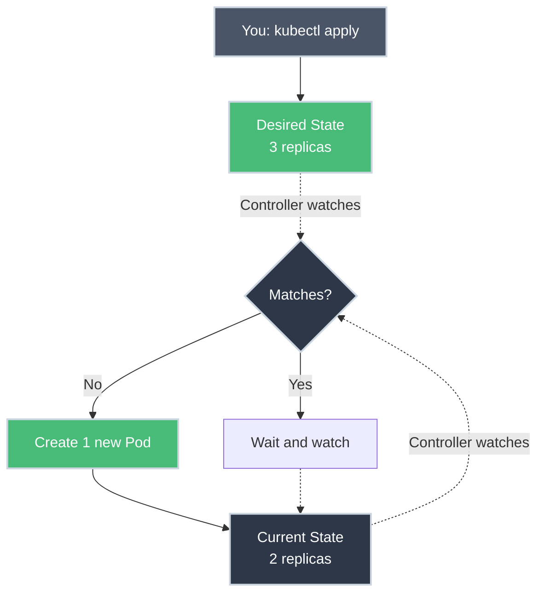
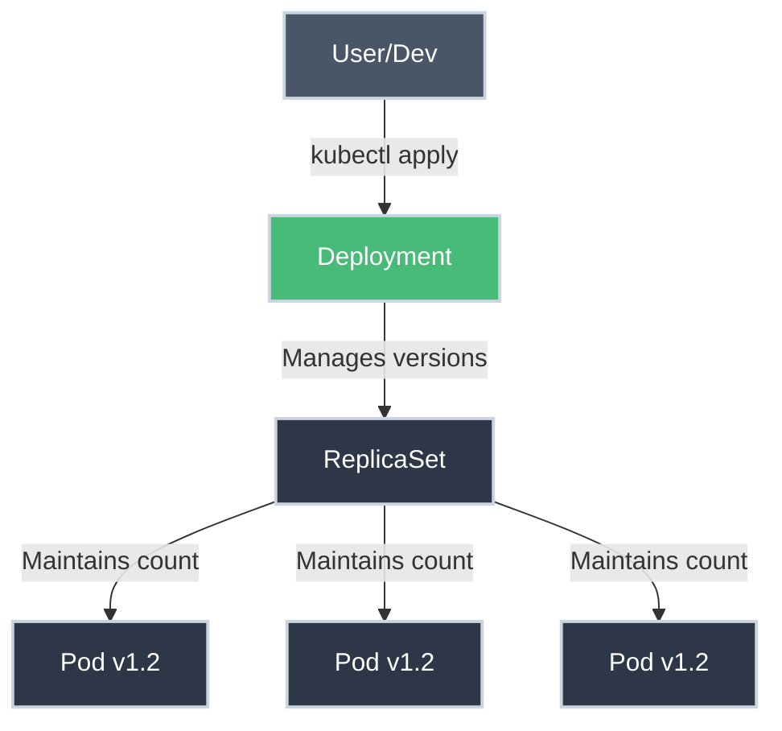

# Deployments: Scaling and Self-Healing

!!! tip "Part of Level 2: Workload Management"
    This article is part of [Level 2: Workload Management](overview.md). Make sure you understand [Pods](../level_1/pods.md) and [Services](../level_1/services.md) first.

If Pods are the building blocks of Kubernetes, then **Deployments** are the architects.

In a real production environment, you almost never create a Pod directly. Instead, you create a **Deployment**, and the Deployment creates the Pods for you.

---

## The Controller Loop: The Secret Sauce

Kubernetes works on a "Desired State" model.

1. You say: *"I want 3 copies of my Web App running."* (**Desired State**)
2. The **Deployment Controller** looks at the cluster and sees 0 copies. (**Current State**)
3. The Controller creates 3 Pods. (**Action**)

This loop runs forever. If you pull the plug on one server and a Pod dies, the Controller notices the count is now 2, and it immediately starts a new Pod on a healthy server to bring it back to 3. This is **Self-Healing**.



---

## Deployments, ReplicaSets, and Pods

A Deployment doesn't actually manage Pods directly. It manages a **ReplicaSet**.

- The **ReplicaSet's** only job is to ensure the exact number of Pods are running.
- The **Deployment's** job is to manage the *version* of those Pods.



**Why the extra layer?** When you update your app version, the Deployment creates a *new* ReplicaSet for the new version while scaling down the old one. This enables rolling updates and rollbacks.

---

## Creating a Deployment

### Basic Deployment

``` yaml title="nginx-deployment.yaml" linenums="1"
apiVersion: apps/v1  # (1)!
kind: Deployment
metadata:
  name: nginx-deployment
  labels:
    app: nginx
spec:
  replicas: 3  # (2)!
  selector:
    matchLabels:
      app: nginx  # (3)!
  template:  # (4)!
    metadata:
      labels:
        app: nginx  # (5)!
    spec:
      containers:
      - name: nginx
        image: nginx:1.21  # (6)!
        ports:
        - containerPort: 80
```

1. API version for apps (Deployments, StatefulSets, etc.)
2. Desired number of pod replicas
3. Selector matches pods with this label
4. Template defines the pods to create
5. Pod labels must match selector
6. Container image - gets updated for rolling updates

**Apply it:**

``` bash title="Create Deployment"
kubectl apply -f nginx-deployment.yaml
# deployment.apps/nginx-deployment created

kubectl get deployments
# NAME               READY   UP-TO-DATE   AVAILABLE   AGE
# nginx-deployment   3/3     3            3           10s

kubectl get pods
# NAME                                READY   STATUS    RESTARTS   AGE
# nginx-deployment-7c5ddbdf54-2xkqn   1/1     Running   0          15s
# nginx-deployment-7c5ddbdf54-8mz4p   1/1     Running   0          15s
# nginx-deployment-7c5ddbdf54-x7fnw   1/1     Running   0          15s
```

---

## Rolling Updates: Zero Downtime

When you want to update your app from version 1.21 to version 1.22, you don't delete everything and start over. A Deployment performs a **Rolling Update**:

1. It creates one new Pod (v1.22).
2. Once the new Pod is healthy, it deletes one old Pod (v1.21).
3. It repeats this until only v1.22 Pods remain.

This ensures your users never see a "404 Not Found" page while you are upgrading your software.

**Update the image:**

``` bash title="Update Deployment Image"
kubectl set image deployment/nginx-deployment nginx=nginx:1.22
# deployment.apps/nginx-deployment image updated

# Watch the rollout
kubectl rollout status deployment/nginx-deployment
# Waiting for deployment "nginx-deployment" rollout to finish: 1 out of 3 new replicas have been updated...
# Waiting for deployment "nginx-deployment" rollout to finish: 2 out of 3 new replicas have been updated...
# deployment "nginx-deployment" successfully rolled out
```

**Or update the YAML:**

``` yaml title="nginx-deployment.yaml (updated)"
spec:
  containers:
  - name: nginx
    image: nginx:1.22  # Changed from 1.21
```

``` bash title="Apply Updated YAML"
kubectl apply -f nginx-deployment.yaml
# deployment.apps/nginx-deployment configured
```

---

## Rollback Strategy

### Rolling Update Configuration

Control how fast the update happens:

``` yaml title="deployment-with-strategy.yaml" linenums="1"
apiVersion: apps/v1
kind: Deployment
metadata:
  name: web-app
spec:
  replicas: 10
  strategy:
    type: RollingUpdate  # (1)!
    rollingUpdate:
      maxSurge: 2  # (2)!
      maxUnavailable: 1  # (3)!
  selector:
    matchLabels:
      app: web
  template:
    metadata:
      labels:
        app: web
    spec:
      containers:
      - name: web
        image: myapp:v2
```

1. RollingUpdate is the default (alternative: Recreate)
2. Max additional pods during update (can exceed replicas temporarily)
3. Max pods that can be unavailable during update

### Rollback: The Panic Button

What if your new code has a bug and starts crashing? A Deployment keeps a history of your previous ReplicaSets. You can "Undo" the update instantly.

``` bash title="Rollback Deployment"
# Check rollout history
kubectl rollout history deployment/nginx-deployment
# REVISION  CHANGE-CAUSE
# 1         <none>
# 2         <none>
# 3         kubectl set image deployment/nginx-deployment nginx=nginx:1.22

# Undo the last rollout
kubectl rollout undo deployment/nginx-deployment
# deployment.apps/nginx-deployment rolled back

# Rollback to specific revision
kubectl rollout undo deployment/nginx-deployment --to-revision=1
```

---

## Scaling Deployments

### Manual Scaling

``` bash title="Scale Deployment"
# Scale to 5 replicas
kubectl scale deployment/nginx-deployment --replicas=5
# deployment.apps/nginx-deployment scaled

# Or update the YAML and apply
```

### Autoscaling (Preview)

Kubernetes can automatically scale based on CPU usage:

``` bash title="Create Horizontal Pod Autoscaler"
kubectl autoscale deployment nginx-deployment --min=2 --max=10 --cpu-percent=80
# horizontalpodautoscaler.autoscaling/nginx-deployment autoscaled
```

We'll cover autoscaling in detail in Level 5.

---

## Working with Deployments

### Essential kubectl Commands

``` bash title="Deployment Operations"
# Get deployments
kubectl get deployments
kubectl get deploy  # Short form

# Detailed information
kubectl describe deployment nginx-deployment

# View replica sets
kubectl get replicasets
kubectl get rs  # Short form

# Watch rollout status
kubectl rollout status deployment/nginx-deployment

# Pause/resume rollout
kubectl rollout pause deployment/nginx-deployment
kubectl rollout resume deployment/nginx-deployment

# Restart deployment (recreate all pods)
kubectl rollout restart deployment/nginx-deployment

# Delete deployment (deletes pods too!)
kubectl delete deployment nginx-deployment
```

!!! warning "Deleting Deployments"
    When you delete a Deployment, all its ReplicaSets and Pods are also deleted. This is usually what you want, but be aware!

---

## Practice Problems

??? question "Practice Problem 1: Manual Deletion"
    You have a Deployment managing 3 Pods. You manually delete one of the Pods using `kubectl delete pod <pod-name>`. What happens 5 seconds later?

    ??? tip "Solution"
        **A new Pod is born.**

        The ReplicaSet controller will notice that the "Current State" (2 Pods) does not match your "Desired State" (3 Pods) and will immediately create a replacement Pod. This is how Kubernetes handles hardware failures automatically.

        **This is self-healing in action.**

??? question "Practice Problem 2: Updating Images"
    You update the container image in your Deployment manifest from `nginx:1.21` to `nginx:1.22` and apply it. You have 10 replicas. Does Kubernetes kill all 10 existing Pods at once?

    ??? tip "Solution"
        **No.**

        By default, it performs a **Rolling Update**. It will gradually replace old Pods with new ones to ensure that the service remains available during the transition.

        With default settings:
        - `maxUnavailable: 25%` - Max 2-3 pods down at once (for 10 replicas)
        - `maxSurge: 25%` - Can temporarily have up to 12-13 pods

        You can customize these values in the deployment strategy.

??? question "Practice Problem 3: Rollback Scenario"
    You deployed v2.0 of your app and it's crashing. What's the fastest way to get back to the working v1.0?

    ??? tip "Solution"
        **Use `kubectl rollout undo`:**

        ```bash
        kubectl rollout undo deployment/my-app
        ```

        This immediately starts a rolling update back to the previous revision. Much faster than editing YAML and reapplying.

        **Pro tip:** Add `--record` flag when applying deployments to track change history:
        ```bash
        kubectl apply -f deployment.yaml --record
        ```

---

## Key Takeaways

| Object | Purpose |
| :--- | :--- |
| **Pod** | Atomic unit of execution |
| **ReplicaSet** | Ensures the correct number of Pods exist |
| **Deployment** | Manages updates, scaling, and rollbacks |
| **Rolling Update** | Zero-downtime deployments |
| **Rollback** | Instant recovery from bad deployments |
| **Self-Healing** | Automatic pod replacement on failure |

---

## Further Reading

### Official Documentation

- [Kubernetes Docs: Deployments](https://kubernetes.io/docs/concepts/workloads/controllers/deployment/) - Complete deployment reference
- [Performing a Rolling Update](https://kubernetes.io/docs/tutorials/kubernetes-basics/update/update-intro/) - Tutorial walkthrough
- [Deployment Strategies](https://kubernetes.io/docs/concepts/workloads/controllers/deployment/#strategy) - RollingUpdate vs Recreate

### Deep Dives

- [Zero-Downtime Deployments](https://kubernetes.io/blog/2018/04/30/zero-downtime-deployment-kubernetes-jenkins/) - Best practices
- [Deployment Best Practices](https://kubernetes.io/docs/concepts/configuration/overview/) - Configuration management

### Related Articles

- [Pods: The Atomic Unit](../level_1/pods.md) - What Deployments manage
- [ReplicaSets Under the Hood](replicasets.md) - How Deployments work internally
- [StatefulSets](statefulsets.md) - For stateful applications
- **Health Checks and Probes** - Ensuring pod health (coming in Level 6)

---

## What's Next?

You understand how Deployments manage applications with zero-downtime updates. Next, learn **[ReplicaSets Under the Hood](replicasets.md)** to understand exactly how Deployments work internally, or jump to **[StatefulSets](statefulsets.md)** for stateful applications.

---

Deployments turn Kubernetes into a self-driving system. By describing the "Desired State" of your application, you free yourself from the manual labor of monitoring servers and restarting failed processes.
