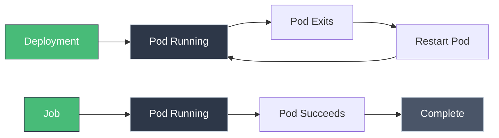

# Jobs and CronJobs: Batch and Scheduled Tasks

!!! tip "Part of Level 2: Workload Management"
    This article is part of [Level 2: Workload Management](overview.md). You should understand [Deployments](deployments.md) first.

Deployments and StatefulSets run long-lived applications. But what about tasks that need to:

- Run once and exit (database migration)
- Run on a schedule (nightly backup)
- Process a batch of work items (image processing queue)
- Complete and clean up automatically

**That's what Jobs and CronJobs are for.**

---

## Jobs vs Deployments

<div class="grid cards" markdown>

-   **Deployment**

    ---
    **Purpose:** Keep application running forever

    **Behavior:** Restarts pods if they exit

    **Example:** Web server, API, microservice

    **Success:** Pod stays Running

-   **Job**

    ---
    **Purpose:** Run task to completion

    **Behavior:** Creates pods, waits for successful exit

    **Example:** Database migration, batch processing

    **Success:** Pod exits with status 0

</div>



---

## When to Use Jobs

<div class="grid cards" markdown>

-   **Database Migrations**

    ---
    Run schema changes before deploying new app version.

    ```bash
    kubectl apply -f db-migration-job.yaml
    kubectl wait --for=condition=complete job/db-migration
    kubectl apply -f app-deployment.yaml
    ```

-   **Batch Processing**

    ---
    Process a queue of items (resize images, generate reports).

    Create multiple Jobs or use Job with `completions` > 1.

-   **One-Time Setup**

    ---
    Initialize application (seed database, create admin user).

    Run once during deployment, then delete.

-   **Data Export**

    ---
    Generate backup, export data to S3.

    CronJob runs nightly backup automatically.

</div>

---

## Job Anatomy

```yaml title="simple-job.yaml" linenums="1"
apiVersion: batch/v1
kind: Job
metadata:
  name: pi-calculation
spec:
  template:  # (1)!
    spec:
      containers:
      - name: pi
        image: perl:5.34
        command: ["perl", "-Mbignum=bpi", "-wle", "print bpi(2000)"]  # (2)!
      restartPolicy: Never  # (3)!
  backoffLimit: 4  # (4)!
```

1. Pod template (no `replicas` field)
2. Calculate Pi to 2000 digits, then exit
3. **Required** for Jobs—Never or OnFailure
4. Retry failed pods up to 4 times

**Deploy it:**

```bash
kubectl apply -f simple-job.yaml

# Watch it run
kubectl get jobs -w
# NAME              COMPLETIONS   DURATION   AGE
# pi-calculation    0/1           5s         5s
# pi-calculation    1/1           10s        10s

# View output
kubectl logs job/pi-calculation
# 3.141592653589793238462643383279502884197...
```

---

## Job Patterns

### Pattern 1: Single Completion (Default)

Run one pod to completion:

```yaml
spec:
  completions: 1  # (1)!
  parallelism: 1  # (2)!
```

1. How many successful pods needed
2. How many pods to run at once

**Behavior:** Creates 1 pod, waits for it to succeed.

### Pattern 2: Multiple Completions (Sequential)

Run task multiple times:

```yaml
spec:
  completions: 5  # (1)!
  parallelism: 1
```

1. Run 5 pods sequentially (one after another)

**Use case:** Process 5 batches of data, one at a time.

### Pattern 3: Multiple Completions (Parallel)

Run multiple pods at once:

```yaml
spec:
  completions: 10  # (1)!
  parallelism: 3  # (2)!
```

1. Need 10 successful completions
2. Run 3 pods at a time

**Behavior:**

- Start with 3 pods
- When one succeeds, start another
- Continue until 10 have succeeded

**Use case:** Process a work queue with parallelism.

### Pattern 4: Work Queue

Process items until queue is empty:

```yaml
spec:
  completions: null  # (1)!
  parallelism: 5
```

1. Keep running until pod exits with success (no fixed count)

**Application must:**

- Pull work from queue
- Exit with status 0 when queue is empty
- Handle coordination between workers

---

## Real-World Example: Database Migration

```yaml title="db-migration-job.yaml" linenums="1"
apiVersion: batch/v1
kind: Job
metadata:
  name: db-migration
  labels:
    app: myapp
    component: migration
spec:
  template:
    metadata:
      labels:
        app: myapp
        component: migration
    spec:
      containers:
      - name: migrate
        image: myapp:v2.0  # (1)!
        command: ["python", "manage.py", "migrate"]  # (2)!
        env:
        - name: DATABASE_URL
          valueFrom:
            secretKeyRef:
              name: db-credentials
              key: url
      restartPolicy: Never  # (3)!
  backoffLimit: 3  # (4)!
```

1. Same image as application (includes migration code)
2. Run migration command, then exit
3. Don't restart on failure (retry via backoffLimit)
4. Retry up to 3 times if migration fails

**Usage:**

```bash
# Deploy migration
kubectl apply -f db-migration-job.yaml

# Wait for completion
kubectl wait --for=condition=complete --timeout=300s job/db-migration

# Check status
kubectl get job db-migration
# NAME           COMPLETIONS   DURATION   AGE
# db-migration   1/1           45s        1m

# View logs
kubectl logs job/db-migration
# Running migrations:
#   Applying users.0001_initial... OK
#   Applying users.0002_add_email... OK

# Clean up
kubectl delete job db-migration
```

---

## CronJobs: Scheduled Jobs

CronJobs create Jobs on a schedule:

```yaml title="backup-cronjob.yaml" linenums="1"
apiVersion: batch/v1
kind: CronJob
metadata:
  name: database-backup
spec:
  schedule: "0 2 * * *"  # (1)!
  jobTemplate:  # (2)!
    spec:
      template:
        spec:
          containers:
          - name: backup
            image: postgres:14
            command:
            - sh
            - -c
            - |
              pg_dump -h postgres-svc -U admin myapp > /backup/backup-$(date +%Y%m%d).sql
              aws s3 cp /backup/backup-$(date +%Y%m%d).sql s3://my-backups/
            env:
            - name: PGPASSWORD
              valueFrom:
                secretKeyRef:
                  name: db-credentials
                  key: password
            volumeMounts:
            - name: backup-volume
              mountPath: /backup
          volumes:
          - name: backup-volume
            emptyDir: {}
          restartPolicy: OnFailure
  successfulJobsHistoryLimit: 3  # (3)!
  failedJobsHistoryLimit: 1  # (4)!
```

1. Cron schedule: "minute hour day month weekday" (2 AM daily)
2. Job template (nested within CronJob)
3. Keep last 3 successful Jobs
4. Keep last failed Job for debugging

**Cron Schedule Reference:**

| Schedule | Description |
|----------|-------------|
| `* * * * *` | Every minute |
| `0 * * * *` | Every hour |
| `0 2 * * *` | 2 AM daily |
| `0 0 * * 0` | Midnight every Sunday |
| `*/15 * * * *` | Every 15 minutes |
| `0 9-17 * * 1-5` | 9 AM to 5 PM on weekdays |

**Useful tool:** [crontab.guru](https://crontab.guru) for building cron expressions.

---

## CronJob Examples

### Example 1: Cleanup Job

Delete old data every night:

```yaml title="cleanup-cronjob.yaml" linenums="1"
apiVersion: batch/v1
kind: CronJob
metadata:
  name: cleanup-old-data
spec:
  schedule: "0 3 * * *"  # 3 AM daily
  jobTemplate:
    spec:
      template:
        spec:
          containers:
          - name: cleanup
            image: postgres:14
            command:
            - sh
            - -c
            - |
              psql -h postgres-svc -U admin -d myapp -c \
              "DELETE FROM logs WHERE created_at < NOW() - INTERVAL '30 days';"
            env:
            - name: PGPASSWORD
              valueFrom:
                secretKeyRef:
                  name: db-credentials
                  key: password
          restartPolicy: OnFailure
```

### Example 2: Report Generation

Generate weekly reports:

```yaml title="weekly-report-cronjob.yaml" linenums="1"
apiVersion: batch/v1
kind: CronJob
metadata:
  name: weekly-report
spec:
  schedule: "0 8 * * 1"  # 8 AM every Monday
  jobTemplate:
    spec:
      template:
        spec:
          containers:
          - name: report
            image: myapp:latest
            command: ["python", "generate_report.py", "--week", "last"]
            env:
            - name: SMTP_HOST
              value: "smtp.example.com"
            - name: RECIPIENTS
              value: "team@example.com"
          restartPolicy: OnFailure
```

### Example 3: Health Check

Ping external service every 5 minutes:

```yaml title="health-check-cronjob.yaml" linenums="1"
apiVersion: batch/v1
kind: CronJob
metadata:
  name: health-check
spec:
  schedule: "*/5 * * * *"  # Every 5 minutes
  jobTemplate:
    spec:
      template:
        spec:
          containers:
          - name: curl
            image: curlimages/curl:7.85.0
            command:
            - sh
            - -c
            - |
              curl -f https://api.example.com/health || exit 1
          restartPolicy: Never
  successfulJobsHistoryLimit: 1  # Only keep last success
```

---

## CronJob Concurrency Policy

What happens if previous Job is still running when next schedule hits?

```yaml
spec:
  concurrencyPolicy: Allow  # (1)!
```

1. Options: Allow, Forbid, Replace

=== "Allow (Default)"
    ```yaml
    concurrencyPolicy: Allow
    ```
    **Behavior:** Run both jobs concurrently

    **Use when:** Jobs are independent and safe to overlap

=== "Forbid"
    ```yaml
    concurrencyPolicy: Forbid
    ```
    **Behavior:** Skip new job if previous still running

    **Use when:** Jobs must not overlap (e.g., database locks)

=== "Replace"
    ```yaml
    concurrencyPolicy: Replace
    ```
    **Behavior:** Cancel old job, start new one

    **Use when:** Only latest run matters

---

## Suspend and Resume

Temporarily pause a CronJob:

```bash
# Suspend CronJob (no new Jobs created)
kubectl patch cronjob database-backup -p '{"spec":{"suspend":true}}'

# Resume CronJob
kubectl patch cronjob database-backup -p '{"spec":{"suspend":false}}'
```

**Or in YAML:**

```yaml
spec:
  suspend: true  # CronJob won't create new Jobs
```

---

## Job Failure Handling

### Retry Strategy

```yaml
spec:
  backoffLimit: 6  # (1)!
  template:
    spec:
      restartPolicy: OnFailure  # (2)!
```

1. Retry up to 6 times (total of 7 attempts)
2. Restart container in same pod on failure

**Backoff calculation:**

- 1st retry: 10s
- 2nd retry: 20s
- 3rd retry: 40s
- Subsequent: capped at 6 minutes

### Timeout

Prevent jobs from running forever:

```yaml
spec:
  activeDeadlineSeconds: 600  # (1)!
```

1. Kill job after 10 minutes

### TTL After Completion

Automatically delete completed jobs:

```yaml
spec:
  ttlSecondsAfterFinished: 86400  # (1)!
```

1. Delete job 24 hours after completion (86400 seconds)

**For CronJobs (built-in):**

```yaml
spec:
  successfulJobsHistoryLimit: 3
  failedJobsHistoryLimit: 1
```

---

## Troubleshooting Jobs

### Problem: Job Never Completes

```bash
kubectl get job my-job
# NAME     COMPLETIONS   DURATION   AGE
# my-job   0/1           5m         5m

kubectl get pods -l job-name=my-job
# NAME           READY   STATUS    RESTARTS   AGE
# my-job-abc     1/1     Running   0          5m
```

**Possible causes:**

- Container never exits (stuck in loop)
- Application doesn't exit with status 0
- Waiting for external resource

**Debug:**

```bash
kubectl logs my-job-abc
# Check if application is stuck

kubectl exec -it my-job-abc -- sh
# Investigate inside container
```

### Problem: Job Fails Repeatedly

```bash
kubectl get job my-job
# NAME     COMPLETIONS   DURATION   AGE
# my-job   0/1           2m         2m

kubectl describe job my-job
# Events:
#   Warning  BackoffLimitExceeded  Job has reached the specified backoff limit
```

**Check pod logs:**

```bash
kubectl get pods -l job-name=my-job
# NAME           READY   STATUS    RESTARTS   AGE
# my-job-abc     0/1     Error     0          1m

kubectl logs my-job-abc
# Error: Database connection failed
```

### Problem: CronJob Not Running

```bash
kubectl get cronjob
# NAME              SCHEDULE      SUSPEND   ACTIVE   LAST SCHEDULE
# database-backup   0 2 * * *     False     0        <none>
```

**Common issues:**

- Schedule format incorrect
- CronJob is suspended
- Previous job still running (Forbid policy)

**Debug:**

```bash
# Manually trigger CronJob
kubectl create job --from=cronjob/database-backup manual-backup-1

# Check if manual job works
kubectl get job manual-backup-1
```

---

## Working with Jobs and CronJobs

```bash title="Essential Commands"
# List Jobs
kubectl get jobs

# List CronJobs
kubectl get cronjobs
kubectl get cj  # Short form

# Describe Job
kubectl describe job my-job

# View Job logs
kubectl logs job/my-job

# View all pods for a Job
kubectl get pods -l job-name=my-job

# Delete completed Job
kubectl delete job my-job

# Suspend CronJob
kubectl patch cronjob my-cronjob -p '{"spec":{"suspend":true}}'

# Resume CronJob
kubectl patch cronjob my-cronjob -p '{"spec":{"suspend":false}}'

# Manually trigger CronJob
kubectl create job --from=cronjob/my-cronjob manual-run-1

# View CronJob history
kubectl get jobs --selector=cronjob=my-cronjob

# Delete old completed Jobs
kubectl delete job --field-selector status.successful=1
```

---

## Quick Recap

| Concept | Explanation |
|---------|-------------|
| **Job** | Runs pods to completion (not forever) |
| **completions** | How many successful pods needed |
| **parallelism** | How many pods to run at once |
| **backoffLimit** | How many retries on failure |
| **CronJob** | Creates Jobs on a schedule |
| **schedule** | Cron expression (minute hour day month weekday) |
| **concurrencyPolicy** | Allow, Forbid, or Replace overlapping jobs |
| **successfulJobsHistoryLimit** | How many successful Jobs to keep |

---

## Practice Exercises

??? question "Exercise 1: Run a One-Time Job"
    Create a Job that prints "Hello Kubernetes" and exits.

    ??? tip "Solution"
        ```yaml title="hello-job.yaml"
        apiVersion: batch/v1
        kind: Job
        metadata:
          name: hello-job
        spec:
          template:
            spec:
              containers:
              - name: hello
                image: busybox
                command: ['echo', 'Hello Kubernetes']
              restartPolicy: Never
          backoffLimit: 2
        ```

        ```bash
        kubectl apply -f hello-job.yaml

        # Wait for completion
        kubectl wait --for=condition=complete job/hello-job

        # View output
        kubectl logs job/hello-job
        # Hello Kubernetes

        # Clean up
        kubectl delete job hello-job
        ```

??? question "Exercise 2: Create a Scheduled Backup"
    Create a CronJob that runs a backup command every hour.

    ??? tip "Solution"
        ```yaml title="hourly-backup-cronjob.yaml"
        apiVersion: batch/v1
        kind: CronJob
        metadata:
          name: hourly-backup
        spec:
          schedule: "0 * * * *"  # Every hour
          jobTemplate:
            spec:
              template:
                spec:
                  containers:
                  - name: backup
                    image: busybox
                    command:
                    - sh
                    - -c
                    - |
                      echo "Running backup at $(date)"
                      echo "Backup complete"
                  restartPolicy: OnFailure
          successfulJobsHistoryLimit: 2
          failedJobsHistoryLimit: 1
        ```

        ```bash
        kubectl apply -f hourly-backup-cronjob.yaml

        # Check CronJob
        kubectl get cronjob hourly-backup

        # Manually trigger to test
        kubectl create job --from=cronjob/hourly-backup test-backup

        # Check job ran
        kubectl get job test-backup
        kubectl logs job/test-backup

        # Clean up
        kubectl delete job test-backup
        kubectl delete cronjob hourly-backup
        ```

---

## Further Reading

### Official Documentation
- [Jobs](https://kubernetes.io/docs/concepts/workloads/controllers/job/)
- [CronJobs](https://kubernetes.io/docs/concepts/workloads/controllers/cron-jobs/)
- [Running Automated Tasks](https://kubernetes.io/docs/tasks/job/)

### Deep Dives
- [Parallel Processing with Jobs](https://kubernetes.io/docs/tasks/job/parallel-processing-expansion/)
- [Coarse Parallel Processing Using a Work Queue](https://kubernetes.io/docs/tasks/job/coarse-parallel-processing-work-queue/)
- [Fine Parallel Processing Using a Work Queue](https://kubernetes.io/docs/tasks/job/fine-parallel-processing-work-queue/)

### Tools
- [Crontab Guru](https://crontab.guru) - Build and explain cron expressions
- [Kubernetes Job Generator](https://k8syaml.com/) - Generate Job YAML

### Related Articles
- [Deployments](deployments.md) - For long-running applications
- **Init Containers** - One-time setup per pod (coming in Level 3)
- **Resource Requests** - Managing job resources (coming in Level 5)

---

## What's Next?

**Congratulations!** You've completed Level 2: Workload Management. You understand:

- Deployments for stateless applications
- ReplicaSets under the hood
- StatefulSets for stable identities
- DaemonSets for node-level workloads
- Jobs and CronJobs for batch processing

Move on to ****Level 3: Networking** (coming soon)** to learn how to connect services, expose applications, and control traffic flow.

---

**Key Takeaway:** Jobs run tasks to completion. CronJobs run Jobs on a schedule. Use them for migrations, backups, batch processing, and any work that needs to finish (not run forever).
