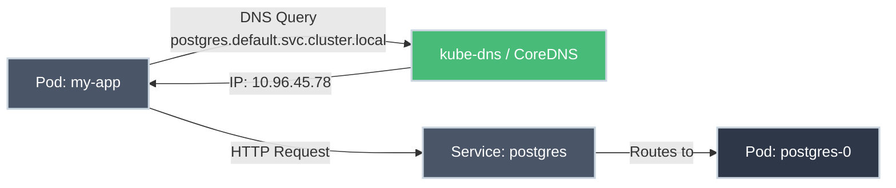

# DNS and Service Discovery

!!! tip "Part of Level 3: Networking"
    This is part of [Level 3: Networking](overview.md). If you haven't covered services yet, start with [Services Deep Dive](services_deep_dive.md).

You deploy a database, and your web app needs to connect to it. How does `my-web-app` find `postgres-service`? You didn't configure IP addresses—how does Kubernetes wire them together?

The answer: **built-in DNS and service discovery**. Every Service gets a DNS name, and pods can find each other without hardcoded IPs.

---

## What You'll Learn

- How Kubernetes DNS works under the hood
- Service DNS naming patterns
- How pods discover and connect to services
- Troubleshooting DNS issues
- Best practices for service discovery

---

## How Kubernetes DNS Works



**What happens:**

1. **Pod makes DNS query** - Your app looks up `postgres.default.svc.cluster.local`
2. **kube-dns/CoreDNS responds** - Returns the Service's ClusterIP
3. **Pod connects to Service** - Uses the IP to connect
4. **Service routes to Pod** - The Service forwards traffic to a healthy Pod

**Why it matters:** No hardcoded IPs. Services can move, scale, or restart—DNS stays the same.

---

## DNS Naming Patterns

<div class="grid cards" markdown>

-   :material-dns: **Service DNS Format**

    ---

    **Why it matters:** Services get predictable DNS names you can use in configuration.

    **Format:**
    ```
    <service-name>.<namespace>.svc.cluster.local
    ```

    **Examples:**
    ```bash
    # Full name
    postgres.default.svc.cluster.local

    # Short name (same namespace)
    postgres

    # Cross-namespace
    postgres.production.svc.cluster.local
    ```

    **Key insight:** Within the same namespace, just use `<service-name>`.

-   :material-server-network: **Headless Service DNS**

    ---

    **Why it matters:** StatefulSets need predictable pod DNS names for direct pod-to-pod communication.

    **Format:**
    ```
    <pod-name>.<service-name>.<namespace>.svc.cluster.local
    ```

    **Example:**
    ```bash
    # StatefulSet pod
    postgres-0.postgres-headless.default.svc.cluster.local
    postgres-1.postgres-headless.default.svc.cluster.local
    ```

    **Key insight:** Each pod gets its own DNS entry (for databases, messaging systems).

-   :material-shape: **Pod DNS Format**

    ---

    **Why it matters:** Sometimes you need to reach a specific pod directly.

    **Format:**
    ```
    <pod-ip-with-dashes>.<namespace>.pod.cluster.local
    ```

    **Example:**
    ```bash
    # Pod with IP 10.244.1.5
    10-244-1-5.default.pod.cluster.local
    ```

    **Key insight:** Rarely used—prefer Services for stable endpoints.

</div>

---

## Service Discovery Scenarios

=== "Same Namespace"

    **Scenario:** Your web app and database are in the same namespace.

    **YAML:**
    ``` yaml title="web-app-deployment.yaml" linenums="1"
    apiVersion: apps/v1
    kind: Deployment
    metadata:
      name: web-app
      namespace: default  # (1)!
    spec:
      replicas: 3
      selector:
        matchLabels:
          app: web-app
      template:
        metadata:
          labels:
            app: web-app
        spec:
          containers:
          - name: web
            image: my-web-app:1.0
            env:
            - name: DATABASE_HOST
              value: postgres  # (2)!
            - name: DATABASE_PORT
              value: "5432"
    ```

    1. Both web-app and postgres service are in `default` namespace
    2. Just use the service name—Kubernetes resolves it

    **Why it works:** Kubernetes automatically searches `<service>.default.svc.cluster.local`.

=== "Cross-Namespace"

    **Scenario:** Your web app in `frontend` namespace needs a database in `backend` namespace.

    **YAML:**
    ``` yaml title="web-app-deployment.yaml" linenums="1"
    apiVersion: apps/v1
    kind: Deployment
    metadata:
      name: web-app
      namespace: frontend  # (1)!
    spec:
      replicas: 3
      selector:
        matchLabels:
          app: web-app
      template:
        metadata:
          labels:
            app: web-app
        spec:
          containers:
          - name: web
            image: my-web-app:1.0
            env:
            - name: DATABASE_HOST
              value: postgres.backend  # (2)!
            - name: DATABASE_PORT
              value: "5432"
    ```

    1. Web app is in `frontend` namespace
    2. Use `<service>.<namespace>` format to cross namespaces

    **Why it works:** Kubernetes resolves `postgres.backend` to `postgres.backend.svc.cluster.local`.

=== "StatefulSet (Headless)"

    **Scenario:** Direct pod-to-pod communication for a database cluster.

    **Service:**
    ``` yaml title="postgres-headless-service.yaml" linenums="1"
    apiVersion: v1
    kind: Service
    metadata:
      name: postgres-headless
    spec:
      clusterIP: None  # (1)!
      selector:
        app: postgres
      ports:
      - port: 5432
        targetPort: 5432
    ```

    1. `clusterIP: None` makes this a headless service

    **StatefulSet:**
    ``` yaml title="postgres-statefulset.yaml" linenums="1"
    apiVersion: apps/v1
    kind: StatefulSet
    metadata:
      name: postgres
    spec:
      serviceName: postgres-headless  # (1)!
      replicas: 3
      selector:
        matchLabels:
          app: postgres
      template:
        metadata:
          labels:
            app: postgres
        spec:
          containers:
          - name: postgres
            image: postgres:14
            ports:
            - containerPort: 5432
    ```

    1. Links StatefulSet to headless service

    **DNS names created:**
    ```
    postgres-0.postgres-headless.default.svc.cluster.local
    postgres-1.postgres-headless.default.svc.cluster.local
    postgres-2.postgres-headless.default.svc.cluster.local
    ```

    **Why it works:** Each pod gets a stable DNS name that persists across restarts.

---

## DNS Configuration in Pods

Every pod automatically gets DNS configuration:

``` bash title="Check pod DNS config"
kubectl exec -it my-pod -- cat /etc/resolv.conf
```

**Output:**
```
nameserver 10.96.0.10
search default.svc.cluster.local svc.cluster.local cluster.local
options ndots:5
```

**What it means:**

- **nameserver**: kube-dns/CoreDNS Service IP
- **search domains**: Automatic suffixes (allows short names like `postgres`)
- **ndots:5**: How many dots before treating as FQDN

---

## Troubleshooting DNS Issues

<div class="grid cards" markdown>

-   :material-bug: **DNS Not Resolving**

    ---

    **Symptom:** `nslookup my-service` fails

    **Check 1: Is kube-dns/CoreDNS running?**
    ``` bash title="Check DNS pods"
    kubectl get pods -n kube-system -l k8s-app=kube-dns
    # or
    kubectl get pods -n kube-system -l k8s-app=coredns
    ```

    **Check 2: Can pod reach DNS?**
    ``` bash title="Test DNS from pod"
    kubectl exec -it my-pod -- nslookup kubernetes.default
    ```

    **Check 3: Verify service exists**
    ``` bash title="List services"
    kubectl get svc
    ```

-   :material-network-off: **Wrong Namespace**

    ---

    **Symptom:** `postgres` resolves but connection fails

    **Issue:** Service is in different namespace

    **Fix:**
    ``` bash title="List services in all namespaces"
    kubectl get svc -A | grep postgres
    ```

    **Use full name:**
    ```
    postgres.backend.svc.cluster.local
    ```

-   :material-timer-sand: **DNS Caching**

    ---

    **Symptom:** Old IP still being used after service recreated

    **Issue:** DNS response is cached

    **Fix:** TTL is short (30s default), wait or restart pods
    ``` bash title="Restart deployment"
    kubectl rollout restart deployment my-app
    ```

</div>

---

## Best Practices

!!! success "DO: Use Service Names"
    ```yaml
    env:
    - name: DATABASE_HOST
      value: postgres  # ✅ Service name
    ```

!!! failure "DON'T: Hardcode IPs"
    ```yaml
    env:
    - name: DATABASE_HOST
      value: 10.96.45.78  # ❌ IP will change
    ```

!!! success "DO: Use Namespaced Names Cross-Namespace"
    ```yaml
    env:
    - name: API_HOST
      value: api.backend  # ✅ Clear and explicit
    ```

!!! success "DO: Use Headless Services for StatefulSets"
    ```yaml
    apiVersion: v1
    kind: Service
    metadata:
      name: postgres-headless
    spec:
      clusterIP: None  # ✅ Enables per-pod DNS
    ```

---

## Practice Exercises

??? question "Exercise 1: Test Service Discovery"
    Deploy an nginx pod and verify you can resolve a service.

    **Goal:** Understand how DNS resolution works from inside a pod.

    **Steps:**
    1. Create a simple service
    2. Deploy a test pod
    3. Use nslookup to resolve the service

    ??? tip "Solution"
        **Create a service:**
        ``` yaml title="nginx-service.yaml" linenums="1"
        apiVersion: v1
        kind: Service
        metadata:
          name: nginx-svc
        spec:
          selector:
            app: nginx
          ports:
          - port: 80
            targetPort: 80
        ---
        apiVersion: apps/v1
        kind: Deployment
        metadata:
          name: nginx
        spec:
          replicas: 2
          selector:
            matchLabels:
              app: nginx
          template:
            metadata:
              labels:
                app: nginx
            spec:
              containers:
              - name: nginx
                image: nginx:1.21
        ```

        ``` bash title="Apply and test"
        kubectl apply -f nginx-service.yaml

        # Deploy test pod
        kubectl run test-pod --image=busybox --rm -it --restart=Never -- sh

        # Inside pod:
        nslookup nginx-svc
        nslookup nginx-svc.default
        nslookup nginx-svc.default.svc.cluster.local

        # All three should resolve to the same ClusterIP
        ```

        **What you learned:** Kubernetes DNS supports multiple name formats—short name works within namespace.

??? question "Exercise 2: Cross-Namespace Service Discovery"
    Create two namespaces and test service discovery across them.

    **Goal:** Understand how to reference services in different namespaces.

    ??? tip "Solution"
        ``` bash title="Create namespaces and services"
        # Create namespaces
        kubectl create namespace frontend
        kubectl create namespace backend

        # Deploy backend service
        kubectl create deployment postgres -n backend --image=postgres:14
        kubectl expose deployment postgres -n backend --port=5432

        # Deploy frontend pod
        kubectl run web -n frontend --image=busybox --rm -it --restart=Never -- sh

        # Inside pod, test resolution:
        nslookup postgres.backend
        nslookup postgres.backend.svc.cluster.local

        # This works! postgres in namespace backend is reachable
        ```

        **What you learned:** Use `<service>.<namespace>` format for cross-namespace communication.

??? question "Exercise 3: Headless Service for StatefulSet"
    Deploy a headless service and verify individual pod DNS names.

    **Goal:** Understand how StatefulSets get stable network identities.

    ??? tip "Solution"
        ``` yaml title="headless-statefulset.yaml" linenums="1"
        apiVersion: v1
        kind: Service
        metadata:
          name: nginx-headless
        spec:
          clusterIP: None  # Headless
          selector:
            app: nginx-sts
          ports:
          - port: 80
        ---
        apiVersion: apps/v1
        kind: StatefulSet
        metadata:
          name: nginx-sts
        spec:
          serviceName: nginx-headless
          replicas: 3
          selector:
            matchLabels:
              app: nginx-sts
          template:
            metadata:
              labels:
                app: nginx-sts
            spec:
              containers:
              - name: nginx
                image: nginx:1.21
        ```

        ``` bash title="Apply and test DNS"
        kubectl apply -f headless-statefulset.yaml

        # Wait for pods
        kubectl get pods -w

        # Test from another pod
        kubectl run test-pod --image=busybox --rm -it --restart=Never -- sh

        # Inside pod:
        nslookup nginx-headless
        nslookup nginx-sts-0.nginx-headless
        nslookup nginx-sts-1.nginx-headless
        nslookup nginx-sts-2.nginx-headless

        # Each pod has its own DNS name!
        ```

        **What you learned:** Headless services + StatefulSets provide stable, predictable DNS names per pod.

---

## Quick Reference

| Scenario | DNS Format | Example |
|----------|-----------|---------|
| **Same namespace** | `<service>` | `postgres` |
| **Full name** | `<service>.<namespace>.svc.cluster.local` | `postgres.default.svc.cluster.local` |
| **Cross-namespace** | `<service>.<namespace>` | `postgres.backend` |
| **StatefulSet pod** | `<pod>.<service>.<namespace>.svc.cluster.local` | `postgres-0.postgres-headless.default.svc.cluster.local` |
| **Pod IP** | `<ip-with-dashes>.<namespace>.pod.cluster.local` | `10-244-1-5.default.pod.cluster.local` |

---

## Quick Recap

- **Every Service gets DNS:** `<service>.<namespace>.svc.cluster.local`
- **Short names work:** Just use `<service>` within same namespace
- **Cross-namespace:** Use `<service>.<namespace>` format
- **Headless Services:** Enable per-pod DNS for StatefulSets
- **Automatic configuration:** Pods get DNS config automatically
- **No hardcoded IPs:** Services provide stable DNS names even as pods move

---

## Further Reading

### Official Documentation
- [Kubernetes DNS](https://kubernetes.io/docs/concepts/services-networking/dns-pod-service/) - Official DNS reference
- [CoreDNS](https://coredns.io/) - DNS server used in modern Kubernetes
- [Service Discovery](https://kubernetes.io/docs/concepts/services-networking/service/#discovering-services) - How apps find services

### Deep Dives
- [DNS for Services and Pods](https://kubernetes.io/docs/concepts/services-networking/dns-pod-service/) - Comprehensive DNS guide
- [Debugging DNS Resolution](https://kubernetes.io/docs/tasks/administer-cluster/dns-debugging-resolution/) - Troubleshooting guide

### Related Articles
- [Services Deep Dive](services_deep_dive.md) - How Services work
- [StatefulSets](../level_2/statefulsets.md) - Stateful applications with stable network IDs
- [Troubleshooting Networking](troubleshooting_networking.md) - Network debugging techniques

---

## What's Next?

You understand how services discover each other. Next, learn systematic approaches to debugging network issues: **[Troubleshooting Networking](troubleshooting_networking.md)**.
