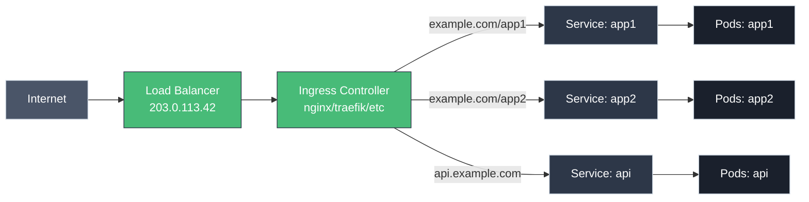

# Ingress: HTTP Routing and Load Balancing

!!! tip "Part of Level 3: Networking"
    This article is part of [Level 3: Networking](overview.md). You should understand [Services](../level_1/services.md) and [Services Deep Dive](services_deep_dive.md) first.

LoadBalancer Services work, but they have problems:

- ❌ Each Service creates a separate cloud load balancer (expensive!)
- ❌ No HTTP routing (path-based, host-based)
- ❌ No TLS termination at the routing layer
- ❌ No URL rewriting or redirects

**Ingress solves these problems.**

---

## What Is Ingress?

Ingress is an API object that manages HTTP/HTTPS access to Services:



**Key benefits:**

- **One load balancer** for many Services
- **Path-based routing:** `/app1` → Service A, `/app2` → Service B
- **Host-based routing:** `app1.example.com` → Service A, `app2.example.com` → Service B
- **TLS termination:** HTTPS at the edge
- **URL rewriting, redirects, authentication**

---

## Ingress Components

### 1. Ingress Resource

You define routing rules:

```yaml
apiVersion: networking.k8s.io/v1
kind: Ingress
metadata:
  name: my-ingress
spec:
  rules:
  - host: example.com
    http:
      paths:
      - path: /app1
        pathType: Prefix
        backend:
          service:
            name: app1-svc
            port:
              number: 80
```

### 2. Ingress Controller

A controller (nginx, Traefik, HAProxy) watches Ingress resources and configures routing.

**Popular Ingress Controllers:**

- **NGINX Ingress Controller** - Most common, battle-tested
- **Traefik** - Modern, automatic HTTPS (Let's Encrypt)
- **HAProxy** - High performance
- **Contour** - Envoy-based
- **Ambassador** - API gateway features
- **AWS ALB Ingress Controller** - Native AWS integration
- **GCE Ingress Controller** - Native GCP integration

**Your platform team typically installs the Ingress Controller.** You just create Ingress resources.

---

## Basic Ingress Example

### Deploy Two Applications

```bash title="Deploy Backend Services"
# App 1
kubectl create deployment app1 --image=nginx:1.21
kubectl expose deployment app1 --port=80

# App 2
kubectl create deployment app2 --image=httpd:2.4
kubectl expose deployment app2 --port=80
```

### Create Ingress

```yaml title="simple-ingress.yaml" linenums="1"
apiVersion: networking.k8s.io/v1
kind: Ingress
metadata:
  name: simple-ingress
spec:
  rules:
  - host: myapp.example.com  # (1)!
    http:
      paths:
      - path: /app1  # (2)!
        pathType: Prefix  # (3)!
        backend:
          service:
            name: app1  # (4)!
            port:
              number: 80
      - path: /app2
        pathType: Prefix
        backend:
          service:
            name: app2
            port:
              number: 80
```

1. Hostname for routing
2. URL path
3. Prefix match (matches `/app1`, `/app1/foo`, etc.)
4. Backend Service name

**Apply it:**

```bash
kubectl apply -f simple-ingress.yaml

# Check Ingress
kubectl get ingress simple-ingress
# NAME              CLASS   HOSTS                ADDRESS         PORTS   AGE
# simple-ingress    <none>  myapp.example.com    203.0.113.42    80      1m
```

**Access:**

```bash
curl -H "Host: myapp.example.com" http://203.0.113.42/app1
# Routes to app1 Service

curl -H "Host: myapp.example.com" http://203.0.113.42/app2
# Routes to app2 Service
```

---

## Path Types

### Prefix (Most Common)

Matches path prefix:

```yaml
pathType: Prefix
path: /app
```

**Matches:**

- ✅ `/app`
- ✅ `/app/`
- ✅ `/app/page`
- ✅ `/app/subdir/file`
- ❌ `/app2` (not a path separator)
- ❌ `/otherapp`

### Exact

Matches exact path only:

```yaml
pathType: Exact
path: /app
```

**Matches:**

- ✅ `/app`
- ❌ `/app/`
- ❌ `/app/page`

### ImplementationSpecific

Behavior depends on Ingress Controller:

```yaml
pathType: ImplementationSpecific
path: /app
```

**Use when:** You need specific Ingress Controller features (regex, etc.)

---

## Host-Based Routing

Route based on hostname:

```yaml title="host-based-ingress.yaml" linenums="1"
apiVersion: networking.k8s.io/v1
kind: Ingress
metadata:
  name: host-based
spec:
  rules:
  - host: app1.example.com  # (1)!
    http:
      paths:
      - path: /
        pathType: Prefix
        backend:
          service:
            name: app1
            port:
              number: 80
  - host: app2.example.com  # (2)!
    http:
      paths:
      - path: /
        pathType: Prefix
        backend:
          service:
            name: app2
            port:
              number: 80
```

1. First subdomain → app1
2. Second subdomain → app2

**Access:**

```bash
curl http://app1.example.com
# Routes to app1

curl http://app2.example.com
# Routes to app2
```

---

## TLS / HTTPS

### Create TLS Secret

```bash title="Create TLS Certificate Secret"
# Using self-signed cert (for testing)
openssl req -x509 -nodes -days 365 -newkey rsa:2048 \
  -keyout tls.key -out tls.crt -subj "/CN=myapp.example.com"

# Create secret
kubectl create secret tls my-tls-secret \
  --cert=tls.crt \
  --key=tls.key
```

### Enable TLS in Ingress

```yaml title="tls-ingress.yaml" linenums="1"
apiVersion: networking.k8s.io/v1
kind: Ingress
metadata:
  name: tls-ingress
spec:
  tls:  # (1)!
  - hosts:
    - myapp.example.com
    secretName: my-tls-secret  # (2)!
  rules:
  - host: myapp.example.com
    http:
      paths:
      - path: /
        pathType: Prefix
        backend:
          service:
            name: app1
            port:
              number: 80
```

1. TLS configuration
2. References TLS Secret

**Access:**

```bash
curl -k https://myapp.example.com
# HTTPS with TLS termination at Ingress
```

### Automatic HTTPS with cert-manager

For production, use **cert-manager** to get Let's Encrypt certificates automatically:

```yaml
apiVersion: networking.k8s.io/v1
kind: Ingress
metadata:
  name: auto-tls
  annotations:
    cert-manager.io/cluster-issuer: letsencrypt-prod  # (1)!
spec:
  tls:
  - hosts:
    - myapp.example.com
    secretName: myapp-tls  # (2)!
  rules:
  - host: myapp.example.com
    http:
      paths:
      - path: /
        pathType: Prefix
        backend:
          service:
            name: app1
            port:
              number: 80
```

1. Use cert-manager for automatic cert
2. cert-manager creates this Secret automatically

**cert-manager handles certificate lifecycle (request, renewal, rotation).**

---

## Default Backend

Handle requests that don't match any rules:

```yaml title="ingress-with-default.yaml" linenums="1"
apiVersion: networking.k8s.io/v1
kind: Ingress
metadata:
  name: with-default
spec:
  defaultBackend:  # (1)!
    service:
      name: default-http-backend
      port:
        number: 80
  rules:
  - host: myapp.example.com
    http:
      paths:
      - path: /app
        pathType: Prefix
        backend:
          service:
            name: app1
            port:
              number: 80
```

1. Fallback for unmatched requests

**Behavior:**

- `myapp.example.com/app` → app1
- `myapp.example.com/other` → default-http-backend
- `unknown.example.com` → default-http-backend

---

## Annotations: Controller-Specific Configuration

Ingress Controllers use annotations for advanced features:

### NGINX Ingress Controller Examples

```yaml
apiVersion: networking.k8s.io/v1
kind: Ingress
metadata:
  name: nginx-ingress
  annotations:
    # Rewrite URLs
    nginx.ingress.kubernetes.io/rewrite-target: /$2  # (1)!

    # Force HTTPS redirect
    nginx.ingress.kubernetes.io/force-ssl-redirect: "true"  # (2)!

    # CORS configuration
    nginx.ingress.kubernetes.io/enable-cors: "true"
    nginx.ingress.kubernetes.io/cors-allow-origin: "*"

    # Rate limiting
    nginx.ingress.kubernetes.io/limit-rps: "10"  # (3)!

    # Custom error pages
    nginx.ingress.kubernetes.io/custom-http-errors: "404,503"
    nginx.ingress.kubernetes.io/default-backend: custom-error-backend

    # Client body size (file uploads)
    nginx.ingress.kubernetes.io/proxy-body-size: "50m"  # (4)!

    # Timeouts
    nginx.ingress.kubernetes.io/proxy-connect-timeout: "60"
    nginx.ingress.kubernetes.io/proxy-send-timeout: "60"
    nginx.ingress.kubernetes.io/proxy-read-timeout: "60"

    # WebSocket support
    nginx.ingress.kubernetes.io/proxy-http-version: "1.1"
    nginx.ingress.kubernetes.io/proxy-set-headers: "Connection: Upgrade"
spec:
  rules:
  - host: myapp.example.com
    http:
      paths:
      - path: /api/v1(/|$)(.*)  # (5)!
        pathType: Prefix
        backend:
          service:
            name: api-svc
            port:
              number: 80
```

1. Rewrites `/api/v1/users` → `/users`
2. Redirect HTTP to HTTPS automatically
3. Max 10 requests per second per IP
4. Allow 50MB file uploads
5. Regex path for rewrite-target

**Annotations are Ingress Controller specific!** NGINX annotations won't work with Traefik, etc.

---

## IngressClass

For clusters with multiple Ingress Controllers:

```yaml title="ingressclass.yaml" linenums="1"
apiVersion: networking.k8s.io/v1
kind: IngressClass
metadata:
  name: nginx
spec:
  controller: k8s.io/ingress-nginx  # (1)!

---
apiVersion: networking.k8s.io/v1
kind: IngressClass
metadata:
  name: traefik
  annotations:
    ingressclass.kubernetes.io/is-default-class: "true"  # (2)!
spec:
  controller: traefik.io/ingress-controller
```

1. NGINX controller
2. Default IngressClass (used if not specified)

**Use in Ingress:**

```yaml
apiVersion: networking.k8s.io/v1
kind: Ingress
metadata:
  name: my-ingress
spec:
  ingressClassName: nginx  # (1)!
  rules:
  - host: myapp.example.com
    http:
      paths:
      - path: /
        pathType: Prefix
        backend:
          service:
            name: app1
            port:
              number: 80
```

1. Use NGINX IngressClass

---

## Real-World Pattern: Multiple Environments

```yaml title="multi-env-ingress.yaml" linenums="1"
---
# Development
apiVersion: networking.k8s.io/v1
kind: Ingress
metadata:
  name: dev-ingress
  namespace: dev
spec:
  rules:
  - host: dev.myapp.example.com
    http:
      paths:
      - path: /
        pathType: Prefix
        backend:
          service:
            name: app
            port:
              number: 80

---
# Staging
apiVersion: networking.k8s.io/v1
kind: Ingress
metadata:
  name: staging-ingress
  namespace: staging
spec:
  rules:
  - host: staging.myapp.example.com
    http:
      paths:
      - path: /
        pathType: Prefix
        backend:
          service:
            name: app
            port:
              number: 80

---
# Production
apiVersion: networking.k8s.io/v1
kind: Ingress
metadata:
  name: prod-ingress
  namespace: prod
  annotations:
    nginx.ingress.kubernetes.io/force-ssl-redirect: "true"
    nginx.ingress.kubernetes.io/limit-rps: "100"
spec:
  tls:
  - hosts:
    - myapp.example.com
    secretName: prod-tls
  rules:
  - host: myapp.example.com
    http:
      paths:
      - path: /
        pathType: Prefix
        backend:
          service:
            name: app
            port:
              number: 80
```

**Result:**

- `dev.myapp.example.com` → dev namespace
- `staging.myapp.example.com` → staging namespace
- `myapp.example.com` (HTTPS, rate-limited) → prod namespace

---

## Troubleshooting Ingress

### Problem: Ingress ADDRESS Empty

```bash
kubectl get ingress
# NAME        CLASS   HOSTS              ADDRESS   PORTS   AGE
# my-ingress  <none>  myapp.example.com  <none>    80      5m
```

**Cause:** No Ingress Controller installed.

**Solution:**

```bash
# Check if Ingress Controller exists
kubectl get pods -n ingress-nginx
# or
kubectl get pods -A | grep ingress

# If missing, install one (platform team responsibility)
kubectl apply -f https://raw.githubusercontent.com/kubernetes/ingress-nginx/controller-v1.8.1/deploy/static/provider/cloud/deploy.yaml
```

### Problem: 404 Not Found

```bash
curl http://myapp.example.com/app
# 404 Not Found
```

**Debug:**

=== "Check Ingress Rules"
    ```bash
    kubectl describe ingress my-ingress
    # Rules:
    #   Host               Path  Backends
    #   ----               ----  --------
    #   myapp.example.com  /app  app1:80 (172.17.0.5:8080)
    ```

    Check path matches your request.

=== "Check Backend Service"
    ```bash
    kubectl get service app1
    # Does it exist?

    kubectl get endpoints app1
    # ENDPOINTS: 172.17.0.5:8080
    # Has endpoints?
    ```

=== "Check Ingress Controller Logs"
    ```bash
    kubectl logs -n ingress-nginx deployment/ingress-nginx-controller
    # Look for routing errors
    ```

### Problem: 502 Bad Gateway

```bash
curl http://myapp.example.com
# 502 Bad Gateway
```

**Cause:** Service exists but Pods aren't ready or don't exist.

```bash
# Check backend Service
kubectl get endpoints app1
# ENDPOINTS: <none>  ← No Pods!

# Check Pods
kubectl get pods -l app=app1
# No resources found.

# Deploy Pods!
kubectl create deployment app1 --image=nginx:1.21
```

### Problem: TLS Certificate Issues

```bash
curl https://myapp.example.com
# SSL certificate problem
```

**Debug:**

```bash
# Check Secret exists
kubectl get secret my-tls-secret
# Should exist

# Check Secret has correct keys
kubectl describe secret my-tls-secret
# Data:
#   tls.crt: 1234 bytes
#   tls.key: 5678 bytes

# Test certificate
kubectl get secret my-tls-secret -o jsonpath='{.data.tls\.crt}' | base64 -d | openssl x509 -text -noout
# Check CN, expiration
```

---

## Quick Recap

| Concept | Explanation |
|---------|-------------|
| **Ingress** | API object defining HTTP routing rules |
| **Ingress Controller** | Implements routing (nginx, Traefik, etc.) |
| **Path-based routing** | `/app1` → Service A, `/app2` → Service B |
| **Host-based routing** | `app1.example.com` → Service A |
| **TLS termination** | HTTPS at Ingress, HTTP to backend |
| **Annotations** | Controller-specific configuration |
| **IngressClass** | Select which controller handles Ingress |
| **Default backend** | Fallback for unmatched requests |

---

## Practice Exercises

??? question "Exercise 1: Create Path-Based Routing"
    Deploy two apps and route `/app1` and `/app2` through one Ingress.

    ??? tip "Solution"
        ```bash
        # Deploy apps
        kubectl create deployment app1 --image=nginx:1.21
        kubectl expose deployment app1 --port=80

        kubectl create deployment app2 --image=httpd:2.4
        kubectl expose deployment app2 --port=80

        # Create Ingress
        cat <<EOF | kubectl apply -f -
        apiVersion: networking.k8s.io/v1
        kind: Ingress
        metadata:
          name: path-routing
        spec:
          rules:
          - http:
              paths:
              - path: /app1
                pathType: Prefix
                backend:
                  service:
                    name: app1
                    port:
                      number: 80
              - path: /app2
                pathType: Prefix
                backend:
                  service:
                    name: app2
                    port:
                      number: 80
        EOF

        # Get Ingress address
        kubectl get ingress path-routing

        # Test (replace INGRESS_IP)
        curl http://INGRESS_IP/app1
        curl http://INGRESS_IP/app2

        # Clean up
        kubectl delete ingress path-routing
        kubectl delete service app1 app2
        kubectl delete deployment app1 app2
        ```

??? question "Exercise 2: Enable HTTPS"
    Add TLS to an existing Ingress.

    ??? tip "Solution"
        ```bash
        # Create self-signed certificate
        openssl req -x509 -nodes -days 365 -newkey rsa:2048 \
          -keyout tls.key -out tls.crt \
          -subj "/CN=myapp.example.com"

        # Create Secret
        kubectl create secret tls my-tls --cert=tls.crt --key=tls.key

        # Create HTTPS Ingress
        cat <<EOF | kubectl apply -f -
        apiVersion: networking.k8s.io/v1
        kind: Ingress
        metadata:
          name: https-ingress
        spec:
          tls:
          - hosts:
            - myapp.example.com
            secretName: my-tls
          rules:
          - host: myapp.example.com
            http:
              paths:
              - path: /
                pathType: Prefix
                backend:
                  service:
                    name: app1
                    port:
                      number: 80
        EOF

        # Test (replace INGRESS_IP)
        curl -k -H "Host: myapp.example.com" https://INGRESS_IP

        # Clean up
        kubectl delete ingress https-ingress
        kubectl delete secret my-tls
        rm tls.key tls.crt
        ```

---

## Further Reading

### Official Documentation
- [Ingress](https://kubernetes.io/docs/concepts/services-networking/ingress/)
- [Ingress Controllers](https://kubernetes.io/docs/concepts/services-networking/ingress-controllers/)
- [Set up Ingress on Minikube with NGINX Controller](https://kubernetes.io/docs/tasks/access-application-cluster/ingress-minikube/)

### Ingress Controllers
- [NGINX Ingress Controller](https://kubernetes.github.io/ingress-nginx/)
- [Traefik](https://doc.traefik.io/traefik/providers/kubernetes-ingress/)
- [Contour (Envoy)](https://projectcontour.io/)
- [HAProxy Ingress](https://haproxy-ingress.github.io/)
- [Ambassador](https://www.getambassador.io/)

### Tools
- [cert-manager](https://cert-manager.io/) - Automatic TLS certificates
- [external-dns](https://github.com/kubernetes-sigs/external-dns) - Automatic DNS records

### Related Articles
- [Services](../level_1/services.md) - Backend Services for Ingress
- [Services Deep Dive](services_deep_dive.md) - Understanding Service routing
- [Network Policies](network_policies.md) - Control traffic between Pods
- [DNS and Service Discovery](dns_service_discovery.md) - How names resolve

---

## What's Next?

You understand Ingress for HTTP routing. Next, learn about **[Network Policies](network_policies.md)** to control which Pods can talk to each other.

---

**Key Takeaway:** Use one Ingress (with Ingress Controller) instead of multiple LoadBalancer Services. Get path routing, host routing, TLS termination, and advanced HTTP features. One load balancer, infinite possibilities.
