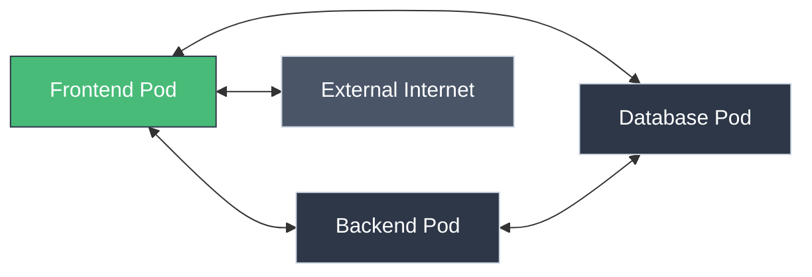
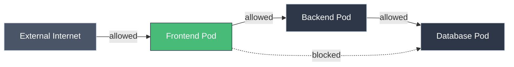

# Network Policies: Controlling Pod Traffic

!!! tip "Part of Level 3: Networking"
    This article is part of [Level 3: Networking](overview.md). You should understand [Pods](../level_1/pods.md) and [Services](../level_1/services.md) first.

By default, **any Pod can talk to any Pod** in your Kubernetes cluster. That includes Pods in different namespaces.

**That's a security problem.**

Network Policies let you control which Pods can communicate:

- Frontend Pods can talk to Backend Pods
- Backend Pods can talk to Database Pods
- Database Pods CANNOT talk to Frontend Pods
- Pods in `dev` namespace CANNOT talk to `prod` namespace

**Think of it like a firewall for Pods.**

---

## Default Behavior (No Network Policies)

Without Network Policies, all Pods can communicate:



**Problems:**

- Compromised frontend can attack database directly
- Pods in `dev` can access `prod` services
- No defense in depth

---

## With Network Policies: Zero Trust



**Benefits:**

- Explicit allow-list (default deny)
- Defense in depth
- Limit blast radius of compromised Pod

---

## Requirements

Network Policies require a **network plugin that supports them:**

- ✅ Calico
- ✅ Cilium
- ✅ Weave Net
- ✅ Antrea
- ❌ Flannel (doesn't support Network Policies)
- ❌ Default Docker bridge

**Check with your platform team** if Network Policies are supported.

---

## Network Policy Anatomy

```yaml title="basic-network-policy.yaml" linenums="1"
apiVersion: networking.k8s.io/v1
kind: NetworkPolicy
metadata:
  name: backend-policy
  namespace: default
spec:
  podSelector:  # (1)!
    matchLabels:
      app: backend
  policyTypes:  # (2)!
  - Ingress
  - Egress
  ingress:  # (3)!
  - from:
    - podSelector:
        matchLabels:
          app: frontend
    ports:
    - protocol: TCP
      port: 8080
  egress:  # (4)!
  - to:
    - podSelector:
        matchLabels:
          app: database
    ports:
    - protocol: TCP
      port: 5432
```

1. Apply policy to Pods with `app=backend`
2. Policy controls both incoming and outgoing traffic
3. Allow ingress from `app=frontend` Pods on port 8080
4. Allow egress to `app=database` Pods on port 5432

**Behavior:**

- Backend Pods can receive traffic FROM frontend Pods (port 8080)
- Backend Pods can send traffic TO database Pods (port 5432)
- All other traffic is blocked

---

## Policy Types

### Ingress Policies (Incoming Traffic)

Control who can connect TO these Pods:

```yaml
apiVersion: networking.k8s.io/v1
kind: NetworkPolicy
metadata:
  name: allow-frontend
spec:
  podSelector:
    matchLabels:
      app: backend
  policyTypes:
  - Ingress
  ingress:
  - from:
    - podSelector:
        matchLabels:
          app: frontend
```

**Result:** Backend Pods only accept connections from frontend Pods.

### Egress Policies (Outgoing Traffic)

Control where these Pods can connect:

```yaml
apiVersion: networking.k8s.io/v1
kind: NetworkPolicy
metadata:
  name: database-egress
spec:
  podSelector:
    matchLabels:
      app: backend
  policyTypes:
  - Egress
  egress:
  - to:
    - podSelector:
        matchLabels:
          app: database
    ports:
    - protocol: TCP
      port: 5432
```

**Result:** Backend Pods can only connect to database Pods (port 5432).

---

## Common Patterns

### Pattern 1: Default Deny All

Start with zero trust—block everything:

```yaml title="default-deny-all.yaml" linenums="1"
---
# Deny all ingress
apiVersion: networking.k8s.io/v1
kind: NetworkPolicy
metadata:
  name: default-deny-ingress
spec:
  podSelector: {}  # (1)!
  policyTypes:
  - Ingress

---
# Deny all egress
apiVersion: networking.k8s.io/v1
kind: NetworkPolicy
metadata:
  name: default-deny-egress
spec:
  podSelector: {}
  policyTypes:
  - Egress
```

1. Empty selector matches ALL Pods in namespace

**After applying:** No Pod can talk to any other Pod (unless explicitly allowed).

### Pattern 2: Three-Tier Application

Frontend → Backend → Database

```yaml title="three-tier-policy.yaml" linenums="1"
---
# Frontend: Allow ingress from Internet, egress to backend
apiVersion: networking.k8s.io/v1
kind: NetworkPolicy
metadata:
  name: frontend-policy
spec:
  podSelector:
    matchLabels:
      tier: frontend
  policyTypes:
  - Ingress
  - Egress
  ingress:
  - {}  # (1)!
  egress:
  - to:
    - podSelector:
        matchLabels:
          tier: backend
    ports:
    - protocol: TCP
      port: 8080
  - to:  # (2)!
    - namespaceSelector: {}
      podSelector:
        matchLabels:
          k8s-app: kube-dns
    ports:
    - protocol: UDP
      port: 53

---
# Backend: Allow ingress from frontend, egress to database
apiVersion: networking.k8s.io/v1
kind: NetworkPolicy
metadata:
  name: backend-policy
spec:
  podSelector:
    matchLabels:
      tier: backend
  policyTypes:
  - Ingress
  - Egress
  ingress:
  - from:
    - podSelector:
        matchLabels:
          tier: frontend
    ports:
    - protocol: TCP
      port: 8080
  egress:
  - to:
    - podSelector:
        matchLabels:
          tier: database
    ports:
    - protocol: TCP
      port: 5432
  - to:  # DNS
    - namespaceSelector: {}
      podSelector:
        matchLabels:
          k8s-app: kube-dns
    ports:
    - protocol: UDP
      port: 53

---
# Database: Allow ingress from backend only, no egress
apiVersion: networking.k8s.io/v1
kind: NetworkPolicy
metadata:
  name: database-policy
spec:
  podSelector:
    matchLabels:
      tier: database
  policyTypes:
  - Ingress
  - Egress
  ingress:
  - from:
    - podSelector:
        matchLabels:
          tier: backend
    ports:
    - protocol: TCP
      port: 5432
  egress:
  - to:  # DNS only
    - namespaceSelector: {}
      podSelector:
        matchLabels:
          k8s-app: kube-dns
    ports:
    - protocol: UDP
      port: 53
```

1. Allow all ingress (from Internet via Ingress/LoadBalancer)
2. Allow DNS lookups (required for Service discovery)

### Pattern 3: Namespace Isolation

Prevent cross-namespace traffic:

```yaml title="namespace-isolation.yaml" linenums="1"
apiVersion: networking.k8s.io/v1
kind: NetworkPolicy
metadata:
  name: deny-other-namespaces
  namespace: prod  # (1)!
spec:
  podSelector: {}
  policyTypes:
  - Ingress
  ingress:
  - from:
    - podSelector: {}  # (2)!
```

1. Apply in prod namespace
2. Only allow traffic from same namespace

**Result:** Pods in `prod` namespace cannot receive traffic from `dev` or `staging`.

### Pattern 4: Allow Specific External IPs

Allow egress to specific external services:

```yaml title="allow-external-api.yaml" linenums="1"
apiVersion: networking.k8s.io/v1
kind: NetworkPolicy
metadata:
  name: allow-external-api
spec:
  podSelector:
    matchLabels:
      app: backend
  policyTypes:
  - Egress
  egress:
  - to:
    - ipBlock:
        cidr: 203.0.113.0/24  # (1)!
        except:  # (2)!
        - 203.0.113.5/32
    ports:
    - protocol: TCP
      port: 443
```

1. Allow this IP range
2. Except this specific IP

---

## Selectors

### podSelector

Match Pods by labels:

```yaml
podSelector:
  matchLabels:
    app: backend
    env: prod
```

### namespaceSelector

Match entire namespaces:

```yaml
namespaceSelector:
  matchLabels:
    environment: prod
```

**Label a namespace:**

```bash
kubectl label namespace prod environment=prod
```

### Combining Selectors

**AND logic (same rule):**

```yaml
ingress:
- from:
  - namespaceSelector:
      matchLabels:
        env: prod
    podSelector:  # (1)!
      matchLabels:
        app: frontend
```

1. Pods with `app=frontend` in namespaces with `env=prod`

**OR logic (multiple rules):**

```yaml
ingress:
- from:
  - namespaceSelector:
      matchLabels:
        env: prod
- from:  # (1)!
  - podSelector:
      matchLabels:
        app: monitoring
```

1. EITHER namespaces with `env=prod` OR Pods with `app=monitoring`

---

## Testing Network Policies

### Deploy Test Applications

```bash title="Deploy Test Pods"
# Frontend
kubectl run frontend --image=nginx:1.21 --labels="app=frontend"

# Backend
kubectl run backend --image=nginx:1.21 --labels="app=backend"

# Database
kubectl run database --image=nginx:1.21 --labels="app=database"

# Expose services (for testing)
kubectl expose pod backend --port=80
kubectl expose pod database --port=80
```

### Test Connectivity (Before Policy)

```bash title="Test Without Network Policy"
# From frontend to backend (should work)
kubectl exec frontend -- wget -O- --timeout=2 http://backend
# Success!

# From frontend to database (should work)
kubectl exec frontend -- wget -O- --timeout=2 http://database
# Success!
```

### Apply Network Policy

```yaml
apiVersion: networking.k8s.io/v1
kind: NetworkPolicy
metadata:
  name: test-policy
spec:
  podSelector:
    matchLabels:
      app: database
  policyTypes:
  - Ingress
  ingress:
  - from:
    - podSelector:
        matchLabels:
          app: backend
```

### Test Connectivity (After Policy)

```bash title="Test With Network Policy"
# From frontend to database (should FAIL)
kubectl exec frontend -- wget -O- --timeout=2 http://database
# wget: download timed out  ← Blocked by policy!

# From backend to database (should work)
kubectl exec backend -- wget -O- --timeout=2 http://database
# Success!
```

---

## Common Gotchas

### 1. DNS Must Be Allowed

If egress policies exist, allow DNS:

```yaml
egress:
- to:
  - namespaceSelector:
      matchLabels:
        name: kube-system  # (1)!
    podSelector:
      matchLabels:
        k8s-app: kube-dns
  ports:
  - protocol: UDP
    port: 53
```

1. DNS runs in kube-system namespace

**Otherwise:** Service names won't resolve!

### 2. Empty {} Means "Allow All"

```yaml
ingress:
- {}  # Allow ALL ingress
```

vs

```yaml
ingress: []  # Deny ALL ingress (no rules)
```

### 3. Policies Are Additive

Multiple policies = OR logic:

- Policy A: Allow frontend
- Policy B: Allow monitoring

**Result:** Backend accepts from BOTH frontend AND monitoring.

### 4. No Policy = Allow All

If no NetworkPolicy targets a Pod, all traffic is allowed.

---

## Troubleshooting Network Policies

### Problem: Connection Refused/Timeout

```bash
kubectl exec frontend -- wget -O- --timeout=2 http://backend
# wget: download timed out
```

**Debug:**

=== "Step 1: Check if Policy Exists"
    ```bash
    kubectl get networkpolicies
    # NAME           POD-SELECTOR   AGE
    # backend-policy app=backend    5m

    kubectl describe networkpolicy backend-policy
    ```

=== "Step 2: Check Pod Labels"
    ```bash
    # Source pod
    kubectl get pod frontend --show-labels
    # Does it have the label required by policy?

    # Destination pod
    kubectl get pod backend --show-labels
    # Does it match podSelector?
    ```

=== "Step 3: Check Network Plugin"
    ```bash
    # Network Policies require compatible CNI
    kubectl get pods -n kube-system | grep -E 'calico|cilium|weave'
    # If no results, Network Policies may not work
    ```

=== "Step 4: Test Without Policy"
    ```bash
    # Temporarily delete policy
    kubectl delete networkpolicy backend-policy

    # Test connection
    kubectl exec frontend -- wget -O- --timeout=2 http://backend
    # Works now? Policy was the issue.

    # Reapply policy and debug rules
    ```

### Problem: DNS Resolution Fails

```bash
kubectl exec frontend -- wget -O- --timeout=2 http://backend
# wget: bad address 'backend'
```

**Cause:** Egress policy blocks DNS.

**Solution:** Add DNS egress rule (see "Common Gotchas" above).

---

## Quick Recap

| Concept | Explanation |
|---------|-------------|
| **Network Policy** | Firewall rules for Pods |
| **podSelector** | Which Pods the policy applies to |
| **Ingress** | Incoming traffic rules |
| **Egress** | Outgoing traffic rules |
| **Default deny** | Block all traffic, then explicitly allow |
| **Additive** | Multiple policies = OR logic |
| **Requires CNI** | Calico, Cilium, Weave (not Flannel) |
| **Allow DNS** | Always allow UDP port 53 to kube-dns |

---

## Practice Exercises

??? question "Exercise 1: Default Deny and Allow Frontend"
    Block all traffic to backend, then allow only from frontend.

    ??? tip "Solution"
        ```bash
        # Deploy test pods
        kubectl run frontend --image=nginx:1.21 --labels="app=frontend"
        kubectl run backend --image=nginx:1.21 --labels="app=backend"
        kubectl expose pod backend --port=80

        # Test before policy (should work)
        kubectl exec frontend -- wget -O- --timeout=2 http://backend

        # Create Network Policy
        cat <<EOF | kubectl apply -f -
        apiVersion: networking.k8s.io/v1
        kind: NetworkPolicy
        metadata:
          name: backend-allow-frontend
        spec:
          podSelector:
            matchLabels:
              app: backend
          policyTypes:
          - Ingress
          ingress:
          - from:
            - podSelector:
                matchLabels:
                  app: frontend
        EOF

        # Test after policy (should still work)
        kubectl exec frontend -- wget -O- --timeout=2 http://backend

        # Create unauthorized pod
        kubectl run hacker --image=nginx:1.21
        kubectl exec hacker -- wget -O- --timeout=2 http://backend
        # Should timeout!

        # Clean up
        kubectl delete pod frontend backend hacker
        kubectl delete service backend
        kubectl delete networkpolicy backend-allow-frontend
        ```

??? question "Exercise 2: Namespace Isolation"
    Create two namespaces and block cross-namespace traffic.

    ??? tip "Solution"
        ```bash
        # Create namespaces
        kubectl create namespace team-a
        kubectl create namespace team-b

        # Deploy in team-a
        kubectl run app-a --image=nginx:1.21 -n team-a
        kubectl expose pod app-a --port=80 -n team-a

        # Deploy in team-b
        kubectl run app-b --image=nginx:1.21 -n team-b

        # Test before policy (should work)
        kubectl exec -n team-b app-b -- wget -O- --timeout=2 http://app-a.team-a.svc.cluster.local

        # Apply namespace isolation to team-a
        cat <<EOF | kubectl apply -f -
        apiVersion: networking.k8s.io/v1
        kind: NetworkPolicy
        metadata:
          name: deny-other-namespaces
          namespace: team-a
        spec:
          podSelector: {}
          policyTypes:
          - Ingress
          ingress:
          - from:
            - podSelector: {}
        EOF

        # Test after policy (should timeout)
        kubectl exec -n team-b app-b -- wget -O- --timeout=2 http://app-a.team-a.svc.cluster.local

        # Clean up
        kubectl delete namespace team-a team-b
        ```

---

## Further Reading

### Official Documentation
- [Network Policies](https://kubernetes.io/docs/concepts/services-networking/network-policies/)
- [Declare Network Policy](https://kubernetes.io/docs/tasks/administer-cluster/declare-network-policy/)
- [Network Policy API Reference](https://kubernetes.io/docs/reference/kubernetes-api/policy-resources/network-policy-v1/)

### Deep Dives
- [Network Policy Recipes](https://github.com/ahmetb/kubernetes-network-policy-recipes) - Common patterns
- [Calico Network Policy](https://docs.projectcalico.org/security/kubernetes-network-policy)
- [Cilium Network Policy](https://docs.cilium.io/en/stable/policy/)

### Tools
- [Network Policy Editor](https://editor.cilium.io/) - Visual editor for policies
- [Kubernetes Network Policy Simulator](https://orca.tufin.io/netpol/) - Test policies

### Related Articles
- [Services](../level_1/services.md) - Backend Services controlled by policies
- [Services Deep Dive](services_deep_dive.md) - How Service routing works
- [Namespaces](../level_1/namespaces.md) - Namespace-based isolation
- **Security Best Practices** - Comprehensive security (coming in Level 5)

---

## What's Next?

You understand Network Policies for Pod-level firewall rules. Next, learn about **[DNS and Service Discovery](dns_service_discovery.md)** to understand how Services find each other.

---

**Key Takeaway:** Network Policies provide Pod-level firewall rules. Start with default deny, then explicitly allow required traffic. Always allow DNS (UDP port 53 to kube-dns). Requires compatible CNI plugin (Calico, Cilium, Weave).
