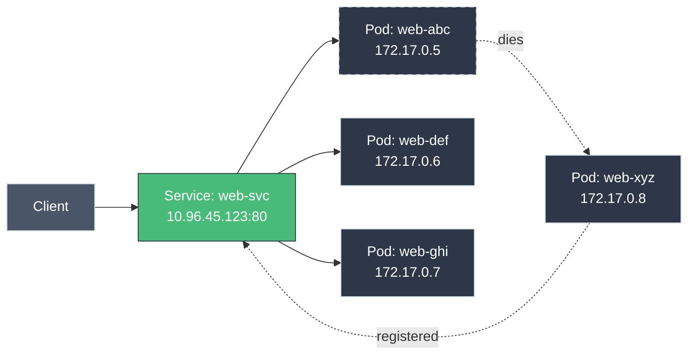
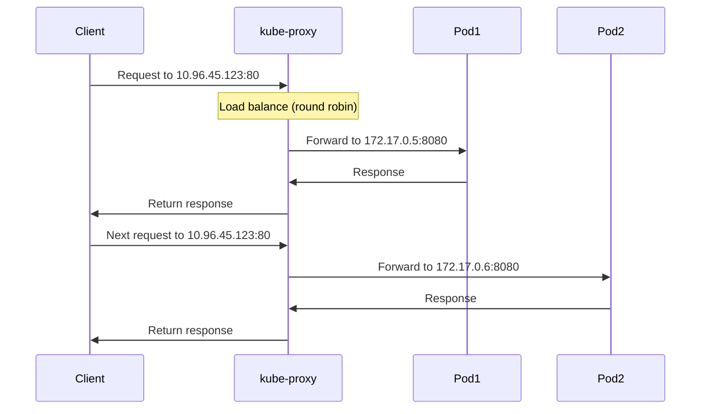
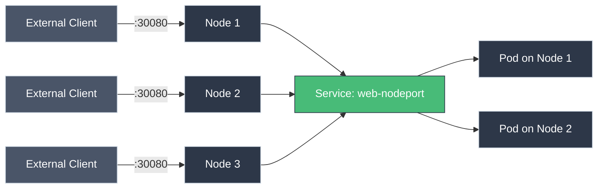

# Services Deep Dive: Advanced Networking

!!! tip "Part of Level 3: Networking"
    This article is part of [Level 3: Networking](overview.md). You should understand [basic Services](../level_1/services.md) from Level 1 first.

You've used Services to connect to Pods. But how do Services actually work? What happens when you hit a Service IP? How does traffic route to the right Pod?

**Time to look under the hood.**

---

## The Service Abstraction

Services solve a fundamental problem: **Pods are ephemeral, Services are stable.**



**What Services provide:**

- **Stable IP address** - Never changes
- **Stable DNS name** - `web-svc.default.svc.cluster.local`
- **Load balancing** - Distributes traffic across Pods
- **Service discovery** - Other apps find you by name

---

## How Services Work: The Components

### 1. Service Object

You create a Service:

```yaml
apiVersion: v1
kind: Service
metadata:
  name: web-svc
spec:
  selector:
    app: web
  ports:
  - port: 80
    targetPort: 8080
```

Kubernetes assigns a ClusterIP: `10.96.45.123`

### 2. Endpoints

Kubernetes watches for Pods matching `app: web`:

```bash
kubectl get endpoints web-svc
# NAME      ENDPOINTS
# web-svc   172.17.0.5:8080,172.17.0.6:8080,172.17.0.7:8080
```

**Endpoints = list of Pod IPs that match the Service selector**

### 3. kube-proxy

On every node, `kube-proxy` watches Services and Endpoints:

- Sees new Service: `web-svc` → `10.96.45.123`
- Sees Endpoints: `172.17.0.5:8080`, `172.17.0.6:8080`, `172.17.0.7:8080`
- Updates node networking rules (iptables, IPVS, or eBPF)

### 4. Request Flow



**Key insight:** Service IPs aren't real—they're routing rules managed by kube-proxy.

---

## Service Types In Depth

### ClusterIP (Default)

**Use case:** Internal communication within cluster

```yaml
apiVersion: v1
kind: Service
metadata:
  name: backend-api
spec:
  type: ClusterIP  # (1)!
  selector:
    app: backend
  ports:
  - port: 3000  # (2)!
    targetPort: 8080  # (3)!
```

1. Default type (can omit this line)
2. Port Service listens on
3. Port where Pod listens

**Access:**

=== "From Inside Cluster"
    ```bash
    # From another pod:
    curl http://backend-api:3000
    curl http://backend-api.default.svc.cluster.local:3000
    ```

=== "NOT Accessible From Outside"
    ```bash
    # From your laptop:
    curl http://backend-api:3000
    # ❌ Won't work—ClusterIP is internal only
    ```

**When to use:** 99% of your Services should be ClusterIP.

### NodePort

**Use case:** Expose Service on every node's IP

```yaml
apiVersion: v1
kind: Service
metadata:
  name: web-nodeport
spec:
  type: NodePort
  selector:
    app: web
  ports:
  - port: 80  # (1)!
    targetPort: 8080  # (2)!
    nodePort: 30080  # (3)!
```

1. ClusterIP port (still created)
2. Pod port
3. Port on every node (30000-32767)

**Access:**

=== "From Outside Cluster"
    ```bash
    # Access any node's IP:
    curl http://node-1-ip:30080
    curl http://node-2-ip:30080
    curl http://node-3-ip:30080
    # All route to same Service
    ```

=== "From Inside Cluster"
    ```bash
    # ClusterIP still works:
    curl http://web-nodeport:80
    ```

**Behavior:**



**When to use:**

- Development/testing (quick external access)
- Edge cases where LoadBalancer isn't available
- NOT recommended for production (use Ingress or LoadBalancer)

### LoadBalancer

**Use case:** Expose Service via cloud provider's load balancer

```yaml
apiVersion: v1
kind: Service
metadata:
  name: web-lb
spec:
  type: LoadBalancer
  selector:
    app: web
  ports:
  - port: 80
    targetPort: 8080
```

**On cloud providers (AWS, GCP, Azure):**

```bash
kubectl get service web-lb
# NAME      TYPE           CLUSTER-IP      EXTERNAL-IP
# web-lb    LoadBalancer   10.96.45.123    203.0.113.42
```

**Access:**

```bash
# From anywhere:
curl http://203.0.113.42
```

**What happens:**

1. Kubernetes requests load balancer from cloud provider
2. Cloud creates LB (AWS ELB, GCP GLB, Azure LB)
3. LB points to NodePorts on all nodes
4. Traffic: Internet → LB → NodePort → Service → Pods

**When to use:**

- Production services that need external access
- Simple HTTP/TCP services
- When Ingress isn't needed (more on that later)

**Cost warning:** Each LoadBalancer Service creates a cloud LB ($$). Use Ingress to share one LB across multiple Services.

### ExternalName

**Use case:** Create DNS alias to external service

```yaml
apiVersion: v1
kind: Service
metadata:
  name: external-db
spec:
  type: ExternalName
  externalName: db.example.com  # (1)!
```

1. External DNS name (not in cluster)

**Access:**

```bash
# From inside cluster:
curl http://external-db
# Resolves to db.example.com
```

**When to use:**

- Migration (point to external DB before moving into cluster)
- Access external SaaS services with consistent naming
- Testing with external dependencies

---

## Endpoints and EndpointSlices

### Understanding Endpoints

When you create a Service, Kubernetes creates an Endpoints object:

```bash
kubectl get endpoints
# NAME      ENDPOINTS                                   AGE
# web-svc   172.17.0.5:8080,172.17.0.6:8080,172.17.0.7:8080   5m
```

**Describe it:**

```bash
kubectl describe endpoints web-svc
# Subsets:
#   Addresses:  172.17.0.5, 172.17.0.6, 172.17.0.7
#   NotReadyAddresses:  <none>
#   Ports:
#     Name     Port   Protocol
#     ----     ----   --------
#     <unset>  8080   TCP
```

### Manual Endpoints (Headless Service Pattern)

Create Service without selector, manually manage Endpoints:

```yaml
---
apiVersion: v1
kind: Service
metadata:
  name: external-api
spec:
  ports:
  - port: 443
    targetPort: 443

---
apiVersion: v1
kind: Endpoints
metadata:
  name: external-api  # (1)!
subsets:
- addresses:
  - ip: 203.0.113.10  # (2)!
  - ip: 203.0.113.11
  ports:
  - port: 443
```

1. Must match Service name
2. External IPs (not Pods)

**Use case:** Point to external database or API that's not in Kubernetes.

### EndpointSlices (Kubernetes 1.21+)

For large clusters, Endpoints objects can get huge (thousands of IPs). EndpointSlices split them into chunks:

```bash
kubectl get endpointslices
# NAME                ADDRESSTYPE   PORTS   ENDPOINTS               AGE
# web-svc-abc123      IPv4          8080    172.17.0.5,172.17.0.6   5m
# web-svc-def456      IPv4          8080    172.17.0.7,172.17.0.8   5m
```

**You don't usually interact with EndpointSlices directly—Kubernetes manages them.**

---

## Session Affinity (Sticky Sessions)

By default, Services load balance every request. For sticky sessions:

```yaml
apiVersion: v1
kind: Service
metadata:
  name: web-sticky
spec:
  sessionAffinity: ClientIP  # (1)!
  sessionAffinityConfig:
    clientIP:
      timeoutSeconds: 3600  # (2)!
  selector:
    app: web
  ports:
  - port: 80
    targetPort: 8080
```

1. Route requests from same client IP to same Pod
2. Affinity expires after 1 hour

**Behavior:**

- First request from `192.0.2.10` → Pod A
- Subsequent requests from `192.0.2.10` → Pod A (for 1 hour)
- Requests from `192.0.2.20` → Load balanced normally

**When to use:**

- WebSocket connections
- Applications with in-memory sessions (avoid if possible—use Redis instead)
- Legacy apps that assume server-side state

**Caution:** Breaks load balancing. Prefer stateless apps + external session store.

---

## Service Discovery Patterns

### Pattern 1: Environment Variables (Legacy)

When Pod starts, Kubernetes injects Service IPs as environment variables:

```bash
kubectl exec my-pod -- env | grep WEB_SVC
# WEB_SVC_SERVICE_HOST=10.96.45.123
# WEB_SVC_SERVICE_PORT=80
```

**Problem:** Service must exist BEFORE Pod starts.

**Don't use this.** Use DNS instead.

### Pattern 2: DNS (Recommended)

Kubernetes DNS (CoreDNS) automatically creates records for Services:

```
<service-name>.<namespace>.svc.cluster.local
```

**Examples:**

=== "Same Namespace"
    ```bash
    # In default namespace:
    curl http://web-svc
    # Resolves to 10.96.45.123
    ```

=== "Different Namespace"
    ```bash
    # From default to monitoring namespace:
    curl http://prometheus.monitoring.svc.cluster.local
    ```

=== "Short Names"
    ```bash
    # These all work:
    curl http://web-svc
    curl http://web-svc.default
    curl http://web-svc.default.svc
    curl http://web-svc.default.svc.cluster.local
    ```

**DNS Search Path:**

Pods get `/etc/resolv.conf` with search domains:

```
search default.svc.cluster.local svc.cluster.local cluster.local
nameserver 10.96.0.10
```

This lets you use short names within the cluster.

---

## Headless Services

**Use case:** Get Pod IPs directly (no load balancing)

```yaml
apiVersion: v1
kind: Service
metadata:
  name: database
spec:
  clusterIP: None  # (1)!
  selector:
    app: postgres
  ports:
  - port: 5432
```

1. Headless service—no ClusterIP assigned

**DNS resolution:**

```bash
# Normal Service:
nslookup web-svc
# Returns: 10.96.45.123 (Service IP)

# Headless Service:
nslookup database
# Returns: 172.17.0.5, 172.17.0.6, 172.17.0.7 (Pod IPs)
```

**When to use:**

- StatefulSets (stable network identities)
- Client-side load balancing
- Service mesh (Istio, Linkerd)
- Direct Pod-to-Pod communication

---

## Multi-Port Services

One Service can expose multiple ports:

```yaml
apiVersion: v1
kind: Service
metadata:
  name: multi-port-svc
spec:
  selector:
    app: web
  ports:
  - name: http  # (1)!
    port: 80
    targetPort: 8080
  - name: https  # (2)!
    port: 443
    targetPort: 8443
  - name: metrics  # (3)!
    port: 9090
    targetPort: 9090
```

1. HTTP traffic
2. HTTPS traffic
3. Prometheus metrics

**Port names are required when using multiple ports.**

**Access:**

```bash
curl http://multi-port-svc:80  # HTTP
curl https://multi-port-svc:443  # HTTPS
curl http://multi-port-svc:9090/metrics  # Metrics
```

---

## Service Topology (Kubernetes 1.17+)

Control traffic routing based on topology:

```yaml
apiVersion: v1
kind: Service
metadata:
  name: topology-aware
spec:
  topologyKeys:  # (1)!
  - "kubernetes.io/hostname"
  - "topology.kubernetes.io/zone"
  - "*"
  selector:
    app: web
  ports:
  - port: 80
```

1. Preference order for routing

**Behavior:**

1. Try same node first
2. If not available, try same zone
3. If not available, try any node

**Use case:** Reduce latency and cross-AZ traffic costs.

---

## Troubleshooting Services

### Problem: Service Not Routing Traffic

```bash
kubectl get service web-svc
# NAME      TYPE        CLUSTER-IP      PORT(S)
# web-svc   ClusterIP   10.96.45.123    80/TCP

curl http://web-svc
# Connection refused
```

**Debug steps:**

=== "Step 1: Check Endpoints"
    ```bash
    kubectl get endpoints web-svc
    # NAME      ENDPOINTS
    # web-svc   <none>  ← Problem!
    ```

    **No endpoints = selector doesn't match any Pods**

    ```bash
    # Check Service selector
    kubectl get service web-svc -o yaml | grep -A 3 selector

    # Check Pod labels
    kubectl get pods --show-labels

    # Fix selector or Pod labels
    ```

=== "Step 2: Check Pod Readiness"
    ```bash
    kubectl get endpoints web-svc -o yaml
    # Subsets:
    #   NotReadyAddresses:  172.17.0.5  ← Pod not ready!
    ```

    **Pod exists but not ready:**

    ```bash
    kubectl describe pod web-abc
    # Conditions:
    #   Ready:  False  ← Failing readiness probe

    kubectl logs web-abc
    # Check why app isn't ready
    ```

=== "Step 3: Check Port Configuration"
    ```bash
    # Service port
    kubectl get service web-svc -o yaml | grep -A 5 ports

    # Container port
    kubectl get pod web-abc -o yaml | grep -A 3 containerPort

    # Do they match?
    ```

### Problem: DNS Not Resolving

```bash
nslookup web-svc
# Server:    10.96.0.10
# Address 1: 10.96.0.10
#
# nslookup: can't resolve 'web-svc'
```

**Debug:**

```bash
# Check CoreDNS is running
kubectl get pods -n kube-system -l k8s-app=kube-dns

# Test DNS from a pod
kubectl run -it --rm debug --image=busybox --restart=Never -- sh
/ # nslookup web-svc
/ # nslookup web-svc.default.svc.cluster.local

# Check Service exists
kubectl get service web-svc
```

---

## Quick Recap

| Concept | Explanation |
|---------|-------------|
| **ClusterIP** | Internal service (default) |
| **NodePort** | Expose on every node's IP |
| **LoadBalancer** | Cloud provider load balancer |
| **ExternalName** | DNS alias to external service |
| **Endpoints** | List of Pod IPs for Service |
| **Headless Service** | Returns Pod IPs (no load balancing) |
| **Session Affinity** | Sticky sessions (same client → same Pod) |
| **kube-proxy** | Manages routing rules on nodes |

---

## Practice Exercises

??? question "Exercise 1: Investigate Service Routing"
    Deploy a Service and trace how traffic flows.

    ??? tip "Solution"
        ```bash
        # Deploy app
        kubectl create deployment nginx --image=nginx:1.21 --replicas=3

        # Expose as Service
        kubectl expose deployment nginx --port=80 --target-port=80

        # Check Service IP
        kubectl get service nginx
        # Note the CLUSTER-IP

        # Check Endpoints
        kubectl get endpoints nginx
        # See Pod IPs

        # Test from inside cluster
        kubectl run -it --rm test --image=busybox --restart=Never -- sh
        / # wget -O- http://nginx
        / # exit

        # Clean up
        kubectl delete service nginx
        kubectl delete deployment nginx
        ```

??? question "Exercise 2: Debug Missing Endpoints"
    Create a Service with incorrect selector and fix it.

    ??? tip "Solution"
        ```bash
        # Deploy pods with label app=web
        kubectl create deployment web --image=nginx:1.21

        # Create Service with WRONG selector
        kubectl create service clusterip broken-svc --tcp=80:80
        kubectl patch service broken-svc -p '{"spec":{"selector":{"app":"wrong"}}}'

        # Check—no endpoints!
        kubectl get endpoints broken-svc
        # ENDPOINTS: <none>

        # Fix selector
        kubectl patch service broken-svc -p '{"spec":{"selector":{"app":"web"}}}'

        # Check again
        kubectl get endpoints broken-svc
        # Now has Pod IPs!

        # Clean up
        kubectl delete service broken-svc
        kubectl delete deployment web
        ```

---

## Further Reading

### Official Documentation
- [Service Concepts](https://kubernetes.io/docs/concepts/services-networking/service/)
- [Connecting Applications with Services](https://kubernetes.io/docs/tutorials/services/connect-applications-service/)
- [DNS for Services and Pods](https://kubernetes.io/docs/concepts/services-networking/dns-pod-service/)

### Deep Dives
- [kube-proxy Modes](https://kubernetes.io/docs/concepts/services-networking/service/#proxy-mode-userspace) - iptables vs IPVS vs eBPF
- [Service Topology](https://kubernetes.io/docs/concepts/services-networking/service-topology/)
- [EndpointSlices](https://kubernetes.io/docs/concepts/services-networking/endpoint-slices/)

### Related Articles
- [Services Basics](../level_1/services.md) - Introduction to Services (Level 1)
- [Ingress Controllers](ingress.md) - HTTP routing and TLS termination
- [DNS and Service Discovery](dns_service_discovery.md) - How DNS works
- [Troubleshooting Networking](troubleshooting_networking.md) - Debug connection issues

---

## What's Next?

You understand how Services work under the hood. Next, learn about **[Ingress Controllers](ingress.md)** for HTTP routing, path-based routing, and TLS termination.

---

**Key Takeaway:** Services provide stable networking for ephemeral Pods. ClusterIP for internal, LoadBalancer for external, Ingress for HTTP routing (next article). Understanding Endpoints and kube-proxy helps debug routing issues.
