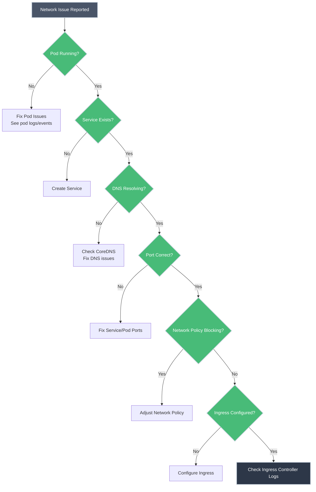

# Troubleshooting Networking

!!! tip "Part of Level 3: Networking"
    This is part of [Level 3: Networking](overview.md). If you haven't covered DNS yet, start with [DNS and Service Discovery](dns_service_discovery.md).

Your pod can't reach the database. Ingress returns 502 errors. DNS isn't resolving. Network issues in Kubernetes can feel impossible to debug—there are so many layers.

This guide gives you a systematic troubleshooting workflow for the most common network problems.

---

## What You'll Learn

- Systematic approach to network debugging
- Common networking issues and fixes
- Essential diagnostic commands
- How to isolate the problem layer
- Tools for packet-level debugging

---

## Network Troubleshooting Workflow



**Start at the bottom (pods) and work your way up the stack.**

---

## Common Issues and Solutions

<div class="grid cards" markdown>

-   :material-cancel: **Issue: Can't Connect to Service**

    ---

    **Symptom:** Connections to service name fail or timeout

    **Diagnostic:**
    ``` bash title="Check service and endpoints"
    # Does service exist?
    kubectl get svc

    # Does service have endpoints?
    kubectl get endpoints <service-name>

    # Are pods running?
    kubectl get pods -l app=<app-label>
    ```

    **Fix:**
    - **No endpoints:** Service selector doesn't match pod labels
    - **No pods:** Deployment/StatefulSet not running
    - **Pods not ready:** Readiness probe failing

    ``` bash title="Fix selector mismatch"
    # Check service selector
    kubectl describe svc <service-name>

    # Check pod labels
    kubectl get pods --show-labels

    # Selector must match labels exactly
    ```

-   :material-dns-outline: **Issue: DNS Not Resolving**

    ---

    **Symptom:** `nslookup my-service` fails

    **Diagnostic:**
    ``` bash title="Test DNS resolution"
    # From within a pod
    kubectl run test --image=busybox --rm -it --restart=Never -- nslookup kubernetes.default

    # Check CoreDNS/kube-dns pods
    kubectl get pods -n kube-system -l k8s-app=kube-dns
    # or
    kubectl get pods -n kube-system -l k8s-app=coredns
    ```

    **Fix:**
    - **CoreDNS not running:** Restart CoreDNS pods
    - **Nameserver unreachable:** Check kube-dns service
    - **Wrong namespace:** Use full DNS name `<service>.<namespace>.svc.cluster.local`

    ``` bash title="Restart CoreDNS"
    kubectl rollout restart deployment/coredns -n kube-system
    ```

-   :material-gate: **Issue: Network Policy Blocking Traffic**

    ---

    **Symptom:** Connections work without NetworkPolicy but fail with one

    **Diagnostic:**
    ``` bash title="Check network policies"
    # List network policies
    kubectl get networkpolicy

    # Describe policy
    kubectl describe networkpolicy <policy-name>
    ```

    **Fix:**
    - **Default deny all:** Add explicit allow rules
    - **Missing ingress rule:** Allow traffic from source pods
    - **Wrong label selector:** Policy doesn't match intended pods

    ``` yaml title="Allow traffic from specific namespace" linenums="1"
    apiVersion: networking.k8s.io/v1
    kind: NetworkPolicy
    metadata:
      name: allow-from-frontend
    spec:
      podSelector:
        matchLabels:
          app: backend
      ingress:
      - from:
        - namespaceSelector:
            matchLabels:
              name: frontend
    ```

-   :material-transit-connection-variant: **Issue: Ingress Returns 502/503**

    ---

    **Symptom:** External requests fail through Ingress

    **Diagnostic:**
    ``` bash title="Check ingress and backend"
    # Check Ingress status
    kubectl describe ingress <ingress-name>

    # Check backend service
    kubectl get svc <backend-service>

    # Check pods
    kubectl get pods -l app=<backend-app>

    # Check Ingress controller logs
    kubectl logs -n ingress-nginx -l app.kubernetes.io/name=ingress-nginx
    ```

    **Fix:**
    - **502:** Backend pods not running or not ready
    - **503:** Service has no endpoints
    - **404:** Ingress path doesn't match service

    ``` bash title="Verify ingress backend"
    kubectl get ingress <name> -o yaml | grep -A 5 backend
    ```

</div>

---

## Essential Diagnostic Commands

### Layer 1: Pod Connectivity

``` bash title="Test pod network connectivity"
# Create test pod
kubectl run test-pod --image=nicolaka/netshoot --rm -it --restart=Never -- bash

# Inside pod:
# Test DNS
nslookup kubernetes.default
nslookup <service-name>

# Test connectivity to service
curl http://<service-name>:<port>

# Test connectivity to pod IP
curl http://<pod-ip>:<port>

# Trace route
traceroute <service-name>

# Check network interfaces
ip addr show
```

✅ **Safe:** Temporary pod, no cluster changes

### Layer 2: Service Configuration

``` bash title="Verify service configuration"
# List services
kubectl get svc

# Describe service (shows endpoints)
kubectl describe svc <service-name>

# Get endpoints directly
kubectl get endpoints <service-name>

# Check service yaml
kubectl get svc <service-name> -o yaml

# Test service from node (advanced)
curl http://<cluster-ip>:<port>
```

✅ **Safe:** Read-only

### Layer 3: DNS Resolution

``` bash title="Test DNS functionality"
# Test from busybox pod
kubectl run test --image=busybox --rm -it --restart=Never -- nslookup <service-name>

# Check CoreDNS logs
kubectl logs -n kube-system -l k8s-app=coredns

# Check kube-dns service
kubectl get svc -n kube-system kube-dns

# Check pod DNS config
kubectl exec <pod-name> -- cat /etc/resolv.conf
```

✅ **Safe:** Read-only

### Layer 4: Network Policies

``` bash title="Check network policy rules"
# List all network policies
kubectl get networkpolicy -A

# Describe specific policy
kubectl describe networkpolicy <policy-name>

# Check which pods a policy applies to
kubectl get pods -l <policy-label-selector>

# Temporarily disable (delete policy)
kubectl delete networkpolicy <policy-name>
```

⚠️ **Caution:** Deleting policies affects security

### Layer 5: Ingress

``` bash title="Debug ingress issues"
# Check ingress status
kubectl get ingress

# Describe ingress (shows backend endpoints)
kubectl describe ingress <ingress-name>

# Check ingress controller logs
kubectl logs -n ingress-nginx -l app.kubernetes.io/name=ingress-nginx --tail=100

# Test from inside cluster
kubectl run test --image=curlimages/curl --rm -it --restart=Never -- \
  curl -H "Host: myapp.example.com" http://<ingress-controller-service>
```

✅ **Safe:** Read-only (except test pod creation)

---

## Debugging Scenarios

=== "Pod Can't Reach Service"

    **Step 1: Verify service exists**
    ``` bash
    kubectl get svc my-service
    ```

    **Step 2: Check if service has endpoints**
    ``` bash
    kubectl get endpoints my-service
    ```

    If **no endpoints**, service selector doesn't match pod labels:
    ``` bash
    # Check service selector
    kubectl get svc my-service -o jsonpath='{.spec.selector}'

    # Check pod labels
    kubectl get pods --show-labels -l app=<app-name>

    # Fix: Update service selector or pod labels
    ```

    **Step 3: Test DNS resolution**
    ``` bash
    kubectl exec my-pod -- nslookup my-service
    ```

    **Step 4: Test connectivity**
    ``` bash
    kubectl exec my-pod -- wget -O- http://my-service:80
    ```

=== "DNS Not Working"

    **Step 1: Test basic DNS**
    ``` bash
    kubectl run test --image=busybox --rm -it --restart=Never -- nslookup kubernetes.default
    ```

    If fails, CoreDNS is broken:

    **Step 2: Check CoreDNS pods**
    ``` bash
    kubectl get pods -n kube-system -l k8s-app=coredns
    ```

    **Step 3: Check CoreDNS logs**
    ``` bash
    kubectl logs -n kube-system -l k8s-app=coredns
    ```

    **Step 4: Restart CoreDNS**
    ``` bash
    kubectl rollout restart deployment/coredns -n kube-system
    ```

=== "Ingress Not Working"

    **Step 1: Check ingress exists and has IP/hostname**
    ``` bash
    kubectl get ingress
    # ADDRESS column should be populated
    ```

    **Step 2: Verify backend service exists**
    ``` bash
    kubectl describe ingress my-ingress | grep -A 5 Backend
    kubectl get svc <backend-service>
    ```

    **Step 3: Check ingress controller logs**
    ``` bash
    kubectl logs -n ingress-nginx -l app.kubernetes.io/name=ingress-nginx --tail=50
    ```

    **Step 4: Test from within cluster**
    ``` bash
    # Get ingress controller service IP
    kubectl get svc -n ingress-nginx

    # Test with curl pod
    kubectl run test --image=curlimages/curl --rm -it --restart=Never -- \
      curl -v -H "Host: myapp.example.com" http://<ingress-controller-ip>
    ```

=== "Network Policy Blocking Traffic"

    **Step 1: List network policies**
    ``` bash
    kubectl get networkpolicy
    ```

    **Step 2: Check which policy applies to your pod**
    ``` bash
    kubectl describe networkpolicy <policy-name>
    # Look at "PodSelector" field
    ```

    **Step 3: Verify ingress/egress rules**
    ``` bash
    kubectl get networkpolicy <policy-name> -o yaml
    ```

    **Step 4: Temporarily delete policy to test**
    ``` bash
    kubectl delete networkpolicy <policy-name>
    # Test connectivity
    # Recreate policy with fixes
    ```

---

## Advanced Debugging Tools

### Using tcpdump in a Pod

``` bash title="Capture network traffic"
# Create debug pod with tcpdump
kubectl run tcpdump --image=nicolaka/netshoot --rm -it --restart=Never -- bash

# Inside pod:
tcpdump -i any -n port 80
tcpdump -i any -n host <pod-ip>
```

### Using netshoot for Full Network Toolkit

``` bash title="Deploy netshoot for debugging"
kubectl run netshoot --image=nicolaka/netshoot --rm -it --restart=Never -- bash

# Available tools:
# - curl, wget
# - nslookup, dig, host
# - ping, traceroute
# - tcpdump, tshark
# - netstat, ss
# - iperf3
```

### Ephemeral Debug Containers (Kubernetes 1.23+)

``` bash title="Attach debug container to running pod"
# Add debug container to existing pod
kubectl debug <pod-name> -it --image=nicolaka/netshoot

# Debug from node
kubectl debug node/<node-name> -it --image=nicolaka/netshoot
```

---

## Practice Exercises

??? question "Exercise 1: Debug Missing Endpoints"
    Deploy a service that has no endpoints and fix it.

    **Goal:** Understand how to diagnose and fix selector mismatches.

    ??? tip "Solution"
        ``` yaml title="broken-service.yaml" linenums="1"
        apiVersion: apps/v1
        kind: Deployment
        metadata:
          name: nginx
        spec:
          replicas: 2
          selector:
            matchLabels:
              app: nginx  # (1)!
          template:
            metadata:
              labels:
                app: nginx
            spec:
              containers:
              - name: nginx
                image: nginx:1.21
        ---
        apiVersion: v1
        kind: Service
        metadata:
          name: nginx-svc
        spec:
          selector:
            app: web  # (2)!
          ports:
          - port: 80
        ```

        1. Pod labels: `app=nginx`
        2. Service selector: `app=web` - **MISMATCH!**

        ``` bash title="Diagnose the issue"
        kubectl apply -f broken-service.yaml

        # Check service
        kubectl get svc nginx-svc

        # Check endpoints - EMPTY!
        kubectl get endpoints nginx-svc

        # Check service selector
        kubectl describe svc nginx-svc | grep Selector

        # Check pod labels
        kubectl get pods --show-labels
        ```

        **Fix: Update service selector**
        ``` bash
        kubectl patch svc nginx-svc -p '{"spec":{"selector":{"app":"nginx"}}}'

        # Verify endpoints now exist
        kubectl get endpoints nginx-svc
        ```

        **What you learned:** Services select pods via labels—mismatches result in no endpoints.

??? question "Exercise 2: Debug DNS Resolution"
    Test DNS resolution and troubleshoot CoreDNS issues.

    **Goal:** Learn how to verify and fix DNS problems.

    ??? tip "Solution"
        ``` bash title="Test DNS"
        # Create test pod
        kubectl run test --image=busybox --rm -it --restart=Never -- sh

        # Inside pod, test DNS:
        nslookup kubernetes.default
        # Should work

        nslookup nonexistent.default
        # Should fail with NXDOMAIN

        # Check pod DNS config
        cat /etc/resolv.conf
        ```

        **If DNS fails:**
        ``` bash
        # Check CoreDNS pods
        kubectl get pods -n kube-system -l k8s-app=coredns

        # Check CoreDNS logs
        kubectl logs -n kube-system -l k8s-app=coredns

        # Restart CoreDNS if needed
        kubectl rollout restart deployment/coredns -n kube-system

        # Wait for pods to be ready
        kubectl wait --for=condition=ready pod -l k8s-app=coredns -n kube-system
        ```

        **What you learned:** CoreDNS is the DNS server for the cluster—if it's down, DNS resolution fails.

??? question "Exercise 3: Debug Ingress 502 Error"
    Deploy an Ingress that returns 502 and fix it.

    **Goal:** Understand how to troubleshoot Ingress backend issues.

    ??? tip "Solution"
        ``` yaml title="broken-ingress.yaml" linenums="1"
        apiVersion: apps/v1
        kind: Deployment
        metadata:
          name: web
        spec:
          replicas: 0  # (1)!
          selector:
            matchLabels:
              app: web
          template:
            metadata:
              labels:
                app: web
            spec:
              containers:
              - name: nginx
                image: nginx:1.21
        ---
        apiVersion: v1
        kind: Service
        metadata:
          name: web-svc
        spec:
          selector:
            app: web
          ports:
          - port: 80
        ---
        apiVersion: networking.k8s.io/v1
        kind: Ingress
        metadata:
          name: web-ingress
        spec:
          rules:
          - host: web.example.com
            http:
              paths:
              - path: /
                pathType: Prefix
                backend:
                  service:
                    name: web-svc
                    port:
                      number: 80
        ```

        1. **BUG:** 0 replicas means no pods running!

        ``` bash title="Deploy and diagnose"
        kubectl apply -f broken-ingress.yaml

        # Check ingress
        kubectl get ingress web-ingress

        # Describe to see backend
        kubectl describe ingress web-ingress

        # Check service endpoints
        kubectl get endpoints web-svc
        # EMPTY! No pods available

        # Check deployment
        kubectl get deployment web
        # 0/0 ready

        # Fix: Scale to at least 1 replica
        kubectl scale deployment web --replicas=2

        # Wait for pods
        kubectl get pods -w

        # Verify endpoints now exist
        kubectl get endpoints web-svc

        # Test ingress (if you have ingress controller configured)
        curl -H "Host: web.example.com" http://<ingress-ip>
        ```

        **What you learned:** 502 errors usually mean backend pods aren't running or not ready.

---

## Troubleshooting Checklist

Use this checklist for any network issue:

- [ ] **Pods running?** `kubectl get pods`
- [ ] **Pods ready?** Check READY column and readiness probe
- [ ] **Service exists?** `kubectl get svc`
- [ ] **Service has endpoints?** `kubectl get endpoints <service>`
- [ ] **Selector matches labels?** Compare service selector to pod labels
- [ ] **DNS resolving?** `kubectl exec pod -- nslookup <service>`
- [ ] **Ports correct?** Service port → target port → container port
- [ ] **Network policies allowing?** `kubectl get networkpolicy`
- [ ] **Ingress configured correctly?** `kubectl describe ingress`
- [ ] **Ingress controller running?** Check ingress controller pods

---

## Quick Reference

| Issue | First Command |
|-------|--------------|
| **Can't connect to service** | `kubectl get endpoints <service>` |
| **DNS not resolving** | `kubectl get pods -n kube-system -l k8s-app=coredns` |
| **Service has no endpoints** | `kubectl get pods --show-labels -l <selector>` |
| **Network policy blocking** | `kubectl get networkpolicy` |
| **Ingress 502/503** | `kubectl get pods -l <backend-app>` |
| **Test from pod** | `kubectl run test --image=nicolaka/netshoot --rm -it` |

---

## Quick Recap

- **Start at the bottom:** Check pods → service → DNS → network policy → ingress
- **Verify endpoints:** Service must have endpoints (pods must be running and ready)
- **Test DNS:** Use `nslookup` from within a pod
- **Check selectors:** Service selector must exactly match pod labels
- **Use debug pods:** `nicolaka/netshoot` has all the tools you need
- **Read logs:** CoreDNS, ingress controller, and pod logs reveal most issues
- **Network policies:** Default-deny blocks everything—must add explicit allows

---

## Further Reading

### Official Documentation
- [Debug Services](https://kubernetes.io/docs/tasks/debug/debug-application/debug-service/) - Official troubleshooting guide
- [Debug DNS Resolution](https://kubernetes.io/docs/tasks/administer-cluster/dns-debugging-resolution/) - DNS-specific debugging
- [Network Plugins](https://kubernetes.io/docs/concepts/extend-kubernetes/compute-storage-net/network-plugins/) - CNI plugin concepts

### Deep Dives
- [Kubernetes Networking Demystified](https://www.cncf.io/blog/2020/02/05/kubernetes-networking-demystified/) - CNCF networking guide
- [Troubleshooting Kubernetes Networking](https://learnk8s.io/troubleshooting-kubernetes-networking) - Comprehensive troubleshooting guide

### Tools
- [nicolaka/netshoot](https://github.com/nicolaka/netshoot) - Network debugging container
- [kubectl-debug](https://github.com/aylei/kubectl-debug) - Enhanced debugging for kubectl

### Related Articles
- [Services Deep Dive](services_deep_dive.md) - Understanding services
- [DNS and Service Discovery](dns_service_discovery.md) - How DNS works
- [Network Policies](network_policies.md) - Controlling traffic flow
- [Ingress Controllers](ingress.md) - External access

---

## What's Next?

You've mastered Kubernetes networking (Level 3). Ready to tackle persistent storage? Continue to ****Level 4: Storage and State** (coming soon)**.
