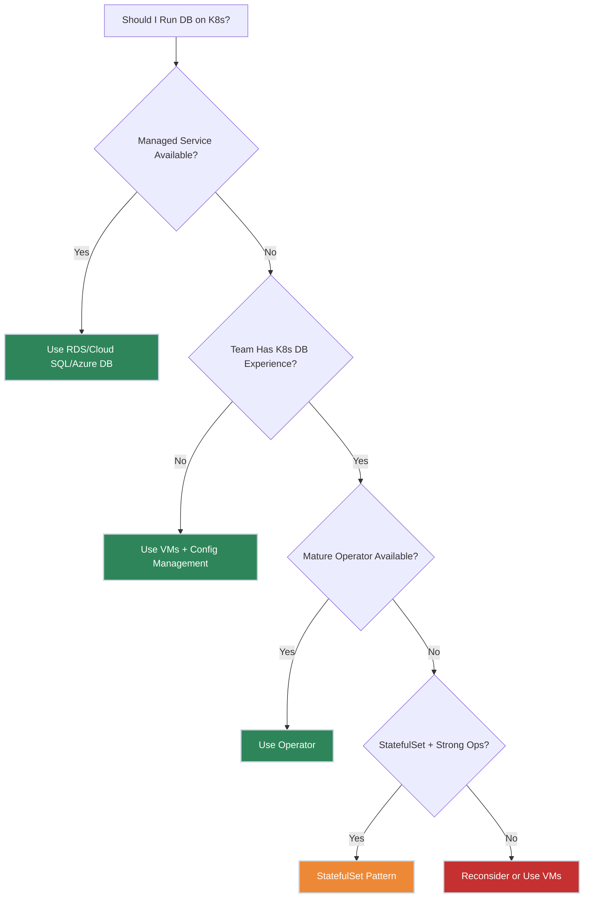
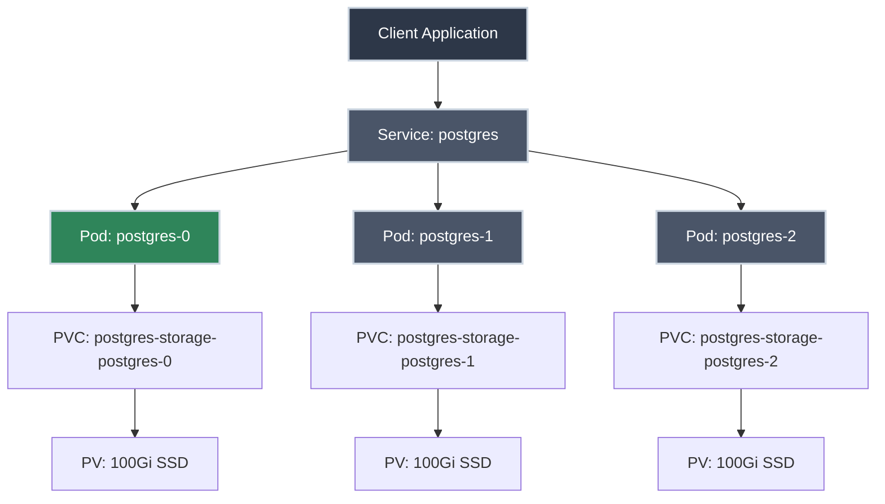

# Running Databases on Kubernetes

!!! tip "Part of Level 4: Storage and State"
    This article is part of [Level 4: Storage and State](overview.md). Complete [StorageClasses](storage_classes.md) first if you haven't already.

Your manager says, "We're running everything on Kubernetes now. Let's move the database too." You nod confidently, but inside you're thinking: "Should I? Can I? Will I regret this?"

Running databases on Kubernetes isn't impossible—companies do it successfully every day. But it's also not simple, and the wrong approach can lead to data loss, performance issues, or 3 AM pages. The question isn't "Can we?" but rather "**Should we?** And if so, **how?**"

This article walks you through the decision, the patterns, and the pitfalls.

---

## What You'll Learn

- When to (and NOT to) run databases on Kubernetes
- StatefulSets: the right tool for databases
- Persistent storage requirements for databases
- Backup and restore strategies
- High availability and replication
- Common pitfalls and how to avoid them
- Production considerations and alternatives

---

## The Kubernetes Database Question



**Key insight:** Running databases on Kubernetes is an operations decision, not a technical one. It's about team capability, not just technical feasibility.

---

## When NOT to Run Databases on Kubernetes

Let's start with the uncomfortable truth: **you probably shouldn't run your production database on Kubernetes**. At least not initially.

<div class="grid cards" markdown>

-   :material-cloud-check: **Use Managed Services Instead**

    ---

    **Why it matters:** Managed databases offload operational complexity.

    **Prefer these:**
    - **AWS RDS** (PostgreSQL, MySQL, MariaDB, Oracle, SQL Server)
    - **Google Cloud SQL** (PostgreSQL, MySQL, SQL Server)
    - **Azure Database** (PostgreSQL, MySQL, MariaDB)
    - **MongoDB Atlas**, **Aiven**, **Confluent Cloud** (managed SaaS)

    **What you get:**
    - Automated backups
    - Point-in-time recovery
    - Automatic failover
    - Security patches and updates
    - Monitoring and alerting
    - Scaling controls

    **Trade-off:** Less control, vendor lock-in, sometimes higher cost. But far less operational burden.

-   :material-server: **VMs Still Make Sense**

    ---

    **Why it matters:** Traditional databases were designed for traditional infrastructure.

    **Use VMs when:**
    - Your team knows VMs better than Kubernetes
    - Database has complex replication (Oracle RAC, SQL Server AlwaysOn)
    - You need bare-metal performance
    - Compliance requires dedicated hardware
    - Migration path isn't clear

    **What you get:**
    - Mature tooling (Ansible, Chef, Puppet)
    - Simpler troubleshooting
    - Direct disk access and performance tuning
    - Easier network isolation

-   :material-alert: **Red Flags for K8s Databases**

    ---

    **Avoid Kubernetes databases if:**

    - ❌ **No Kubernetes ops experience** - Databases fail. Can your team recover at 2 AM?
    - ❌ **No backup/restore testing** - Hope is not a strategy
    - ❌ **Critical financial data** - Start with dev/test, not production accounting
    - ❌ **Regulatory compliance** - Auditors may not accept containerized databases (yet)
    - ❌ **Team doesn't understand StatefulSets** - Learn with non-critical workloads first

    **Start small:** Dev/test databases, caches, ephemeral data. Gain confidence before moving critical data.

</div>

---

## When Kubernetes Databases Make Sense

That said, there are valid reasons to run databases on Kubernetes:

<div class="grid cards" markdown>

-   :material-wrench: **Consistency and Standardization**

    ---

    **Why it matters:** One platform for everything simplifies operations.

    **Use case:**
    - **Multi-tenant platforms** - Deploy database per tenant, automated
    - **Development environments** - Spin up full stack (app + DB) for each PR
    - **Microservices with embedded DBs** - Each service owns its data store

    **Example:** SaaS platform deploys isolated PostgreSQL instance per customer in dedicated namespaces.

-   :material-robot: **Kubernetes Operators**

    ---

    **Why it matters:** Operators automate database operations using Kubernetes APIs.

    **Mature operators:**
    - [**Percona Operators**](https://www.percona.com/software/percona-kubernetes-operators) - PostgreSQL, MySQL, MongoDB
    - [**Zalando Postgres Operator**](https://github.com/zalando/postgres-operator) - PostgreSQL with HA
    - [**CrunchyData PGO**](https://www.crunchydata.com/products/crunchy-postgresql-for-kubernetes) - Enterprise PostgreSQL
    - [**MongoDB Kubernetes Operator**](https://github.com/mongodb/mongodb-kubernetes-operator) - Official MongoDB

    **What operators provide:**
    - Automated backups and restores
    - High availability and failover
    - Scaling and replication
    - Upgrades and rollbacks
    - Monitoring integration

-   :material-rocket-launch: **Cloud-Native Databases**

    ---

    **Why it matters:** Some databases were designed for Kubernetes.

    **Built for K8s:**
    - **Vitess** - Sharded MySQL (YouTube uses this)
    - **CockroachDB** - Distributed SQL (designed for orchestration)
    - **Cassandra** - Distributed NoSQL (scales horizontally)
    - **Redis** (via Redis Enterprise Operator)

    **Key trait:** These embrace distributed systems principles—failures are expected, recovery is automatic.

</div>

---

## StatefulSets: The Foundation

If you're running databases on Kubernetes, you need **StatefulSets**. Deployments won't work.

### Why Deployments Don't Work for Databases

| Requirement | Deployment Behavior | Problem for DB |
|-------------|---------------------|----------------|
| **Stable identity** | Random pod names | Can't identify primary/replica |
| **Stable network** | IP changes on restart | Replication breaks |
| **Ordered startup** | Pods start in parallel | Can't bootstrap cluster |
| **Persistent storage** | Volume may bind to any pod | Data corruption from multiple writers |

**Deployments treat pods as cattle. Databases need to be pets (or at least... well-managed cattle).**

### How StatefulSets Solve This

``` yaml title="postgres-statefulset.yaml" linenums="1"
apiVersion: apps/v1
kind: StatefulSet  # (1)!
metadata:
  name: postgres
spec:
  serviceName: postgres-headless  # (2)!
  replicas: 3  # (3)!
  selector:
    matchLabels:
      app: postgres
  template:
    metadata:
      labels:
        app: postgres
    spec:
      containers:
      - name: postgres
        image: postgres:15  # (4)!
        ports:
        - containerPort: 5432
          name: postgres
        env:
        - name: POSTGRES_PASSWORD
          valueFrom:
            secretKeyRef:
              name: postgres-secret
              key: password
        - name: PGDATA  # (5)!
          value: /var/lib/postgresql/data/pgdata
        volumeMounts:
        - name: postgres-storage
          mountPath: /var/lib/postgresql/data
  volumeClaimTemplates:  # (6)!
  - metadata:
      name: postgres-storage
    spec:
      accessModes: [ "ReadWriteOnce" ]
      storageClassName: fast-ssd  # (7)!
      resources:
        requests:
          storage: 100Gi
```

1. StatefulSet, not Deployment—critical for databases
2. Headless Service for stable DNS (see below)
3. Three replicas: one primary, two replicas (requires replication config)
4. Pin PostgreSQL version—never use `:latest` for databases
5. PostgreSQL requires PGDATA to be a subdirectory (not the mount point)
6. volumeClaimTemplates create one PVC per pod
7. Use fast storage (SSD) for database workloads

**Key StatefulSet features for databases:**

<div class="grid cards" markdown>

-   :material-tag: **Stable Pod Names**

    ---

    Pods get predictable names:
    - `postgres-0` (primary)
    - `postgres-1` (replica)
    - `postgres-2` (replica)

    **Why it matters:** You can configure replication using these stable identities.

-   :material-network: **Stable Network Identity**

    ---

    Each pod gets a stable DNS name:
    - `postgres-0.postgres-headless.default.svc.cluster.local`

    **Why it matters:** Replication configuration can reference stable hostnames.

-   :material-sort-numeric-ascending: **Ordered Operations**

    ---

    - **Startup:** `postgres-0` starts first, then `postgres-1`, then `postgres-2`
    - **Shutdown:** Reverse order (`postgres-2`, `postgres-1`, `postgres-0`)

    **Why it matters:** Primary must be running before replicas can connect.

-   :material-harddisk: **Persistent Storage per Pod**

    ---

    Each pod gets its own PVC:
    - `postgres-storage-postgres-0` → 100Gi volume
    - `postgres-storage-postgres-1` → 100Gi volume
    - `postgres-storage-postgres-2` → 100Gi volume

    **Why it matters:** Data persists even if pod is rescheduled to different node.

</div>

---

## Required Components

Running a database on Kubernetes requires more than just a StatefulSet:



### 1. Headless Service

**Purpose:** Provides stable DNS for each pod.

``` yaml title="postgres-headless-service.yaml" linenums="1"
apiVersion: v1
kind: Service
metadata:
  name: postgres-headless
spec:
  clusterIP: None  # (1)!
  selector:
    app: postgres
  ports:
  - port: 5432
    name: postgres
```

1. `clusterIP: None` makes this a "headless" service—no load balancing, direct pod DNS

**DNS entries created:**
- `postgres-headless.default.svc.cluster.local` → All pods
- `postgres-0.postgres-headless.default.svc.cluster.local` → Specific pod

### 2. Client Service

**Purpose:** Load balance read queries across replicas.

``` yaml title="postgres-service.yaml" linenums="1"
apiVersion: v1
kind: Service
metadata:
  name: postgres
spec:
  type: ClusterIP
  selector:
    app: postgres
    role: replica  # (1)!
  ports:
  - port: 5432
    targetPort: 5432
```

1. Only route to replicas, not primary (requires pod label for read/write split)

### 3. ConfigMap for Configuration

**Purpose:** Externalize database configuration.

``` yaml title="postgres-config.yaml" linenums="1"
apiVersion: v1
kind: ConfigMap
metadata:
  name: postgres-config
data:
  postgresql.conf: |
    max_connections = 200
    shared_buffers = 256MB
    effective_cache_size = 1GB
    maintenance_work_mem = 64MB
    checkpoint_completion_target = 0.9
    wal_buffers = 16MB
    default_statistics_target = 100
    random_page_cost = 1.1
    effective_io_concurrency = 200
  pg_hba.conf: |
    # TYPE  DATABASE        USER            ADDRESS                 METHOD
    local   all             all                                     trust
    host    all             all             127.0.0.1/32            trust
    host    all             all             ::1/128                 trust
    host    all             all             0.0.0.0/0               md5
```

### 4. Secret for Credentials

**Purpose:** Store database passwords securely.

``` yaml title="postgres-secret.yaml" linenums="1"
apiVersion: v1
kind: Secret
metadata:
  name: postgres-secret
type: Opaque
stringData:  # (1)!
  password: "changeMe123!"  # (2)!
  replication-password: "replChangeMe456!"
```

1. `stringData` for plain text (Kubernetes base64-encodes it)
2. **NEVER commit actual passwords to git**—use sealed secrets or external secrets operator

---

## Backup Strategies

**Critical truth:** Your database on Kubernetes will lose data without backups. Kubernetes doesn't back up your data automatically.

<div class="grid cards" markdown>

-   :material-database-export: **Logical Backups**

    ---

    **Method:** Dump database to SQL file.

    **PostgreSQL example:**
    ```bash
    kubectl exec postgres-0 -- pg_dumpall -U postgres > backup.sql
    ```

    **Pros:**
    - Simple to implement
    - Human-readable SQL
    - Portable across versions

    **Cons:**
    - Slow for large databases
    - No point-in-time recovery
    - Requires downtime or read locks

    **Use for:** Dev/test, small databases (<10GB)

-   :material-camera: **Volume Snapshots**

    ---

    **Method:** Take storage-level snapshot of PVC.

    **VolumeSnapshot example:**
    ```yaml
    apiVersion: snapshot.storage.k8s.io/v1
    kind: VolumeSnapshot
    metadata:
      name: postgres-snapshot
    spec:
      volumeSnapshotClassName: csi-aws-snapshots
      source:
        persistentVolumeClaimName: postgres-storage-postgres-0
    ```

    **Pros:**
    - Fast (storage-level operation)
    - Minimal performance impact
    - Point-in-time consistency

    **Cons:**
    - Cloud provider-specific
    - Requires VolumeSnapshot support
    - Restore creates new PVC (not in-place)

    **Use for:** Production, large databases

-   :material-backup-restore: **Continuous Archiving (WAL)**

    ---

    **Method:** Stream write-ahead logs to object storage.

    **PostgreSQL WAL-G example:**
    - Configure PostgreSQL to archive WAL files
    - Use [WAL-G](https://github.com/wal-g/wal-g) to stream to S3/GCS
    - Point-in-time recovery (PITR) to any second

    **Pros:**
    - Point-in-time recovery
    - Minimal data loss (RPO < 1 minute)
    - No downtime for backups

    **Cons:**
    - Complex setup
    - Requires object storage
    - More moving parts

    **Use for:** Critical production databases

-   :material-robot-outline: **Operator-Managed Backups**

    ---

    **Method:** Use database operator's built-in backup features.

    **Examples:**
    - **Percona Operator** → Automated backups to S3
    - **CrunchyData PGO** → pgBackRest integration
    - **Zalando Postgres Operator** → WAL-E/WAL-G

    **Pros:**
    - Automated scheduling
    - Tested recovery procedures
    - Integrated monitoring

    **Cons:**
    - Operator-specific
    - Must trust operator code

    **Use for:** Production with mature operators

</div>

### Backup CronJob Example

``` yaml title="postgres-backup-cronjob.yaml" linenums="1"
apiVersion: batch/v1
kind: CronJob
metadata:
  name: postgres-backup
spec:
  schedule: "0 2 * * *"  # (1)!
  jobTemplate:
    spec:
      template:
        spec:
          containers:
          - name: backup
            image: postgres:15
            command:
            - /bin/bash
            - -c
            - |
              pg_dumpall -h postgres-0.postgres-headless -U postgres | \
              gzip > /backup/postgres-$(date +%Y%m%d-%H%M%S).sql.gz
            env:
            - name: PGPASSWORD
              valueFrom:
                secretKeyRef:
                  name: postgres-secret
                  key: password
            volumeMounts:
            - name: backup-storage
              mountPath: /backup
          restartPolicy: OnFailure
          volumes:
          - name: backup-storage
            persistentVolumeClaim:
              claimName: backup-pvc  # (2)!
```

1. Run daily at 2 AM
2. Separate PVC for backups—don't store on same volume as database

!!! danger "Test Your Restores"
    A backup you haven't tested is worthless. Schedule regular restore drills. Can you restore in 30 minutes? Can you do it at 3 AM?

---

## High Availability Patterns

### Read Replicas

**Goal:** Scale read queries, not writes.

**Pattern:**

1. **Primary pod** (`postgres-0`) - Accepts writes
2. **Replica pods** (`postgres-1`, `postgres-2`) - Read-only, replicate from primary
3. **Application** - Route writes to primary, reads to replicas

**PostgreSQL replication setup** (simplified):

``` bash
# On primary (postgres-0)
psql -U postgres -c "CREATE ROLE replicator WITH REPLICATION LOGIN PASSWORD 'replChangeMe456!';"

# On replicas (postgres-1, postgres-2)
# Use recovery.conf or standby.signal (PostgreSQL 12+)
# primary_conninfo = 'host=postgres-0.postgres-headless port=5432 user=replicator password=replChangeMe456!'
```

**Application-level routing:**

``` python
# Python example (pseudo-code)
write_db = "postgres-0.postgres-headless:5432"
read_db = "postgres-headless:5432"  # Load balanced across all

db_write.connect(write_db)
db_read.connect(read_db)
```

### Automatic Failover

**Challenge:** If primary fails, promote a replica.

**Solutions:**

1. **Manual failover** - Ops team promotes replica manually
2. **Patroni/Stolon** - Automated consensus-based failover
3. **Operator-managed** - Zalando Postgres Operator, CrunchyData PGO

**Patroni example** (using etcd for consensus):

- Monitors primary health
- If primary fails, elects new primary from replicas
- Updates DNS/endpoints to point to new primary
- Old primary becomes replica when it recovers

!!! warning "Split-Brain Risk"
    Without proper consensus (etcd, Consul, Zookeeper), you risk **split-brain**—two primaries accepting writes, data corruption.

    **Never:** Use simple health checks without distributed consensus.

---

## Common Pitfalls

!!! warning "Lost Data on Pod Restart"
    **Problem:** Forgot to configure persistent storage—pod restarts and data is gone.

    **Fix:** Always use `volumeClaimTemplates` in StatefulSets. Verify PVCs are created and bound.

    ```bash
    kubectl get pvc
    # Ensure each pod has a bound PVC
    ```

!!! warning "Performance Degradation"
    **Problem:** Database is slow—disk I/O is bottleneck.

    **Common causes:**
    - Using HDD instead of SSD (`storageClassName` misconfigured)
    - Shared storage with high latency (EFS, NFS)
    - Under-provisioned IOPS (AWS gp3 defaults to 3000 IOPS)

    **Fix:**
    - Use local NVMe or high-performance cloud disks
    - Set appropriate IOPS/throughput in StorageClass
    - Monitor disk I/O with `iostat`, `iotop`, or cloud metrics

!!! warning "Backup Never Tested"
    **Problem:** Backup CronJob runs successfully, but restore fails (wrong permissions, missing tools, corrupted data).

    **Fix:** Schedule quarterly restore drills. Automate restore testing in staging.

    ```bash
    # Test restore procedure
    kubectl create namespace restore-test
    kubectl exec -n restore-test postgres-restore-pod -- psql < backup.sql
    # Verify data integrity
    ```

!!! warning "No Resource Limits"
    **Problem:** Database consumes all node memory, crashes other pods.

    **Fix:** Set resource requests and limits in StatefulSet:

    ```yaml
    resources:
      requests:
        memory: "2Gi"
        cpu: "1000m"
      limits:
        memory: "4Gi"
        cpu: "2000m"
    ```

    **Tune based on workload:** Monitor actual usage, adjust limits accordingly.

!!! warning "StatefulSet Upgrade Gone Wrong"
    **Problem:** Rolling update corrupts replication, loses quorum, downtime.

    **Fix:**
    - Test upgrades in staging first
    - Use `updateStrategy: OnDelete` for manual control
    - Take snapshots before upgrades
    - Have rollback plan ready

---

## Production Readiness Checklist

Before running a database in production on Kubernetes:

### Infrastructure

- [ ] **High-performance storage** - SSDs, appropriate IOPS/throughput
- [ ] **StorageClass configured** - With `Retain` reclaim policy
- [ ] **Node affinity/anti-affinity** - Spread replicas across failure domains
- [ ] **Resource limits** - Prevent OOM kills
- [ ] **Network policies** - Restrict database access

### Operations

- [ ] **Automated backups** - Daily minimum, tested restore procedure
- [ ] **Monitoring** - Metrics (Prometheus), logs (ELK/Loki), alerts
- [ ] **Runbooks** - Written procedures for common failures
- [ ] **On-call training** - Team can recover from failures
- [ ] **Disaster recovery plan** - RTO/RPO defined and tested

### High Availability

- [ ] **Replication configured** - Primary + replicas
- [ ] **Automated failover** - Patroni, operator, or manual procedure
- [ ] **Split-brain protection** - Distributed consensus (etcd, Consul)
- [ ] **Connection pooling** - PgBouncer, ProxySQL
- [ ] **Read/write splitting** - Route reads to replicas

### Security

- [ ] **Secrets encrypted** - Sealed Secrets, External Secrets Operator, Vault
- [ ] **TLS enabled** - Encrypted connections
- [ ] **RBAC configured** - Limit who can access database pods
- [ ] **Network policies** - Restrict traffic to database namespace
- [ ] **Audit logging** - Track database access

---

## Practice Exercises

??? question "Exercise 1: Deploy PostgreSQL with StatefulSet"
    Deploy a single-instance PostgreSQL database with persistent storage.

    **Goal:** Understand StatefulSet basics and persistent storage.

    ??? tip "Solution"
        **Step 1: Create Secret**

        ``` yaml title="postgres-secret.yaml" linenums="1"
        apiVersion: v1
        kind: Secret
        metadata:
          name: postgres-secret
        type: Opaque
        stringData:
          password: "testPassword123"
        ```

        ```bash
        kubectl apply -f postgres-secret.yaml
        ```

        **Step 2: Create StatefulSet**

        ``` yaml title="postgres-statefulset.yaml" linenums="1"
        apiVersion: apps/v1
        kind: StatefulSet
        metadata:
          name: postgres
        spec:
          serviceName: postgres-headless
          replicas: 1
          selector:
            matchLabels:
              app: postgres
          template:
            metadata:
              labels:
                app: postgres
            spec:
              containers:
              - name: postgres
                image: postgres:15
                ports:
                - containerPort: 5432
                  name: postgres
                env:
                - name: POSTGRES_PASSWORD
                  valueFrom:
                    secretKeyRef:
                      name: postgres-secret
                      key: password
                - name: PGDATA
                  value: /var/lib/postgresql/data/pgdata
                volumeMounts:
                - name: postgres-storage
                  mountPath: /var/lib/postgresql/data
          volumeClaimTemplates:
          - metadata:
              name: postgres-storage
            spec:
              accessModes: [ "ReadWriteOnce" ]
              resources:
                requests:
                  storage: 10Gi
        ```

        **Step 3: Create Headless Service**

        ``` yaml title="postgres-headless.yaml" linenums="1"
        apiVersion: v1
        kind: Service
        metadata:
          name: postgres-headless
        spec:
          clusterIP: None
          selector:
            app: postgres
          ports:
          - port: 5432
            name: postgres
        ```

        ```bash
        kubectl apply -f postgres-statefulset.yaml
        kubectl apply -f postgres-headless.yaml

        # Verify
        kubectl get statefulset postgres
        kubectl get pods -l app=postgres
        kubectl get pvc
        ```

        **Step 4: Test Connection**

        ```bash
        kubectl exec -it postgres-0 -- psql -U postgres
        # postgres=# CREATE DATABASE testdb;
        # postgres=# \l
        # postgres=# \q
        ```

        **What you learned:** StatefulSets create stable pod identities and persistent storage per pod.

??? question "Exercise 2: Test Data Persistence"
    Verify that data survives pod deletion.

    **Goal:** Confirm persistent storage works correctly.

    ??? tip "Solution"
        **Step 1: Create test data**

        ```bash
        kubectl exec postgres-0 -- psql -U postgres -c "CREATE DATABASE persistence_test;"
        kubectl exec postgres-0 -- psql -U postgres -d persistence_test -c "CREATE TABLE test (id SERIAL PRIMARY KEY, data TEXT);"
        kubectl exec postgres-0 -- psql -U postgres -d persistence_test -c "INSERT INTO test (data) VALUES ('This should survive');"

        # Verify
        kubectl exec postgres-0 -- psql -U postgres -d persistence_test -c "SELECT * FROM test;"
        #  id |        data
        # ----+---------------------
        #   1 | This should survive
        ```

        **Step 2: Delete the pod**

        ```bash
        kubectl delete pod postgres-0
        # pod "postgres-0" deleted

        # Wait for pod to recreate
        kubectl get pods -l app=postgres -w
        ```

        **Step 3: Verify data persisted**

        ```bash
        # After pod is Running again
        kubectl exec postgres-0 -- psql -U postgres -d persistence_test -c "SELECT * FROM test;"
        #  id |        data
        # ----+---------------------
        #   1 | This should survive
        ```

        **Data is still there!** The PVC persisted across pod deletion.

        **What you learned:** StatefulSets with volumeClaimTemplates preserve data across pod restarts.

??? question "Exercise 3: Perform a Backup"
    Create a logical backup of the database.

    **Goal:** Practice backup procedures.

    ??? tip "Solution"
        **Option 1: Manual backup**

        ```bash
        # Export to local file
        kubectl exec postgres-0 -- pg_dumpall -U postgres > postgres-backup-$(date +%Y%m%d).sql

        # Verify backup
        ls -lh postgres-backup-*.sql
        ```

        **Option 2: Backup to pod volume**

        ```bash
        # Create backup PVC
        cat <<EOF | kubectl apply -f -
        apiVersion: v1
        kind: PersistentVolumeClaim
        metadata:
          name: backup-pvc
        spec:
          accessModes:
            - ReadWriteOnce
          resources:
            requests:
              storage: 20Gi
        EOF

        # Create backup job
        cat <<EOF | kubectl apply -f -
        apiVersion: batch/v1
        kind: Job
        metadata:
          name: postgres-backup
        spec:
          template:
            spec:
              containers:
              - name: backup
                image: postgres:15
                command:
                - /bin/bash
                - -c
                - |
                  pg_dumpall -h postgres-0.postgres-headless -U postgres > /backup/backup-$(date +%Y%m%d-%H%M%S).sql
                env:
                - name: PGPASSWORD
                  valueFrom:
                    secretKeyRef:
                      name: postgres-secret
                      key: password
                volumeMounts:
                - name: backup
                  mountPath: /backup
              restartPolicy: Never
              volumes:
              - name: backup
                persistentVolumeClaim:
                  claimName: backup-pvc
        EOF

        # Check job status
        kubectl get jobs postgres-backup
        kubectl logs job/postgres-backup
        ```

        **What you learned:** Backups can be manual (kubectl exec) or automated (CronJob).

---

## Quick Recap

- **Prefer managed databases** - RDS, Cloud SQL, Azure Database offload operational burden
- **StatefulSets are required** - Stable identity, persistent storage, ordered operations
- **Backups are critical** - Logical dumps, volume snapshots, WAL archiving
- **Test restore procedures** - Backups you can't restore are worthless
- **HA requires more than replicas** - Need failover automation, split-brain protection
- **Start small** - Dev/test first, gain confidence, then consider production
- **Use operators when available** - Percona, Zalando, CrunchyData automate best practices
- **Resource limits are essential** - Prevent databases from consuming all node resources

---

## Further Reading

### Official Documentation

- [StatefulSets](https://kubernetes.io/docs/concepts/workloads/controllers/statefulset/) - Complete StatefulSet reference
- [Volume Snapshots](https://kubernetes.io/docs/concepts/storage/volume-snapshots/) - Storage-level backups
- [Init Containers](https://kubernetes.io/docs/concepts/workloads/pods/init-containers/) - Useful for database initialization

### Database-Specific Guides

- [PostgreSQL on Kubernetes](https://www.postgresql.org/docs/current/high-availability.html) - Official HA documentation
- [Percona Kubernetes Operators](https://www.percona.com/software/percona-kubernetes-operators) - PostgreSQL, MySQL, MongoDB
- [Zalando Postgres Operator](https://github.com/zalando/postgres-operator) - Production-ready PostgreSQL
- [CrunchyData PGO](https://access.crunchydata.com/documentation/postgres-operator/latest/) - Enterprise PostgreSQL operator

### Deep Dives

- [Running Databases on Kubernetes](https://thenewstack.io/databases-on-kubernetes-pros-and-cons/) - Industry perspectives
- [Vitess: Scaling MySQL](https://vitess.io/) - YouTube's MySQL sharding solution
- [Data on Kubernetes Community](https://dok.community/) - Best practices and patterns

### Related Articles

- [Understanding Volumes](volumes.md) - Volume basics
- [Persistent Volumes (PV)](persistent_volumes.md) - Cluster storage resources
- [Persistent Volume Claims (PVC)](persistent_volume_claims.md) - Requesting storage
- [StorageClasses](storage_classes.md) - Dynamic provisioning

---

## What's Next?

You've completed Level 4: Storage and State. Next, move to **Level 5: Advanced Scheduling & Security**, where you'll learn resource management, node affinity, RBAC, and security best practices.

Check the [Level 4 Overview](overview.md) for the complete storage learning path.

---

**Final thought:** Running databases on Kubernetes is possible, but it's not a requirement. Choose the path that matches your team's capabilities and your application's needs. Sometimes the best Kubernetes database strategy is... not running it on Kubernetes.
