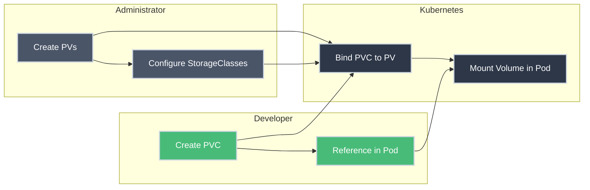

# Persistent Volume Claims (PVC)

!!! tip "Part of Level 4: Storage and State"
    This article is part of [Level 4: Storage and State](overview.md). Read [Persistent Volumes (PV)](persistent_volumes.md) first to understand the cluster resource side of storage.

You need to run a database. You need to store user uploads. You need persistent storage, but you're a developer—not a cluster admin who manages physical disks. You shouldn't need to know where the storage comes from or how it's configured.

Persistent Volume Claims (PVCs) solve this: you declare "I need 10GB of storage," and Kubernetes finds (or creates) storage that matches your requirements. You just mount it in your pod.

---

## What You'll Learn

- What PVCs are and how they differ from PVs
- How PVC binding works
- How to create PVCs and use them in pods
- Access modes and storage requests
- PVC lifecycle and deletion
- Static vs dynamic provisioning from a developer's perspective

---

## The Developer-Admin Contract



**Key insight:** Developers create PVCs. Kubernetes handles binding to PVs. Developers never need to know the physical storage details.

---

## What is a PVC?

<div class="grid cards" markdown>

-   :material-file-document-edit: **PVC = Storage Request**

    ---

    **Why it matters:** Developers declare storage needs without knowing infrastructure details.

    **What you specify:**
    - How much storage you need (e.g., 20Gi)
    - How you'll access it (RWO, ROX, RWX)
    - What type of storage (via StorageClass)

    **What Kubernetes does:**
    - Finds a matching PV (or creates one dynamically)
    - Binds PVC to PV
    - Makes it available for pods

    **Analogy:** Ordering a hotel room—you specify requirements (king bed, non-smoking), the hotel assigns you a specific room.

-   :material-link: **PVC-to-PV Binding**

    ---

    **Why it matters:** Once bound, PVC and PV are locked together until PVC is deleted.

    **Binding rules:**
    - PV must have ≥ PVC's requested capacity
    - Access modes must match (or be more permissive)
    - StorageClass must match (or PV has no class)
    - First matching PV wins

    **One-to-one:** One PVC binds to exactly one PV. No sharing.

</div>

---

## Creating a PVC

=== "Simple PVC (Static Binding)"

    **Scenario:** Request storage that will bind to a manually created PV.

    ``` yaml title="simple-pvc.yaml" linenums="1"
    apiVersion: v1
    kind: PersistentVolumeClaim
    metadata:
      name: my-pvc  # (1)!
    spec:
      accessModes:
        - ReadWriteOnce  # (2)!
      resources:
        requests:
          storage: 10Gi  # (3)!
      storageClassName: manual  # (4)!
    ```

    1. PVC name—used to reference in pod spec
    2. How the storage will be accessed (must match available PV)
    3. Minimum storage capacity required
    4. Storage class—must match PV's storageClassName

    ``` bash title="Create and check status"
    kubectl apply -f simple-pvc.yaml
    # persistentvolumeclaim/my-pvc created

    kubectl get pvc
    # NAME     STATUS   VOLUME      CAPACITY   ACCESS MODES   STORAGECLASS
    # my-pvc   Bound    nfs-pv      50Gi       RWX            manual

    kubectl describe pvc my-pvc
    # Shows which PV it bound to, capacity, access modes
    ```

    **Status = Bound:** Kubernetes found a matching PV and bound them together.

=== "Dynamic Provisioning PVC"

    **Scenario:** Request storage that will be automatically created by a StorageClass.

    ``` yaml title="dynamic-pvc.yaml" linenums="1"
    apiVersion: v1
    kind: PersistentVolumeClaim
    metadata:
      name: postgres-pvc
    spec:
      accessModes:
        - ReadWriteOnce
      resources:
        requests:
          storage: 20Gi
      storageClassName: fast-ssd  # (1)!
    ```

    1. References a StorageClass that will dynamically create PV

    ``` bash title="Create PVC"
    kubectl apply -f dynamic-pvc.yaml

    kubectl get pvc postgres-pvc
    # NAME           STATUS   VOLUME                 CAPACITY   STORAGECLASS
    # postgres-pvc   Bound    pvc-abc123-auto-gen    20Gi       fast-ssd
    ```

    **What happened:**
    - StorageClass `fast-ssd` provisioner created a new PV
    - PV was automatically bound to this PVC
    - Underlying storage (EBS volume, etc.) was created

=== "PVC with Specific PV Selector"

    **Scenario:** Bind to a specific PV using labels.

    **PV with label:**
    ``` yaml title="labeled-pv.yaml" linenums="1"
    apiVersion: v1
    kind: PersistentVolume
    metadata:
      name: critical-data-pv
      labels:
        environment: production  # (1)!
        tier: database
    spec:
      capacity:
        storage: 100Gi
      accessModes:
        - ReadWriteOnce
      persistentVolumeReclaimPolicy: Retain
      storageClassName: manual
      nfs:
        server: nfs-prod.example.com
        path: "/critical"
    ```

    1. Labels to identify this PV

    **PVC selecting that PV:**
    ``` yaml title="selective-pvc.yaml" linenums="1"
    apiVersion: v1
    kind: PersistentVolumeClaim
    metadata:
      name: database-pvc
    spec:
      accessModes:
        - ReadWriteOnce
      resources:
        requests:
          storage: 100Gi
      storageClassName: manual
      selector:  # (1)!
        matchLabels:
          environment: production
          tier: database
    ```

    1. Selector ensures PVC only binds to PV with matching labels

    **Why use selectors:** When you have multiple PVs and need to bind to a specific one (e.g., production vs staging storage).

---

## Using PVCs in Pods

=== "Mount PVC in Single Pod"

    **Scenario:** PostgreSQL database using persistent storage.

    ``` yaml title="postgres-with-pvc.yaml" linenums="1"
    apiVersion: v1
    kind: Pod
    metadata:
      name: postgres
    spec:
      containers:
      - name: postgres
        image: postgres:14
        env:
        - name: POSTGRES_PASSWORD
          value: mysecretpassword
        volumeMounts:
        - name: postgres-storage  # (1)!
          mountPath: /var/lib/postgresql/data  # (2)!

      volumes:
      - name: postgres-storage  # (3)!
        persistentVolumeClaim:
          claimName: postgres-pvc  # (4)!
    ```

    1. Volume mount name (arbitrary, must match volumes section)
    2. Where PostgreSQL stores its data inside container
    3. Volume definition references PVC
    4. Name of the PVC created earlier

    ``` bash title="Deploy and verify"
    kubectl apply -f postgres-with-pvc.yaml

    # Check pod is running
    kubectl get pods postgres

    # Verify volume is mounted
    kubectl describe pod postgres
    # Look for "Volumes:" section showing PVC mount
    ```

=== "StatefulSet with PVC Template"

    **Scenario:** Scalable database cluster where each pod needs its own storage.

    ``` yaml title="statefulset-with-pvc.yaml" linenums="1"
    apiVersion: apps/v1
    kind: StatefulSet
    metadata:
      name: mysql
    spec:
      serviceName: mysql
      replicas: 3
      selector:
        matchLabels:
          app: mysql
      template:
        metadata:
          labels:
            app: mysql
        spec:
          containers:
          - name: mysql
            image: mysql:8.0
            env:
            - name: MYSQL_ROOT_PASSWORD
              value: rootpass
            volumeMounts:
            - name: data  # (1)!
              mountPath: /var/lib/mysql

      volumeClaimTemplates:  # (2)!
      - metadata:
          name: data  # (3)!
        spec:
          accessModes:
            - ReadWriteOnce
          resources:
            requests:
              storage: 20Gi
          storageClassName: fast-ssd
    ```

    1. Mount point name—matches volumeClaimTemplates
    2. Creates PVC automatically for each pod replica
    3. PVC name base—becomes data-mysql-0, data-mysql-1, etc.

    **What happens:**
    - StatefulSet creates 3 pods: mysql-0, mysql-1, mysql-2
    - Each pod gets its own PVC: data-mysql-0, data-mysql-1, data-mysql-2
    - Each PVC gets its own dynamically provisioned PV
    - Each pod has independent persistent storage

    ``` bash title="Verify StatefulSet PVCs"
    kubectl get pvc
    # NAME            STATUS   VOLUME       CAPACITY   STORAGECLASS
    # data-mysql-0    Bound    pvc-abc123   20Gi       fast-ssd
    # data-mysql-1    Bound    pvc-def456   20Gi       fast-ssd
    # data-mysql-2    Bound    pvc-ghi789   20Gi       fast-ssd
    ```

---

## PVC Lifecycle


| Phase | Meaning |
|-------|---------|
| **Pending** | PVC created, waiting for matching PV |
| **Bound** | PVC bound to a PV, ready to use |
| **In Use** | Pod is using the PVC |
| **Released** | PVC deleted, PV reclaim policy determines next step |

---

## Working with PVCs

``` bash title="Essential PVC Commands"
# Get all PVCs in current namespace
kubectl get pvc

# Get PVCs with more details
kubectl get pvc -o wide
# Shows VOLUME, STORAGECLASS, and more

# Describe specific PVC
kubectl describe pvc my-pvc
# Shows:
# - Status (Bound/Pending)
# - Volume (which PV it's bound to)
# - Capacity, access modes
# - Events (why pending if not bound)

# Get PVC as YAML
kubectl get pvc my-pvc -o yaml

# Delete PVC
kubectl delete pvc my-pvc
```

!!! warning "Deleting PVCs"
    Deleting a PVC triggers the PV's reclaim policy:
    - **Retain:** PV becomes "Released" with data intact (requires manual cleanup)
    - **Delete:** PV and underlying storage are automatically deleted

---

## Troubleshooting PVCs

### PVC Stuck in Pending

``` bash title="Check why PVC isn't binding"
kubectl describe pvc my-pvc
# Look for Events section:
# - "no persistent volumes available" - no matching PV exists
# - "no volume with name X found" - selector doesn't match any PV
# - "waiting for first consumer" - dynamic provisioning delayed until pod created
```

**Common causes:**

<div class="grid cards" markdown>

-   :material-alert: **No Matching PV**

    ---

    **Problem:** No PV exists with sufficient capacity, correct access mode, and matching storage class.

    **Solution:**
    - Check available PVs: `kubectl get pv`
    - Create new PV matching PVC requirements
    - Or use dynamic provisioning with StorageClass

-   :material-alert: **Wrong StorageClass**

    ---

    **Problem:** PVC requests `storageClassName: fast-ssd` but no PV or StorageClass with that name exists.

    **Solution:**
    - Check StorageClasses: `kubectl get storageclass`
    - Update PVC to use existing storage class
    - Or create the missing StorageClass

-   :material-alert: **Insufficient Capacity**

    ---

    **Problem:** PVC requests 100Gi but only 50Gi PVs are available.

    **Solution:**
    - Reduce PVC request size
    - Create larger PVs
    - Use dynamic provisioning

-   :material-alert: **WaitForFirstConsumer**

    ---

    **Problem:** StorageClass has `volumeBindingMode: WaitForFirstConsumer` (common with cloud providers).

    **Solution:**
    - This is normal—PVC binds when pod using it is created
    - Create pod that uses the PVC
    - Binding happens automatically when pod is scheduled

</div>

---

## Access Modes Best Practices

| Use Case | Access Mode | Reason |
|----------|-------------|--------|
| **Database (single pod)** | ReadWriteOnce (RWO) | One pod writes, standard for block storage |
| **Shared logs/assets** | ReadWriteMany (RWX) | Multiple pods need concurrent access |
| **Static content** | ReadOnlyMany (ROX) | Many pods read, no writes needed |
| **StatefulSet** | ReadWriteOnce (RWO) | Each pod has dedicated storage |

---

## Practice Exercises

??? question "Exercise 1: Create and Use PVC"
    Create a PVC and mount it in a pod, verify data persists across pod restarts.

    **Goal:** Understand the complete workflow from PVC creation to pod usage.

    ??? tip "Solution"
        ``` yaml title="pvc-and-pod.yaml" linenums="1"
        apiVersion: v1
        kind: PersistentVolumeClaim
        metadata:
          name: data-pvc
        spec:
          accessModes:
            - ReadWriteOnce
          resources:
            requests:
              storage: 1Gi
          storageClassName: manual  # Adjust to your cluster
        ---
        apiVersion: v1
        kind: Pod
        metadata:
          name: data-pod
        spec:
          containers:
          - name: writer
            image: busybox
            command: ["/bin/sh", "-c"]
            args:
            - echo "$(date): Data persists!" >> /data/log.txt;
              cat /data/log.txt;
              sleep 3600
            volumeMounts:
            - name: storage
              mountPath: /data

          volumes:
          - name: storage
            persistentVolumeClaim:
              claimName: data-pvc
        ```

        ``` bash title="Test persistence"
        # Create PVC and pod
        kubectl apply -f pvc-and-pod.yaml

        # Check PVC is bound
        kubectl get pvc data-pvc

        # Check pod logs
        kubectl logs data-pod
        # Should show: "Thu Jan 1 12:00:00 UTC 2026: Data persists!"

        # Delete pod (not PVC!)
        kubectl delete pod data-pod

        # Recreate pod
        kubectl apply -f pvc-and-pod.yaml

        # Check logs again
        kubectl logs data-pod
        # Should show TWO entries—data persisted!
        ```

        **What you learned:** PVC-backed storage survives pod deletion.

??? question "Exercise 2: StatefulSet with Persistent Storage"
    Deploy a StatefulSet where each pod has its own PVC.

    **Goal:** Understand how StatefulSets use volumeClaimTemplates.

    ??? tip "Solution"
        ``` yaml title="statefulset-storage.yaml" linenums="1"
        apiVersion: apps/v1
        kind: StatefulSet
        metadata:
          name: web
        spec:
          serviceName: web
          replicas: 3
          selector:
            matchLabels:
              app: web
          template:
            metadata:
              labels:
                app: web
            spec:
              containers:
              - name: nginx
                image: nginx:1.21
                volumeMounts:
                - name: www
                  mountPath: /usr/share/nginx/html

          volumeClaimTemplates:
          - metadata:
              name: www
            spec:
              accessModes:
                - ReadWriteOnce
              resources:
                requests:
                  storage: 1Gi
              storageClassName: manual  # Adjust to your cluster
        ```

        ``` bash title="Deploy and verify"
        kubectl apply -f statefulset-storage.yaml

        # Watch PVCs being created
        kubectl get pvc -w
        # www-web-0    Bound
        # www-web-1    Bound
        # www-web-2    Bound

        # Check pods
        kubectl get pods
        # web-0   1/1   Running
        # web-1   1/1   Running
        # web-2   1/1   Running

        # Each pod has unique storage
        kubectl exec web-0 -- sh -c "echo 'Pod 0 data' > /usr/share/nginx/html/index.html"
        kubectl exec web-1 -- sh -c "echo 'Pod 1 data' > /usr/share/nginx/html/index.html"

        # Verify separation
        kubectl exec web-0 -- cat /usr/share/nginx/html/index.html  # Pod 0 data
        kubectl exec web-1 -- cat /usr/share/nginx/html/index.html  # Pod 1 data
        ```

        **What you learned:** StatefulSets create unique PVCs for each pod replica.

??? question "Exercise 3: Troubleshoot Pending PVC"
    Diagnose why a PVC is stuck in Pending state.

    **Goal:** Learn to debug PVC binding issues.

    ??? tip "Solution"
        ``` bash title="Diagnose Pending PVC"
        # Create PVC that won't bind
        cat <<EOF | kubectl apply -f -
        apiVersion: v1
        kind: PersistentVolumeClaim
        metadata:
          name: test-pvc
        spec:
          accessModes:
            - ReadWriteOnce
          resources:
            requests:
              storage: 999Gi  # Unrealistically large
          storageClassName: nonexistent-class  # Doesn't exist
        EOF

        # Check status
        kubectl get pvc test-pvc
        # STATUS: Pending

        # Describe to see why
        kubectl describe pvc test-pvc
        # Events section shows:
        # "no persistent volumes available"
        # OR "storageclass nonexistent-class not found"

        # Check available PVs
        kubectl get pv
        # None match our requirements

        # Check available StorageClasses
        kubectl get storageclass
        # nonexistent-class doesn't exist

        # Fix: Update PVC to use existing storage class
        kubectl delete pvc test-pvc
        kubectl create -f - <<EOF
        apiVersion: v1
        kind: PersistentVolumeClaim
        metadata:
          name: test-pvc
        spec:
          accessModes:
            - ReadWriteOnce
          resources:
            requests:
              storage: 1Gi
          storageClassName: manual  # Existing class
        EOF

        kubectl get pvc test-pvc
        # STATUS: Bound (or Pending until pod is created, depending on binding mode)
        ```

        **What you learned:** `describe` shows events explaining why PVC won't bind.

---

## Quick Reference

### PVC Spec Fields

| Field | Description | Example |
|-------|-------------|---------|
| `accessModes` | How volume will be mounted | `[ReadWriteOnce]` |
| `resources.requests.storage` | Minimum capacity needed | `20Gi` |
| `storageClassName` | Storage class to use | `fast-ssd` |
| `selector` | Label selector for specific PV | `matchLabels: {tier: db}` |

### Common Commands

``` bash
kubectl get pvc                    # List all PVCs
kubectl describe pvc <name>        # Show PVC details
kubectl delete pvc <name>          # Delete PVC (triggers reclaim policy)
kubectl get pvc -o wide            # Show bound PV and storage class
```

---

## Quick Recap

- **PVCs are storage requests:** Developers declare needs, Kubernetes handles binding
- **Binding:** PVC ↔ PV one-to-one relationship
- **Use in pods:** Reference PVC in volumes section, mount in containers
- **Dynamic provisioning:** StorageClass creates PV automatically when PVC is created
- **StatefulSets:** volumeClaimTemplates create unique PVC per pod
- **Deletion:** PVC deletion triggers PV reclaim policy (Retain or Delete)

---

## Further Reading

### Official Documentation
- [Persistent Volume Claims](https://kubernetes.io/docs/concepts/storage/persistent-volumes/#persistentvolumeclaims) - Official PVC reference
- [Configure PVC](https://kubernetes.io/docs/tasks/configure-pod-container/configure-persistent-volume-storage/) - Complete tutorial
- [Storage Classes](https://kubernetes.io/docs/concepts/storage/storage-classes/) - Dynamic provisioning

### Deep Dives
- [PVC Protection](https://kubernetes.io/docs/concepts/storage/persistent-volumes/#storage-object-in-use-protection) - Preventing accidental deletion
- [Volume Binding Mode](https://kubernetes.io/docs/concepts/storage/storage-classes/#volume-binding-mode) - WaitForFirstConsumer explained

### Related Articles
- [Persistent Volumes (PV)](persistent_volumes.md) - Understanding cluster storage resources
- **StorageClasses** - Dynamic provisioning (next article)
- **Running Databases on Kubernetes** - Real-world stateful applications

---

## What's Next?

You understand how to request persistent storage with PVCs. Next, learn about **dynamic provisioning** with ****StorageClasses****—no manual PV creation required.
