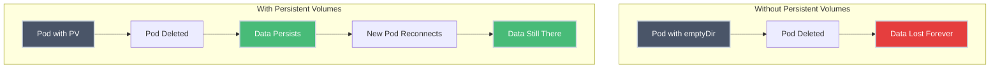
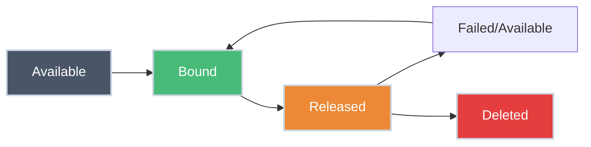

# Persistent Volumes (PV)

!!! tip "Part of Level 4: Storage and State"
    This article is part of [Level 4: Storage and State](overview.md). Start with [Understanding Volumes](volumes.md) if you haven't already.

Your database pod gets deleted. You deploy a new version of your app. The node fails. In all these scenarios, ephemeral volumes (like emptyDir) are wiped clean. Your data is gone.

Persistent Volumes (PVs) solve this problem by providing storage that lives independently of pods. When a pod dies, the data survives. When you deploy a new pod, it can reconnect to the same storage.

---

## What You'll Learn

- What Persistent Volumes are and how they differ from ephemeral volumes
- How PVs work as cluster resources
- PV lifecycle and reclaim policies
- Access modes and capacity
- How to create and inspect PVs
- The relationship between PVs and Persistent Volume Claims

---

## The Storage Problem



**Key insight:** Persistent Volumes decouple storage from pod lifecycle.

---

## How Persistent Volumes Work

Kubernetes separates storage into two concepts:

<div class="grid cards" markdown>

-   :material-server: **Persistent Volume (PV)**

    ---

    **Why it matters:** Cluster administrator's view of storage.

    **What it is:**
    - A piece of storage in the cluster
    - Created by cluster admin or dynamically provisioned
    - Exists independently of any pod
    - Can be cloud disk, NFS share, local disk, etc.

    **Analogy:** A parking space in a garage—it exists whether or not a car is parked there.

-   :material-file-document-outline: **Persistent Volume Claim (PVC)**

    ---

    **Why it matters:** Developer's request for storage.

    **What it is:**
    - A request for storage by a user/developer
    - Specifies size and access requirements
    - Gets bound to a matching PV
    - Used in pod specs to mount storage

    **Analogy:** A parking ticket that reserves a specific parking space.

</div>

**The workflow:**

1. **Admin** creates PVs (or configures dynamic provisioning)
2. **Developer** creates PVC requesting storage
3. **Kubernetes** binds PVC to a suitable PV
4. **Pod** mounts the PVC and uses the storage
5. **Pod deleted** → Storage persists
6. **New pod** → Can mount the same PVC and access the data

---

## PV Characteristics

=== "Access Modes"

    **How the volume can be mounted:**

    | Mode | Abbreviation | Meaning |
    |------|--------------|---------|
    | **ReadWriteOnce** | RWO | One node can mount it read-write |
    | **ReadOnlyMany** | ROX | Many nodes can mount it read-only |
    | **ReadWriteMany** | RWX | Many nodes can mount it read-write |

    **Why it matters:**

    - **RWO:** Most common—typical for block storage (AWS EBS, GCE Persistent Disk)
    - **ROX:** Good for shared config or static content
    - **RWX:** Rare—requires network storage (NFS, CephFS, GlusterFS)

    !!! warning "RWO Doesn't Mean One Pod"
        ReadWriteOnce means one **node**, not one pod. Multiple pods on the same node can use RWO storage.

=== "Capacity"

    **How much storage the PV provides:**

    ``` yaml
    spec:
      capacity:
        storage: 10Gi  # 10 gibibytes
    ```

    **Storage units:**
    - `Mi` = Mebibytes (1024²)
    - `Gi` = Gibibytes (1024³)
    - `Ti` = Tebibytes (1024⁴)

    **Why it matters:** PVC must request ≤ PV capacity to bind successfully.

=== "Reclaim Policy"

    **What happens to PV when PVC is deleted:**

    | Policy | Behavior |
    |--------|----------|
    | **Retain** | PV remains, data preserved, requires manual cleanup |
    | **Delete** | PV and underlying storage deleted automatically |
    | **Recycle** | ⚠️ Deprecated—basic scrub (`rm -rf /volume/*`) |

    **Default:** Depends on StorageClass (usually Delete for dynamic provisioning)

    **Use Retain when:**
    - Data is critical and needs manual backup verification
    - You want to inspect data before deletion
    - Compliance requires audit trails

    **Use Delete when:**
    - Development/testing environments
    - Data is backed up elsewhere
    - You trust automated cleanup

=== "Storage Class"

    **Type of storage backing the PV:**

    ``` yaml
    spec:
      storageClassName: fast-ssd
    ```

    **Why it matters:**
    - Different classes = different performance (SSD vs HDD)
    - Different classes = different backends (AWS EBS vs EFS)
    - PVC must match PV's storage class to bind

    **Common patterns:**
    - `standard` - Default, general-purpose
    - `fast` or `ssd` - High-performance SSD
    - `slow` or `archive` - Cheap, slow storage
    - `manual` - Manually provisioned (no dynamic provisioning)

---

## Creating a Persistent Volume

=== "Manual PV (On-Prem/NFS)"

    **Scenario:** Cluster admin creates PV backed by NFS share.

    ``` yaml title="nfs-pv.yaml" linenums="1"
    apiVersion: v1
    kind: PersistentVolume
    metadata:
      name: nfs-pv  # (1)!
    spec:
      capacity:
        storage: 50Gi  # (2)!
      accessModes:
        - ReadWriteMany  # (3)!
      persistentVolumeReclaimPolicy: Retain  # (4)!
      storageClassName: manual  # (5)!
      nfs:  # (6)!
        server: nfs.example.com
        path: "/exports/data"
    ```

    1. PV name—cluster-wide unique
    2. Total capacity available
    3. NFS supports multiple nodes mounting simultaneously
    4. Keep data when PVC is deleted
    5. Storage class for matching PVCs
    6. NFS-specific configuration

    ``` bash title="Create PV"
    kubectl apply -f nfs-pv.yaml
    # persistentvolume/nfs-pv created

    kubectl get pv
    # NAME     CAPACITY   ACCESS MODES   RECLAIM POLICY   STATUS      STORAGECLASS
    # nfs-pv   50Gi       RWX            Retain           Available   manual
    ```

    **Status = Available:** PV exists but no PVC has claimed it yet.

=== "Cloud PV (AWS EBS)"

    **Scenario:** Manually create PV for existing AWS EBS volume.

    ``` yaml title="aws-ebs-pv.yaml" linenums="1"
    apiVersion: v1
    kind: PersistentVolume
    metadata:
      name: aws-ebs-pv
    spec:
      capacity:
        storage: 100Gi
      accessModes:
        - ReadWriteOnce  # (1)!
      persistentVolumeReclaimPolicy: Retain
      storageClassName: gp2  # (2)!
      awsElasticBlockStore:  # (3)!
        volumeID: vol-0abcd1234efgh5678  # (4)!
        fsType: ext4
    ```

    1. EBS only supports single-node mounting
    2. AWS gp2 = General Purpose SSD
    3. AWS-specific volume type
    4. Pre-created EBS volume ID

    !!! warning "Pre-Create EBS Volume"
        The EBS volume must already exist in AWS. PV just references it—it doesn't create it.

=== "Local Storage"

    **Scenario:** Use disk directly attached to node (high performance, low availability).

    ``` yaml title="local-pv.yaml" linenums="1"
    apiVersion: v1
    kind: PersistentVolume
    metadata:
      name: local-pv
    spec:
      capacity:
        storage: 200Gi
      accessModes:
        - ReadWriteOnce
      persistentVolumeReclaimPolicy: Retain
      storageClassName: local-storage
      local:  # (1)!
        path: /mnt/disks/ssd1
      nodeAffinity:  # (2)!
        required:
          nodeSelectorTerms:
          - matchExpressions:
            - key: kubernetes.io/hostname
              operator: In
              values:
              - node-1  # (3)!
    ```

    1. Local volume type—path on the node
    2. Pod must be scheduled on this specific node
    3. Node where this disk physically exists

    **Key insight:** Local storage is fast but not portable—pod is tied to one node.

---

## PV Lifecycle



| Phase | Meaning |
|-------|---------|
| **Available** | PV is ready, no PVC has claimed it |
| **Bound** | PV is bound to a PVC and in use |
| **Released** | PVC was deleted, but PV hasn't been reclaimed yet |
| **Failed** | PV failed automatic reclamation |

---

## Inspecting Persistent Volumes

``` bash title="View all PVs"
kubectl get pv
# NAME       CAPACITY   ACCESS MODES   RECLAIM POLICY   STATUS
# nfs-pv     50Gi       RWX            Retain           Available
# ebs-pv     100Gi      RWO            Delete           Bound

kubectl get pv nfs-pv -o wide
# Shows additional details: STORAGECLASS, REASON, AGE
```

``` bash title="Describe specific PV"
kubectl describe pv nfs-pv
# Shows:
# - Capacity, access modes, reclaim policy
# - StorageClass
# - Status (Available/Bound/Released)
# - Claim (which PVC claimed it)
# - Events
```

``` bash title="Get PV as YAML"
kubectl get pv nfs-pv -o yaml
# See full PV spec and status
```

---

## Static vs Dynamic Provisioning

<div class="grid cards" markdown>

-   :material-hand-pointing-right: **Static Provisioning**

    ---

    **How it works:**
    - Admin manually creates PVs
    - Developer creates PVC
    - Kubernetes finds matching PV and binds them

    **Pros:**
    - Full control over storage
    - Useful for on-prem or existing storage

    **Cons:**
    - Manual work for each PV
    - Can run out of pre-created PVs
    - Admin bottleneck

    ``` yaml
    # Admin creates PV first
    kubectl apply -f nfs-pv.yaml

    # Developer creates PVC
    kubectl apply -f my-pvc.yaml

    # Kubernetes binds them automatically
    ```

-   :material-robot: **Dynamic Provisioning**

    ---

    **How it works:**
    - Admin creates StorageClass (once)
    - Developer creates PVC referencing StorageClass
    - Kubernetes automatically creates PV and underlying storage

    **Pros:**
    - Self-service for developers
    - No pre-provisioning needed
    - Scales automatically

    **Cons:**
    - Requires cloud provider or CSI driver
    - Less control over individual volumes

    ``` yaml
    # Admin creates StorageClass (once)
    kubectl apply -f storageclass.yaml

    # Developer creates PVC
    kubectl apply -f my-pvc.yaml

    # Kubernetes creates PV automatically
    ```

</div>

**In practice:** Cloud environments use dynamic provisioning. On-prem often uses static.

---

## Practice Exercises

??? question "Exercise 1: Create a Manual PV"
    Create a hostPath PV for local testing.

    **Goal:** Understand how to manually create a Persistent Volume.

    **Hint:** Use hostPath type with a directory on the node.

    ??? tip "Solution"
        ``` yaml title="hostpath-pv.yaml" linenums="1"
        apiVersion: v1
        kind: PersistentVolume
        metadata:
          name: hostpath-pv
        spec:
          capacity:
            storage: 5Gi
          accessModes:
            - ReadWriteOnce
          persistentVolumeReclaimPolicy: Retain
          storageClassName: manual
          hostPath:
            path: /mnt/data
            type: DirectoryOrCreate  # Creates directory if missing
        ```

        ``` bash title="Apply and verify"
        kubectl apply -f hostpath-pv.yaml

        kubectl get pv hostpath-pv
        # NAME           CAPACITY   ACCESS MODES   RECLAIM POLICY   STATUS
        # hostpath-pv    5Gi        RWO            Retain           Available

        kubectl describe pv hostpath-pv
        # Check capacity, access modes, and status
        ```

        **What you learned:** PVs are cluster resources that exist independently of pods.

??? question "Exercise 2: Inspect PV Details"
    Get detailed information about a PV's configuration and status.

    **Goal:** Learn how to troubleshoot PV binding issues.

    ??? tip "Solution"
        ``` bash title="Inspect PV"
        # Get all PVs
        kubectl get pv

        # Describe specific PV
        kubectl describe pv hostpath-pv
        # Look for:
        # - Capacity: 5Gi
        # - Access Modes: RWO
        # - Reclaim Policy: Retain
        # - Status: Available (not bound)
        # - StorageClass: manual

        # Get YAML definition
        kubectl get pv hostpath-pv -o yaml
        # Shows full spec including:
        # - metadata.creationTimestamp
        # - spec.hostPath
        # - status.phase
        ```

        **What you learned:** `describe` shows human-readable info, `-o yaml` shows complete spec.

??? question "Exercise 3: Understand Access Modes"
    A PV has access mode `ReadWriteOnce`. Can two pods on the same node use it simultaneously?

    **Goal:** Clarify the meaning of RWO.

    ??? tip "Solution"
        **Yes, multiple pods on the same node can use RWO storage.**

        `ReadWriteOnce` means **one node** can mount the volume read-write, not one pod.

        **Example scenario:**
        - StatefulSet with 3 replicas
        - All 3 pods scheduled on the same node
        - All 3 can mount the same RWO PV

        **Why this matters:**
        - Common misconception: RWO = one pod
        - Reality: RWO = one node (multiple pods on that node can share)
        - For true multi-node access, you need ReadWriteMany (RWX)

        **What you learned:** Access modes control node-level access, not pod-level access.

---

## Common Pitfalls

!!! warning "PV Remains After PVC Deletion (Retain Policy)"
    With `persistentVolumeReclaimPolicy: Retain`, deleting a PVC leaves the PV in "Released" state with data intact. You must manually:

    1. Backup/verify data
    2. Delete the PV: `kubectl delete pv <pv-name>`
    3. Delete underlying storage (if desired)

!!! warning "Wrong Access Mode"
    If your storage backend only supports RWO (like AWS EBS), but you request RWX in PVC, binding will fail. Check storage backend capabilities.

!!! warning "Manual PV Binding"
    PVCs bind to the first matching PV. If you have multiple PVs with same capacity/class, you can't control which one gets bound. Use labels and selectors for specific binding.

---

## Quick Reference

### Access Modes

| Mode | Abbrev | Meaning | Common Backend |
|------|--------|---------|----------------|
| ReadWriteOnce | RWO | Single node RW | AWS EBS, GCE PD, Azure Disk |
| ReadOnlyMany | ROX | Many nodes RO | NFS, CephFS |
| ReadWriteMany | RWX | Many nodes RW | NFS, CephFS, GlusterFS |

### Reclaim Policies

| Policy | Behavior | Use Case |
|--------|----------|----------|
| Retain | Keep PV and data | Production, manual cleanup |
| Delete | Delete PV and storage | Development, cloud |
| Recycle | ⚠️ Deprecated | Don't use |

---

## Quick Recap

- **PVs are cluster resources:** Created by admins, exist independently of pods
- **Decoupled from pods:** Data survives pod deletion
- **Access modes:** RWO (one node), ROX (many nodes read), RWX (many nodes read-write)
- **Reclaim policy:** Retain (keep data), Delete (clean up automatically)
- **Static vs Dynamic:** Manual PV creation vs automatic StorageClass provisioning
- **PVCs bind to PVs:** Developers request storage via PVCs (next article)

---

## Further Reading

### Official Documentation
- [Persistent Volumes](https://kubernetes.io/docs/concepts/storage/persistent-volumes/) - Official PV reference
- [Storage Classes](https://kubernetes.io/docs/concepts/storage/storage-classes/) - Dynamic provisioning
- [Volume Types](https://kubernetes.io/docs/concepts/storage/volumes/#volume-types) - All supported volume types

### Deep Dives
- [Configure PV](https://kubernetes.io/docs/tasks/configure-pod-container/configure-persistent-volume-storage/) - Step-by-step guide
- [Local Volumes](https://kubernetes.io/blog/2019/04/04/kubernetes-1.14-local-persistent-volumes-ga/) - Using local storage

### Related Articles
- [Understanding Volumes](volumes.md) - Ephemeral volume types
- [Persistent Volume Claims (PVC)](persistent_volume_claims.md) - How to request storage (next)
- **StorageClasses** - Dynamic provisioning

---

## What's Next?

You understand Persistent Volumes—cluster-wide storage resources. Next, learn how developers request storage: **[Persistent Volume Claims (PVC)](persistent_volume_claims.md)**.
